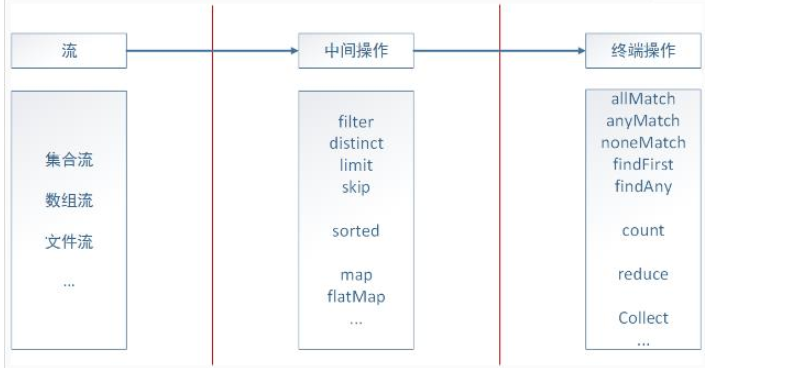
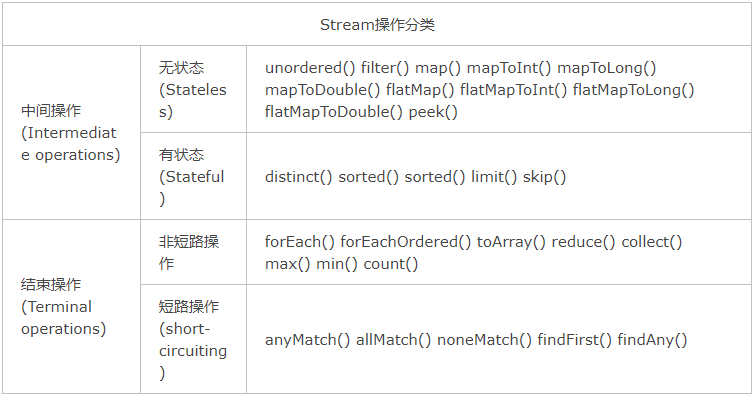
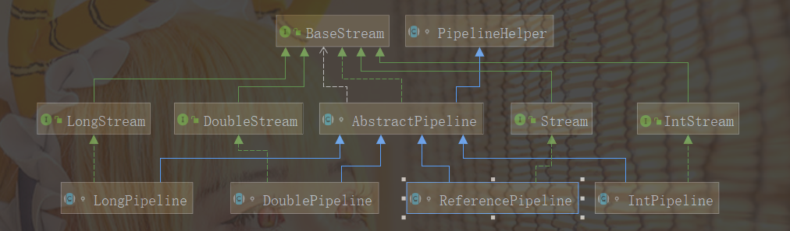
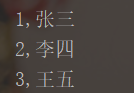
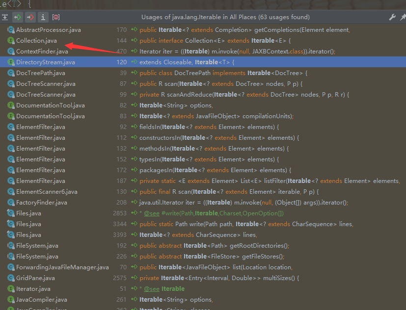
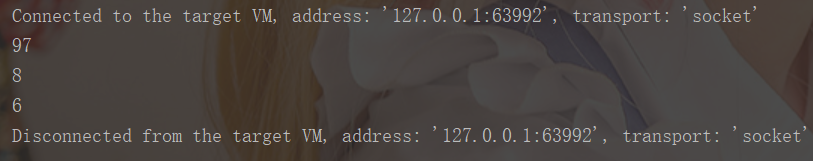

# Stream

## 介绍

Stream是Java8的新特性之一，从名字看出来，它的含义是流，所谓的流就是一个数据渠道，可以用于操作集合所生成的元素序列。 实际上不光是集合，包括数组、文件等，只要是可以转换成流，我们都可以借助流式处理，类似于我们写SQL语句一样对其进行操作。 

> 1）Stream自己不会存储元素。
>
> 2）Stream不会改变源对象。
>
> 3）Stream操作是延时执行的，这意味着它们会等到需要结果时才执行。

## 处理过程

Stream的流式处理可以分为三个部分：转换成流、中间操作、终端操作，如下图：



具体语句如下：

```
List<Integer> userIds = userLists.stream().map(UserDO::getId).collect(Collectors.toList());
```

stream语句将userLists集合转换成了一个流，map为`中间操作`，通过函数式表达式获取user的Id，最后通过终端操作将其转换成一个list集合返回。

可以发现，Stream极大地简化了我们对集合的操作。

## API

### 创建流

1）  通过Collection得Stream（）方法（串行流）或者 parallelStream（）方法（并行流）创建Stream。 

```
 @Test
public void test1 () {
    
    //1. 通过Collection得Stream（）方法（串行流）
    //或者 parallelStream（）方法（并行流）创建Stream
    List<String> list = new ArrayList<String>();
    Stream<String> stream1 = list.stream();
    
    Stream<String> stream2 = list.parallelStream();
    
}
```

2） 通过Arrays中得静态方法stream（）获取数组流 。

```
@Test
public void test2 () {
    
    //2. 通过Arrays中得静态方法stream（）获取数组流
    IntStream stream = Arrays.stream(new int[]{3,5});
    
}
```

3） 通过Stream类中得 of（）静态方法获取流 。

```
@Test
public void test3 () {
    
    //3. 通过Stream类中得 of（）静态方法获取流
    Stream<String> stream = Stream.of("4645", "huinnj");
    
}
```

4） 创建无限流(迭代、生成) 。

```
@Test
public void test4 () {
    
    //4. 创建无限流
    //迭代（需要传入一个种子，也就是起始值，然后传入一个一元操作）
    Stream<Integer> stream1 = Stream.iterate(2, (x) -> x * 2);
    
    //生成(无限产生对象)
    Stream<Double> stream2 = Stream.generate(() -> Math.random());
    
}
```

### 中间操作API

#### 1）distinct

distinct: 对于Stream中包含的元素进行去重操作（去重逻辑依赖元素的equals方法），新生成的Stream中没有重复的元素。

#### 2）filter 过滤

filter方法是根据设置的条件来过滤、筛选出所需要的元素。

#### 3）map 根据指定的函数进行转化

map方法是对于Stream中包含的元素使用给定的转换函数进行转换操作，新生成的Stream只包含转换生成的元素。

#### 4）limit 获取指定数量的元素

limit方法是根据设定的数量从流中获取对应数量的元素。

#### 5）skip 获取去除指定数量之后的元素

skip方法与limt有点区别，此方法是获取到根据设定的数量n去除掉集合中前n个元素之后的所有数据。

#### 6）sorted 排序

sorted方法是对流中的元素进行排序，降序和升序都可以使用自然排序的方法，也可以调用Comparator中的方法进行排序

#### 7）peek

peek 方法是生成一个包含原Stream的所有元素的新Stream，同时会提供一个消费函数(Consumer实例)，新Stream每个元素被消费的时候都会执行给定的消费函数
*注*：刚开始以为peek与map的用法一样，后面通过学习及练习，peek方法其实是没有返回值的，多半用于一些输出，数据的校验等。

#### 8）flatMap

接收一个函数作为参数，将流中的每个值都换成一个流，然后把所有流连接成一个流。

### 终端操作API

#### 1） allMatch  查找匹配

 检查是否匹配所有元素。 

#### 2）anyMatch 

 检查是否至少匹配所有元素 。

#### 3）noneMatch

 检查是否没有匹配所有元素 。

#### 4）findFirst

 返回第一个元素。 

```
@Test
public void test16 () {
	Optional<Person> person = persons.stream().findFirst();
	System.out.println(person);

	person.orElse(new Person("王五", "男", 35, Status.BUSY));
}
```

#### 5）findAny

 返回当前流中任意元素。 

#### 6）count

 返回流中元素总个数。 

#### 7）max 

 返回流中最大值。 

#### 8）min 

 返回流中最小值。 

#### 9）reduce（可以将流中元素反复结合在一起，得到一个值） 

有`reduce（T identitty，BinaryOperator）` 与` reduce（BinaryOperator） `，前者需要一个起始值，然后传入二元运算，后者没有起始值。

#### 10）collect （将流转换为其他形式。接收一个Collector接口得实现，用于给其他Stream中元素做汇总的方法） 

Collector接口中方法得实现决定了如何对流执行收集操作（如收集到List，Set，Map）。但是Collectors实用类提供了很多静态方法，可以方便地创建常见得收集器实例。 

### 总结



## Stream流水线原理

### 问题引出

先来看下列语句：

```java
List<String> list = Arrays.asList("Hello","World","Word");
// 求出以W开头，长度最长的单词，并把长度赋值给num
Integer num = list.stream().filter(x -> x.startsWith("W")).mapToInt(String::length).max().getAsInt();
        System.out.println(num);
```

逻辑很简单，使用一行stream()语句即可完成需求，但是这里有一个问题，stream()究竟是怎么做到用一行来完成这么多筛选条件的语句呢？它是每调用一次中间操作就遍历一遍集合元素吗？答案是不是的，我们来看看stream()具体是怎么操作的。

首先我们来看看一般的for循环是怎么在一次迭代的情况下完成的：

```java
int maxLength = 0;
for (String str : list) {
    if (str.startsWith("W")) {
        maxLength = Math.max(str.length(), maxLength);
    }
}
```

这种方式不但只用了一次迭代，同时避免了存储中间结果，但是它有个前提，必须得知道当前的程序意图。而Stream设计者并不能知道用户想要实现的功能是什么。因此，在无法假设用户行为的前提下实现流水线，是设计者首要考虑的问题。

### 解决

在这里，大家应该都能想到，如果能够像队列一样记录用户的每一次操作，在用户结束操作的时候，再将所有的记录叠加到一次迭代中全部执行掉，那不就解决问题了吗。那么接下来又会有一系列的问题：

1）用户的操作该怎么记录？

2）操作如何叠加？

3）叠加之后的操作如何？

4）执行后的结果在哪里？ 

#### 操作如何记录 



注意，这里的操作是指中间操作，Stream中会使用Stage概念来描述一个完整的操作，并用某种实例化后的PipelineHelper来代表Stage，将具有先后顺序的各个Stage连到一起，就构成了整个流水线，其中Stream相关类和接口的继承关系如上图所示。 

Stream流水线组织结构示意图如下：


通过Collection.stream()方法得到Head，也就是stage0，紧接着调用一系列中间操作，不断产生新的Stream，这些Stream对象以双向链表的形式组织在一起，构成整个流水线，由于每个Stage都记录了前一个Stage和本次的操作以及回调函数，依靠这种结构就能建立起对数据源的所有操作。 

> 1. Head记录Stream起始操作。
> 2. StatelessOp记录无状态的中间操作。
> 3. StatefulOp记录有状态的中间操作 。

**Reference构造函数**

```java
AbstractPipeline(AbstractPipeline<?, E_IN, ?> previousStage, int opFlags) {
    if (previousStage.linkedOrConsumed)
        throw new IllegalStateException(MSG_STREAM_LINKED);
    previousStage.linkedOrConsumed = true;
    previousStage.nextStage = this;
    this.previousStage = previousStage;
    this.sourceOrOpFlags = opFlags & StreamOpFlag.OP_MASK;
    this.combinedFlags = StreamOpFlag.combineOpFlags(opFlags, previousStage.combinedFlags);
    this.sourceStage = previousStage.sourceStage;
    if (opIsStateful())
        sourceStage.sourceAnyStateful = true;
    this.depth = previousStage.depth + 1;
}
```

Reference构造方法调用了AbstractPipeline的构造方法，可以发现，它的构造函数更像是链表的操作，指定了前驱stage的后继stage为当前stage。

**Head构造函数**

```java
AbstractPipeline(Supplier<? extends Spliterator<?>> source,
                 int sourceFlags, boolean parallel) {
    this.previousStage = null;
    this.sourceSupplier = source;
    this.sourceStage = this;
    this.sourceOrOpFlags = sourceFlags & StreamOpFlag.STREAM_MASK;
    // The following is an optimization of:
    // StreamOpFlag.combineOpFlags(sourceOrOpFlags, StreamOpFlag.INITIAL_OPS_VALUE);
    this.combinedFlags = (~(sourceOrOpFlags << 1)) & StreamOpFlag.INITIAL_OPS_VALUE;
    this.depth = 0;
    this.parallel = parallel;
}
```

可以发现，Head的构造方法指定了sourceStage为当前stage。

#### 操作如何叠加

现在我们知道Stream()是如何记录每一步的操作了，要想让流水线将所有的操作叠加在一起，还需要有一种协议来协调相邻的Stage之间的关系。这个协议就是Sink接口，Sink接口方法如下：


有了此协议，相邻Stage之间调用就很方便了，每个Stage都会将自己的操作封装到一个Sink里，前一个Stage只需调用后一个Stage的`accept()`方法即可，并不需要知道内部是如何处理的。对于短路操作，也要实现cancellationRequested()。**实际上Stream API内部实现的本质，就是如何重载Sink的这四个接口方法。**

有了Sink包装，流水线调用时只需要从流水线的head开始，对数据源依次调用每个Stage对应的Sink{begin()，accept()，cancellationRequested()，end()}就可以了。就类似于[处理->转发]这种模型。

让我们以**Stream.map()**为例，探索Sink是怎么实现的：

```java
// 产生一个新的stream
public final <R> Stream<R> map(Function<? super P_OUT, ? extends R> mapper) {
    Objects.requireNonNull(mapper);
    return new StatelessOp<P_OUT, R>(this, StreamShape.REFERENCE,
                                 StreamOpFlag.NOT_SORTED | StreamOpFlag.NOT_DISTINCT) {
        // opWrapSink返回回调函数包装成的Sink
        @Override
        Sink<P_OUT> opWrapSink(int flags, Sink<R> sink) {
            return new Sink.ChainedReference<P_OUT, R>(sink) {
                @Override
                public void accept(P_OUT u) {
                    // 将处理结果传递给流水线下游
                    downstream.accept(mapper.apply(u));
                }
            };
        }
    };
}
```

上述逻辑总结如下：首先，将回调函数mapper包装到一个Sink中，由于Stream.map()是一个无状态的中间操作，所以返回一个StatelessOp对象，调用这个新Stream的opWripSink()得到一个包装了当前回调函数的Sink。

接下来我们看一看**Stream.sorted()**方法：

```
// Stream.sort()方法用到的Sink实现
class RefSortingSink<T> extends AbstractRefSortingSink<T> {
    private ArrayList<T> list;// 存放用于排序的元素
    RefSortingSink(Sink<? super T> downstream, Comparator<? super T> comparator) {
        super(downstream, comparator);
    }
    @Override
    public void begin(long size) {
        ...
        // 创建一个存放排序元素的列表
        list = (size >= 0) ? new ArrayList<T>((int) size) : new ArrayList<T>();
    }
    @Override
    public void end() {
        list.sort(comparator);// 只有元素全部接收之后才能开始排序
        downstream.begin(list.size());
        if (!cancellationWasRequested) {// 下游Sink不包含短路操作
            list.forEach(downstream::accept);// 2. 将处理结果传递给流水线下游的Sink
        }
        else {// 下游Sink包含短路操作
            for (T t : list) {// 每次都调用cancellationRequested()询问是否可以结束处理。
                if (downstream.cancellationRequested()) break;
                downstream.accept(t);// 2. 将处理结果传递给流水线下游的Sink
            }
        }
        downstream.end();
        list = null;
    }
    @Override
    public void accept(T t) {
        list.add(t);// 1. 使用当前Sink包装动作处理t，只是简单的将元素添加到中间列表当中
    }
}
```

1）首先beging()方法告诉Sink参与排序的元素个数，方便确定中间结果容器的的大小；

2）之后通过accept()方法将元素添加到中间结果当中，最终执行时调用者会不断调用该方法，直到遍历所有元素；

3）最后end()方法告诉Sink所有元素遍历完毕，启动排序步骤，排序完成后将结果传递给下游的Sink；

4）如果下游的Sink是短路操作，将结果传递给下游时不断询问下游cancellationRequested()是否可以结束处理。

#### 叠加之后的操作如何执行

既然Sink已经将Stream的每一步操作都进行了封装，就差最后一步执行了，那么究竟是谁来执行呢？没错，就是我们一开始提到的结束操作。

结束操作之后不能再有别的操作，所以结束操作会创建一个包装了自己操作的Sink，这也是最后一个Sink，它只需处理数据，而不需要转发，对于Sink的[处理，转发]模型，结束操作的Sink就是调用链的出口。

我们再来考察一下上游的Sink是如何找到下游Sink的。一种可选的方案是在*PipelineHelper*中设置一个Sink字段，在流水线中找到下游Stage并访问Sink字段即可。

但Stream类库的设计者没有这么做，而是设置了一个`Sink AbstractPipeline.opWrapSink(int flags, Sink downstream)`方法来得到Sink，该方法的作用是返回一个新的包含了当前Stage代表的操作以及能够将结果传递给downstream的Sink对象。

为什么要产生一个新对象而不是返回一个Sink字段？这是因为使用opWrapSink()可以将当前操作与下游Sink（上文中的downstream参数）结合成新Sink。

试想只要从流水线的最后一个Stage开始，不断调用上一个Stage的opWrapSink()方法直到最开始（不包括stage0，因为stage0代表数据源，不包含操作），就可以得到一个代表了流水线上所有操作的Sink，用代码表示就是这样： 

```java
// AbstractPipeline.wrapSink()
// 从下游向上游不断包装Sink。如果最初传入的sink代表结束操作，
// 函数返回时就可以得到一个代表了流水线上所有操作的Sink。
final <P_IN> Sink<P_IN> wrapSink(Sink<E_OUT> sink) {
    ...
    for (AbstractPipeline p=AbstractPipeline.this; p.depth > 0; p=p.previousStage) {
        sink = p.opWrapSink(p.previousStage.combinedFlags, sink);
    }
    return (Sink<P_IN>) sink;
}
```

现在流水线上从开始到结束的所有的操作都被包装到了一个Sink里，执行这个Sink就相当于执行整个流水线，执行Sink的代码如下： 

```java
// AbstractPipeline.copyInto(), 对spliterator代表的数据执行wrappedSink代表的操作。
final <P_IN> void copyInto(Sink<P_IN> wrappedSink, Spliterator<P_IN> spliterator) {
    ...
    if (!StreamOpFlag.SHORT_CIRCUIT.isKnown(getStreamAndOpFlags())) {
        wrappedSink.begin(spliterator.getExactSizeIfKnown());// 通知开始遍历
        spliterator.forEachRemaining(wrappedSink);// 迭代
        wrappedSink.end();// 通知遍历结束
    }
    ...
}
```

### 执行结果存放


1）对于表中返回boolean或者Optional的操作（Optional是存放 一个 值的容器）的操作，由于值返回一个值，只需要在对应的Sink中记录这个值，等到执行结束时返回就可以了。

2）对于归约操作，最终结果放在用户调用时指定的容器中（容器类型通过[收集器](https://www.cnblogs.com/CarpenterLee/p/5-Streams API(II).md#收集器)指定）。collect(), reduce(), max(), min()都是归约操作，虽然max()和min()也是返回一个Optional，但事实上底层是通过调用[reduce()](https://www.cnblogs.com/CarpenterLee/p/5-Streams API(II).md#多面手reduce)方法实现的。

3）于返回是数组的情况，毫无疑问的结果会放在数组当中。这么说当然是对的，但在最终返回数组之前，结果其实是存储在一种叫做*Node*的数据结构中的。Node是一种多叉树结构，元素存储在树的叶子当中，并且一个叶子节点可以存放多个元素。这样做是为了并行执行方便。

# forEach

## 介绍

forEach是java8的特性之一，它可以大大简化代码的操作，比如有关HashMap的操作：

```java
HashMap<Integer, String> hashMap = new HashMap<>(3);
hashMap.put(1, "张三");
hashMap.put(2, "李四");
hashMap.put(3, "王五");
for (Map.Entry<Integer, String> entry : hashMap.entrySet()) {
    System.out.println(entry.getKey() + "," + entry.getValue());
}
```

这是使用映射的视图来遍历整个hashmap来输出键值对的逻辑，输出如下：



写起来比较繁琐，看起来也有点累，那么使用forEach就可以简化为如下代码：

```
Map<Integer, String> hashMap = new HashMap<>(3);
hashMap.put(1, "张三");
hashMap.put(2, "李四");
hashMap.put(3, "王五");
hashMap.forEach((k, v) -> System.out.println(k + "," + v));
```

可以发现，它简化了大部分的操作。那么我们就会有几个问题，比如什么情况下可以使用forEach，以及它的底层迭代原理是什么，性能跟传统的foreach相比如何等。

## 使用条件

点进forEach方法中，可以发现，它是Iterable接口的一个方法，因此可以得出一个结论，**只要一个类实现了此接口，那么此类的实例一定可以使用forEach方法**。



同时我们可以看到，Collection接口继承了此接口。而我们大部分的集合类接口都继承了Collection接口，具体有Set、List、Map、SortedSet、SortedMap、HashSet、TreeSet、ArrayList、LinkedList、  Vector、Collections、Arrays、AbstractCollection。所以只要是上述的实现类，都可以使用forEach方法。

## 迭代原理

让我们回归Iterable接口，看看接口中的方法：

```java
default void forEach(Consumer<? super T> action) {
    Objects.requireNonNull(action);
    for (T t : this) {
        action.accept(t);
    }
}
```

方法的形参是一个Consumer类型的action，我们可以猜到，这一定是跟lambda表达式相关的一个东西。事实上，它是一个函数式接口，让我们看看Consumer：

```java
@FunctionalInterface
public interface Consumer<T> {

    /**
     * 可实现方法，接受一个参数且没有返回值
     *
     * @param t the input argument
     */
    void accept(T t);

    /**
     * 返回一个组合的{@code consumer}，该组合的{@code consumer}按顺序执行此操作，然后执行	 * {@code after}操作。如果执行任一操作时引发异常，则将其中继到组合操作的调用方。如果执行此操作  	  *	引发异常，则{@code after}操作将不会执行。
     *
     * @param after the operation to perform after this operation
     * @return a composed {@code Consumer} that performs in sequence this
     * operation followed by the {@code after} operation
     * @throws NullPointerException if {@code after} is null
     */
    default Consumer<T> andThen(Consumer<? super T> after) {
        Objects.requireNonNull(after);
        return (T t) -> { accept(t); after.accept(t); };
    }
}
```

因此实际上，它还是使用了foreach来遍历迭代对象，在一个个对参数执行对应的操作。

## 性能

为了测试性能，我们可以编写一个循环，来输出遍历完的时间，具体如下：

```java
public static void main(String[] args) {
    List<Integer> list = new ArrayList<>();

    for (int i = 0; i < 100000; i++) {
        list.add(i);
    }

    long l = System.currentTimeMillis();
    list.forEach(i -> {
    });
    System.out.println(System.currentTimeMillis() - l);

    l = System.currentTimeMillis();
    for (Integer s : list) {
    }
    System.out.println(System.currentTimeMillis() - l);
}
```

输出结果如下：


大约相差了十五倍。那么为什么.forEach就会比foreach慢了个十倍左右的数量级呢？细细比较两者区别可以想到forEach多了一个Consumer的声明，那么我们再来测试一下：

```java
public static void main(String[] args) {
    List<Integer> list = new ArrayList<>();

    for (int i = 0; i < 100000; i++) {
        list.add(i);
    }

    // 声明Consumer
    long l = System.currentTimeMillis();
    Consumer<Integer> consumer = integer -> {
    };
    System.out.println(System.currentTimeMillis() - l);

    // forEach
    l = System.currentTimeMillis();
    list.forEach(consumer);
    System.out.println(System.currentTimeMillis() - l);

    // foreach
    l = System.currentTimeMillis();
    for (Integer integer : list) {
    }
    System.out.println(System.currentTimeMillis() - l);
}
```

输出结果如下：




**但forEach效率真的这么低吗？**

其实不是的，java会使用预热，当第二次第三次调用forEach的时候，速度不比foreach慢，有可能跟JIT有关。

