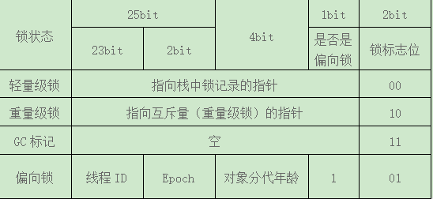

# 并发编程的挑战

## 上下文切换

单核处理器也可以支持多线程执行代码，这是由于CPU通过给每个线程分配CPU时间片实现这个机制，时间片非常短，所以CPU通过不断地切换线程执行，让我们感觉多个线程是同时执行的，时间片一般是几十毫秒。

### 概念

CPU通过时间片分配算法来循环执行任务，当前任务执行一个时间片后会切换到下一个任务，需要保存记录当前任务的状态，所以任务从保存到再加载的过程就是一次**上下文切换。**

**造成问题**

上下文切换固然会造成一定的时间开销，所以当并发执行累加操作不超过百万次时，速度会比串行执行累加操作更慢。

### 减少上下文切换

减少上下文切换的方法有无锁并发编程、CAS算法、使用最少线程和使用协程。

#### 无锁并发编程

多线程竞争锁时，会引起上下文切换，所以多线程处理数据时，可以用一些办法来避免锁，如将数据的ID按照Hash算法取模分段，不同的线程处理不同段的数据。无锁编程具体使用和考虑到的技术方法包括：原子操作（atomic operations）, 内存栅栏（memory barriers）, 内存顺序冲突（memory order）， 指令序列一致性（sequential consistency）和顺ABA现象等等。

#### CAS算法

Java的Atomic包使用CAS算法来更新数据，不需要加锁。

#### 使用最少线程

尽量使线程数减少，来避免大量线程处于等待状态。每一次从WAITTING到RUNNABLE都会进行一次上下文的切换。

#### 协程

在单线程里实现多任务的调度，并在单线程里维持多个任务间的切换。

### 死锁

锁是个非常有用的工具，但运用不好就会产生死锁，一旦产生死锁，系统功能就不可用，下面介绍避免死锁的几个常见方法。

1）避免一个线程同时获取多个锁。

2）避免一个线程在锁内同时占用多个资源，尽量保证每个锁只占用一个资源。

3）尝试使用定时锁，使用lock.tryLock来替代使用内部锁机制。

4）对于数据库锁，加锁和解锁必须在一个数据库连接里，否则会出现解锁失败的情况。

# Java并发机制的底层实现原理

## volatile的应用

众所周知，volatile是轻量级的synchronized，它在多处理器开发中保证了共享变量的“可见性”。可见性的意思是当一个线程修改一个共享变量时，另一个线程可以读到这个修改值。它比synchronized的使用和执行成本更低，因为它不会引起线程上下文的切换和调度。

#### volatile的定义与实现原理

java对volatile的定义：Java编程语言允许线程访问共享变量 ，为了确保共享变量能被准确和一致地更新，线程应该确保通过排他锁单独获得这个变量。

​																				**CPU的术语定义**

| 术语       | 英文单词               | 术语描述                                                     |
| ---------- | ---------------------- | ------------------------------------------------------------ |
| 内存屏障   | memory barriers        | 是一组处理器指令，用于实现对内存操作的顺序限制               |
| 缓冲行     | cache line             | CPU高速缓存中可以分配的最小存储单位。处理器填写缓存行时会加载整个缓存行，现代CPU需要执行几百次CPU指令。 |
| 原子操作   | atomic operations      | 不可中断的一个或一系列操作。                                 |
| 缓存行填充 | cache line fill        | 当处理器识别到从内存中读取操作数是可缓存的，处理器读取整个高速缓存行到适当的缓存（L1,L2,L3的或所有）。 |
| 缓存命中   | cache hit              | 如果进行高速缓存行填充操作的内存位置仍然是下次处理器访问的地址时，处理器从缓存中读取操作数，而不是从内存读取。 |
| 写命中     | write hit              | 当处理器将操作数写回到一个内存缓存的区域时，他首先会检查这个缓存的内存地址是否在缓存行中，如果存在一个有效的缓存行，则处理器将这个操作数写回到缓存，而不是写回到内存，这个操作被称为写命中。 |
| 写缺失     | write misses the cache | 一个有效的缓存行被写入到不存在的内存区域                     |

用工具获取JIT编译器生成的汇编指令来查看对volatile进行写操作时，CPU的动作：

java代码：

`instance = new Singleton();    //instance是volatile变量`

转变成汇编代码，如下：

`0x-1a3de1d: movb $0×0,0×1104800(%esi);0x01a3de24:lock add1 $0×0,(%esp);`

有volatile变量修饰的共享变量进行写操作的时候会多出第二行汇编代码，通过查IA-32架构软件开发者手册知，Lock前缀的指令在多核处理器下会引发两件事情：

1）将当前处理器缓存行的数据写回到系统内存。

2）这个写回内存的操作会使其他CPU里缓存了该内存地址的数据无效。

为了提高处理速度，处理器不直接和内存通信，而是会将系统内存的数据读到内部缓存后再进行操作，不知道何时会写到内存。如果对声明了volatile的变量进行写操作，JVM就会向处理器发送一条Lock前缀的指令，将这个变量所在缓存行的数据写回到系统内存，但是会出现其他处理器缓存依旧为旧值的情况，所以为了保证各个处理器的缓存一致性，就会实现**缓存一致性协议**，每个处理器通过嗅探在总线上传播的数据来检查自己缓存的值是否过期，当处理器发现自己缓存行对应的内存地址被修改，就会将当前处理器的缓存行设置成无效状态，当处理器对这个数据进行修改操作的时候，会重新从系统内存数据读到处理器缓存里。

#### volatile的两条实现原则

##### Lock前缀指令会引起处理器缓存回写到内存。

Lock前缀指令导致在执行指令期间，声言处理器的LOCK#信号。在多处理器环境中，LOCK#信号确保在声言该信号期间，处理器可以独占任何共享内存。但是，在最近的处理器里，LOCK#信号一般不锁总线，而是锁缓存，毕竟锁总线开销的比较大。在P6和目前的处理器中，如果访问的内存区域已经缓存在处理器内部，则不会声言LOCK#信号，而是锁定这块内存区域的和缓存并回写到内存，并使用缓存一致性机制来确保修改的原子性，此操作被称为**“缓存锁定”**，缓存一致性机制会阻止同时修改由两个以上处理器缓存的内存区域数据。

##### 一个处理器的缓存回写到内存会导致其他处理器的缓存无效。

IA-32（英特尔32位）处理器和Intel64处理器使用MESI（修改、独占、共享、无效）控制协议去维护内部缓存和其他处理器缓存的一致性。再多核处理器系统中进行操作时，IA-32和Intel64处理器能嗅探其他处理器访问系统内存和它们的内部缓存。处理器使用**嗅探技术**保证它的内部缓存、系统内存和其他处理器的缓存的数据在总线上保持一致。

#### volatile的使用优化

著名的Java并发编程大师Doug lea在JDK7的并发包里新增一个队列集合类LinkedTransferQueue，它在使用volatile变量时，用一种追加字节的方式来优化队列出队和入队的性能。

```
/** 队列中的头部结点 */
private transient final PaddedAtomicReference<QNode> head;
/** 队列中的尾部结点 */
private transient final PaddedAtomicReference<QNode> tail;
static final class PaddedAtomicReference <T> extends AtomicReference <T> {
	//使用很多4个字节的引用追加到64个字节
	Object p0,p1,p2,p3,p4,p5,p6,p7,p8,p9,pa,pb,pc,pd,pe;
	PaddedAtomicReference(T r){
		super(r);
	}
} 
public class AtomicReference <V> implements java.io.Serializable{
	private volatile V value;
	//省略其他代码
}
```

##### 追加字节优化性能

先使用内部类型定义队列的头结点(head)和尾结点(tail)，而这个内部类PaddedAtomicReference相对于父类AtomicReference只做了一件事情，就是将共享变量追加到64个字节，一个对象的引用占用4个字节，增加了15个变量（共占60个字节），再加上父类的value变量，一共64个字节。

##### 提高原因

对于英特尔酷睿i7、酷睿、Atom和NetBurst，以及Core Solo和Pentium M处理器的L1、L2或L3缓存的**高速缓存行是64个字节的字节宽**，不支持部分填充缓存行，意味着，如果队列头结点和尾结点都不足64字节的话，处理器会将他们都读到同一个高速缓存行中，在多处理器下每个处理器都会缓存同样的头、尾结点，当一个处理器试图修改头结点时，会将这个缓存行锁定，那么在缓存一致性机制的作用下，会导致其他处理器不能访问自己高速缓存中的尾结点，而队列的入队和出队操作则需要不停修改头结点和尾结点，所以在多处理器的情况下将会严重影响到队列的入队和出队效率。所以追加到64字节的方式来填满高速缓冲区的缓存行，**避免头结点和尾结点加载到同一个缓存行**，使头、尾结点在修改时不会互相锁定。

##### 都应该加到64字节吗？

不是的，在两种情况下不应该使用这种方式

1）缓存行非64字节宽的处理器。

2）共享变量不会被频繁地写。

## synchronized的实现原理与应用

在多线程并发编程中，synchronized一直是元老级角色，很多人都会称呼它为重量级锁。但是，随着Java SE 1.6对synchronized进行了各种优化之后，他显得不是那么重了。

#### synchronized实现同步的基础

Java中的每一个对象都可以作为锁，有3种形式：

1）对于普通同步方法，锁是当前实例对象。

2）对于静态同步方法，锁是当前类的Class对象。

3）对于同步方法块，锁是Synchronized括号里配置的对象。

#### Synchronized在JVM里的实现原理

JVM基于进入和退出Monitor对象来实现方法同步和代码块同步，但两者的实现细节不一样，代码块同步是使用monitorenter和monitorexit指令实现的，而方法同步时使用另外一种方式实现的，细节在JVM规范里并无说明，但是，方法的同步同样可以使用这两个指令来实现。

monitorenter指令是在编译后插入到同步代码块的**开始位置**，而monitorexit是插入到方法**结束处和异常处**，JVM要保证每个monitorenter必须有对应的monitorexit与之配对。任何对象都有一个monitor与之关联，当且一个monitor被持有后，它将处于锁定状态。线程执行到monitorenter指令时，将会尝试获取对象所对应的monitor的所有权，即尝试获得对象的锁。

### Java对象头

synchronized用的锁是存在Java对象头里的，如果对象是数组类型，则虚拟机用3个字宽(Word)存储对象头，如果对象是非数组类型，则用2字宽存储对象头。在32位虚拟机中，1字宽等于4字节，即32bit。

​																					**Java对象头的长度**

| 长度     | 内容                   | 说明                         |
| -------- | ---------------------- | ---------------------------- |
| 32/64bit | Mark Word              | 存储对象的hashCode或锁信息等 |
| 32/64bit | Class Metadata Address | 存储到对象类型数据的指针     |
| 32/32bit | Array length           | 数组的长度                   |

Java对象头里的Mark Word里默认存储对象的HashCode、分代年龄和锁标记位。32位JVM的Mark Word的默认存储结构如表所示：

​																	       	**Java对象头的存储结构**

| 锁状态   | 25bit          | 4bit         | 1bit是否是偏向锁 | 2bit锁标志位 |
| -------- | -------------- | ------------ | ---------------- | ------------ |
| 无锁状态 | 对象的hashCode | 对象分代年龄 | 0                | 01           |

在运行期间，Mark Word里存储的数据会随着锁标志位的变化而变化。Mark Word可能变化为存储一下4种数据：

**Mark Word的状态变化**

​																			

在64为虚拟机下，Mark Word是64bit大小的，其存储结构如下：

​															       		**Mark Word的存储结构**

| 锁状态 | 25bit                       | 31bit    | 1bit     | 4bit     | 1bit   | 2bit     |
| ------ | --------------------------- | -------- | -------- | -------- | ------ | -------- |
|        |                             |          | cms_free | 分代年龄 | 偏向锁 | 锁标志位 |
| 无锁   | unused                      | hashCode |          |          | 0      | 01       |
| 偏向锁 | ThreadId(54bit) Epoch(2bit) | 同左     |          |          | 1      | 01       |

### 锁的升级与对比

在Java SE1.6中，为了减少获得锁和释放锁带来的性能消耗，引入了“偏向锁”和“轻量级锁”，锁一共有4种状态，级别从低到高依次是：无锁状态、偏向锁状态、轻量级锁状态和重量级锁状态， 这几个状态会随着竞争情况逐渐升级。锁可以升级但不能降级，目的是为了提高获得锁和释放锁的效率。

1）偏向锁：无实际竞争，且将来只有第一个申请锁的线程会使用锁。

2）轻量级锁：无实际竞争，多个线程交替使用锁；允许短时间的锁竞争。

3）重量级锁：有实际竞争，且锁竞争时间长。

如果锁竞争时间短，可以使用自旋锁进一步优化轻量级锁，重量级锁的性能，减少线程切换。

#### 偏向锁

大多数情况下，锁不仅不存在多线程竞争，而且总是由**同一线程**多次获得，为了让线程获得锁的代价更低而引入了偏向锁。当一个线程访问同步代码块并获取锁时，会在**对象头**和**栈帧**中的所记录里存储锁偏向的**线程ID**，以后该线程在进入和退出同步块时不需要进行CAS操作来加锁和解锁，只需要简单地测试一下对象头的Mark Word里是否存储着指向当前线程的偏向锁。如果测试成功，表示线程已经获得了锁。如果测试失败，则需要再测试一下Mark Word中偏向锁的标识是否设置成1（表示当前是偏向锁）：如果没有设置，则使用CAS竞争锁；如果设置了，则尝试使用CAS将对象头的偏向锁指向当前线程。

##### 偏向锁的撤销

偏向锁使用了一种等到竞争出现才释放锁的机制，所以当其他线程尝试竞争偏向锁时，持有偏向锁的线程才会释放锁。偏向锁的撤销需要等待全局安全点（在这个时间点上没有正在执行的字节码）。它会首先暂停拥有偏向锁的线程，然后检查持有偏向锁的线程是否活着，如果线程不处于活动状态，则将对象头设置成无锁状态；如果线程活着，拥有偏向锁的栈会被执行，遍历偏向对象的锁记录，栈中的锁记录和对象头的Mark Word要么重新偏向于其他线程，要么恢复到无锁或者标记对象不适合作为偏向锁，最后唤醒暂停的线程。

##### 关闭偏向锁

偏向锁在Java6和Java7是默认启用的，但是它在应用程序启动几秒钟之后才激活，如有必要可以使用JVM参数来关闭延迟：`-XX:BiasedLockingStartupDelay=0`。如果确定应用程序里所有的锁通常情况下处于竞争状态，可以通过JVM参数关闭偏向锁：`-XX:-UseBiasedLocking=false`，那么程序默认会进入轻量级锁状态。

#### 流程


#### 轻量级锁

##### 轻量级锁加锁

线程在执行同步块之前，JVM会先在当前线程的**栈帧**中创建用于存储锁记录的空间，并将对象头中的Mark Word复制到锁记录中，官方称为**Displaced Mark Word**。然后线程尝试使用CAS将对象头中的Mark Word替换为指向锁记录的指针。如果成功，当前线程获得锁，如果失败，表示其他线程竞争锁，当前线程便尝试使用自旋来获取锁。

##### 轻量级锁解锁

轻量级解锁时，会使用原子的CAS操作将Displaced Mark Word替换回到对象头，如果成功，则表示没有竞争发生。如果失败，表示当前锁存在竞争，锁就会膨胀成重量级锁。

因为自旋会消耗CPU，为了避免无用的自旋，一旦锁升级到重量级锁，就不会再恢复到轻量级锁状态。当锁处于这个状态下，其他线程视图获取锁时，都会被阻塞住，当持有锁的线程释放锁之后会唤醒这些线程，被唤醒的线程就会进行新一轮的夺锁之争。

#### 锁的优缺点对比

| 锁       | 优点                                                         | 缺点                                           | 适用场景                           |
| -------- | ------------------------------------------------------------ | ---------------------------------------------- | ---------------------------------- |
| 偏向锁   | 加锁和解锁不需要额外的消耗，和执行非同步方法相比仅存在纳秒级的差距 | 如果线程间存在锁竞争，会带来额外的锁撤销的消耗 | 适用于只有一个线程访问同步块场景   |
| 轻量级锁 | 竞争的线程不会阻塞，提高了程序的响应速度                     | 如果始终得不到锁竞争的线程，使用自旋会消耗CPU  | 追求响应时间，同步块执行速度非常快 |
| 重量级锁 | 线程竞争不使用自旋，不会消耗CPU                              | 线程阻塞，响应时间缓慢                         | 追求吞吐量，同步块执行速度较长     |

## 原子操作的实现原理

原子(atomic)本意是“不能被进一步分割的最小粒子“，而原子操作意为“不可被中断的一个或一系列操作”。在多处理器上实现原子操作就变得有点复杂。

### 术语定义

| 术语名称     | 英文                   | 解释                                                         |
| ------------ | ---------------------- | ------------------------------------------------------------ |
| 缓存行       | Cache line             | 缓存的最小操作单位                                           |
| 比较并交换   | Compare and Swap       | CAS操作需要输入两个数值，一个旧值（期望操作前的值）和一个新值，在操作期间先比较旧值有没有发生变化，如果没有发生变化，才交换成新值，发生了变化则不交换 |
| CPU流水线    | CPU pipeline           | CPU流水线的工作方式就像工业生产上的装配流水线，在CPU中由5~6个不同功能的电路单元组成一条指令处理流水线，然后将一条X86指令分成5~6步后再由这些电路单元分别执行，这样就能实现在一个CPU时钟周期完成一条指令，因此提高CPU的运算速度 |
| 内存顺序冲突 | Memory order violation | 内存顺序冲突一般是由假共享引起的，假共享是指多个CPU同时修改同一个缓存行的不同部分而引起其中一个CPU的操作无效，当出现这个内存顺序冲突时，CPU必须清空流水线 |

### 处理器如何实现原子操作

32位IA-32处理器使用基于对**缓存**加锁或**总线**加锁的方式来实现多处理器之间的原子操作。首先处理器会自动保证**基本**的**内存操作**的原子性。

处理器保证从系统内存中读取或者写入一个字节是原子的，意思是当一个处理器读取一个字节时，其他处理器不能访问这个字节的内存地址。

Pentium6和最新的处理器能自动保证单处理器对同一个缓存行里进行16/32/64位的操作是原子的，但是复杂的内存操作处理器是不能自动保证其原子性的，比如跨总线宽度、跨多个缓存行和跨页表的访问。但是，处理器提供**总线锁定和缓存锁定**两个机制来保证复杂内存操作的原子性。

#### 使用总线锁保证原子性

第一个机制是通过总线锁保证原子性。如果多个处理器同时对共享变量进行读改写操作(i++)，那么共享变量就会被多个处理器同时操作，这样读改写操作就不是原子的，操作完之后共享变量的值会和期望的不一致。

为了保证原子性，就必须保证CPU1读改写共享变量的时候，CPU2不能操作缓存了该共享变量内存地址的缓存。

处理器总线锁就是来解决这个问题的，所谓总线索就是使用处理器提供的一个LOCK#信号，当一个处理器在总线上输出此信号时，其他处理器的请求将被阻塞住，那么该处理器可以独占共享内存。

#### 使用缓存锁保证原子性

第二个机制是通过缓存锁定来保证原子性。在同一时刻，我们只需要保证对某个内存地址的操作是原子性即可，但总线把CPU和内存之间的通信锁住了，这使得锁定期间，其他处理器不能操作其他内存地址的数据，所以总线锁定的开销比较大。

频繁使用内存会缓存在处理器的L1、L2和L3高速缓存里，那么原子操作就可以直接在**处理器内部缓存**中进行，并不需要声明总线锁，在Pentium6和目前的处理器中可以使用**“缓存锁定”**的方式实现复杂的原子性。所谓的“缓存锁定”是指内存区域如果被缓存在处理器的缓存行中，并且在Lock操作期间被锁定，那么当他执行锁操作回写到内存时，处理器不在总线上声言LOCK#信号，而是**修改内部的内存地址**，并允许它的缓存一致性机制来保证操作的原子性，因为缓存一致性机制会阻止同时修改由两个以上的处理器缓存的内存区域，当其他处理器回写已被锁定的缓存行的数据时，会使缓存行无效。

##### 两种处理器不会使用缓存锁定的情况

1）当操作的数据不能被缓存在处理器内部，或操作的数据跨多个缓存行