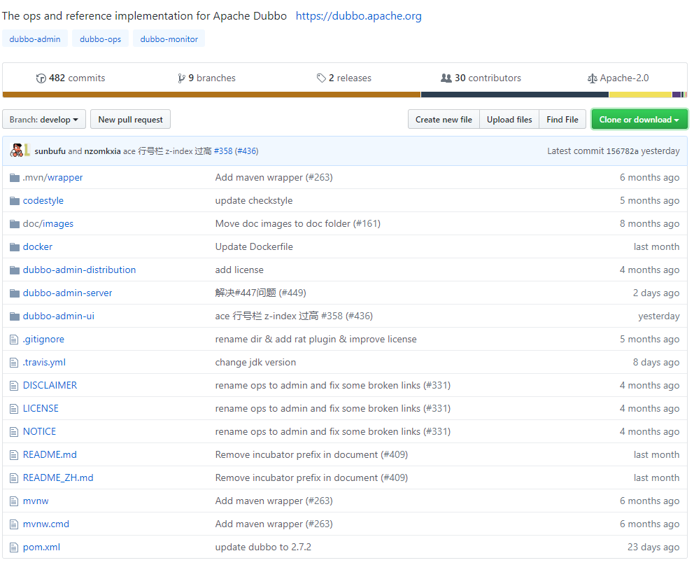
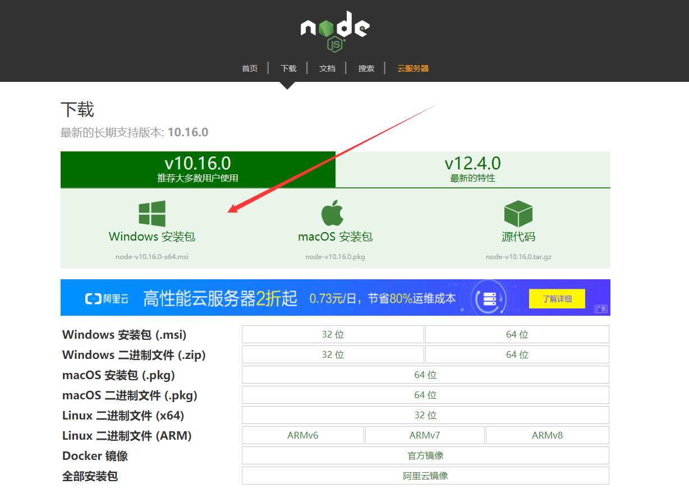
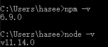
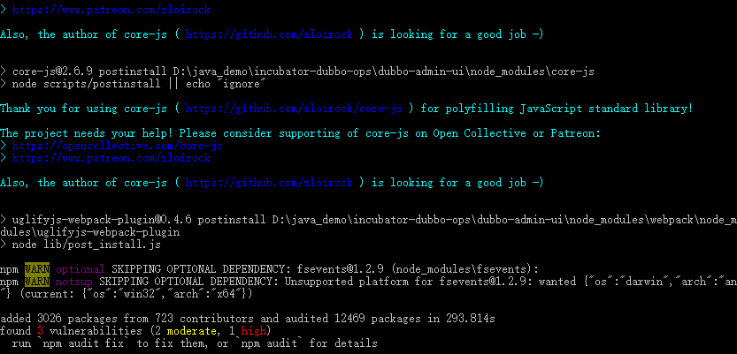
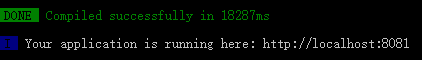
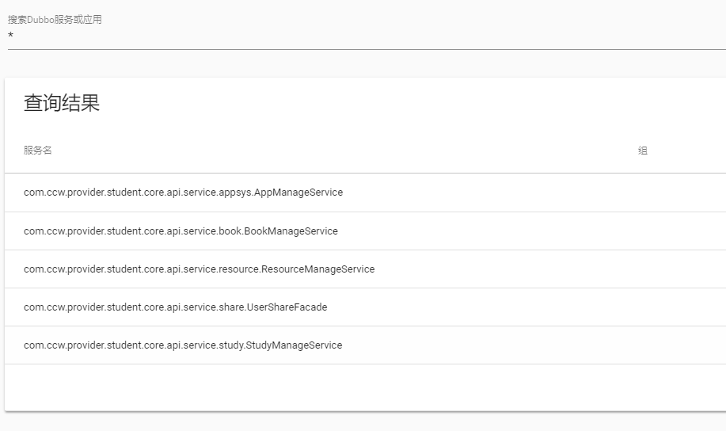
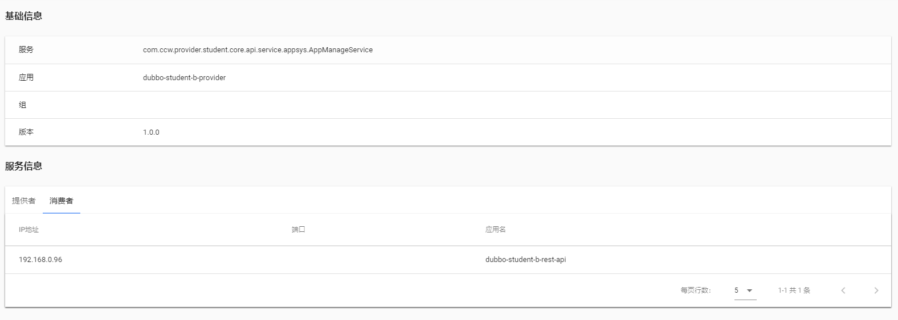

# dubbo-admin的搭建

## 项目介绍

应用截图：


如图所示，Dubbo-admin是一个dubbo的后台管理与监控平台。可以提供服务查询，服务治理，条件路由，黑白名单，负载均衡等功能操作，十分方便。

## 项目下载

项目地址：https://github.com/apache/dubbo-admin



打开cmd，使用命令`git clone https://github.com/apache/dubbo-admin.git`进行项目的克隆。

## dubbo-admin-server项目配置

使用IDEA打开项目，可以发现是一个springboot项目，如下图所示。


如果使用的是远程的zookeeper，那么需要修改相应的配置，打开dubbo-admin-server包，找到application.properties文件，修改相应的zookeeper地址，如下：

```
admin.registry.address=zookeeper://你的ip:2181
admin.config-center=zookeeper://你的ip:2181
admin.metadata-report.address=zookeeper://你的ip:2181
```

修改完毕即可启动server中的DubboAdminApplication，在浏览器中输入`localhost:8080/swagger-ui.html`可以看见swagger文档。

## dubbo-admin-ui项目配置

### 安装nodejs

由于前端页面使用到了vue框架，所以需要下载nodejs，进入官网，进行下载。

下载地址：http://nodejs.cn/download/



安装完毕后，配置环境变量：

>1）修改用户变量PATH：新建变量，内容为"D:\nodejs"。
>
>2）新增系统变量NODE_PATH：设置为：“D:\nodejs\node_modules"。

重新打开cmd，使用命令：`node -v ` 与`npm -v`，如果出现版本号，则说明安装成功！



### 运行

1）使用命令`npm congfig get registry`，结果为[http://registry.npmjs.org](http://registry.npmjs.org/)，由于是国外的镜像，所以下载速度堪忧，使用set命令`npm config set registry http://registry.npm.taobao.org`将其换成淘宝的镜像。

2）使用cd命令，进入文件dubbo-admin-ui目录，使用命令`npm install`，进行安装。安装完毕如下图所示。



3）使用命令`npm run dev`，运行成功，如下图所示。



可能会报如下错误：

```
> webpack-dev-server --inline --progress --config build/webpack.dev.conf.js

'webpack-dev-server' 不是内部或外部命令，也不是可运行的程序
或批处理文件。
npm ERR! code ELIFECYCLE
npm ERR! errno 1
npm ERR! dubbo-admin-ui@1.0.0 dev: `webpack-dev-server --inline --progress --config build/webpack.dev.conf.js`
npm ERR! Exit status 1
npm ERR!
npm ERR! Failed at the dubbo-admin-ui@1.0.0 dev script.
npm ERR! This is probably not a problem with npm. There is likely additional logging output above.

npm ERR! A complete log of this run can be found in:
npm ERR!     C:\Users\hasee\AppData\Roaming\npm-cache\_logs\2019-07-05T07_41_22_766Z-debug.log
```

**解决方案：**删除当前目录下的node_modules文件，重新执行`npm install`命令。

4）打开浏览器输入`localhost:8081`，即可看到运行成功页面。

### 运行Dubbo项目

运行自己已有的dubbo项目，可以看到查询结果如图所示。



*为查询所有服务。



同时可以查看具体的提供者与消费者等信息。

### 修改端口

由于端口8081可能会造成冲突，故可以修改自己指定的端口，比如7081。

具体操作如下：

1）找到dubbo-admin-ui中的config下的index.js文件，修改port为7081。

2）修改proxyTable中的target为`target: 'http://localhost:7081/'`，如下图所示。


重新运行如图所示。


