# Dubbo学习

## 分布式系统概念与Zookeeper简介

#### zookeeper简介

1）中间件，提供协调服务

2）作用于分布式系统，发挥其优势，可以为大数据服务

3）支持java，提供java和c语言的客户端api

##### 特点

1）一致性

数据一致性，按照顺序分批入库

2）原子性

事务要么成功要么失败

3）单一视图

客户端连接集群中的任一zk结点，数据都是一致的

4）可靠性

每次对zk的操作状态都会保存在服务端

5）实时性

客户端可以读取到zk服务端的最新数据

##### 目录说明

Bin:主要的一些执行命令

Conf:存放配置文件，需要修改zk.cfg

Contrib:附加的一些功能

Dist-maven:Mvn编译后的目录

Docs:文档

Lib:需要依赖的jar包

Recipes:案例demo代码

src:源文件

#### 分布式概念

1）很多台计算机组成一个整体，一个整体一致对外并且处理同一请求

2）内部的每台计算机都可以相互通信(rest/rpc)

3）客户端到服务端的一次请求到相应结束会历经多台计算机

##### 优点

1）增大系统容量

2）加强系统可用

3）提高模块重用度

4）提高运行速度

5）系统可扩展性高

## zk数据模型介绍

Zookeeper是一个树形结构，类似于前端开发中的tree.js组件


1）zk的数据模型也可以理解为linux/unix的文件目录：/usr/local/...

2）每一个结点都称之为znode，它可以有子结点，也可以有数据

3）每个结点分为临时结点和永久结点，临时结点在客户端断开后消失

4）每个zk结点都有各自的版本号，可以通过命令行来显示结点信息

5）每当结点数据发生变化，那么该结点的版本号会累加（乐观锁）

6）删除/修改过时结点，版本号不匹配则会报错

7）结点可以设置权限acl，可以通过权限来限制用户的访问

#### Zookeeper数据模型基本操作


#### zk的作用体现

1）master结点选举，主结点挂了以后，从结点就会接手工作，并且保证这个结点是唯一的，这也是所谓首脑模式，从而保证我们的集群是高可用的

2）统一配置文件管理，只需要部署一台服务器，则可以把相同的配置文件同步更新到其他所有服务器，此操作在云计算中用的特别多

3）发布与订阅，类似消息队列MQ，dubbo发布者把数据存在znode上，订阅者会读取这个数据

4）提供分布式锁，分布式环境中不同进程之间争夺资源，类似于多线程中的锁

5）集群管理，集群中保证数据的强一致性（一致性可分为强一致性，顺序一致性，弱一致性）

## zk特性-session的基本原理

zookeeper中session意味着一个物理连接，客户端连接服务器成功之后，会发送一个连接型请求，此时就会有session 产生

1）客户端与服务端之间的连接存在会话

2）每个会话都可以设置一个超时时间

3）心跳结束，session则过期

4）Session过期，则临时结点znode会被抛弃

5）心跳机制：客户端向服务端的ping包请求

## 常用的zookeeper命令行

`ls /`：查看目录


`ls2 /`:显示数据的目录和状态信息


```
cZxid Zookeeper为结点分配的Id
cTime 结点创建时间
mZxid 修改后的id
mtime 修改时间
pZxid 子结点id
cversion 子结点的version     //更新一次版本加一
dataVersion 当前结点数据的版本号
aclVersion 权限Version
dataLength 数据长度
numChildren  子结点个数
```

`stat /`：查询数据的状态信息


`get /`：取出结点数据


`create /xxx content`：创造xxx结点，内容为content


`create -e /xxx content`：创造xxx临时结点


可以发现ephemeralOwner发生了变化，不再是0x0，0x0为永久结点，上图为临时结点。临时结点会话断开后经过心跳机制的时间周期就会被消除：


`create -s xxx content`：创建顺序结点


结点名后面的数字会递增

`set /xxx content`：修改结点内容


`set /xxx content number`：使用乐观锁进行修改


如果不使用最新的datafVersion会出错

`delete /xxx`：删除结点


`delete /xxx number`：删除对应版本号的结点

### Watcher机制

1）针对每个结点的操作，都会有一个监督者->watcher

2）当监控的某个对象(znode)发生了变化，则触发watcher事件

3）zk中的watcher是一次性的，触发后立即销毁

4）父结点，子结点的增删改查都能够触发其watcher

5）针对不同类型的操作，触发的watcher事件也不同

> 1、(子)结点创建事件
>
> 2、(子)结点删除时间
>
> 3、(子)结点数据变化事件

#### Watcher命令行学习

1）通过get path [watch]设置watcher

2）父结点 增删改操作触发watcher

3）子结点 增删改操作触发watcher

##### Watcher事件类型

1、

1）创建父结点触发：NodeCreated

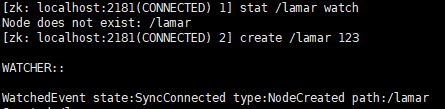

2）修改父结点数据触发：NodeDataChanged


3）删除父结点触发：NodeDeleted

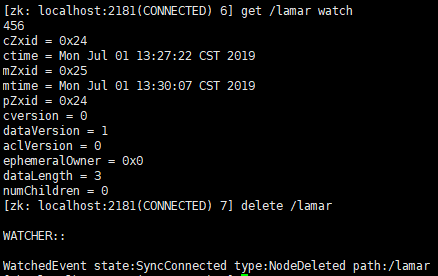

2、

1）ls为父结点设置watcher，创建子结点触发：NodeChildrenChanged

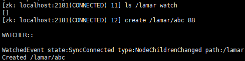

2）ls为父结点设置watcher，删除子结点触发：NodeChildrenChanged

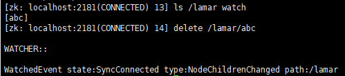

3）ls为父结点设置watcher，修改子结点不触发事件

必须要把它当成父结点来设置，而不是子结点，即：get /lamar/abc watch

#### watcher使用场景

1）统一资源配置

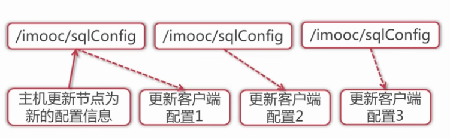

### ACL(access control lists)权限控制

1）针对结点可以设置相关读写等权限，目的是为了保障数据安全性

2）权限permissions可以指定不同的权限范围以及角色

#### ACL命令行

`getAcl`：获取某个结点的acl权限信息

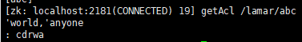

`setAcl`：设置某个结点的acl权限信息

`addauth`：输入认证授权信息，注册时输入明文密码（登录），但是在zk的系统里，密码是以加密的形式存在的

#### ACL的构成

**1、**

zk的acl通过`[scheme:id:permissions]`来构成权限列表

> scheme：代表采用的某种权限机制
>
> id：代表允许访问的用户
>
> permissions：权限组合字符串

**2、Scheme**

1）world：world下只有一个Id，即只有一个用户，也就是anyone，那么组合的写法就是`world:anyone:[permissons]`

2）auth：代表认证登录，需要注册用户有权限就可以，形式为`auth:user:password:[permissions]`

3）digest：需要对密码加密才能访问，组合形式为`digest:username:BASE64(SHA1(password)):[permissions]`

> auth与digest的区别就是，前者明文，后者密文

4）ip：当设置为ip指定的ip地址，此时限制ip进行访问，比如ip:192.168.1.1:[permissions]

5）super：代表超级管理员，拥有所有的权限

**3、permissions**

1）权限字符串缩写cdrwa

> CREATE：创建子结点
>
> DELETE：删除子结点
>
> READ：获取结点/子结点
>
> WRITE：设置结点数据
>
> ADMIN：设置权限

#### ACL命令行学习

1、

1）`world:anyone:cdrwa`

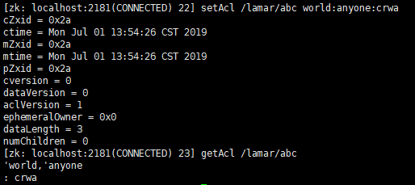


可以发现，修改为crwa的结点不能被删除

2）`auth:user:pwd:cdrwa`&`digest:user:BASE64(SHA1(pwd)):cdrwa`&`addauth digest user:pwd`

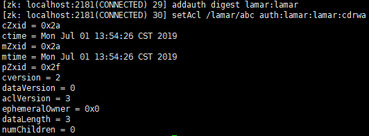

先注册用户，才可以设置auth属性

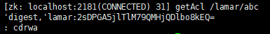

密码进行了加密的处理，另外，再设置了用户名和密码的时候，可以用匿名的形式对结点的权限进行设置，如：`setAcl /lamar/abc auth::cdrwa`

3）`ip:192.168.1.1:cdrwa`


2、

1）Super

> (1) 修改zkServer.sh增加super管理员
>
> (2) 重启zkServer.sh

在zkServer.sh中添加：

`-Dzookeeper.DigestAuthenticationProvider.superDigest=lamar:2sDPGA5jlTlM79QMHjQDlbo8kEQ=`


在进行登录操作之后，就有了所有的权限

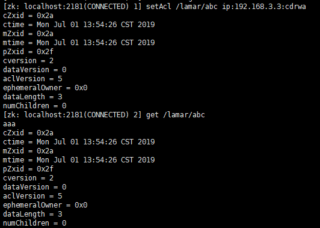

可以发现，在一般情况下无法取得的权限，在super账户下都可以获得

#### ACL的常用使用场景

1）开发/测试环境分离，开发者无权操作测试库的结点，只能看

2）生产环境上控制指定ip的服务可以访问相关结点，防止混乱

### zk四字命令Four Letter Words

1）zk可以通过它自身提供的简写命令来和服务器进行交互

2）需要使用到nc命令，安装：yum install nc

3）`echo [commond] | nc [ip] [port]`

从官方文档中查看四字命令：Document->Admin&Ops->Administrator's Guide->搜索The Four Letter Words

https://zookeeper.apache.org/doc/r3.5.5/zookeeperAdmin.html#sc_4lw

#### 常见命令

1）`[stat]`：查看zk的状态信息，以及是否mode

​	使用命令`echo stat | nc 127.0.0.1 2181`

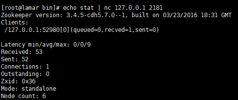

2）`[ruok]`：查看当前zkServer是否启动，返回imok


3）`[dump]`：列出未经处理的会话和临时结点


4）`[conf]`：查看服务器配置

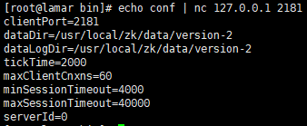

5）`[cons]`：展示连接到服务器的客户端信息

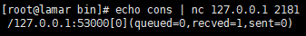

6）`[envi]`：环境变量


7）`[mntr]`：监控zk健康信息

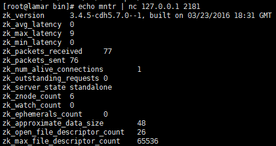

8）`[wchs]`：展示watch的信息

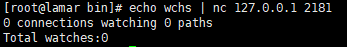

9）`[wchc]`与`[wchp]` session与watch及path与watch信息

## Zookeeper集群搭建

1）zk集群，主从结点，心跳机制（选举模式）

2）配置数据文件myid1/2/3对应server.1/2/3

3）通过`./zkCli.sh -server [ip]:[port]`检测集群是否配置成功

### 伪分布式具体操作

1）使用`cp zookeeper zookeeper02 -rf`拷贝zookeeper，拷贝两份，分别命名02,03

在zoo.cfg加入：

```
server.1=ip:2888:3888
server.2=ip:2889:3888
server.3=ip:2890:3888
```

> 等号右边第一个数字为数据传播端口号，第二个数字为选举模式相关

2）在dataDir中创建myid文件，内容写1

3）修改zookeeper02，重复1操作，并修改端口号为2182

4）重复2，内容写2

5）修改zookeeper03，重复上述操作

6）依次从1到3启动zookeeper

7）使用命令`./zkCli.sh -server localhost:2181`创建结点进行测试

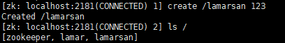

再登录其他端口的客户端，发现已经同步创建了

2182：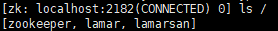

2183：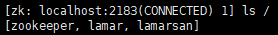

### 物理分布式注意事项

环境配置：ip要不同，但是端口号可以相同

#### 选举模式

使用status查看01的状态


可以发现是leader，剩下的两台都是follower

在物理分布式环境下（三个不同的机子）关闭leader，查看剩下两台状态。可以发现其中一台成为了新的leader，重启关闭的那台，查看状态，会发现已经变成了Follower

## 基于服务的架构演变过程


## Dubbo

### dubbo简介

1）最大程度进行解耦，降低系统耦合性

2）生产者/消费者模式

3）zk注册中心，admin监控中心，协议支持

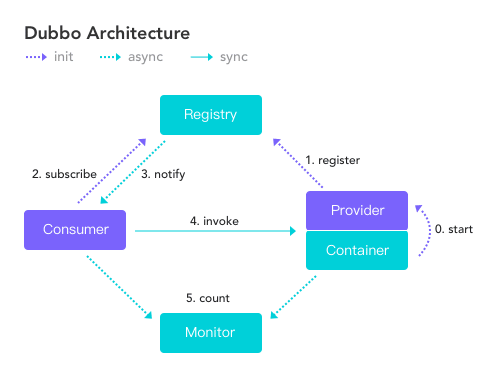

> 1、register：注册进zookeeper
>
> 2、subscribe：订阅
>
> 3、notify：通知
>
> 4、invoke：调用
>
> 5、count：计数监听

