# 安装

1）使用Xshell连接服务器，使用命令:

```sh
curl -L -O https://artifacts.elastic.co/downloads/elasticsearch/elasticsearch-7.2.0-linux-x86_64.tar.gz
```

进行tar包的下载。

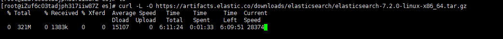

2）下载完毕后使用命令`tar -zxvf elasticsearch-7.2.0-linux-x86_64.tar.gz`进行解压。

解压完毕后进入bin：`cd elasticsearch-7.2.0/bin`

3）执行命令`./elasticsearch`，报错如下：


**解决方案：**进入config文件夹，修改jvm.options：

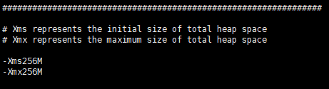

点击保存退出，再次运行，报错如下：

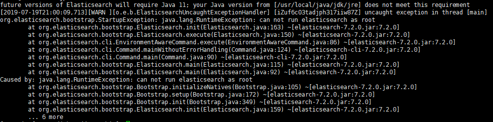

不能使用root账户运行es，创建es用户，使用命令：

```
adduser es
passwd es
```

赋予用户权限：

`chown -R esuser elasticsearch-7.2.0`

切换用户：

`su es`

再次使用命令，即可正常启动。

4）若想远程连接，进入config文件修改elasticsearch.yml文件中的端口信息如下：

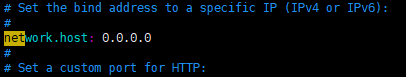

进入bin目录，使用命令`./elasticsearch`

报错：`max virtual memory areas vm.max_map_count [65530] is too low, increase to at least [262144]`

**解决方法：**切换回root用户，使用命令`vi /etc/sysctl.conf`，修改配置文件如下：

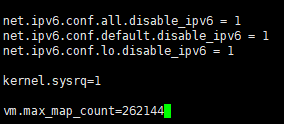

保存退出，执行命令：

`sysctl -p`

切换至es用户，再次启动。报错如下：`the default discovery settings are unsuitable for production use; at least one of [discovery.seed_hos`

修改配置文件elasticsearch.yml如下：

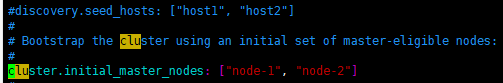

保存退出，启动成功。

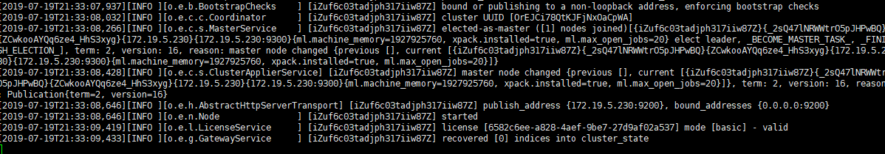

在浏览器中输入ip:9200，成功返回了命令。

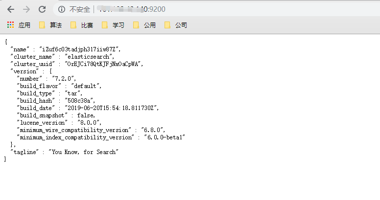

# Kibana

## 下载

1）打开官网，进行Kibana的下载。

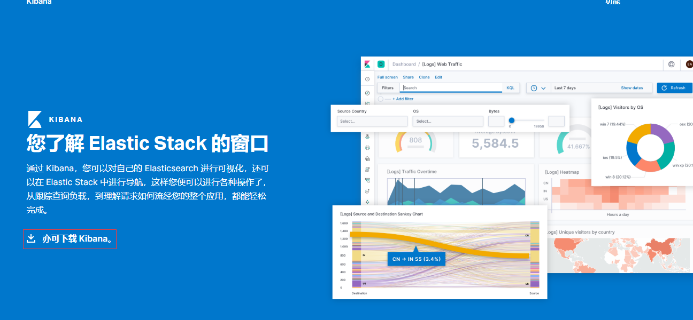

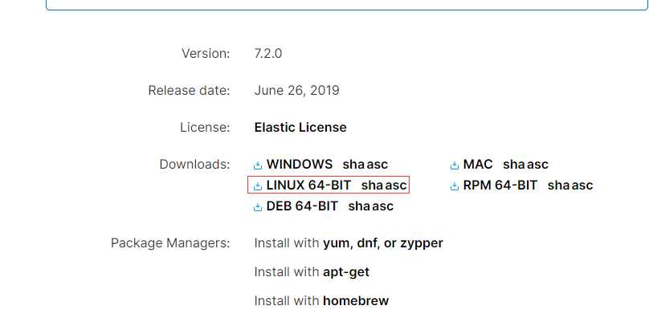

2）将下载好的tar包放至服务器进行解压。赋予es用户对kibana文件具有读写改权限。

`chown -R es elasticsearch-7.2.0`

3）修改配置文件的端口号，配置文件为config目录下的kibana.yml。

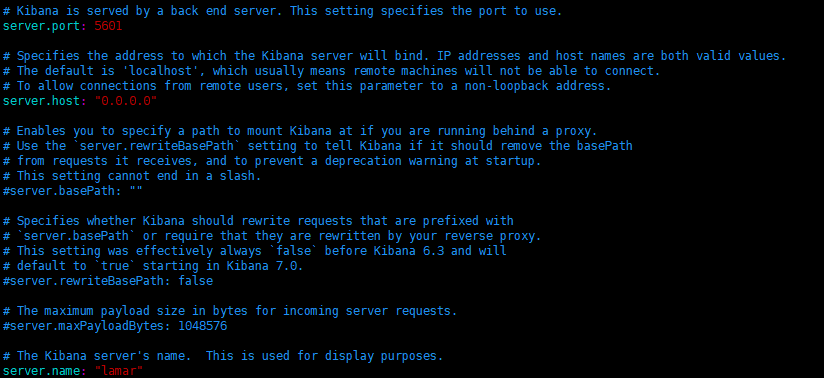

4）进入bin目录，使用命令`./kibana`运行。

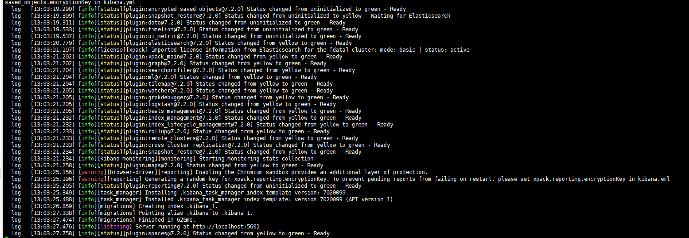

5）在本地浏览器中输入ip:5601。跳转至kibana页面。

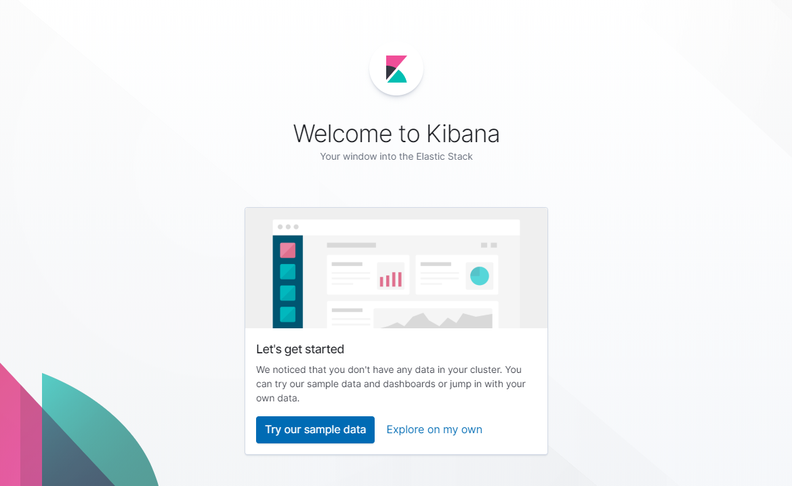

# 开始使用ES

## 相关概念

**基本术语:**
**1、Index（索引-数据库）**
索引包含一堆有相似结构的文档数据，比如可以有一个客户索引，商品分类索引，订单索引，索引有一个名称。一个index包含很多document，一个index就代表了一类类似的或者相同的document。比如说建立一个product index，商品索引，里面可能就存放了所有的商品数据，所有的商品document。

**2、Type（类型-表）**
每个索引里都可以有一个或多个type，type是index中的一个逻辑数据分类，一个type下的document，都有相同的field，比如博客系统，有一个索引，可以定义用户数据type，博客数据type，评论数据type。
商品index，里面存放了所有的商品数据，商品document
但是商品分很多种类，每个种类的document的field可能不太一样，比如说电器商品，可能还包含一些诸如售后时间范围这样的特殊field；生鲜商品，还包含一些诸如生鲜保质期之类的特殊field。

**3、Document（文档-行）**
文档是es中的最小数据单元，一个document可以是一条客户数据，一条商品分类数据，一条订单数据，通常用JSON数据结构表示，每个index下的type中，都可以去存储多个document。

**4、Field（字段-列）**
Field是Elasticsearch的最小单位。一个document里面有多个field，每个field就是一个数据字段。

​																																				——摘自大数据课程

## 探索集群部分

### 集群健康

打开Kibana的Console，输入命令：`GET /_cat/health?v`可以查看集群状态。结果如图所示。

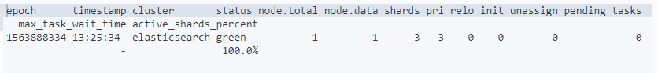

可以发现，elasticsearch的运行状态为green。状态还有Yellow以及Red，如下。

```
Green - 一切都很好（集群功能齐全）
Yellow - 所有数据都可用，但尚未分配一些副本（群集功能齐全）
Red - 某些数据由于某种原因不可用（群集部分功能）
```

除此以外，有可能出现多节点的情况，使用命令`GET /_cat/nodes?v`可以查看结点列表。

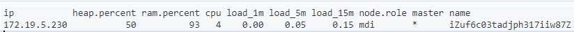

结点名字为iZuf6c03tadjph317iiw87Z，单节点运行。

### 列出索引

可以使用命令`GET /_cat/indices?v`列出所有的索引，如图所示。

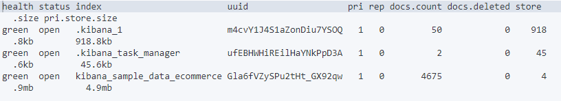

### 创建索引

创建索引并列出：

```
PUT /customer?pretty
GET /_cat/indices?v
```

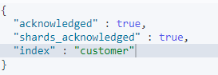

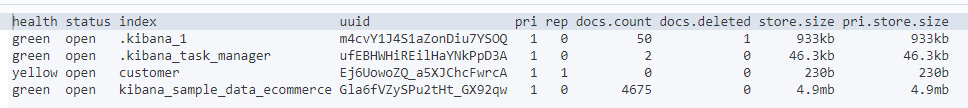

pretty用来返回JSON响应。默认创建了一个叫customer的索引以及一个分片和一个副本，并包含零个文档。

同时，可以发现状态为yellow，表示尚未分配一些副本。情况是目前只有一个结点在运行，因此在另一个结点加入集群的之前，尚无法分配一个副本（用于高可用）。该副本分配到第二个节点后，索引的运行状况将变成绿色。

### 索引和查询文档

现在在索引中放入一些文档，如下所示：

```
PUT /customer/_doc/1?pretty
{
  "name": "John Doe"
}
```

返回结果如下所示：

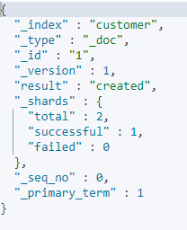

索引中成功创建了一个新的客户文档。该文档还具有我们在索引时指定的内部标识1。

值得注意的是，es不需要在将文档编入索引之前先显示创建索引。如果客户索引事先尚未存在，则es将自动创建客户索引。

我们现在检索刚刚编入索引的文档：

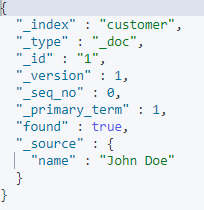

### 删除索引

先删除一个索引，再查询这个索引。

```
DELETE /customer?pretty
GET /_cat/indices?v
```

返回结果如下：

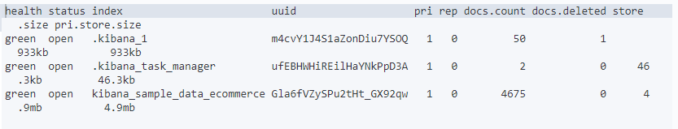可以发现，customer索引已经被删除了。

### 总结

我们学过的命令如下：

```
PUT /customer
PUT /customer/_doc/1
{
  "name": "John Doe"
}
GET /customer/_doc/1
DELETE /customer
```

可以发现命令形式如下：

`<HTTP Verb> /<Index>/<Endpoint>/<ID>`

## 修改数据

### 替换文档

回顾一下，创建单个索引命令为：

```
PUT /customer/_doc/1?pretty
{
  "name": "John Doe"
}
```

如果再次使用不同的命令，可以替换原来的内容，如图所示：

```console
PUT /customer/_doc/1?pretty
{
  "name": "Jane Doe"
}
```

现在，我们使用命令往id为2的索引中添加数据：

```console
PUT /customer/_doc/2?pretty
{
  "name": "Jane Doe"
}
```

同时，如果不指定id，将会随机生成id进行填充，由于没有指定id，要将PUT改成POST：

```console
POST /customer/_doc?pretty
{
  "name": "Jane Doe"
}
```

随机id**“mEB6M2wBmwF6zhLkwP-h”**生成如下：

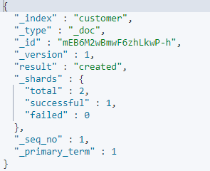

### 更新文档

请注意，es实际上并没有在缘由的基础上进行就地更新，每当我们更新时，es都会删除旧文档，然后一次性对应用了更新的新文档进行索引的编辑。

1）将名称字段更改为“Jane Doe"来更新我们以前的文档，同时为其添加年龄字段：

```
POST /customer/_update/1?pretty
{
  "doc": { "name": "Jane Doe", "age": 20 }
}
```

2）使用脚本在原有年龄基础上增加5岁：

```
POST /customer/_update/1?pretty
{
  "script" : "ctx._source.age += 5"
}
```

使用命令查询结果，返回如下：

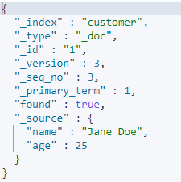

其中，ctx.source指的是即将更新的当前源文档。

### 删除文档

删除id为2的customer文档：

`DELETE /customer/_doc/2?pretty`

### 批量操作

使用`bulk`关键字可以对文档进行批量的操作。

```console
POST /customer/_bulk?pretty
{"index":{"_id":"1"}}
{"name": "John Doe" }
{"index":{"_id":"2"}}
{"name": "Jane Doe" }
```

返回结果如下：

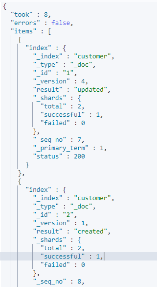

接下来试着更新id为1的文档，并删除id为2的文档

```console
POST /customer/_bulk?pretty
{"update":{"_id":"1"}}
{"doc": { "name": "John Doe becomes Jane Doe" } }
{"delete":{"_id":"2"}}
```

请注意，对于Bulk API，不会因为其中一个操作的失败而失败，如果单个操作因任何原因失败，它将继续处理其后的其余操作。批量API返回时，它将为每个操作提供一个状态，以便检查操作是否失败。

## 探索数据

在前面有了es的基础知识后，让我们尝试更真实的数据集。
使用命令将数据集下载到集群中：

```sh
wget https://raw.githubusercontent.com/elastic/elasticsearch/master/docs/src/test/resources/accounts.json

curl -H "Content-Type: application/json" -XPOST "localhost:9200/bank/_bulk?pretty&refresh" --data-binary "@accounts.json"
curl "localhost:9200/_cat/indices?v"
```

查询的返回结果如下：

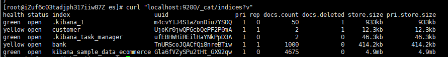

可以发现，已经出现了bank index，并导入了1000个文档。

### 搜索API

ES中有两种基本的搜索方法：一种是发送`REST request URI`，另一种是发送`REST request body`。后者更具有表现力，并且更有可读性，现在我们尝试第一种搜索方式，但是后面，我们都将采用第二种方法。

`REST API`可以用`_search`结尾，以下结果返回了文档中所有的索引。

`GET /bank/_search?q=*&sort=account_number:asc&pretty`

`q=*`表示匹配索引中的所有文档；`sort=account_number:asc`表示`account_number`每个文档的字段以升序排序。

返回结果如下：

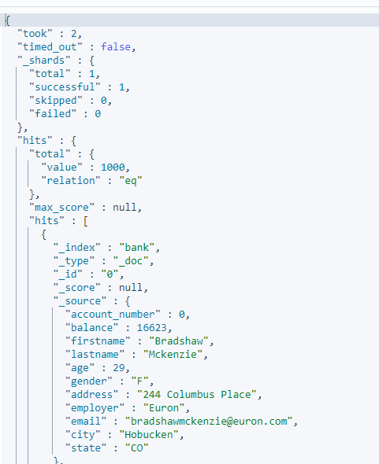

- `took` - Elasticsearch执行搜索的时间（以毫秒为单位）
- `timed_out` - 告诉我们搜索是否超时
- `_shards` - 告诉我们搜索了多少个分片，以及搜索成功/失败分片的数量
- `hits` - 搜索结果
- `hits.total` - 包含与我们的搜索条件匹配的文档总数的信息的对象
  - `hits.total.value`- 总命中数的值（必须在上下文中解释`hits.total.relation`）。
  - `hits.total.relation`- `hits.total.value`是否是确切的命中次数，在这种情况下它等于`"eq"`，即两者相等；或总命中数的下限（大于或等于），在这种情况下它等于`gte`。
- `hits.hits` - 实际的搜索结果数组（默认为前10个文档）
- `hits.sort` - 为每个结果排序键的排序值（如果按分数排序则丢失）
- `hits._score`与`max_score`- 暂时忽略这些字段

精度`hits.total`由请求参数控制`track_total_hits`，当设置为true时，请求将准确跟踪总命中（`"relation": "eq"`）。默认为`10,000` 这意味着总命中数被准确地跟踪到`10,000`文档。

以下是用另外的查询方式请求相同的返回结果：

```console
GET /bank/_search
{
  "query": { "match_all": {} },
  "sort": [
    { "account_number": "asc" }
  ]
}
```

### 介绍查询语言

Elasticsearch提供了一种JSON样式的特定于域的语言，可用于执行查询。这被称为Query DSL。

回顾我们之前的第一个例子：

```console
GET /bank/_search
{
  "query": { "match_all": {} }
}
```

`query`部分告诉我们查询定义是什么，`match_all`是在指定索引的所有文档进行搜索。

1）接下来我们可以传递`size`参数：

```
GET /bank/_search
{
  "query": { "match_all": {} },
  "size": 1
}
```

如果size没有明确，默认数为10。

2）`from`参数：

```console
GET /bank/_search
{
  "query": { "match_all": {} },
  "from": 10,
  "size": 10
}
```

此示例返回文档10到19，在实现搜索结果的分页时，此功能非常有用，如果为指定，from默认为0。

3）`sort`参数:

```console
GET /bank/_search
{
  "query": { "match_all": {} },
  "sort": { "balance": { "order": "desc" } }
}
```

此示例返回按照账户余额降序的前十个文档。

### 执行搜索

默认情况下，会以JSON形式返回文档中的所有字段，这被称为`source`，但是我们可以指定返回的字段。

**1）条件查询**

接下来这个例子只返回了`_source`中的`account_number` 和`balance`。

```console
GET /bank/_search
{
  "query": { "match_all": {} },
  "_source": ["account_number", "balance"]
}
```

返回结果如下：


在上述例子中，我们都是用`match_all`这个查询语句来返回所有文档，现在我们可以加个特点的条件：

```console
GET /bank/_search
{
  "query": { "match": { "account_number": 20 } }
}
```

查询结果如下：

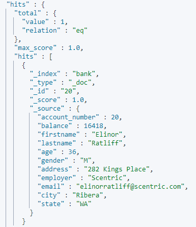

同时可以在里面加多个条件，返回地址为mill **or** lane的文档：

```console
GET /bank/_search
{
  "query": { "match": { "address": "mill lane" } }
}
```

接下来这个`match_phrase`为match的变体，意义为地址等于"mill lane"的文档：

```console
GET /bank/_search
{
  "query": { "match_phrase": { "address": "mill lane" } }
}
```

**2）bool查询**

bool查询允许我们使用布尔逻辑将较小的查询组成更大的查询，此示例组成两个`match`查询并返回地址中同时包含“mill”和“lane”的所有帐户：

```console
GET /bank/_search
{
  "query": {
    "bool": {
      "must": [
        { "match": { "address": "mill" } },
        { "match": { "address": "lane" } }
      ]
    }
  }
}
```

返回结果如下所示：


**must**表示与逻辑，即需要两者同时满足，**should**表示或，满足其一即可，如下所示：

```console
GET /bank/_search
{
  "query": {
    "bool": {
      "should": [
        { "match": { "address": "mill" } },
        { "match": { "address": "lane" } }
      ]
    }
  }
}
```

接下来这个实例中的**must_not**表示既不包含"mill"也不包含"lane"的所有账户。

```console
GET /bank/_search
{
  "query": {
    "bool": {
      "must_not": [
        { "match": { "address": "mill" } },
        { "match": { "address": "lane" } }
      ]
    }
  }
}
```

我们可以用`must`,`should`,`must_not`子句表示复杂的布尔查询，更甚者，我们可以用来表示复杂的逻辑，接下来这个例子返回了年纪为40岁，但州不为ID的文档：

```console
GET /bank/_search
{
  "query": {
    "bool": {
      "must": [
        { "match": { "age": "40" } }
      ],
      "must_not": [
        { "match": { "state": "ID" } }
      ]
    }
  }
}
```

查询结果如下：

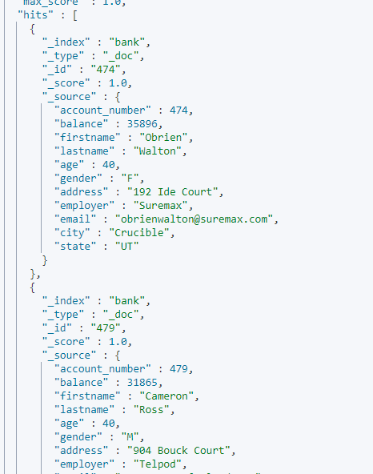

### 执行过滤器

在上述例子中，我们忽略了一个被称为`_score`的参数，它表示文档与我们的搜索查询匹配程度的相对度量，值越大，文档越相关，值越小，相关性越低。

但是查询并不总是需要产生sore，特别是仅用于“过滤”文档集的时候。bool查询还支持一些filter字句，这些子句允许我们使用查询来限制将与其他子句匹配的文档，而不会更改计算分数的方式。接下来，我们介绍一下`range`查询，它允许我们按一系列值过滤文档，通常用于数字或者日期过滤。

此示例使用bool查询返回所有余额介于20000和30000之间的帐户。换句话说，我们希望找到余额大于或等于20000且小于或等于30000的帐户。

```console
GET /bank/_search
{
  "query": {
    "bool": {
      "must": { "match_all": {} },
      "filter": {
        "range": {
          "balance": {
            "gte": 20000,
            "lte": 30000
          }
        }
      }
    }
  }
}
```

在上面的情况下，范围查询非常有意义，因为落入范围的文档都“相同”匹配，即，没有文档比另一文档更相关。返回结果如下：

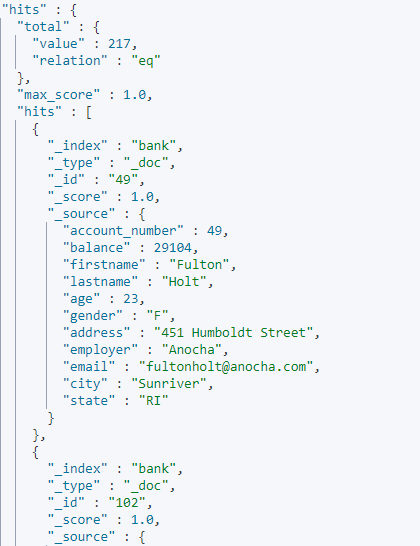

### 执行聚合

聚合提供了从数据中分组和提取统计信息的功能。在ES中，可以执行返回匹配的搜索，同时在一个响应中返回与命中相关的聚合结果。这是非常强大和高效的，因为您可以运行查询和多个聚合，并一次性获取两个（或任一）操作的结果，避免使用简洁和简化的API进行网络往返。

首先，此示例按州对所有帐户进行分组，然后返回按计数降序排序的前10个（默认）州（也是默认值）：

```console
GET /bank/_search
{
  "size": 0,
  "aggs": {
    "group_by_state": {
      "terms": {
        "field": "state.keyword"
      }
    }
  }
}
```

返回结果如下所示：


语句如果拿SQL类比的话就是：

```sh
SELECT state, COUNT(*) FROM bank GROUP BY state ORDER BY COUNT(*) DESC LIMIT 10;
```

我们可以看到`ID`（爱达荷州）有27个账户，其次是`TX`（德克萨斯州）的27个账户，其次是`AL`（阿拉巴马州）的25个账户，依此类推。

请注意，我们设置`size=0`为不显示搜索匹配，因为我们只想在响应中看到聚合结果。

在前一个聚合的基础上，此示例按州计算平均帐户余额（同样仅针对按降序排序的前10个州）：

```console
GET /bank/_search
{
  "size": 0,
  "aggs": {
    "group_by_state": {
      "terms": {
        "field": "state.keyword"
      },
      "aggs": {
        "average_balance": {
          "avg": {
            "field": "balance"
          }
        }
      }
    }
  }
}
```

返回结果如下所示：

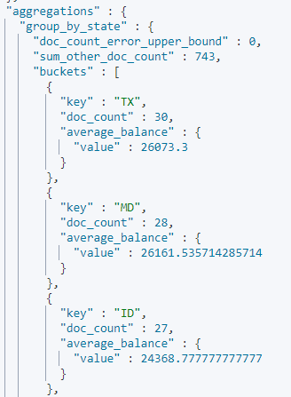

请注意我们如何嵌套`average_balance`聚合内的`group_by_state`聚合。这是所有聚合的常见模式。您可以在聚合中任意嵌套聚合，以从数据中提取所需的轮转摘要。

在前一个聚合的基础上，我们现在按降序排列平均余额：

```console
GET /bank/_search
{
  "size": 0,
  "aggs": {
    "group_by_state": {
      "terms": {
        "field": "state.keyword",
        "order": {
          "average_balance": "desc"
        }
      },
      "aggs": {
        "average_balance": {
          "avg": {
            "field": "balance"
          }
        }
      }
    }
  }
}
```

此示例演示了我们如何按年龄段（20-29岁，30-39岁和40-49岁）进行分组，然后按性别进行分组，最后得到每个年龄段的平均帐户余额：

```console
GET /bank/_search
{
  "size": 0,
  "aggs": {
    "group_by_age": {
      "range": {
        "field": "age",
        "ranges": [
          {
            "from": 20,
            "to": 30
          },
          {
            "from": 30,
            "to": 40
          },
          {
            "from": 40,
            "to": 50
          }
        ]
      },
      "aggs": {
        "group_by_gender": {
          "terms": {
            "field": "gender.keyword"
          },
          "aggs": {
            "average_balance": {
              "avg": {
                "field": "balance"
              }
            }
          }
        }
      }
    }
  }
}
```

返回结果如下：

```
{
  "took" : 28,
  "timed_out" : false,
  "_shards" : {
    "total" : 1,
    "successful" : 1,
    "skipped" : 0,
    "failed" : 0
  },
  "hits" : {
    "total" : {
      "value" : 1000,
      "relation" : "eq"
    },
    "max_score" : null,
    "hits" : [ ]
  },
  "aggregations" : {
    "group_by_age" : {
      "buckets" : [
        {
          "key" : "20.0-30.0",
          "from" : 20.0,
          "to" : 30.0,
          "doc_count" : 451,
          "group_by_gender" : {
            "doc_count_error_upper_bound" : 0,
            "sum_other_doc_count" : 0,
            "buckets" : [
              {
                "key" : "M",
                "doc_count" : 232,
                "average_balance" : {
                  "value" : 27374.05172413793
                }
              },
              {
                "key" : "F",
                "doc_count" : 219,
                "average_balance" : {
                  "value" : 25341.260273972603
                }
              }
            ]
          }
        },
        {
          "key" : "30.0-40.0",
          "from" : 30.0,
          "to" : 40.0,
          "doc_count" : 504,
          "group_by_gender" : {
            "doc_count_error_upper_bound" : 0,
            "sum_other_doc_count" : 0,
            "buckets" : [
              {
                "key" : "F",
                "doc_count" : 253,
                "average_balance" : {
                  "value" : 25670.869565217392
                }
              },
              {
                "key" : "M",
                "doc_count" : 251,
                "average_balance" : {
                  "value" : 24288.239043824702
                }
              }
            ]
          }
        },
        {
          "key" : "40.0-50.0",
          "from" : 40.0,
          "to" : 50.0,
          "doc_count" : 45,
          "group_by_gender" : {
            "doc_count_error_upper_bound" : 0,
            "sum_other_doc_count" : 0,
            "buckets" : [
              {
                "key" : "M",
                "doc_count" : 24,
                "average_balance" : {
                  "value" : 26474.958333333332
                }
              },
              {
                "key" : "F",
                "doc_count" : 21,
                "average_balance" : {
                  "value" : 27992.571428571428
                }
              }
            ]
          }
        }
      ]
    }
  }
}
```

# 设置ES

## 配置ES

### 配置JVM选项

设置JVM选项（包括系统属性和JVM标志）的首选方法是通过`jvm.options`配置文件。此文件的默认位置是`config/jvm.options`。

此文件包含遵循特殊语法的以行分隔的JVM参数列表：

- 仅包含空格的行被忽略。

- 以#开头的行被视为注释，并被忽略。

  ```text
  # this is a comment
  ```

- 以`-`开头的行被视为JVM选项，该选项独立于JVM的版本而应用

  ```text
  -Xmx2g
  ```

- 以数字冒号和`-`开头的行被视为JVM选项，仅当JVM的版本与数字匹配时才使用

  ```text
  8:-Xmx2g
  ```

- 以数字开头后跟`-：-`的行被视为JVM选项，仅当JVM的版本大于或等于数字时才使用

  ```text
  8-:-Xmx2g
  ```

- 以数字开头后跟`-`与数字后跟`:-`的行被视为JVM选项，仅当JVM的版本落在两个数字的范围内时才适用

  ```text
  8-9:-Xmx2g
  ```

- 所有其他的行都被拒绝

设置Java虚拟机选项的另一种机制是通过 `ES_JAVA_OPTS`环境变量。例如：

```sh
export ES_JAVA_OPTS="$ES_JAVA_OPTS -Djava.io.tmpdir=/path/to/temp/dir"
./bin/elasticsearch
```

### 安全设置

某些设置是敏感的，依靠文件系统权限来保护其值是不够的。对于此用例，Elasticsearch提供了一个密钥库和管理密钥库中设置的工具`elasticsearch-keystore`。

1）此处的所有命令都应该作为运行Elasticsearch的用户运行。

2）只有一些设置可以从密钥库中读取。但是，密钥库没有验证来阻止不支持的设置。将不受支持的设置添加到密钥库将导致Elasticsearch将其他不受支持的设置添加到密钥库将导致Elasticsearch无法启动。请参阅每个设置的文档，以查看它是否作为密钥库的一部分受支持。

3）只有在重新启动Elasticsearch之后，对密钥库的所有修改才会生效。

4）elasticsearch密钥库目前仅提供模糊处理。将来，将添加密码保护。

这些设置与`elasticsearch.yml`配置文件中的常规设置一样，需要在集群中的每个节点上指定。目前，所有安全设置都是特定于节点的设置，每个节点上的值必须相同。

#### 创建密钥库

要创建 `elasticsearch.keystore`，使用 `create` command:

```sh
bin/elasticsearch-keystore create
```

文件`elasticsearch.keystore` 会与 `elasticsearch.yml`一起被创建。

#### 列出密钥库设置

使用以下`list`命令可以获得密钥库中的设置列表：

```sh
bin/elasticsearch-keystore list
```

#### 添加字符串设置

可以使用以下`add`命令添加敏感字符串设置，例如云插件的身份验证凭据： 

```sh
bin/elasticsearch-keystore add the.setting.name.to.set
```

该工具将提示设置的值。要通过stdin传递值，请使用`--stdin`标志：

```sh
cat /file/containing/setting/value | bin/elasticsearch-keystore add --stdin the.setting.name.to.set
```

#### 添加文件设置

您可以使用该`add-file`命令添加敏感文件，例如云插件的身份验证密钥文件。确保在设置名称后包含文件路径作为参数。

```sh
bin/elasticsearch-keystore add-file the.setting.name.to.set /path/example-file.json
```

#### 删除设置

要从密钥库中删除设置，请使用以下`remove`命令：

```sh
bin/elasticsearch-keystore remove the.setting.name.to.remove
```

#### 可重新加载的安全设置

与设置在`elasticsearch.yml`中的值一样，密钥库内容的更改不会自动应用于正在运行的elasticsearch节点。重新读取设置需要重新启动节点。但是，某些安全设置被标记为**可重新加载**。可以重新读取这些设置并将其应用于正在运行的节点上。

所有安全设置的值（**可重新加载**或不可**加载）**在所有群集节点上必须相同。在进行所需的安全设置更改后，使用该`bin/elasticsearch-keystore add`命令调用：

```console
POST _nodes / reload_secure_settings
```

此API将在每个群集节点上解密并重新读取整个密钥库，但仅应用**可重新加载的**安全设置。对其他设置的更改将在下次重新启动后生效。一旦调用返回，重载就已完成，这意味着所有依赖于这些设置的内部数据结构都已更改。一切看起来好像设置从一开始就具有新值。

更改多个**可重新加载的**安全设置时，请在每个群集节点上修改所有这些设置，然后发出`reload_secure_settings`调用，而不是在每次修改后重新加载。

# JAVA API

## 导入依赖

```
<dependency>
    <groupId>org.elasticsearch.client</groupId>
    <artifactId>elasticsearch-rest-high-level-client</artifactId>
    <version>6.7.1</version>
</dependency>
<dependency>
    <groupId>org.apache.logging.log4j</groupId>
    <artifactId>log4j-core</artifactId>
    <version>2.11.1</version>
</dependency>
<dependency>
    <groupId>org.springframework.boot</groupId>
    <artifactId>spring-boot-starter-data-elasticsearch</artifactId>
</dependency>
```

spring版本采用2.1.0.RELEASE。

## .properties配置

```
server.port = 8098

#es
spring.data.elasticsearch.cluster-name=lamarsan
spring.data.elasticsearch.cluster-nodes=101.132.43.140:9300
```

## 编写实体类

```
@Data
@NoArgsConstructor
@Document(indexName = "article",type = "_doc", shards = 1,replicas = 0, refreshInterval = "-1")
public class ArticleEsEntity implements Serializable {
    @Id
    private Integer id;

    private Integer articleUserId;

    private String articleTitle;

    private String articleContent;

    private Integer state;
}
```

## 编写dao

```
public interface ArticleEsRepository extends ElasticsearchRepository<ArticleEsEntity, String> {
    Page<ArticleEsEntity> findByArticleContentOrArticleTitle(String content, String title, Pageable pageable);
}
```

## 编写dto

```
@Data
@NoArgsConstructor
@AllArgsConstructor
public class ArticleDTO implements Serializable {
    private String content;
    private String title;
    private Integer pageIndex;
    private Integer pageSize;
}
```

## 编写controller

```
@RestController
@CrossOrigin
@RequestMapping("/article")
public class ArticleController {
    @Autowired
    ArticleEsRepository articleEsRepository;

    @PostMapping
    public List<ArticleEsEntity> list(ArticleDTO articleDTO) {
        Pageable pageable = PageRequest.of(articleDTO.getPageIndex() - 1, articleDTO.getPageSize());
        Page<ArticleEsEntity> page = articleEsRepository.findByArticleContentOrArticleTitle(articleDTO.getContent(), articleDTO.getTitle(), pageable);
        return page.getContent();
    }
}
```

最后使用postman进行测试（请事先添加好数据）。

## 注意

ES对Springboot版本的要求很高，之前ES版本采用了7.2.0，各种报错，同时，服务器上也要将ES的版本降下来，否则会报错。