# 大数据


## Hadoop

### 初始Hadoop

#### HDFS  

**特点**

扩展性&&容错性&&海量数量存储

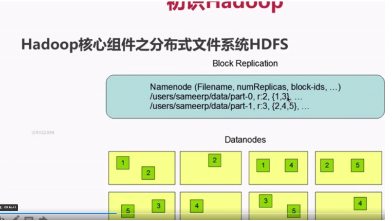

#### YARN

负责整个集群资源的管理和调度

**特点**

扩展性&&容错性&&多框架资源统一调度

#### MapReduce

**特点**

扩展性&&容错性&&海量数量离线处理


### 分布式文件系统HDFS

#### 架构

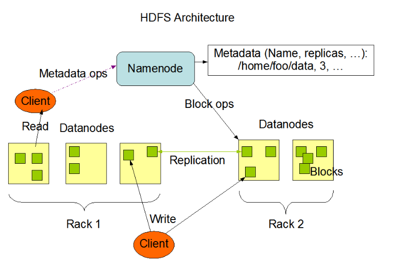

**1：**Master(NameNode/NN)  带N个Slaves(DataNode/DN)
HDFS/YARN/HBASE都有相似的结构

一个文件会被拆分成多个Block。存在一个Blocksize，超过blocksize的部分会被分成多份文件进行存储

**NN：**

①负责客户端请求的响应

②负责元数据（文件的名称、副本系数、Block存放的DN）的管理

**DN:**

①存储用户的文件对应的数据块（Block）

②要定期向NN发送心跳信息，汇报本身及其所有的block信息，健康状况

部署：一个NN加上多个DN

#### Hadoop伪分布式安装步骤

不要用公网ip做映射！！！！！

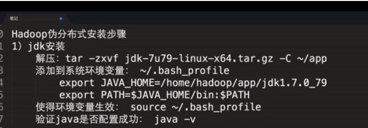

加上


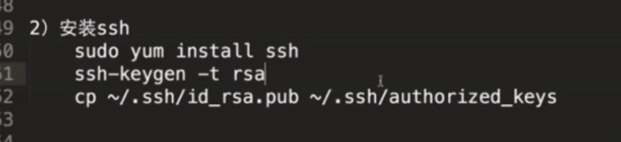

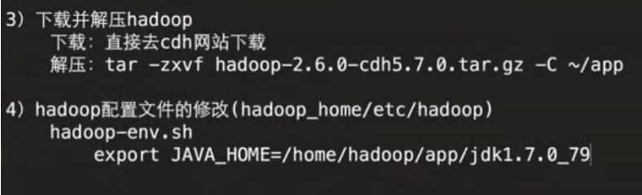

下载地址http://archive.cloudera.com/cdh5/cdh/5/


**test文件基础测试代码**

```
public static final String HDFS_PATH = "hdfs://192.168.110.128:8020";

FileSystem fileSystem = null;
Configuration configuration = null;

@Before
public void setUp() throws Exception {
    System.out.println("HDFSApp.setUp");
    configuration = new Configuration();
    fileSystem = FileSystem.get(new URI(HDFS_PATH), configuration, "root");
}

@After
public void tearDown() throws Exception {
    configuration = null;
    fileSystem = null;
    System.out.println("HDFSApp.tearDown");
}
```

#### HDFS优点

数据冗余、硬件容错

适合存储大文件

处理流式的数据访问      （一次存入，多次读取）

可构建在廉价机器上

#### HDFS缺点

不适合低延迟的数据访问

不适合小文件存储

#### HDFS命令

查看文件：`hadoop fs -ls /`

传文件：`hadoop fs -put xxx /`

查看文件内容：`hadoop fs -cat /xxx`

递归查看：`hadoop fs  -ls -R /`

递归删除：`hadoop fs -rm -R /`

### 资源调度框架YARN

#### YARN(Yet Another Resource Negotiator)

**作用：**

不同计算框架可以共享同一个HDFS集群上的数据，享受整体的资源调度

**XXX on YARN的好处**：与其他计算框架共享集群资源，按资源需要分配，进而提高集群资源的利用率

XXX:Spark/MapReduce/Storm/Flink

**概述：**

通用的资源管理系统

为上层应用提供统一的资源管理和调度

**架构：**

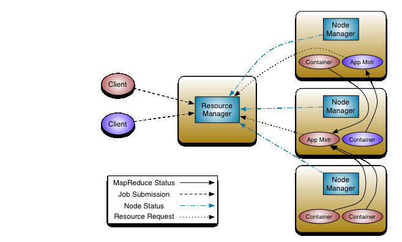

**1:ResourceManager:RM**

整个集群同一时间提供服务的RM只有一个，负责集群资源的统一管理和调度

处理客户端的请求：提交一个作业、杀死一个作业

监控NM，一旦某个NM挂了，那么该NM上运行的任务需要告诉我们的AM来如何进行处理

**2:NodeManager:NM**

整个集群中有多个，负责自己本身结点资源管理和使用

定时向RM汇报本节点的资源使用情况

接受并处理来自RM的各种命令：启动Container

处理来自AM的命令

单个结点的资源管理

**3:ApplicationMaster:AM**

每个应用程序对应一个：MR、Spark，负责应用程序的管理

为应用程序向RM申请资源（core、memory)，分配给内部task

需要与NM通信：启动/停止task，task是运行在Container里面，AM也是运行在Container里面

**4:Container**

封装了CPU、Memory等资源的一个容器

是一个任务运行环境的抽象

**5:Client**

提交作业

查询作业的运行进度

杀死作业

#### YARN环境搭建

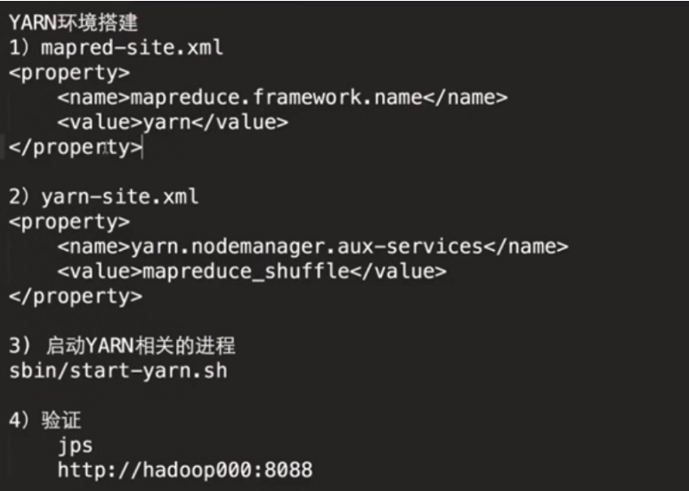

#### 提交MapReduce作业到YARN上运行

/root/app/hadoop-2.6.0-cdh5.9.0/share/hadoop/mapreduce/hadoop-mapreduce-examples-2.6.0-cdh5.9.0.jar

命令

`hadoop jar hadoop-mapreduce-examples-2.6.0-cdh5.9.0.jar ...`

### MapReduce

#### MapReduce概述

优点：海量数量离线处理&易开发&易运行

缺点：实时流式计算

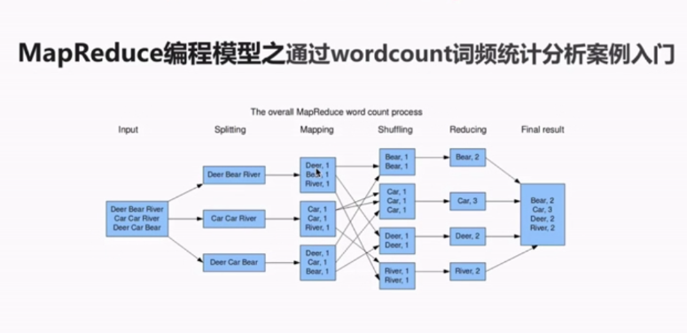

**MapReduce编程模型之Map和Reduce阶段**

将作业拆分成Map阶段和Reduce阶段

Map阶段：Map Tasks

Reduce阶段：Reduce Tasks

**MapReduce编程模型之执行步骤**

准备map处理的输入数据

Mapper处理

Shuffle

Reduce处理

结果输出

**MapReduce编程模型之核心概念**

Split：交由MapReduce作业来处理的数据块，是MapReduce中最小的计算单元

​	HDFS：blocksize 是HDFS中最小的存储单元

​	默认情况下：他们两个是一一对应的，当然我们也可以手工设置他们之间的关系（不建议）

InputFormat:

​	将输入数据进行分片（split）

​	TextInputFormat：处理文本格式的数据

OutputFormat：输出
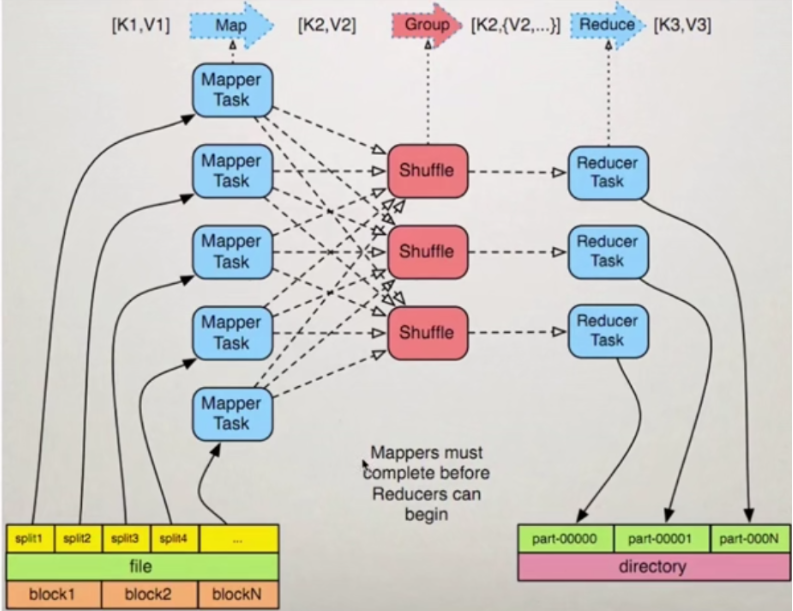

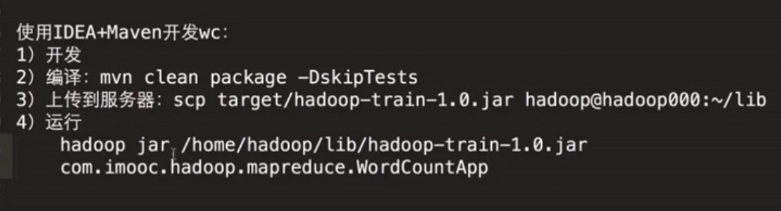

运行： 

```
hadoop jar /root/lib/jar.jar com.hadoop.mapreduce.WordCountApp hdfs://hadoop1:8020/hello.txt hdfs://hadoop1:8020/output/wc
```

相同的代码和脚本再次执行，会报错

```
WARN security.UserGroupInformation: PriviledgedActionException as:root (auth:SIMPLE) cause:org.apache.hadoop.mapred.FileAlreadyExistsException: Output directory hdfs://hadoop1:8020/output/wc already exists
Exception in thread "main" org.apache.hadoop.mapred.FileAlreadyExistsException: Output directory hdfs://hadoop1:8020/output/wc already exists
	at org.apache.hadoop.mapreduce.lib.output.FileOutputFormat.checkOutputSpecs(FileOutputFormat.java:146)
	at org.apache.hadoop.mapreduce.JobSubmitter.checkSpecs(JobSubmitter.java:270)
	at org.apache.hadoop.mapreduce.JobSubmitter.submitJobInternal(JobSubmitter.java:143)
	at org.apache.hadoop.mapreduce.Job$10.run(Job.java:1307)
	at org.apache.hadoop.mapreduce.Job$10.run(Job.java:1304)
	at java.security.AccessController.doPrivileged(Native Method)
	at javax.security.auth.Subject.doAs(Subject.java:422)
	at org.apache.hadoop.security.UserGroupInformation.doAs(UserGroupInformation.java:1698)
	at org.apache.hadoop.mapreduce.Job.submit(Job.java:1304)
	at org.apache.hadoop.mapreduce.Job.waitForCompletion(Job.java:1325)
	at com.hadoop.mapreduce.WordCountApp.main(WordCountApp.java:85)
	at sun.reflect.NativeMethodAccessorImpl.invoke0(Native Method)
	at sun.reflect.NativeMethodAccessorImpl.invoke(NativeMethodAccessorImpl.java:62)
	at sun.reflect.DelegatingMethodAccessorImpl.invoke(DelegatingMethodAccessorImpl.java:43)
	at java.lang.reflect.Method.invoke(Method.java:498)
	at org.apache.hadoop.util.RunJar.run(RunJar.java:221)
	at org.apache.hadoop.util.RunJar.main(RunJar.java:136)
```


在MR中，输出文件是不能事先存在的

(1)先手工通过shell的方式将输出文件夹先删除

​    `hadoop fs -rm -r /output/wc`

(2)在代码中完成自动删除功能：推荐使用这种方式

```
//准备清理已存在的输出目录
Path outputPath = new Path(args[1]);
FileSystem fileSystem = FileSystem.get(configuration);
if (fileSystem.exists(outputPath)) {
    fileSystem.delete(outputPath, true);
    System.out.println("output file exists,but is has deleted");
}
```

   #### MapReduce编程之Combiner

**特点：**

本地的reducer

减少Map Tasks输出的数据量及数据网络传输量

**Combiner案例开发**

```
//通过job设置combiner处理类，其实逻辑上和我们的reduce是一模一样的
job.setCombinerClass(MyReducer.class);
```

使用场景：

求和、次数    +

不适合求：平均数     *  

#### MapReduce编程之Partitioner

Partitioner决定MapTask输出的数据交由哪个ReduceTask处理

默认实现：分发的key的hash值对Reduce Task个数取模

```
public static class MyPartitioner extends Partitioner<Text, LongWritable> {
    @Override
    public int getPartition(Text key, LongWritable value, int numPartitions) {
        if (key.toString().equals("xiaomi")) {
            return 0;
        }
        if (key.toString().equals("huawei")) {
            return 1;
        }
        if (key.toString().equals("iphone7")) {
            return 2;
        }
        return 3;
    }
}
```

#### jobhistory

记录已运行完的MapReduce信息到指定的HDFS目录下

默认是不开启的

在`mapred-site.xm`加入

```
<property>
	<name>mapreduce.jobhistory.address</name>
	<value>hadoop1:10020</value>
	<description>MapReduce JobHistory Server IPC host:port
	</description>
</property>

<property>
	<name>mapreduce.jobhistory.webapp.address</name>
	<value>hadoop1:19888</value>
	<description>MapReduce JobHistory Server Web UI host:port
	</description>
</property>

<property>
	<name>mapreduce.jobhistory.done-dir</name>
	<value>/history/done</value>
</property>

<property>
	<name>mapreduce.jobhistory.intermediate-done-dir</name>
	<value>/history/done_intermediate</value>
</property>
```

在yarn-site.xml中加入

```
<property>
        <name>yarn.log-aggregation-enable</name>
        <value>true</value>
</property>
```

### 用户行为日志

**概念：**

每次访问网站时所有的行为数据（访问、浏览、搜索、点击...）

​	用户行为轨迹、流量日志

**为什么要记录用户访问行为日志：**

1）网站页面的访问量

2）网站的粘性

3）推荐

**用户行为日志生成渠道：**

1）Nginx

2）Ajax

**用户行为日志内容：**

一次访问记录：

1）访问者IP地址

2）访问者账号

3）访问时间和区域

4）访问者所使用的客户端（Chrome、Firefox....）

5）模块app ID

6）跳转的链接地址


**用户行为日志分析的意义：**

1）网站的眼睛

2）网站的神经

3）网站的大脑

### 离线数据处理架构

#### 离线数据处理流程

1）数据采集

​	Flume:web日志写入到HDFS

2）数据清洗

​	脏数据

​	Spark、Hive、MapReduce

​	清洗完之后的数据可以存放在HDFS（Hive/Spark SQL)

3）数据处理

​	按照我们的需要进行相应业务的统计和分析

​	Spark、Hive、MapReduce或者其他的一些分布式计算框架

4）处理结果入库

​	结果可以存放到RDBMS、NoSQL

5）数据的可视化

​	通过图形化展示的方式展现出来：饼图、柱状图、地图、折线图

​	ECharts、HUE、Zeppelin

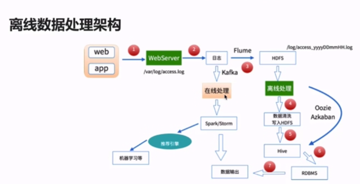

### Hadoop分布式环境搭建

hadoop1:192.168.110.128

hadoop2:192.168.110.130

hadoop3:192.168.110.131


各结点角色分配

hadoop1: NameNode/DataNode   ResourceManager

hadoop2: DataNode NodeManager

hadoop3: DataNode NodeManager

#### 前置安装

1）ssh免密码登录

在每台机器上运行：ssh-keygen -t rsa

以hadoop1机器为主

ssh-copy-id -i ~/.ssh/id_rsa.pub hadoop1

**yarn-site.xml加上**：

```
<property>
        <name>yarn.resourcemanager.hostname</name>
        <value>hadoop1</value>
</property>
```

**slaves配置**:

​	     hadoop1

​             hadoop2

​             hadoop3


验证：

hadoop1：

1905 NameNode
2002 DataNode
2773 Jps
2343 ResourceManager
2442 NodeManager
2175 SecondaryNameNode

Hadoop2:

3638 Jps
3481 NodeManager
3391 DataNode

Hadoop3:

3442 NodeManager
3352 DataNode
3579 Jps

## Hive

### Hive产生背景

MapReduce编程的不便性

HDFS上的文件缺少Schema

### Hive是什么

1）由Facebook开源，最初用于解决海量结构化的日志数据统计问题

2）构建在Hadoop之上的数据仓库

3）Hive定义了一种类SQL查询语言：HQL（类似SQL但不完全相同）

4）通常用于进行离线数据处理（采用MapReduce)

5）底层支持多种不同的执行引擎

​	Hive底层的执行引擎：MapReduce、Tez、Spark

​		Hive on MapReduce

​		Hive on Tez

​		Hive on Spark

6）支持多种不同的压缩格式、存储格式以及自定义函数

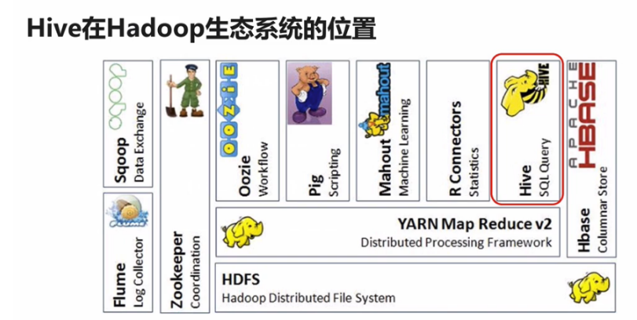

### Hive安装配置

1）下载相应tar包进行解压

2）在~/.bash_profile配置：

`export HIVE_HOME=/root/app/hive    export PATH=$HIVE_HOME/bin:$PATH`

3）实现安装一个mysql

4）在conf内改写hive-env.sh文件，手动写上HADOOP_HOME

5）创建hive-site.xml并编写

代码如下：

```
<configuration>
<property>
	<name>javax.jdo.option.ConnectionURL</name>
		<value>jdbc:mysql://192.168.110.1:3306/sparksql?createDatabaseIfNotExist=true</value>
</property>

<property>
	<name>javax.jdo.option.ConnectionDriverName</name>
		<value>com.mysql.jdbc.Driver</value>
</property>

<property>
	<name>javax.jdo.option.ConnectionUserName</name>
		<value>root</value>
</property>

<property>
	<name>javax.jdo.option.ConnectionPassword</name>
		<value>root</value>
</property>

</configuration>
```

6）拷贝mysql驱动到$HIVE_HOME/lib/

7）启动Hive

#### 坑：

注意，如果要远程连接mysql，即连接主机上的mysql上时，要将mysql设置为可远程连接

```
mysql -u root -p 
mysql>use mysql; 
mysql>select 'host' from user where user='root'; 
mysql>update user set host = '%' where user ='root'; 
mysql>flush privileges; 
mysql>select 'host'   from user where user='root'; 
```

启动hive之前一定要启动hadoop!!!!!

### 语法

#### 创建

`create table table_name(context string);`

创建的表可在tbls里查看

#### 加载

`load data local inpath '/root/data/hello.txt' into table hive_wordcount;`

#### wordcount实现

`select word,count(1) from hive_wordcount lateral view explode(split(context,'\t')) wc as word group by word;`

lateral view explode():把每行记录按照指定分隔符进行拆解

hive sql提交执行以后会生成mr作业，并在yarn上运行

## Spark

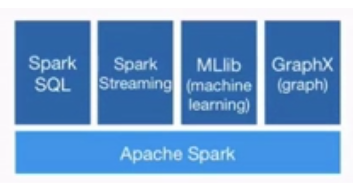

相较于传统的mapreduce优点：

1：速度快

2：通用性高

3：易使用

4：能在各种地方用

#### MapReduce的局限性：

1）代码繁琐；

2）只能够支持map和reduce方法；

3）执行效率低下；

4）不适合迭代多次、交互式、流式的处理；

#### 框架多样化：

1）批处理（离线）：MapReduce、Hive、Pig

2）流式处理（实时）：Storm、JStorm

3）交互式计算：Impala

### 源码编译

`./dev/make-distribution.sh --name 2.6.0-cdh5.9.0 --tgz -Phadoop-2.6 -Phive -Phive-thriftserver -Pyarn -Dhadoop.version=2.6.0-cdh5.9.0`

cpu撑不住

### Spark对比Hadoop


建议用Spark语言学习

#### spark操作

**spark启动**：`spark-shell --master local[2]`

**spark实现wordcount**：

```val file = sc.textFile(&quot;file:///root/data/hello.txt&quot;)
val file = sc.textFile("file:///root/data/hello.txt")

val a = file.flatMap(line => line.split(" "))

val b = a.map(word => (word,1))
--------------------------------------------------------------------------------
Array[(String, Int)] = Array((doop,1), (welcome,1), (hadoop,1), (hdfs,1), (mapreduce,1), (hadoop,1), (hdfs,1), ("",1))

val c = b.reduceByKey(_+_)
--------------------------------------------------------------------------------
Array[(String, Int)] = Array((doop,1), (mapreduce,1), ("",1), (welcome,1), (hadoop,2), (hdfs,2))

```

### 弹性分布式数据集（RDD / Resilient Distributed Datasets)

弹性分布式数据集（RDD）是所有Spark程序的核心，并行分布在整个集群中

RDD的一个重要特征是，分布式数据集可以在不同的并行环境当中被重复使用，这个特性将Spark和其他并行数据流模型框架(如MapReduce)区别开。

#### **RDDs:**

一个RDD是一个不可改变的分布式集合对象。

Spark中，所有的计算都是通过RDDs的创建，转换，操作完成的。

一个RDD内部由许多partitions（分片）组成。

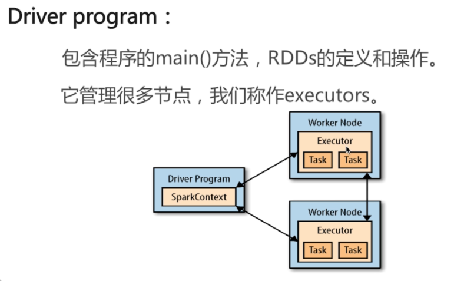


### 创建

1）**把已经存在的一个集合传给SparkContext的parallelize()方法，测试用**

`val rdd=sc.parallelize(Array(1,2,2,4),4)`

2）**创建一个对外部数据集的引用**

`val rddText=sc.textFile("hello.txt")`

### 转换

#### Transformations(转换)：

从现有的RDD生成新的RDD，像map()和filter()

##### map():

map()接受函数，把函数应用到RDD的每一个元素，返回新RDD。

`val lines2 = lines.map(word=>(word,1))`

**filter():**

filter()接受函数，返回只包含满足filter()函数的元素的新RDD。

`val lines3=lines.filter(word=>word.contains("hello"))`

**flatMap()：**

对每个输入元素，输出多个输出元素。

flat是压扁的意思，将RDD中元素压扁后返回一个新的RDD。

### 动作

动作触发对RDD的计算并对计算结果执行某种操作，要么返回给用户，要么保存到外部存储器中。

**reduce():**

接受一个函数，作用在RDD两个类型相同的元素上，返回新元素。

可以实现，RDD中元素的累加，计数，和其他类型的聚集操作。

`val sum = rdd.reduce((x,y) => x + y)`

**Collect():**

遍历整个RDD，向driver program返回RDD的内容

需要单机内存能够容纳下（因为数据要拷贝给driver,测试使用）

**take(n):**

返回RDD的n个元素（同时尝试访问最少的partitions)。

返回结果是无序的，测试使用。

**top():**

排序（根据RDD中数据的比较器）

**foreach():**

计算RDD中的每个元素，但不返回到本地

可以配合println()友好地打印出数据

`rdd.foreach(println)`

### RDDs的特性

**RDDs的血统关系图：**

Spark维护者RDDs之间的依赖关系和创建关系，叫做血统关系图

Spark使用血统关系图来计算每个RDD的需求和恢复丢失的数据

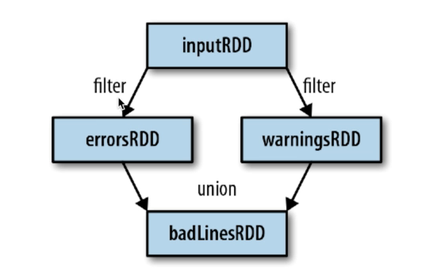

**延迟计算：**

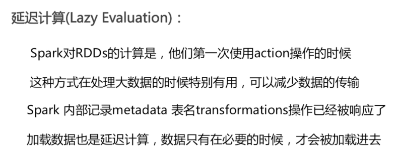

**RDD.persist():**

默认每次在RDDs上面进行action操作时，Spark都重新计算RDDs

如果想重复利用一个RDD，可以使用RDD.persist()

unpersist()方法从缓存中移除

例子-persist()

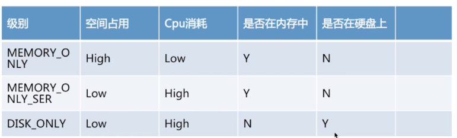


### KeyValue对RDDs

创建KeyValue对RDDs

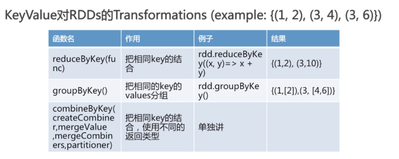


**combineByKey():**

`createCombiner,mergeValue,mergeCombiners,partitioner)`

最常用的基于key的聚合函数，返回的类型可以与输入类型不一样


求平均值例子：

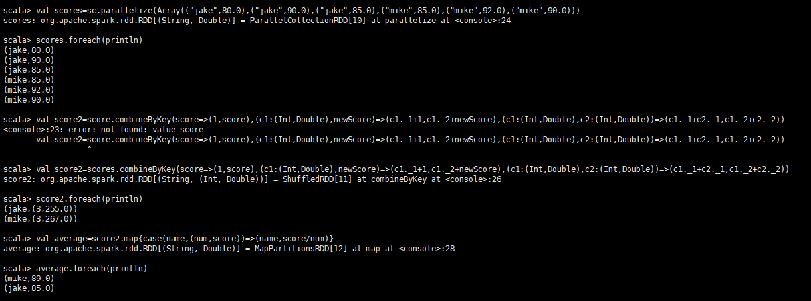

## Spark SQL

sql

dataframe/dataset api

metastore

访问：hdfs、rdbms、json、hbase、mongodb、s3、hive   ==> 外部数据源

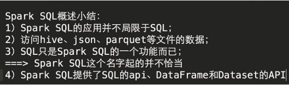

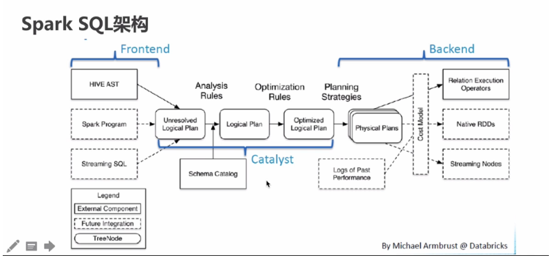


## Flink

### 概述

开源，**流式**的处理框架

分布式的，高性能的，高可用的准确计算的一个应用

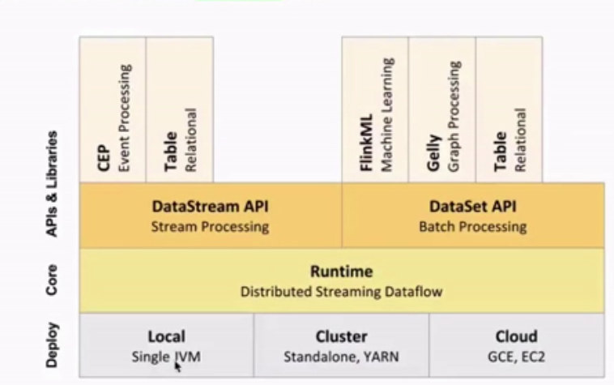

### 大数据处理神器Beam

#### 安装

```
mvn archetype:generate \
      -DarchetypeGroupId=org.apache.beam \
      -DarchetypeArtifactId=beam-sdks-java-maven-archetypes-examples \
      -DarchetypeVersion=2.8.0 \
      -DgroupId=org.example \
      -DartifactId=word-count-beam \
      -Dversion="0.1" \
      -Dpackage=org.apache.beam.examples \
      -DinteractiveMode=false
```

#### 运行

```
#direct方式运行
mvn compile exec:java -Dexec.mainClass=org.apache.beam.examples.WordCount \
 -Dexec.args="--inputFile=pom.xml --output=counts" -Pdirect-runner

#spark方式运行
mvn compile exec:java -Dexec.mainClass=org.apache.beam.examples.WordCount \
     -Dexec.args="--runner=SparkRunner --inputFile=pom.xml --output=counts" -Pspark-runner
```

## Scala

Scala：是一门多范式的编程语言，设计初衷是要集成面向对象编程和函数式编程的各种特性，它是一种静态类型语言

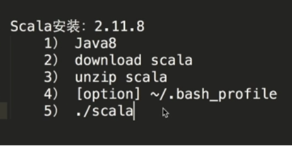

#### Scala VS Java


### scala入门

#### val vs var

val：值

​	final

​	val 值名称：类型=xxx

var：变量

​	var 值名称：类型=xxx

#### 基本数据类型

​	Byte/Char

​	Short/Int/Long/Float/Double

​	Boolean

定义float类型数字后面需要加上f

类型转换：`variable.asInstanceOf[Type]`

判断是否为目标类型：`variable.isInstanceOf[Type]`

#### Lazy在Scala中的应用

只有在变量应用到的时候，才会发生计算

在代码迭代的时候可能会使用

```
scala> import scala.io.Source._
import scala.io.Source._

scala> fromFile("/root/data/scala/HelloWorld.scala").mkString
res2: String =
"object HelloWorld{
	def main(args : Array[String]){
		println("Hello World...")
	}
}
"

scala> val info = fromFile("/root/data/scala/HelloWorld.scala").mkString
info: String =
"object HelloWorld{
	def main(args : Array[String]){
		println("Hello World...")
	}
}
"

scala> lazy  val info = fromFile("/root/data/scala/HelloWorld.scala").mkString
info: String = <lazy>

scala> info
res3: String =
"object HelloWorld{
	def main(args : Array[String]){
		println("Hello World...")
	}
}
"
```

#### 开发工具

Scala IDE

​	IDEA: 需要自己安装Scala插件

​	Eclipse: Scala IDE Eclipse 自带Scala插件

​	NetBeans:......

### Scala函数

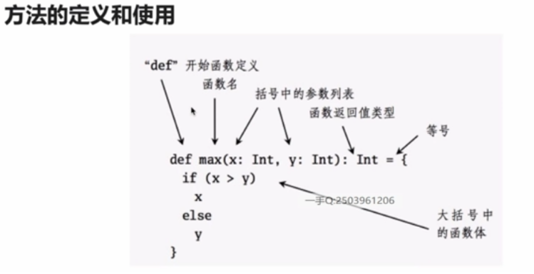

#### 循环：

```
// 普通for循环
for(i <- 1 to 10){
    println(i)
}
// course其实就是courses里面的每个元素
// =>就是将左边的course作用上一个函数，变成另外一个结果
// println 就是作用到course上的一个函数
val courses = Array("Hadoop","Spark SQL",...,"Scala")
courses.foreach(course => println(course))
```

### Scala对象

**主构造器和附属构造器**

```
package scala

object ConstructorApp {
  def main(args : Array[String]) : Unit = {

    val person = new Person("zhangsan",30)
    println(person.name + " : " + person.age + " : " +person.school)

    val person2 = new Person("PK",18,"M")
    println(person2.name + " : " + person2.age + " : " +person2.school + " : "+person2.gender)
  }
}

//主构造器
class Person(val name:String, val age:Int){

  println("Person Constructor enter....")

  val school = "ustc"
  var gender :String = _

  //附属构造器
  def this(name:String ,age:Int,gender :String) {
    //附属构造器的第一行代码必须要调用主构造器或其他附属构造器
    this(name,age)
    this.gender = gender
  }

  println("Person Constructor leave....")
}
```

#### Applay

伴生类和伴生对象如果有一个class，还有一个与class同名的object那么就称这个object是class的伴生对象，class是object的伴生类

类名（） ==》 Object.apply

对象（）==》 Class.apply

最佳实践：在Object的apply方法中去new Class

```
package scala

object ApplyApp {

  def main(args: Array[String]): Unit = {
//    for(i <- 1 to 10) {
//      ApplyTest.incr
//    }
//    println(ApplyTest.count)
    val b = ApplyTest()

    println("--------------------------")
    val c = new ApplyTest()
    println(c)
    c()
  }
}

/**
  * 伴生类和伴生对象
  * 如果有一个class，还有一个与class同名的object
  * 那么就称这个object是class的伴生对象，class是object的伴生类
  */

class ApplyTest{
  println("class ApplyTest enter...")

  def apply() = {
    println("Object ApplyTest apply...")

    //在object中的apply中new class
    new ApplyTest
  }

  println("class ApplyTest leave...")
}

object ApplyTest{
  println("Object ApplyTest enter...")

  var count = 0

  def incr = {
    count = count + 1
  }

  //面试必问 最佳实践：在Object的apply方法中去new Class
  def apply() = {
    println("Object ApplyTest apply...")

    //在object中的apply中new class
    new ApplyTest
  }
  println("Object ApplyTest leave...")
}
```

## Flume

### 下载安装配置

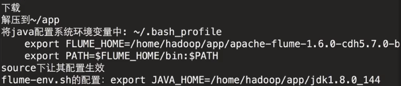

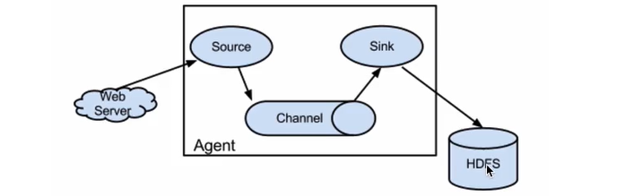

### 需求1：从指定网络端口采集数据输出到控制台

#### 使用Flume的关键就是写配置文件

A)	配置Source

B）	配置Channel

C）	配置Sink

D）	把以上三个组件串起来

a1:	agent名称

r1:	source的名称

k1:	sink的名称

c1:	channel的名称

```
# example.conf: A single-node Flume configuration

# Name the components on this agent
a1.sources = r1
a1.sinks = k1
a1.channels = c1

# Describe/configure the source
a1.sources.r1.type = netcat
a1.sources.r1.bind = 192.168.110.128 
a1.sources.r1.port = 44444

# Describe the sink
a1.sinks.k1.type = logger

# Use a channel which buffers events in memory
a1.channels.c1.type = memory

# Bind the source and sink to the channel
a1.sources.r1.channels = c1
a1.sinks.k1.channel = c1
```

将上文保存到conf目录中，命名为example.conf

#### 启动

```
flume-ng agent --name a1 --conf $FLUME_HOME/conf --conf-file $FLUME_HOME/conf/example.conf -Dflume.root.logger=INFO,console
```

#### 使用telnet进行测试：

 `telnet 192.168.110.128  44444`

#### 解析

`Event: { headers:{} body: 6C 6F 76 65 20 7A 68 65 6E 67 6E 75 6F 0D       love zhengnuo. }`

Event是Flume数据传输的基本单元

Event = 可选的header + byte array

### 需求2：监控一个文件实时采集新增的数据输出到控制台

#### Agent选型：

exec source + memory channel + logger sink

```
# example.conf: A single-node Flume configuration

# Name the components on this agent
a1.sources = r1
a1.sinks = k1
a1.channels = c1

# Describe/configure the source
a1.sources.r1.type = exec
a1.sources.r1.command = tail -F /root/data/flumedata/data.log
a1.sources.r1.shell = /bin/sh -c

# Describe the sink
a1.sinks.k1.type = logger

# Use a channel which buffers events in memory
a1.channels.c1.type = memory

# Bind the source and sink to the channel
a1.sources.r1.channels = c1
a1.sinks.k1.channel = c1
```

保存到conf目录下，文件名为exec-memory-logger.conf

#### 启动

`flume-ng agent --name a1 --conf $FLUME_HOME/conf --conf-file $FLUME_HOME/conf/exec-memory-logger.conf -Dflume.root.logger=INFO,console`

### 需求3：将A服务器上的日志实时采集到B服务器

#### 技术选型：

第一组：exec source + memory channel + avro sink

第二组：avro source + memory channel + logger sink

#### exec-memory-avro.conf

```
# example.conf: A single-node Flume configuration

# Name the components on this agent
exec-memory-avro.sources = exec-source
exec-memory-avro.sinks = avro-sink
exec-memory-avro.channels = memory-channel

# Describe/configure the source
exec-memory-avro.sources.exec-source.type = exec
exec-memory-avro.sources.exec-source.command = tail -F /root/data/flumedata/data.log
exec-memory-avro.sources.exec-source.shell = /bin/sh -c

# Describe the sink
exec-memory-avro.sinks.avro-sink.type = avro
exec-memory-avro.sinks.avro-sink.hostname = 192.168.110.128
exec-memory-avro.sinks.avro-sink.port = 44444

# Use a channel which buffers events in memory
exec-memory-avro.channels.memory-channel.type = memory

# Bind the source and sink to the channel
exec-memory-avro.sources.exec-source.channels = memory-channel
exec-memory-avro.sinks.avro-sink.channel = memory-channel
```

#### avro-memory-logger.conf

```
# example.conf: A single-node Flume configuration

# Name the components on this agent
avro-memory-logger.sources = avro-source
avro-memory-logger.sinks = logger-sink
avro-memory-logger.channels = memory-channel

# Describe/configure the source
avro-memory-logger.sources.avro-source.type = avro
avro-memory-logger.sources.avro-source.bind = 192.168.110.128
avro-memory-logger.sources.avro-source.port = 44444

# Describe the sink
avro-memory-logger.sinks.logger-sink.type = logger

# Use a channel which buffers events in memory
avro-memory-logger.channels.memory-channel.type = memory

# Bind the source and sink to the channel
avro-memory-logger.sources.avro-source.channels = memory-channel
avro-memory-logger.sinks.logger-sink.channel = memory-channel
```

#### 先启动avro-memory-logger

`flume-ng agent --name avro-memory-logger --conf $FLUME_HOME/conf --conf-file $FLUME_HOME/conf/avro-memory-logger.conf -Dflume.root.logger=INFO,console`

`flume-ng agent --name exec-memory-avro --conf $FLUME_HOME/conf --conf-file $FLUME_HOME/conf/exec-memory-avro.conf -Dflume.root.logger=INFO,console`


## 分布式消息队列Kafka

### 概述

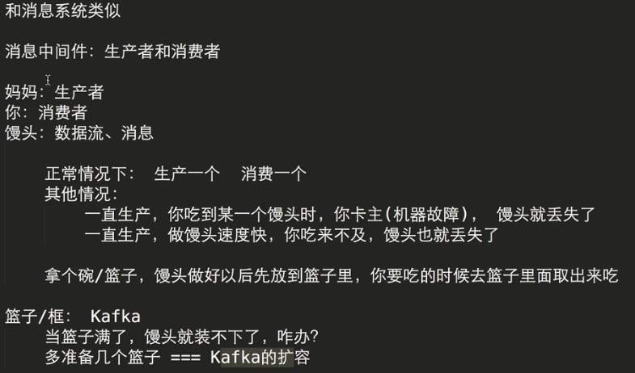


### 要先启动Zookeeper

#### 配置

./bash_profile

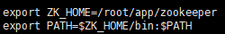

修改 zoo.cfg

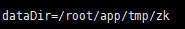

创建相应的文件夹

#### 启动

`./zkServer.sh`

`./zkCli.sh`

### 配置Kafka

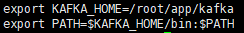

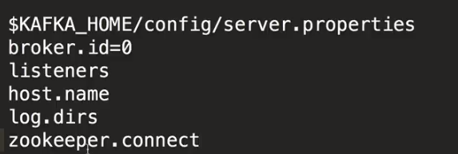

### 单节点单broker的部署及使用

#### 启动Kafka

`kafka-server-start.sh -daemon $KAFKA_HOME/config/server.properties`

#### 创建Topic：zk

`kafka-topics.sh --create --zookeeper 192.168.110.128:2181 --replication-factor 1 --partitions 1 --topic hello_topic`

##### 查看Topic

`kafka-topics.sh --list --zookeeper 192.168.110.128:2181`

#### 发送消息：broker

`kafka-console-producer.sh --broker-list 192.168.110.128:9092 --topic hello_topic`

#### 消费消息：zk

`kafka-console-consumer.sh --zookeeper 192.168.110.128:2181 --topic hello_topic --from-beginning`

`--from-beginning`：如果带了这个参数表示从头开始消费

### IDEA编程的坑

rm -r /var/log/mongodb rm -r /var/lib/mongo

在配置文件中设置

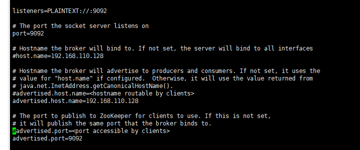

### 整合Flume和Kafka

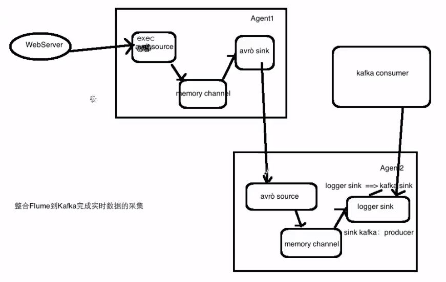

avro-memory-kafka.conf

```
# example.conf: A single-node Flume configuration

# Name the components on this agent
avro-memory-kafka.sources = avro-source
avro-memory-kafka.sinks = kafka-sink
avro-memory-kafka.channels = memory-channel

# Describe/configure the source
avro-memory-kafka.sources.avro-source.type = avro
avro-memory-kafka.sources.avro-source.bind = 192.168.110.128
avro-memory-kafka.sources.avro-source.port = 44444

# Describe the sink
avro-memory-kafka.sinks.kafka-sink.type = org.apache.flume.sink.kafka.KafkaSink
avro-memory-kafka.sinks.kafka-sink.brokerList = 192.168.110.128:9092
avro-memory-kafka.sinks.kafka-sink.topic = hello_topic
avro-memory-kafka.sinks.kafka-sink.batchSize = 5
avro-memory-kafka.sinks.kafka-sink.requiredAcks = 1

# Use a channel which buffers events in memory
avro-memory-kafka.channels.memory-channel.type = memory

# Bind the source and sink to the channel
avro-memory-kafka.sources.avro-source.channels = memory-channel
avro-memory-kafka.sinks.kafka-sink.channel = memory-channel
```

#### 启动

`flume-ng agent --name avro-memory-kafka --conf $FLUME_HOME/conf --conf-file $FLUME_HOME/conf/avro-memory-kafka.conf -Dflume.root.logger=INFO,console`

`flume-ng agent --name exec-memory-avro --conf $FLUME_HOME/conf --conf-file $FLUME_HOME/conf/exec-memory-avro.conf -Dflume.root.logger=INFO,console`

`kafka-console-consumer.sh --zookeeper fzp001:2181 --topic test`

## Spark Streaming

### Spark-submit的使用(生产)

先输入`nc -lk 9999`

```
./spark-submit --master local[2] 
--class org.apache.spark.examples.streaming.NetworkWordCount 
--name NetworkWordCount /root/app/spark/examples/jars/spark-examples_2.11-2.1.0.jar 192.168.110.128 9999
```

### 工作原理

Spark Streaming接收到实时数据流，把数据按照指定的时间段切成一片片小的数据块，然后把小的数据块传给Spark Engine处理。

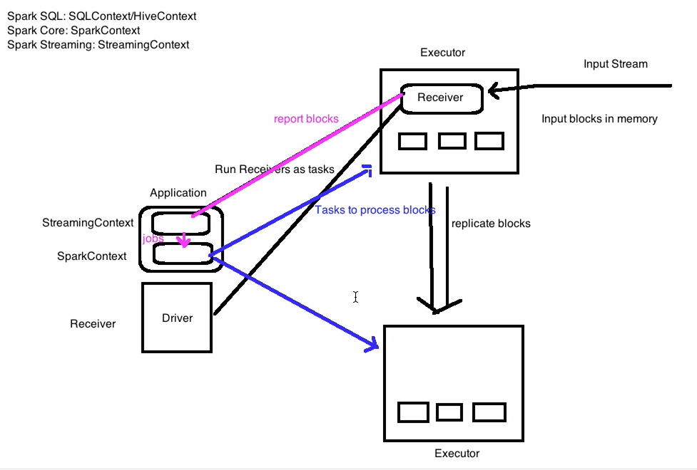

### Dstream

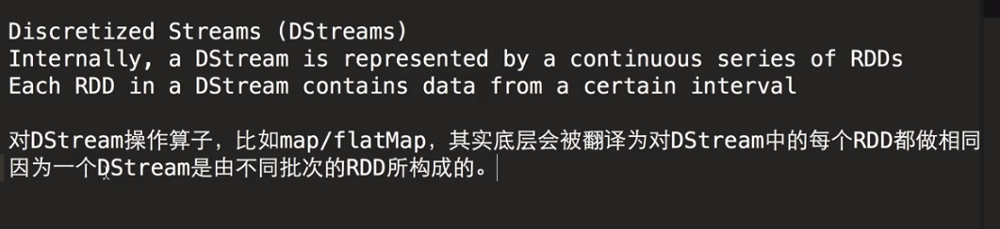

### window：

定时的进行一个时间段内的数据处理

window length：窗口的长度

sliding interval：窗口的间隔

这两个参数和我们的batch size有关系：倍数

**每隔多久计算某个范围内的数据**：

每隔10秒计算前10分钟的wc ==> 每隔sliding interval统计前window length的值

### 整合flume和streaming

```
# example.conf: A single-node Flume configuration

# Name the components on this agent
simple-agent.sources = netcat-source
simple-agent.sinks = avro-sink
simple-agent.channels = memory-channel

# Describe/configure the source
simple-agent.sources.netcat-source.type = netcat
simple-agent.sources.netcat-source.bind = 192.168.110.128
simple-agent.sources.netcat-source.port = 44444

# Describe the sink
simple-agent.sinks.avro-sink.type = avro
simple-agent.sinks.avro-sink.hostname = 192.168.110.128
simple-agent.sinks.avro-sink.port = 41414

# Use a channel which buffers events in memory
simple-agent.channels.memory-channel.type = memory

# Bind the source and sink to the channel
simple-agent.sources.netcat-source.channels = memory-channel
simple-agent.sinks.avro-sink.channel = memory-channel
```

`flume-ng agent --name simple-agent --conf $FLUME_HOME/conf --conf-file $FLUME_HOME/conf/flume-push-streaming.conf -Dflume.root.logger=INFO,console`

```
spark-submit --class com.spark.streaming.FlumePushWordCount --master local[2] --packages org.apache.spark:spark-streaming-flume_2.11:2.2.0 /root/data/kafka1/target/kafka1-1.0-SNAPSHOT.jar 192.168.110.128 41414
```

### Pull方式整合

```
# example.conf: A single-node Flume configuration

# Name the components on this agent
simple-agent.sources = netcat-source
simple-agent.sinks = spark-sink
simple-agent.channels = memory-channel

# Describe/configure the source
simple-agent.sources.netcat-source.type = netcat
simple-agent.sources.netcat-source.bind = 192.168.110.128
simple-agent.sources.netcat-source.port = 44444

# Describe the sink
simple-agent.sinks.spark-sink.type = avro
simple-agent.sinks.spark-sink.hostname = 192.168.110.128
simple-agent.sinks.spark-sink.port = 41414

# Use a channel which buffers events in memory
simple-agent.channels.memory-channel.type = memory

# Bind the source and sink to the channel
simple-agent.sources.netcat-source.channels = memory-channel
simple-agent.sinks.spark-sink.channel = memory-channel
```

`flume-ng agent --name simple-agent --conf $FLUME_HOME/conf --conf-file $FLUME_HOME/conf/flume_pull_streaming.conf -Dflume.root.logger=INFO,console`

```
spark-submit --class com.spark.streaming.FlumePullWordCount --master local[2] --packages org.apache.spark:spark-streaming-flume_2.11:2.1.0 /root/data/kafka1/target/kafka1-1.0-SNAPSHOT.jar 192.168.110.128 41414
```

### SparkStreaming整合Flueme和Kafka

```
# example.conf: A single-node Flume configuration

# Name the components on this agent
agent1.sources = avro-source
agent1.sinks = log-sink
agent1.channels = logger-channel

# Describe/configure the source
agent1.sources.avro-source.type = avro
agent1.sources.avro-source.bind = 192.168.110.128
agent1.sources.avro-source.port = 44444

# Describe the sink
agent1.sinks.log-sink.type = logger

# Use a channel which buffers events in memory
agent1.channels.logger-channel.type = memory

# Bind the source and sink to the channel
agent1.sources.avro-source.channels = logger-channel
agent1.sinks.log-sink.channel = logger-channel
```

#### 启动

`flume-ng agent --name agent1 --conf $FLUME_HOME/conf --conf-file $FLUME_HOME/conf/streaming.conf -Dflume.root.logger=INFO,console`

## HBase

### 配置

```
cd conf 

vi hbase-site.xml
```

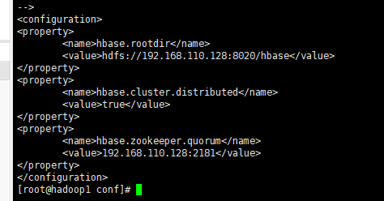

### 启动

`./start-hbase.sh`

# MLlib

### Spark MLlib实现的算法

逻辑回归 朴素贝叶斯 线性回归 SVM 决策树 LDA 矩阵分解 etc.

### 数据格式

#### 本地向量

本地向量是存储在本地节点上的，其基本数据类型是Vector.其有两个子集，分别是密集的与稀疏的，我们一般使用Vectors工厂类来生成，例如：`Vecotrs.dense(1.0,2.0,3.0)`

#### 标签数据

监督学习是(x,y)数据形式，其中这个y就是标签，x是特征向量。标签数据也是一样。

例如：`LabeledPoint(1.0,Vectors.dense(1.0,2.0,3.0))`

#### 本地矩阵

与向量相似，本地矩阵类型为Matrix,分为稠密与稀疏两种类型。同样使用工厂方法Matrices来生成。但是要注意，MLlib的矩阵是按**列**存储的。

例如下面创建一个3×3的单位矩阵：`Matrices.dense(3,3,Array(1,0,0,0,1,0,0,0,1))`

### 数据结构

#### RDD

RDD，弹性分布式数据集，是Spark中结构最简单，也是最常用的一类数据集形式。可以理解为把输入数据进行简单的封装之后形成的对内存数据的抽象。

#### Dataset

与RDD分行存储，没有列的概念不同，Dataset引入了列的概念，这一点类似于一个CSV文件结构，类似于一个简单的二维表。

#### DataFrame

DataFrame结构与Dataset是类似的，都引入了列的概念。与Dataset 不同的是，DataFrame中的每一行被再次封装为Row的对象。需要通过该对象的方法来获取到具体的值。

### 矩阵与向量介绍

#### 创建向量

`val v1 = org.apache.spark.mllib.linalg.Vectors.dense(1,2,3,4)`

`val v2 = breeze.linalg.DenseVector(1,2,3,4)`

#### 创建矩阵

`val m1 = org.apache.spark.mllib.linalg.Matrices.dense(2,3,Array(1,2,3,4,5,6))`

`val m2 = breeze.linalg.DenseMatrix(Array(1,2,3),Array(4,5,6))`

## 回归算法

### 回归分析概述

回归与分类类似，只不过回归的预测结果是连续的，而分类的预测结果是离散的。

这样，也就使得很多回归与分类的模型可以经过改动而通用。

### 线性回归算法概述

在回归分析中，自变量与因变量之间满足或基本满足线性关系，可以使用线性模型进行拟合。

#### 使用线性回归的前提条件

1）自变量与因变量之间具有线性趋势，即相关系数相关。

2）独立性：因变量之间取值相互独立，不存在关联。

#### 数学表达式

一元线性回归：y=w·x+b

矩阵形式：y=w^T·X

#### 最小二乘法

最小二乘法又称最小平方法，通过最小化残差平方和来找到最佳的函数匹配。

也就是说，最小二乘法以残差的平方和作为损失函数，用于衡量模型的好坏。

利用最小二乘法可以实现对曲线的拟合。

#### 随机梯度下降

随机梯度下降（SGD）是一种机器学习中常用的优化方法。

它是通过不断迭代更新的手段，来寻找某一个函数的全局最优解的方法。

与最小二乘法类似，都是优化算法，随机梯度下降特别适合变量众多，受控系统复杂的模型，尤其在深度学习中具有十分重要的作用。

#### 随机梯度下降优点

随机梯度下降的“随机”体现在进行梯度计算的样本是随机抽取的n个，与直接采用全部样本相比，这样计算量更少。

随机的梯度下降善于解决大量训练样本的情况。

学习率决定了梯度下降的速度，同时，在SGD的基础上引入了“动量”的概念，从而进一步加速收敛速度的优化算法也陆续被提出。

### 逻辑回归算法概述

逻辑回归即logistic回归，是一种广义上的线性回归，但是与线性回归模型不同的是，其引入了非线性函数。

因此，逻辑回归可以用于非线性关系的回归拟合，这一点是线性回归所不具备的。

#### 逻辑回归算法原理

##### Sigmoid函数

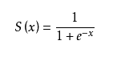


因为h(x) = w^T·x，故用h(x)代替上式中的x

#### 状态

人学习太过容易不动的变通，过于教条，变成所谓的“书呆子”。机器学习也是一样。

我们把机器学习模型训练得太过，陷入“教条”的状态称之为**过拟合**（over fitting)

反之，预测能力不强，宛若“智障”的模型称之为**欠拟合**（under fitting)

##### 如何达到刚刚好的程度呢

对于欠拟合状态，只需要加大训练轮次，增加特征量，使用非线性模型等即可实现，而相反，过拟合却往往更加棘手。

常用的减少过拟合的方法有交叉验证法，正则化方法等。

#### 交叉验证法：

所谓交叉验证法，就是在训练过程中，将训练数据集拆分为训练集和验证集两个部分，训练集专用训练模型，验证集只为检验模型预测能力，当二者同时达到最优时，即是模型最优的时候。

#### 正则化原理

对于过拟合现象，往往都是模型过于复杂，超出实际需要。

可以在损失函数的计算中，对模型的复杂程度进行量化，越复杂的模型，就越对其进行“惩罚“，以便使模型更加”中庸“。

上面的思路就是正则化的思想，通过动态调节惩罚程度，来防止模型过于复杂。

1）令损失函数为L(y,f(w,x))

2）则经过优化的参数为w = argminL(y,f(w,x))+λΩ(w)

3）其中Ω(w)为正则化项，反映了模型的复杂程度，在不同算法中有差异，例如可以为Ω(w)=||w||^p

### 保序回归算法概述

保序回归是用于你和非递减数据（非递增也一样）的一种回归分析，同时，保序回归能够使得你和之后的误差最小化。

#### 保序回归的应用

保序回归用于拟合非递减数据，不需要事先判断线性与否，只需数据总体的趋势是非递减的即可。例如研究某种药物的使用剂量与药效之间的关系。

#### 保序回归的原理

使用保序回归的前提是结果数据的非递减，那么，我们可以通过判断数据是否减少来触发计算。

算法描述：

minΣ(i=1,n)wi(xi-ai)^2 subject to xi ≤ xj for all(i,j)∈E

spark实现求解该模型的算法是pool adjacent violators算法（PAVA）

## 分类算法

### 朴素贝叶斯算法概述

#### 朴素贝叶斯简介

朴素贝叶斯算法是基于贝叶斯定理和特征条件独立假设的一种分类方法。

朴素贝叶斯算法是一种基于联合概率分布的统计学习方法。

朴素贝叶斯算法实现简单，效果良好，是一种常用的机器学习方法。

### 支持向量机概述

#### 支持向量机介绍

支持向量机介绍（SVM）是一种用来分类的算法，当然，在这基础上进行改进，也可以进行回归分析(SVR)。

SVM是最优秀的分类算法之一，即便是在如今深度学习盛行的时代，仍然具有很广泛的应用。

SVM被设计成一种二分类的算法，当然，也有人提出了使用SVM进行多分类的方法，但是SVM依然主要被用在二分类中。

#### 支持向量机算法原理

##### SVM的基本思想

SVM的主要思想是寻找能够将数据进行分类的平面或超平面，在平面上的则是A类，在平面下的则是B类，因此，SVM是一种二分类算法。

因此，这个”阈值”更贴切地说应该称为“边界”，而这个“边界”恰恰就是通过向量来表示的，故而这个”边界“我们就称为支持向量。

##### SVM的核函数

SVM虽然只能进行线性分类，但是，可以通过引入核函数，将非线性的数据，转化为另一个空间中的线性可分数据，这叫做支持向量机的核技巧，可以认为是支持向量机的精髓之一。

##### SVM的类别

1）基于硬间隔最大化的线性可分支持向量机

2）基于软间隔最大化的线性支持向量机

3）使用核函数的非线性支持向量机

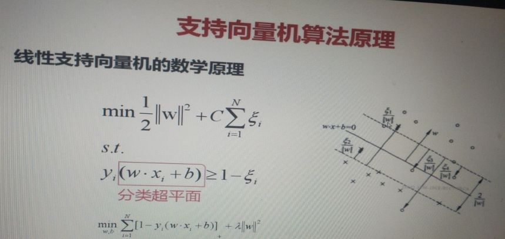

### 决策树算法概述

#### 决策树介绍

决策树因其进行决策判断的结构与数据结构中的树相同，故而得名

决策树算法既可以实现分类，也可以实现回归，一般用作分类的比较多。例如if-then就是一种简单的决策树。

#### 决策树的优势

1）决策树原理简单，易于实现。

2）决策树能够实现多分类。

3）能够在较短的时间内对大型数据源作出预测，预测性能较好。

#### 决策树的缺点

1）对输入特征要求较高，很多情况下需要作预处理。

2）识别类别过多时，发生错误的概率较大。

#### 决策树的特征选择

输入变量的特征有很多，选择特征作为分类判断的依据之一便是能够具有很好的区分度。

那么也就是说，选择出的变量能够更具有代表性，以至于区分程度更高，作为决策树的判断结点。

#### 信息增益

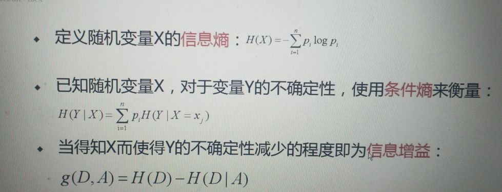

#### 决策树生成之ID3算法

ID3算法是一种决策树生成算法，其对于决策树各个结点应用信息增益准则从而选取特征，在树的每一层进行递归，从而构建整棵树。

从根结点开始，在每层选择信息增益最大的作为该结点的判断特征。

对所有结点进行相同操作，知道没有特征选择或者所有特征的信息增益均很小为止。

#### 决策树的剪枝

决策树是针对训练集进行递归生成的，这样对于训练集效果自然非常好，但是对未知数据的预测结果可能并不会很好。

即使用决策树生成算法生成的决策树模型过于复杂，对未知数据的泛化能力下降，即出现了过拟合现象。

过拟合是因为树的结构过于复杂，将树的结构精简，就能够减轻过拟合现象，即决策树的剪枝。

##### 剪枝算法

1）决策树从叶结点开始递归地向根结点剪枝。

2）判断一个结点能否被剪掉，只需比较修剪后与修建前的损失函数值大小即可。

3）如果在修建之后，损失函数值小于等于原先的损失函数值，即将该父节点变为新的叶结点即可。

#### CART算法

1）CART即分类与回归决策树，其是一棵二叉树，根据判断结果划分为“是否”二分类。

2）决策树生成：基于训练集生成一个尽可能大的决策树。

3）决策树剪枝：使用验证集对生成的决策树进行剪枝，以便使损失函数最小化

## 聚类

### Kmeans算法概述

前面所说的分类、回归都属于监督学习

我们之前提到过，无监督学习是不需要用户去指定标签的 

而我们看到的分类、回归算法都需要用户输入的训练数据集中给定一个明确的y值

#### Kmeans算法与无监督学习

Kmeans算法是无监督学习的一种

它不需要人为指定一个因变量，即标签y，而是由程序自己发现，给出类别y

#### Kmeans算法原理

1）设置需要聚类的类别个数K，以及n个训练样本，随机初始化k个聚类中心。

2）计算每个样本与聚类中心的距离，样本选择最近的聚类中心作为其类别；重新选择聚类中心。

3）迭代执行上一步，直到算法收敛。

### LDA算法概述

LDA即文档主题生成模型，该算法是一种无监督学习。

将主题对应聚类中心，文档作为样本，则LDA也是一种聚类算法。

该算法用来将多个文档划分为K个主题，与Kmeans类似。

#### LDA算法原理

LDA是一种基于概率统计的生成算法。

LDA算法是一种常用的主题模型，可以对文档主题进行聚类，同样也可以用在其他非文档的数据中。

LDA算法是通过找到词、文档与主题三者之间的统计学关系进行推断的。

## 降维

### PCA算法概述

PCA算法是一种常用的线性降维算法，算法类似于“投影”。

降维简化了数据集，故可以视为一个压缩过程，在压缩过程中可能会有信息丢失。

PCA除可以用来精简特征，还可以应用在图像处理中，例如基于PCA算法的特征脸法，它可以用来人脸识别。

#### PCA算法原理

PCA是基于K-L变换实现的一种算法。

PCA算法在实现上用到了协方差矩阵，以及矩阵的特征分解。

基本主要内容在于求出协方差矩阵，然后求协方差矩阵的特征值与特征向量。

### 推荐系统


PMML模型文件

# Storm

## 命令

### 启动zk

`nohup sh storm dev-zookeeper &`

### 启动nimbus

`nohup sh storm nimbus &`

### 启动supervisor

`nohup sh storm supervisor &`

### 启动logviewer

`nohup sh storm logviewer &`

### 启动ui

`nohup sh storm ui &`

### 运行storm

`storm jar /home/hadoop/lib/storm-1.0-SNAPSHOT.jar com.lamarsan.bigdata.integration.kafka.StormKafkaTopo`

### list作业

`storm list`

### 停止作业

`storm kill ClusterSumStormTopology `

## 流程

### 启动zookeeper

`./zkServer.sh start`

### 配置logstash

```
input {
 file {
  path => "/home/hadoop/data/logs/access.log"
 }
}


output {
 kafka {
  topic_id => "project_topic"
  bootstrap_servers => "hadoop000:9092"
  batch_size => 1
  codec => plain {
    format => "%{message}"
  }
 }
}
```

### 启动logstash

`bin/logstash -f project.conf`

### 启动kafka

`./kafka-server-start.sh -daemon /home/hadoop/app/kafka_2.11-0.9.0.0/config/server.properties`

查看topic:

`./kafka-topics.sh --list --zookeeper hadoop000:2181`

创建项目topic:

`./kafka-topics.sh --create --zookeeper hadoop000:2181 --replication-factor 1 --partitions 1 --topic project_topic`

