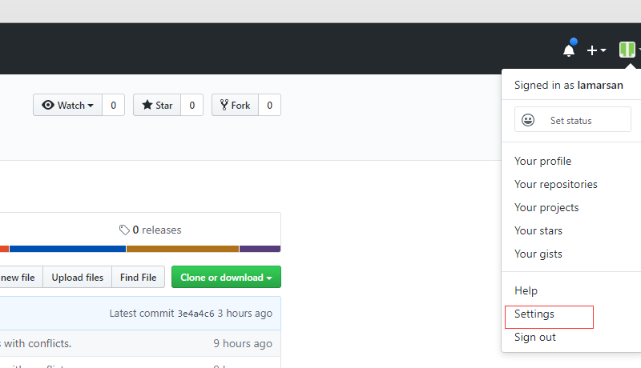
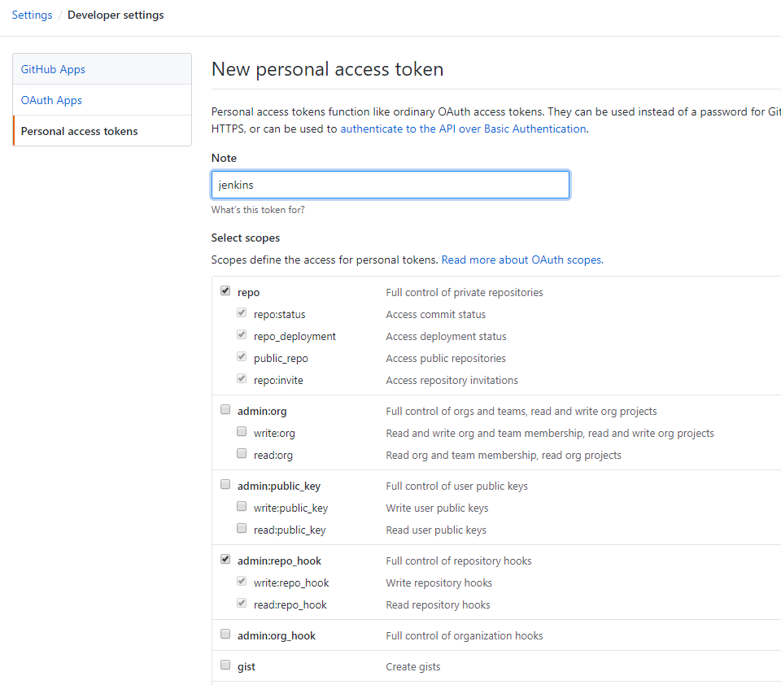
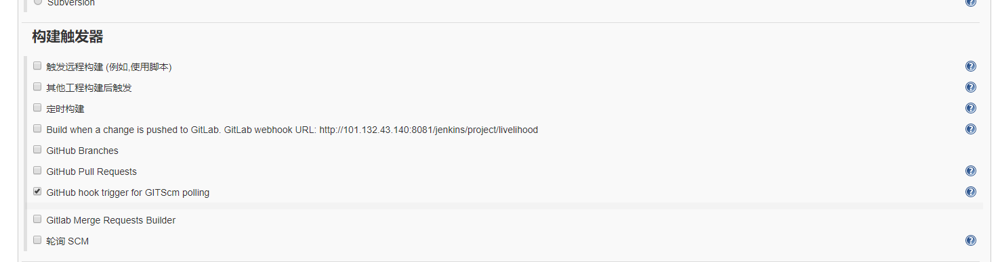

# Jenkins介绍
1）Jenkins是一个开源持续集成工具。

2）开发工具：JAVA。

3）功能：提供了软件开发的持续集成服务。

4）特点：支持主流软件配置管理，配合实现软件配置管理，持续集成功能。
## Jenkins的优势和应用场景

1）主流的运维开发平台，兼容所有主流开发环境。

2）插件市场可与海量业内主流开发工具实现集成。

3）Job为配置单位与日志管理，使运维与开发人员能协同工作。

4）权限管理划分不同Job不同角色。

5）强大的负载均衡功能，保证我们项目的可靠性。
## Jenkins Job介绍

1）代表一个任务或者项目。

2）可配置与可执行。

3）执行后的记录称之为Build。

4）日志监控与记录。

5）所有文件集中保存。

### Freestyle Job：

1）需在页面添加模块配置项与参数完成配置。

2）每个Job仅能实现一个开发功能。

3）无法将配置代码化，不利于Job配置迁移与版本控制。

4）逻辑相对简单，无需额外学习成本。

### Pipeline Job：

匹配持续集成（CI）与持续交付（CD）的几个核心概念。

**持续：**“持续”用于描述遵循许多不同流程时间。这并不意味着“一直在运行”，而是“随时可运行”。

**快速失败**：管道的工作之一就是快速处理变更。另一个是监视创建发布的不同任务和作业。由于编译失败或测试未通过的代码可以阻止管道继续运行，因此快速通知用户此类情况非常重要。快速失败指的是在管道流程中尽快发现问题并快速通知用户的方式，这样可以及时修正问题并重新提交代码以便管道在此运行。通常在管道流程中可通过查看历史记录来确定是谁做了那次修改并通知此人及团队。

**持续集成**：持续集成（CI）是在源代码变更后自动检测、拉去、构建和进行单元测试的过程。持续集成是启动管道的环节。检测变更的工作通常由Jenkins负责。检测的类型有：

	1）轮询：检测程序反复询问代码管理系统是否有新变更。
	
	2）定期：检测程序配置为定期启动构建，无论代码是否有变更，但若没有变更，也不会增加额外成本。
	
	3）推送：这与用于代码管理系统检查的检测程序相反，代码管理系统被配置为提交变更到仓库时将“推送”
一个通知到检测程序。

**单元测试**：单元测试是由开发人员编写的小型的专项测试，以确保新代码独立工作。所谓的独立是指不依赖或调用其他不可直接访问的代码，也不依赖外部数据或其他模块，如果必要的话可以用模拟（mock）表示。常见的单元测试框架有Java开发的JUnit。

**持续交付**：持续交付（CD）通常是指整个流程链（管道），它自动检测源代码变更并通过构建、测试、打包和相关操作运行它们以生成可部署的版本，基本上没有任何人为干预。

#### 特点：

1）所有模块，参数配置都可以体现为一个pipeline脚本。

2）可以定义多个stage构建一个管道工作集。

3）所有配置代码化，方便Job配置迁移与版本控制。

4）需要pipeline脚本语法基础。

#### 编写规范：

**基础架构：**

1）所有代码包裹在pipeline{}层内。

2）stages{}层用来包含该pipeline所有stage子层。

3）stage{}层用来包含具体我们需要编写任务的steps{}子层。

4）steps{}层用来添加我们具体需要调用的模块语句。
**agent区域：**

1）agent定义pipeline在哪里运行。

      可以使用any，none，或具体的Jenkins node主机名等。
    
      例如要特指在node1上执行，可以写成`agent {node{label 'node1'}}`

**environment区域：**

1）”变量名称=变量值“定义我们的环境变量。

2）可以定义全局环境变量，应用所有stages任务。

3）可以定义stage环境变量，应用单独的stage任务。

**script区域（可选）：**

1）在steps内定义script{}。

2）groovy脚本语言。

3）用来进行脚本逻辑运算。

**常用steps区域：**

1）echo：打印输出。

2）sh：调用Linux系统shell命令。

3）git url：调用git模块进行git相关操作。

```
pipeline{
	agent any
	environment{
		host='test.example.com'
		user='deploy'
	}
	stages{
		stage('build'){
			steps{
				sh "cat $host"
				echo $deploy
				script{
					def servers = ['node1','node2']
					For(int i=0;i<server.size();i++){
						echo "testing ${servers[i]} server"
					}
				}
			}
		}
	}
}
```


# 在linux配置git公钥到github上

## 安装git
安装git的目的是在自动化部署前实时从git远程仓库中拉取最新的代码。在linux(centos7系统)安装git：
`yum install git`

## 生成密钥
使用命令：
`ssh-keygen -t rsa -C "youremail@abc.com"`

可以不用设置密钥密码，连续按三次回车，如图所示。


## 添加密钥
将/root/.ssh/id\_rsa.pub中生成的密钥添加到github上去。具体步骤如下：

1）打开github，点击右上角个人头像，点击setting。

2）找到Personal settings的SSH AND GPG KEYS一栏，点击New SSH
   key。


3）将刚刚在服务器生成的ssh字符串复制黏贴进文本框，点击Add SSH
   key即可，如图3所示。


# 在linux安装maven
安装maven的目的是通过项目中的pom.xml文件自动解决项目依赖问题，构建项目。将本地已下载好的maven压缩包上传至服务器解压即可。
## 具体步骤：

1）将本地maven包拖进XShell框内，进行上传。如图所示。


2） 使用命令进行解压：`tar -zxvf apache-maven-3.3.9-bin.tar.gz`

3）配置环境变量。编辑etc/profile文件，添加环境，添加完毕后保存退出，source使其生效： 
``` java
vi etc/profile
//在文件中加入下述字符串
export MAVEN\_HOME=/usr/local/maven/maven
export PATH=\$MAVEN\_HOME/bin:\$PATH
//使其生效
source /etc/profile
```
4）检查版本号，检查环境是否已正确配置：`mvn -v`，结果如图所示：


# 在linux安装Jenkins

使用命令，关闭防火墙，防止防火墙影响jenkins的工作：
``` java
systemctl stop firewalld
systemctl disable firewalld
```
## 安装方法一

关闭防火墙后，使用yum命令，安装jenkins：
``` java
//下载YUM源
wget -O /etc/yum.repos.d/jenkins.repo
http://pkg.jenkins-ci.org/redhat/jenkins.repo
//添加YUM源
rpm \--import https://jenkins-ci.org/redhat/jenkins-ci.org.key
//YUM安装
yum install -y jenkins
```
## 安装方法二
由于使用yum源安装较慢，故直接使用官网提供的war包，如图所示，复制至tomcat目录下的webapps中。

登录网址：http://linux服务器的ip:8081/jenkins/，如图7所示，将从本地文件生成的密码复制到文本框中。

点击安装推荐的插件，等待所有的插件安装完毕。


随后创建个人管理员账户。创建完毕后主页面如图所示。


# 配置Jenkins
1）点击manage jenkin中的Configure System，如图所示。


填写git plugin信息，如图所示。


2）添加凭据。首先点击主页面凭据，随后点击Jenkins，如图所示，在全局凭据中加入个人信息。用户名与密码为github邮箱与github密码。


3） 点击全局设置，添加jdk，git与maven，将自动安装的勾勾去掉，如图14所示。


# 自动构建Maven的Freestyle Job项目

1）首先点击新建Item，如图所示。


2）填写名称，并点击自由风格项目，最后点击确定，如图所示。


3）可以填入构建参数描述，如图所示。


4）填入描述与git仓库地址和Credentials，如图所示。


5）点击构建，增加构建步骤，点击执行Shell，添加代码如下。
``` java
\#!/bin/sh

export
PATH=\"/bin:/sbin:/user/bin:/user/sbin:/user/local/bin:/usr/local/sbin\"

\# Print env variable

echo \"The build is \$version\" \>\> test.properties

echo \"\[INFO\] Done\...\"

\# Check test properties

echo \"\[INFO\] Check test properties\"

if \[ -s test.properties\]

then

cat test.properties

echo \"\[INFO\] Done\...\"

else

echo \"test.properties is empty\"

fi

echo \"\[INFO\] Build finished\...\"
```


6）点击增加构建步骤，点击调用顶层Maven目标，添加信息如图所示。


7）保存退出后点击Build with Parameters，点击开始构建，即可开始项目的构建，如图所示。


8）点击左下角的小圆圈可以看见控制台的日志输出，可以查看构建已经成功。生成的Jar包可以在/root/.jenkins/workspace/maven-freestyle-job/target中查看。如图所示。


9）此外，jenkins还可以提供定时与轮询构建。

1：轮询：检测程序反复询问代码管理系统是否有新变更。

2：定期：检测程序配置为定期启动构建，无论代码是否有变更，但若没有变更，也不会增加额外成本。

设定定时任务如图所示。


设定轮询任务如图20所示。


定时任务与轮询任务可以兼容，同时该字段遵循cron的语法（略有不同）。具体来说，每行包含由TAB或空格分隔的5个字段：

| 字段 | 范围                              |
| ---- | --------------------------------- |
| 分钟 | 一小时内（0-59）                  |
| 小时 | 一天中的小时（0-23）              |
| DOM  | 每月的某一天（1-31）              |
| 月   | 月（1-12）                        |
| DOW  | 星期几（0-7），其中0和7是星期日。 |

要为一个字段指定多个值，可以使用以下运算符。按优先顺序排列。

- \* 指定所有有效值
- M-N 指定一系列值
- M-N/X或者\*/X按X的间隔步长到指定范围或整个有效范围
- A,B,\...,Z 枚举多个值

为了允许定期计划的任务在系统上产生均匀负载，H应尽可能使用符号（"哈希"）。例如，使用0
0 \* \* \*十几个日常工作将导致午夜大幅飙升。相比之下，使用H H \* \*
\*仍然会每天执行一次，但不能同时执行，更好地使用有限的资源。

所述H符号可以与范围内使用。例如，H H(0-7) \* \*
\* 表示从凌晨12:00（午夜）到早上7:59之间的某个时间段。还可以使用H带有或不带范围的步长间隔。

该H符号可以被认为是在一定范围内的随机值，但它实际上是作业名称，而不是随机函数的哈希值，所以该值仍然是任何项目稳定。

请注意，对于月份字段的日期，由于月份长度可变，短期周期（例如\*/3或H/3将不会在大多数月份结束时始终如一地工作）。例如，\*/3将在一个月的第1天，第4天，第31天，然后在下个月的第二天再次运行。哈希总是在1-28范围内选择，因此H/3在月底之间产生3到6天之间的差距。（更长的周期也会有不一致的长度，但效果可能相对不太明显。）

以句号开头的空行和\#行将被忽略。

此外，\@yearly，\@annually，\@monthly， \@weekly，\@daily，\@midnight，并且\@hourly也支持方便的别名。这些使用哈希系统进行自动平衡。例如，在一小时内的任何时间\@hourly都是相同的H
\* \* \*
\*并且可能意味着。 \@midnight实际上是指在凌晨12:00到凌晨2:59之间的某个时间段。

例子：

**每十五分钟一次（也许在：07：，22，：37，：52）：**

`H / 15 * * * *`

**每小时上半场每十分钟一次（三次，也许是：04，：14，：24）：**

`H（0-29）/ 10 * * * *`

**每小时一次，每小时45分钟，从上午9:45开始，每个工作日下午3:45结束：**

`45 9-16 / 2 * * 1-5`

**每个工作日上午9点到下午5点每两小时一次（可能是上午10点38分，下午12点38分，下午2点38分，下午4点38分）：**

`H H（9-16）/ 2 * * 1-5`

**每月1日和15日每天一次，12月除外：**

`H H 1,15 1-11 *`

### 时区规范

定期任务通常在Jenkins主JVM（目前为**亚洲/上海**）的时区中的预定时间执行。通过在字段的第一行中指定备用时区，可以选择更改此行为。时区规范以TZ=，后跟时区的ID开头。

具有时区规范的计划的完整示例：

`TZ =欧洲/伦敦`

＃这项工作需要在伦敦时间早上开始

`H 8 * * *`

\#Butlers没有五点钟，所以我们再次开始工作

`H（0-30）17 * * *`

# 自动构建Maven的Pipeline Job项目
1）首先点击新建Item，如图所示。


2）填写名称，并点击流水线项目，最后点击确定，如图所示。


3）将事先准备好的shell代码填入流水线，如图所示。


``` java
pipeline{
	agent {node{label 'master'}}
    
    environment{
    	PATH="/bin:/sbin:/usr/bin:/usr/sbin:/usr/local/bin"
    }
    
    parameters {
    	choice(
    		choices:'dev\nprod',
    		description:'choose deploy environment',
    		name:'deploy_env'
    	)
    	string (name:'version',defaultValue:'1.0.0',description:'build version')
    }
    
    stages{
    	stage("Checkout test repo"){
    		steps{
    			sh 'git config --global http.sslVerify false'
    			dir ("${env.WORKSPACE}"){
    				git branch:'master',credentialsId:"c1b21f21-edf9-44fb-9da6-c32169ffe2d9",url:'https://github.com/lamarsan/background-program.git'
    			}
    		}
    	}
    	stage("Print env variable"){
    		steps{
    			dir("${env.WORKSPACE}"){
    				sh """
    				echo "[INFO] Print env variable"
    				echo "Current deployment environment is $deploy_env" >> test.properties
    				echo "The build is $version" >> test.properties
    				echo "[INFO] Done..."
    				"""
    			}
    		}
    	}
    	stage("Check test properties"){
    		steps{
    			dir("${env.WORKSPACE}"){
    				sh """
    				echo "[INFO] Check test properties"
    				if [ -s test.properties ]
    				then
    					cat test.properties
    					echo "[INFO] Done..."
    				else
    					echo "test.properties is empty"
    				fi
    				"""
    				
    				echo "[INFO] Build finished..."
    			}
    		}
    	}
    }
}
```
4）保存退出，点击立即构建，结果会失败，如图所示。


5）失败是由于没有添加参数所致，返回到项目，点击Build with Parameters，如图所示。同时，日志提示没有找到git命令，故去掉`sh 'git config --global http.sslVerify false'`一行。


6）点击开始构建，构建成功，如图所示。


# 实现Dubbo项目提交后自动构建

## 准备Shell文件

1）replace.sh

构建后复制target文件至jenkins目录下：

```
cp /root/.jenkins/workspace/livelihood/people-services-core/people-services-core-provider/target/people-services-core-provider.jar  /usr/local/jenkins/build/people-services/
cp /root/.jenkins/workspace/livelihood/people-services-rest-api/target/people-services-rest-api.jar  /usr/local/jenkins/build/people-services/
```

2）stop-api.sh

api的停用：

```
echo "Stopping people-services-rest-api.jar"
pid=`ps -ef | grep people-services-rest-api.jar | grep -v grep | awk '{print $2}'`
if [ -n "$pid" ]
then
   echo "kill -9 的pid:" $pid
   kill -9 $pid
fi
```

3）stop-core.sh

微服务的停用：

```
echo "Stopping people-services-core-provider.jar"
pid=`ps -ef | grep people-services-core-provider.jar | grep -v grep | awk '{print $2}'`
if [ -n "$pid" ]
then
   echo "kill -9 的pid:" $pid
   kill -9 $pid
fi
```

4）startup-core.sh

微服务的启用：

```
java -jar  /usr/local/jenkins/build/people-services/people-services-core-provider.jar
```

5）startup-api.sh

api的启用：

```
java -jar  /usr/local/jenkins/build/people-services/people-services-rest-api.jar
```

## 配置Github

### 生成Secret

1）进入账号设置一栏，如图所示：



2）点击Develper settings


3）点击Personal access tokens


4）生成secret token



### 项目设置

1）进入github项目，点击进入设置：


2）点击settings中的Webhooks，添加如下信息：


Secret为刚刚生成的token，点击保存。

## 配置Jenkins

### 构建触发器

勾选**GitHub hook trigger for GITScm polling**：



### 构建环境


1）点击Use secret text(s) or file(s)。

2）点击新增中的Secert text。

3）填入相应信息，变量为github生成的secret。

4）添加凭据，如图所示：


### 添加Shell脚本

使用自由风格配置好基本配置后，在构建一栏的增加构建步骤中选择执行Shell，如图所示：


在命令中填入：

```
#!/bin/bash
cd /usr/local/jenkins/shell/people-service
./stop-api.sh
./stop-core.sh
./replace.sh
echo "Execute shell Finish"
BUILD_ID=dontKillMe nohup /usr/local/jenkins/shell/people-service/startup-core.sh &
BUILD_ID=dontKillMe nohup /usr/local/jenkins/shell/people-service/startup-api.sh &
```

## 立即构建

点击如图所示的立即构建：


结果如下：


