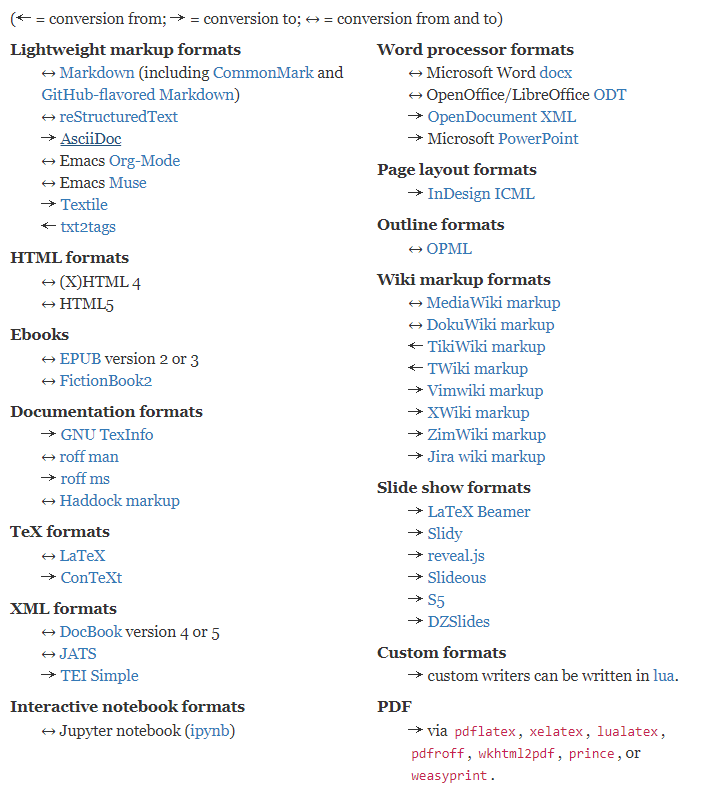
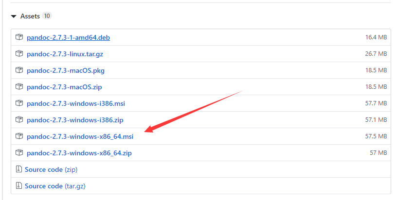

# pandoc安装与使用

## 什么是pandoc

如果需要将文件从一种标记格式转换为另一种标记格式，那么pandoc就是您的瑞士军刀。PanDoc可以在以下格式之间转换：

## 下载

进入github下载链接，点击下载。

github：https://github.com/jgm/pandoc/releases

## 安装

无脑安装即可。

安装完毕进入cmd输入命令`pandoc -v`可以查看版本号，版本号显示正确即已正确安装。

## 使用

使用cd命令进入要转换的文件目录，使用以下命令。

`pandoc xxx.md -s -o xxx.docx`：将Markdown转换成word。

`pandoc xxx.docx -s -o xxx.md`：将word文件转成markdown。

其他的转换方式可以自行了解。

