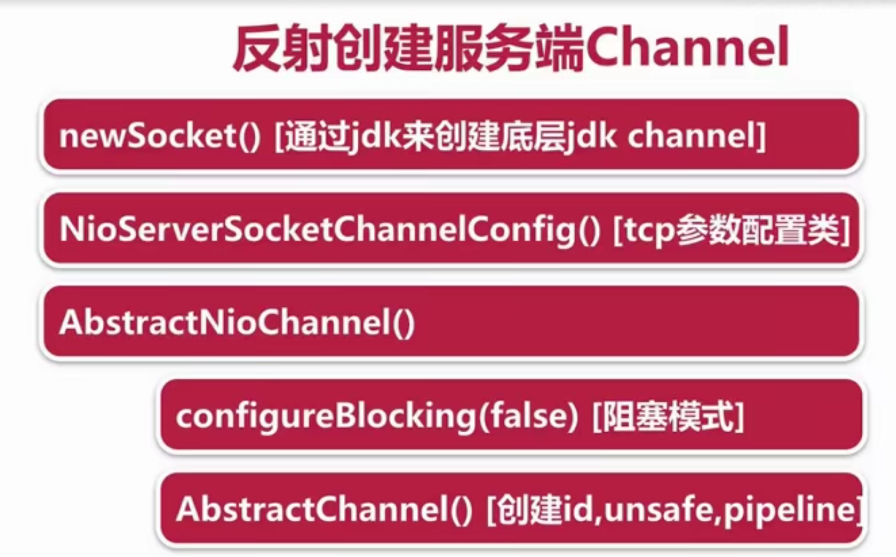
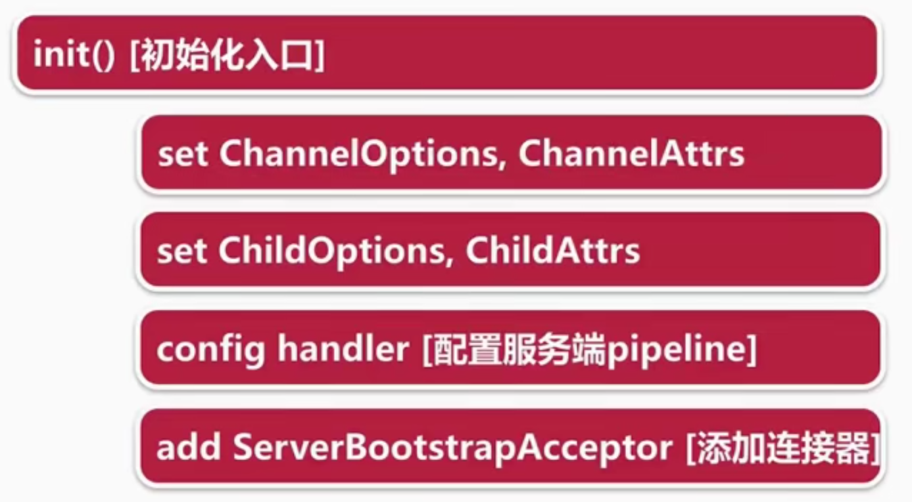
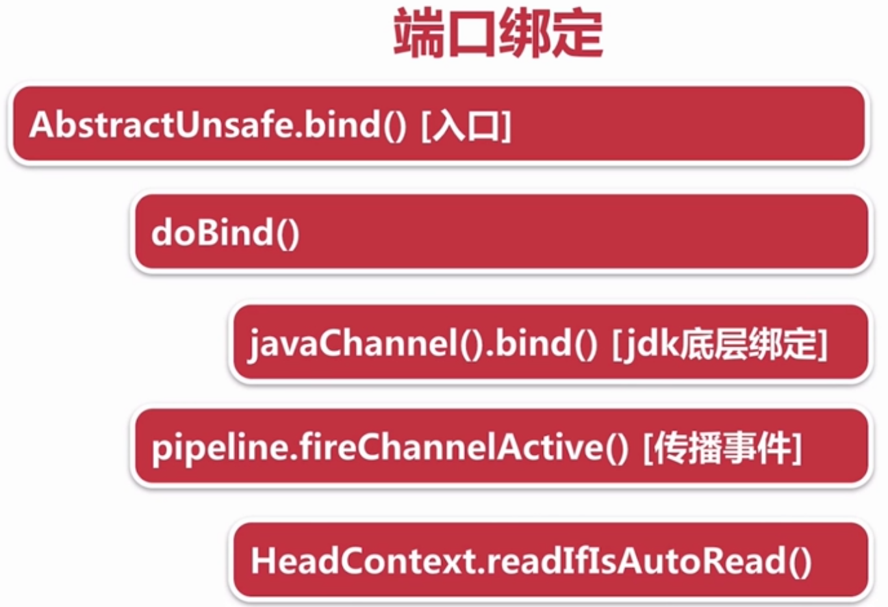
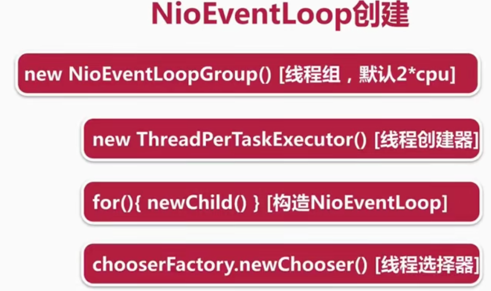
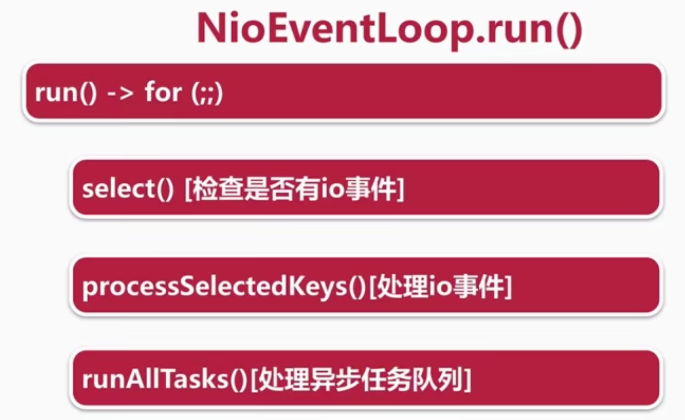
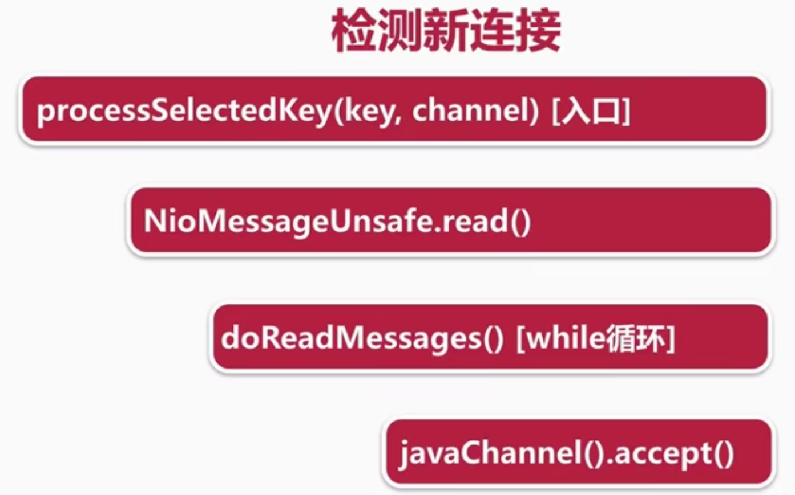
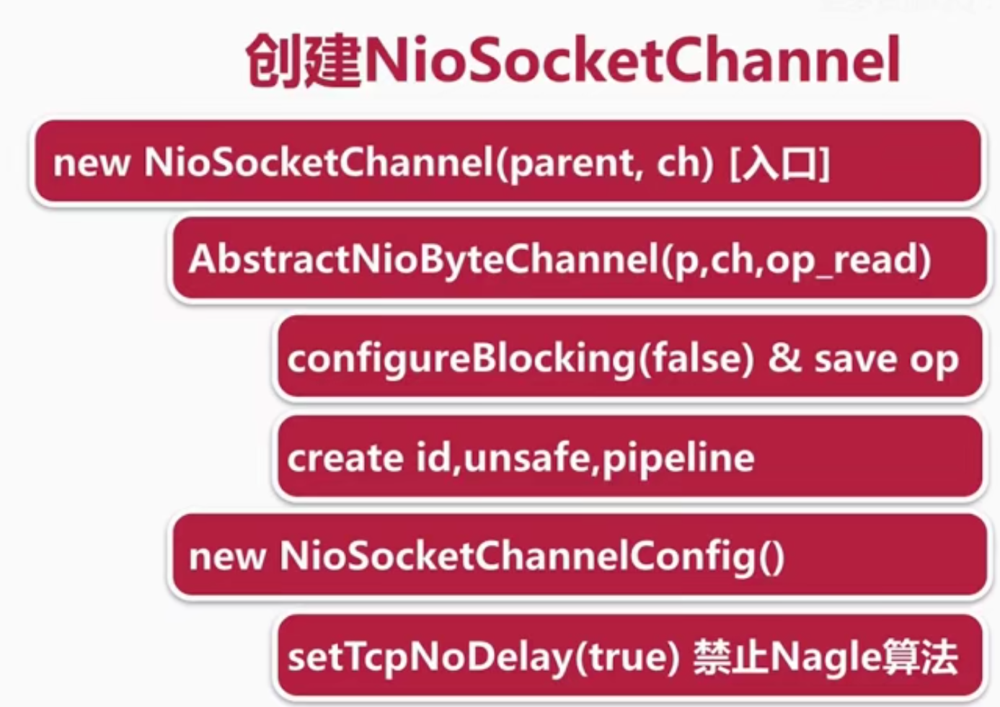
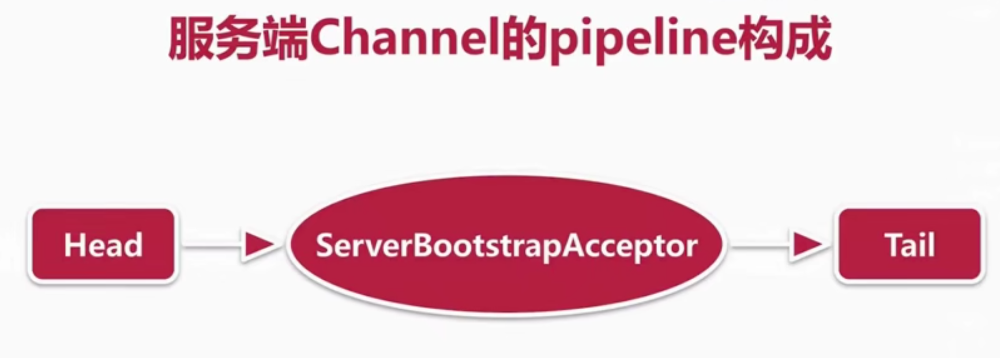
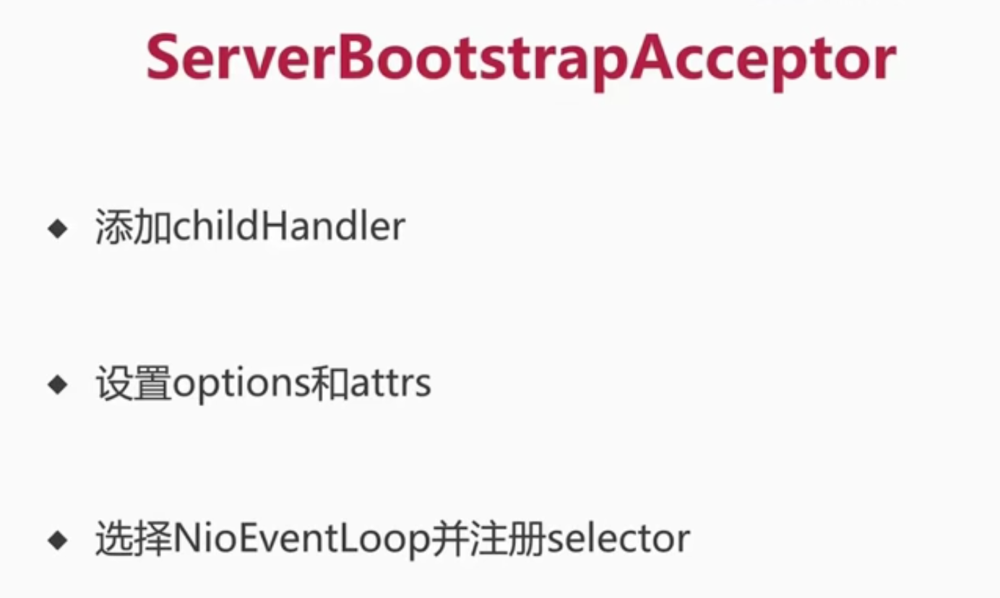

# 服务端

## 流程

1）创建服务端Channel

2）初始化服务端Channel

3）注册selector

4）端口绑定

## 源码

### 创建

### 初始化

### 注册selector

### 端口绑定

# NIOEventLoop

## 常见面试题

1）默认情况下，Netty服务端起多少线程，何时启动？

2）Netty是如何解决jdk空轮询bug的？

3）Netty如何保证异步串行无锁化？

## 源码

### 创建

#### ThreadPerTaskExecutor

1）每次执行任务都会创建一个线程实体

2）NioEventLoop线程命名规则nioEventLoop-1-xx

### 启动

### 执行

#### select

1）deadline以及任务穿插逻辑处理

2）阻塞式select

3）避免jdk空轮询的bug

#### processSelectedKeys()

1）selected KeySet优化（HashSet->数组）

2）processSelectedKeysOptimized()

# 新连接接入

## 源码

### 检测新连接

### 创建NioSocketChannel

### 新连接NioEventLoop的分配和Select注册

#### 服务端Channel的pipeline构成

