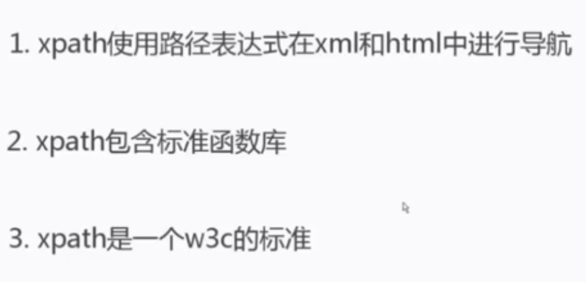
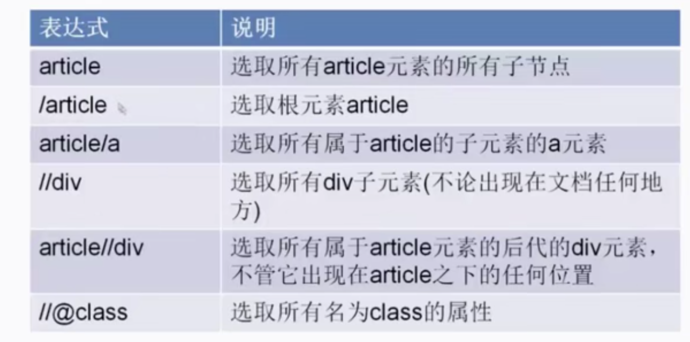
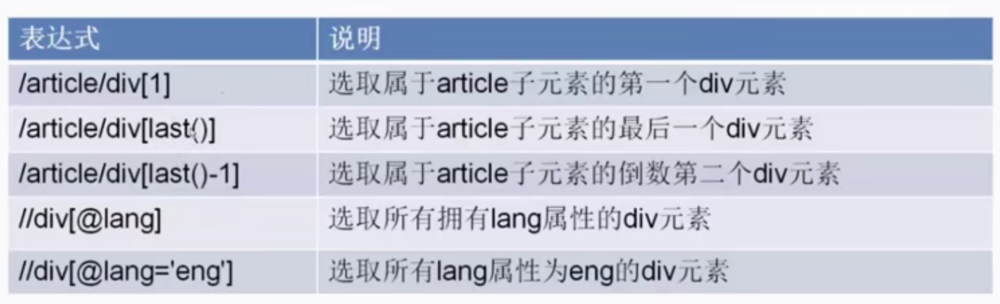
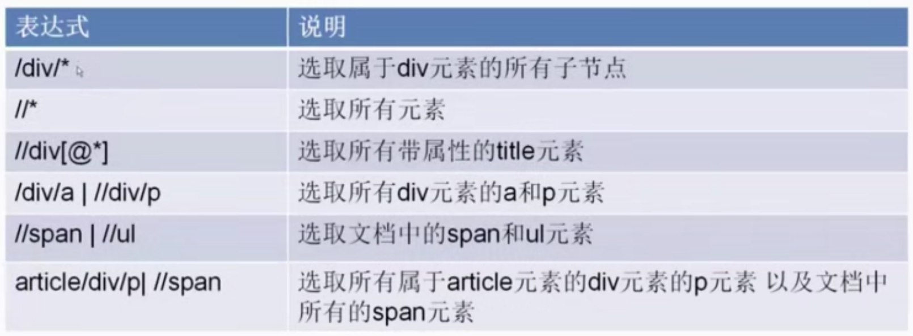
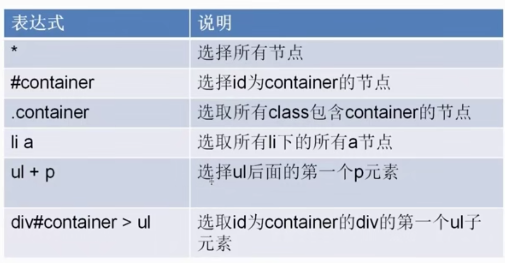
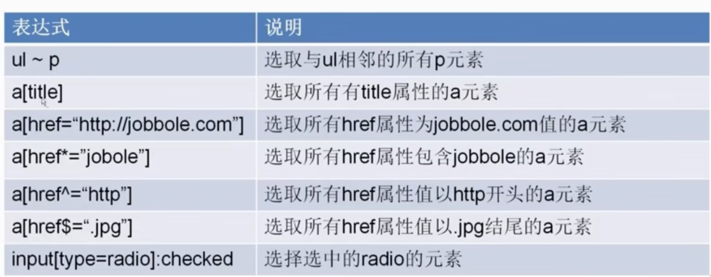
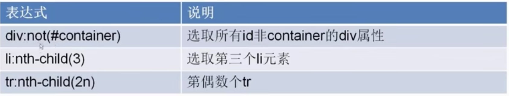
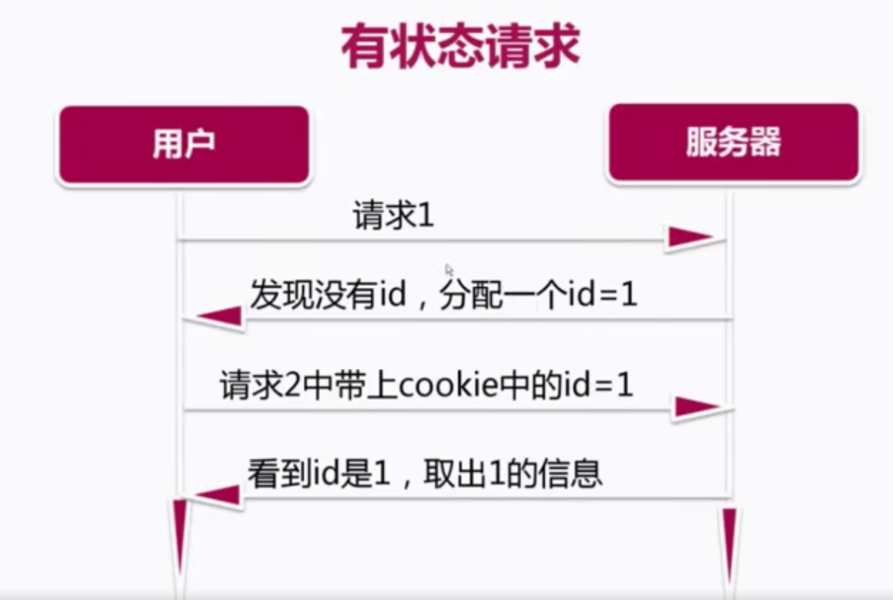
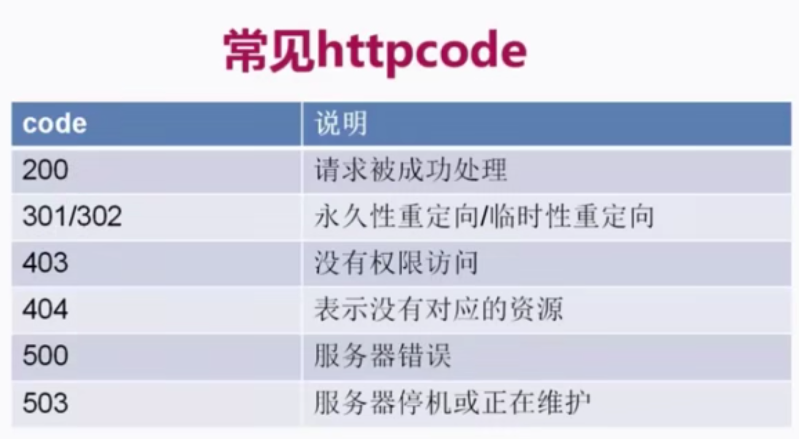

# 安装工作

## 虚拟环境的安装

```
pip install virtualenv
mkvirtualenv 虚拟环境名
workon 名字
pip install scrapy
```

## 创建工程

```
scrapy startproject 工程名
scrapy genspider 名字 网址
```

# XPATH

## 简介



## 语法







# CSS选择器

## 语法







# cookie和session

## cookie

http请求本身是一种无状态，而cookie和session是有状态的。cookie是浏览器请求的一种本地存储机制，它是一种本地的状态，以键值对的形式存储于浏览器中的某一域名之下，每个域名之下的key和value无法互相访问，浏览器每次向服务器发送请求的时候就会发送cookie，服务器就会看见浏览器自带的信息，这些信息是之前服务器返回给浏览器或者用户填写的一些信息。但同时，cookie也存在某些不安全性。

## session

session用来解决cookie的不安全性，session根据用户的用户名和密码生成了随机字符串，它是服务器生成的，存储于服务端中，会发送给用户，用户在请求服务器的时候也会把session信息传过去，服务器再根据sessionId获取用户信息。



# httopcode



# scrapy架构图


说明：当yield item的时候，数据发送到pipelins进行处理，当yield request的时候，数据发送到scheduler进行处理，然后再交由downloader进行下载

request由spiders产生，response由downloader产生

scrapy shell xxx

