# 主流消息队列介绍

## ActiveMQ

1）ActiveMQ是Apache出品，最流行的，能力强劲的开源消息总线，并且是一个完全支持JMS（Java Message Service）规范的消息中间件。

2）其丰富的API、多种集群构建模式使得他称为业界老牌消息中间件，在中小型企业中应用广泛！

3）MQ衡量指标：服务性能、数据存储、集群架构。

### 集群架构模式

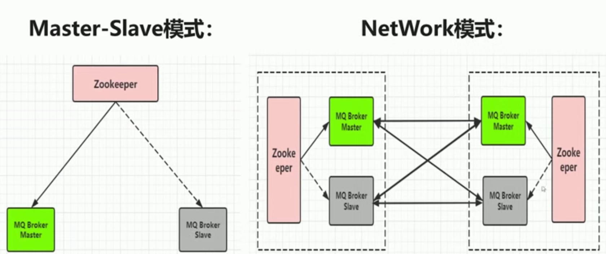

## KAFKA

Kafka是Linkedln开源的分布式发布-订阅消息系统，目前归属于Apache顶级项目。Kafka主要特点是基于Pull的模式来处理消息消费，追求高吞吐量，一开始的目的就是用于日志收集和传输。0.8版本开始支持复制，不支持事务，对消息的**重复、丢失、错误**没有严格要求，适合产生大量数据的互联网服务的数据收集业务。

### 集群模式

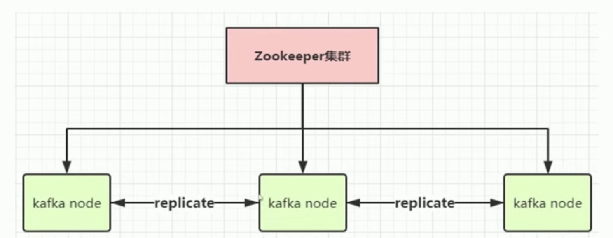

## RocketMQ（收费）

RocketMQ是阿里开源的消息中间件，目前也已经孵化为Apache顶级项目，它是纯Java开发，具有高吞吐量、高可用性、适合大规模分布式系统应用的特点。RocketMQ思路起源于Kafka，它对消息的可靠性传输及事务性做了优化，目前在阿里集团被广泛应用于交易、充值、流计算、消息推送、日志流式处理、binglog分发等场景。

### 集群架构

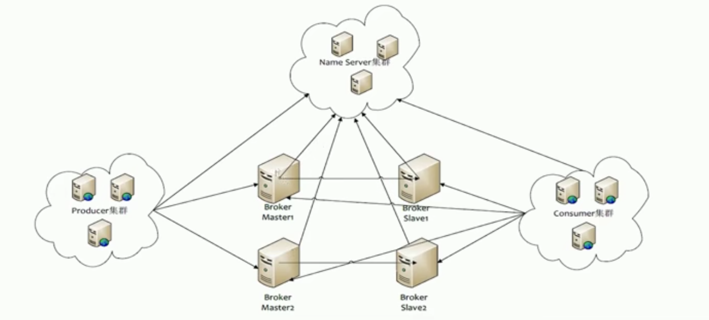

## RabbitMQ

RabbitMQ是使用Erlang语言开发的开源消息队列系统，基于AMQP协议来实现。AMQP的主要特征是面向消息、队列、路由（包括点对点和发布/订阅）、可靠性、安全。AMQP协议更多用在企业系统内，对数据一致性、稳定性和可靠性要求很高的场景，对性能和吞吐量的要求在其次。

### 集群架构

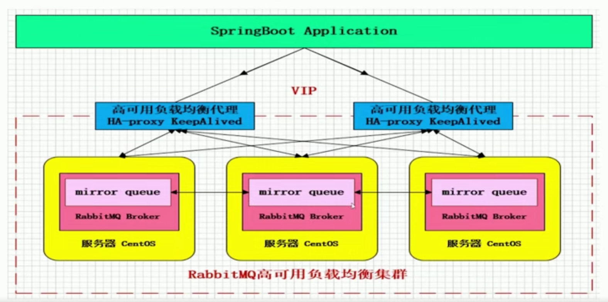

# 初始RabbitMQ

rabbitmq拥有数万用户，是最受欢迎的开源消息代理之一。从T-Mobile到Runtastic，RabbitMQ在全球范围内用于小型初创企业和大型企业。

rabbitmq重量轻，易于在内部和云中部署。它支持多种消息协议。rabbitmq可以部署在分布式和联合配置中，以满足高规模、高可用性要求。

rabbitmq运行在许多操作系统和云环境中，并为最流行的语言提供广泛的开发工具。

## RabbitMQ高性能的原因

1）Erlang语言最初是交换机领域的架构模式，这样使得RabbitMQ在Broker之间进行数据交互的性能是非常优秀的。

2）Erlang的优点：Erlang有着和原生Socket一样的延迟。

## 什么是AMQP高级消息队列协议？

AMQP全称：Advanced Message Queuing Protocol.

AMQP翻译：高级消息队列协议。

AMQP定义：是具有现在特征的二进制**协议**。是一个提供统一消息服务的应用层标准高级消息队列协议，是应用层协议的一个开放标准，为面向消息的中间件设计。

### AMQP协议模型


### AMQP核心概念

**Server**：又称Broker，接受客户端的连接，实现AMQP实体服务。

**Connection**：连接，应用程序与Broker的网络连接。

**Channel**：网络信道，几乎所有的操作都在Channel中进行，Channel是进行消息读写的通道。客户端可建立多个Channel，每个Channel代表一个会话任务。

**Message**：消息，服务器和应用程序之间传送的数据，由Properties和Body组成。Properties可以对消息进行修饰，比如消息的优先级、延迟等高级特性；Body则就是消息体内容。

**Virtual host**：虚拟地址，用于进行逻辑隔离，最上层的消息路由。一个Virtual Host里面可以有若干个Exchange和Queue，同一个Virtual Host里面不能有相同名称的Exchange和Queue。

**Exchange**：交换机，接收消息，根据路由键转发消息到绑定的队列。

**Binding**：Exchange和Queue之间的虚拟连接，binding中可以包含routing key。

**Routing key**：一个路由规则，虚拟机可用它来确定如何路由一个特定消息。

**Queue**：也称为Message Queue，消息队列，保存消息并将它们转发给消费者。

## RabbitMQ的整体架构

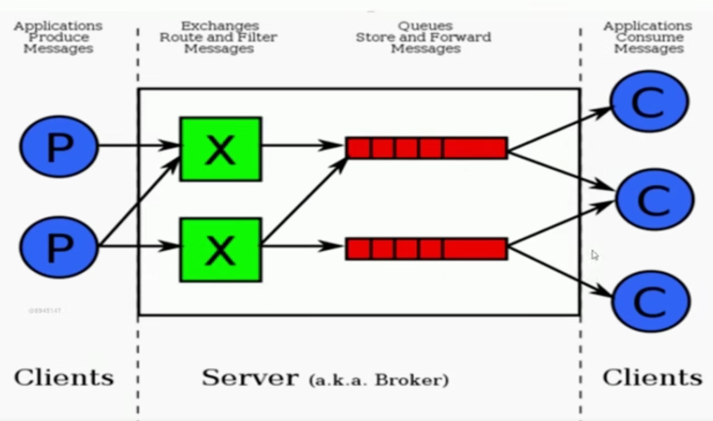

流转过程：

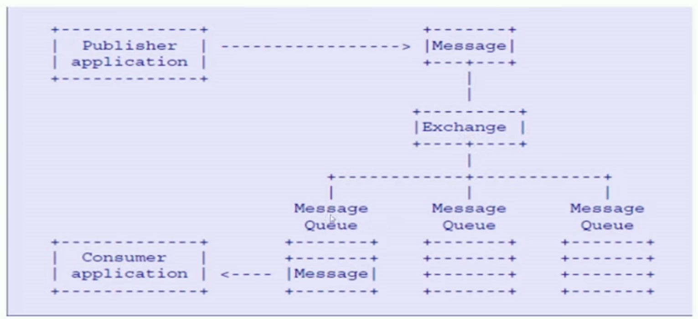

# RabbitMQ安装与使用

## 打开官网

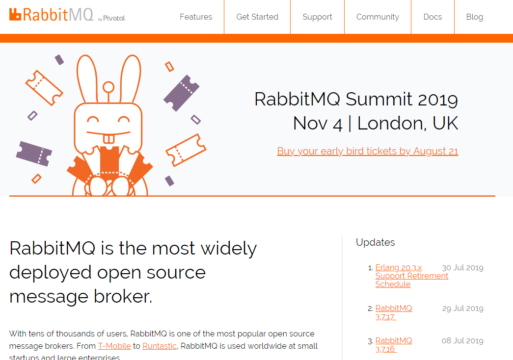

## 点击右侧2，进入下载页面。


## 下载RPM版本。

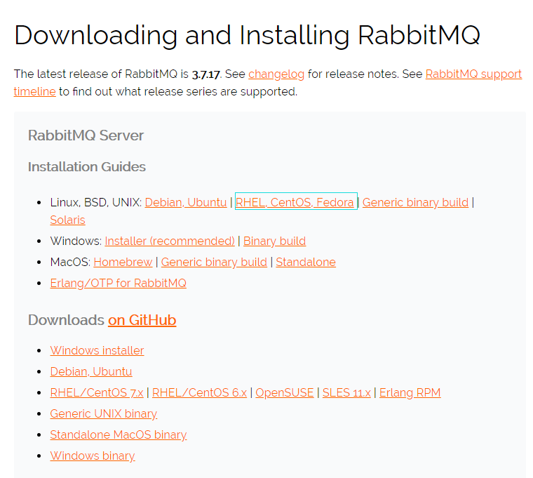

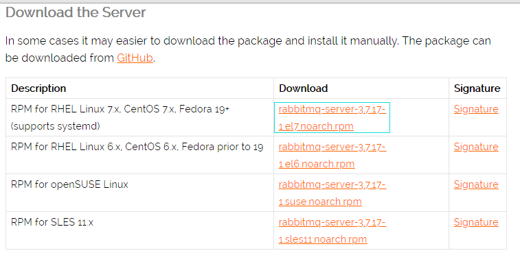

## 下载erlang

1）使用命令：

`cd /etc/yum.repos.d`

`vi rabbitmq_erlang.repo`

添加内容：

```
# In /etc/yum.repos.d/rabbitmq_erlang.repo
[rabbitmq_erlang]
name=rabbitmq_erlang
baseurl=https://packagecloud.io/rabbitmq/erlang/el/7/$basearch
repo_gpgcheck=1
gpgcheck=0
enabled=1
gpgkey=https://packagecloud.io/rabbitmq/erlang/gpgkey
sslverify=1
sslcacert=/etc/pki/tls/certs/ca-bundle.crt
metadata_expire=300

[rabbitmq_erlang-source]
name=rabbitmq_erlang-source
baseurl=https://packagecloud.io/rabbitmq/erlang/el/7/SRPMS
repo_gpgcheck=1
gpgcheck=0
enabled=1
gpgkey=https://packagecloud.io/rabbitmq/erlang/gpgkey
sslverify=1
sslcacert=/etc/pki/tls/certs/ca-bundle.crt
metadata_expire=300
```

2）使用命令：`yum -y install erlang`进行安装

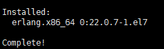

参考网址：https://github.com/rabbitmq/erlang-rpm

## 安装Socat

下载地址：https://centos.pkgs.org/7/centos-x86_64/socat-1.7.3.2-2.el7.x86_64.rpm.html

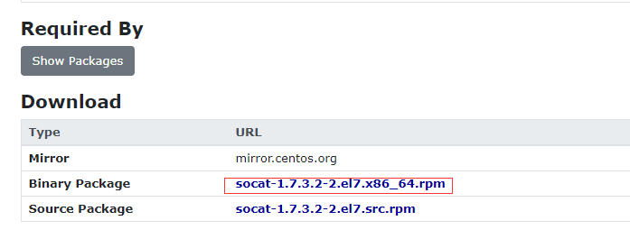

使用命令`rpm -ivh socat-1.7.3.2-2.el7.x86_64.rpm`安装。

## 安装RabbitMQ

使用命令`rpm -ivh rabbitmq-server-3.7.17-1.el7.noarch.rpm`安装rabbitmq。可以发现已经安装成功。

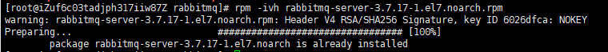

使用命令`rpm -ql rabbitmq-server-3.7.17-1.el7.noarch`可以查看文件位置。

主要文件目录：/usr/sbin

## 配置RabbitMQ

使用命令`vi /usr/lib/rabbitmq/lib/rabbitmq_server-3.7.17/ebin/rabbit.app `编辑配置文件。配置文件为json格式。

### 端口号

rabbitmq端口号为5672，如图所示。

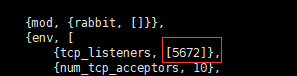

### loopback_users参数

修改loopback_users参数如下图所示，去掉<<>>，只保留数组。


保存退出。

## RabbitMQ的使用

服务的启动：`rabbitmq-server start &`

服务的停止：`rabbitmqctl stop_app`

管理插件：`rabbitmq-plugins enable rabbitmq_management`

访问地址：http://ip:15672

### 启动

进入/usr/sbin目录，使用服务启动命令，启动成功：

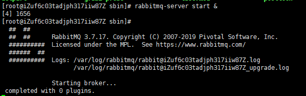

由于日志文件跟主机名有关，故修改主机名：

`vi /etc/hostname`

将字符串改为自己想要取的名字。

同时，使用命令`vi /etc/hosts`，修改域名绑定关系，如图所示：

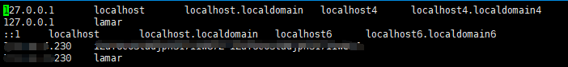

保存退出，重启生效。

使用命令`lsof -i:5672`，可以看到rabbitmq已经启动成功。


### 启用可视化插件

使用命令`rabbitmq-plugins enable rabbitmq_management`：

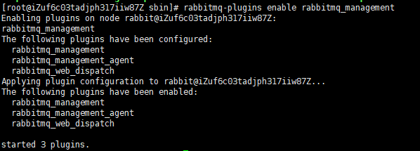

在浏览器中输入ip:15672，结果如图所示：

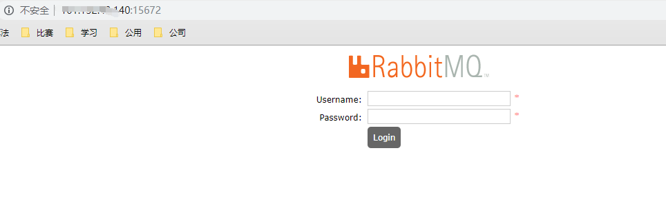

用户名和密码统一输入guest，管控台如图所示：

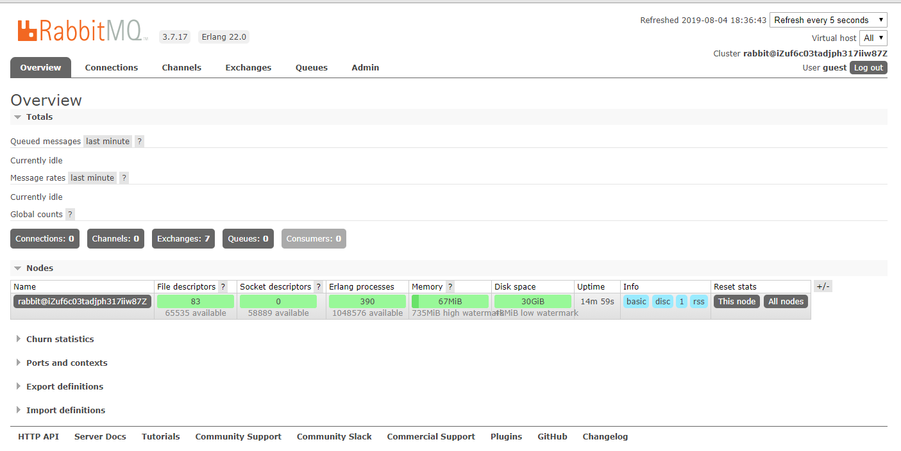

### 命令行与管控台-基础操作

**rabbitmqctl stop_app**：关闭应用

**rabbitmqctl start_app**：启动应用

**rabbitmqctl status**：节点状态

---------------------------------------------------------------------------------------------------------

**rabbitmqctl add_user username password**：添加用户

**rabbitmqctl list_users**：列出所有用户

**rabbitmqctl delete_user username**：删除用户

**rabbitmqctl clear_permissions -p vhostpath username**：清除用户权限

**rabbitmqctl list_user_permissions username**：列出用户权限

**rabbitmqctl change_password username newpassword**：修改密码

**rabbitmqctl set_permissions -p vhostpath username ".\*"".*"".\*"**：设置用户权限

---------------------------------------------------------------------------------------------------------

**rabbitmqctl add_vhost vhostpath**：创建虚拟主机

**rabbitmqctl list_vhosts**：列出所有虚拟主机

**rabbitmqctl list_permissions -p vhostpath**：列出虚拟主机上所有权限

**rabbitmqctl delete_vhost vhostpath**：删除虚拟主机

---------------------------------------------------------------------------------------------------------

**rabbitmqctl list_queues**：查看所有队列信息

**rabbitmqctl -p vhostpath purge_queue blue**：清除队列里的消息

---------------------------------------------------------------------------------------------------------

**rabbitmqctl reset**：移除所有数据，要在rabbitmqctl stop_app之后使用

**rabbitmqctl join_cluster <clusternode> [--ram]**：组成集群命令

**rabbitmqctl cluster_status**：查看集群状态

**rabbitmqctl change_cluster_node_type disc | ram**：修改集群节点的存储形式

**rabbitmqctl forget_cluster_node [--offline]**：忘记节点（摘除节点）

**rabbitmqctl rename_cluster_node oldnode1 newnode1 [oldnode2] [newnode2...]**：修改节点名称

# java demo

## pom.xml

写入依赖

```
<dependency>
    <groupId>com.rabbitmq</groupId>
    <artifactId>amqp-client</artifactId>
    <version>5.7.3</version>
</dependency>
```

## Producer

```
package com.rabbitmq.rabbitmq_demo.rabbitmq;

import com.rabbitmq.client.Channel;
import com.rabbitmq.client.Connection;
import com.rabbitmq.client.ConnectionFactory;

import java.io.IOException;
import java.util.concurrent.TimeoutException;

/**
 * className: Producer
 * description: TODO
 *
 * @author hasee
 * @version 1.0
 * @date 2019/8/11 13:24
 */
public class Producer {
    public static void main(String[] args) throws IOException, TimeoutException {
        //创建ConnectionFactory
        ConnectionFactory connectionFactory = new ConnectionFactory();
        connectionFactory.setHost("101.132.43.140");
        connectionFactory.setPort(5672);
        connectionFactory.setVirtualHost("/");
        //通过连接工厂创建连接
        Connection connection = connectionFactory.newConnection();
        //通过connection创建一个Channel
        Channel channel = connection.createChannel();
        //发送数据
        String msg = "Hello!!!";
        //The default exchange is implicitly bound to every queue, with a routing key equal to the queue name.
        //It is not possible to explicitly bind to, or unbind from the default exchange. It also cannot be deleted.
        channel.basicPublish("", "test001", null, msg.getBytes());
        System.out.println("Sent '"+msg+ "'");
        //关闭连接
        channel.close();
        connection.close();
    }
}
```

## Consumer

```
package com.rabbitmq.rabbitmq_demo.rabbitmq;

import com.rabbitmq.client.*;

import java.io.IOException;
import java.util.concurrent.TimeoutException;

/**
 * className: Consumer
 * description: TODO
 *
 * @author hasee
 * @version 1.0
 * @date 2019/8/11 13:27
 */
public class Consumer {
    public static void main(String[] args) throws IOException, TimeoutException {
        //创建ConnectionFactory
        ConnectionFactory connectionFactory = new ConnectionFactory();
        connectionFactory.setHost("101.132.43.140");
        connectionFactory.setPort(5672);
        connectionFactory.setVirtualHost("/");
        //通过连接工厂创建连接
        Connection connection = connectionFactory.newConnection();
        //通过connection创建一个Channel
        Channel channel = connection.createChannel();
        //创建队列
        String queueName = "test001";
        channel.queueDeclare(queueName, true, false, false, null);
        System.out.println(" [*] Waiting for messages. To exit press CTRL+C");
        //以对象的形式提供一个回调，它将缓冲消息
        DeliverCallback deliverCallback = (consumerTag, delivery) -> {
            String message = new String(delivery.getBody(), "UTF-8");
            System.out.println(" [x] Received '" + message + "'");
        };
        channel.basicConsume(queueName, true, deliverCallback, consumerTag -> { });

    }
}
```

## 运行结果

### 启动消费者

运行消费者，输出如下：

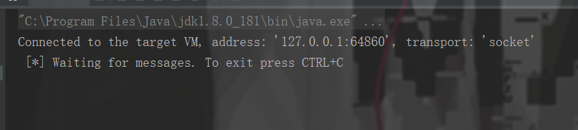

打开网页，输入ip:15672，显示如下：

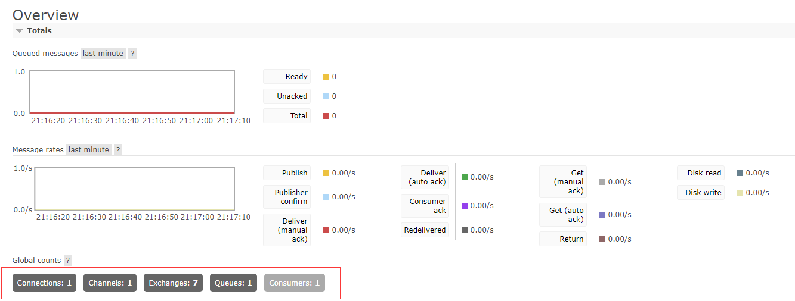

可以发现Global counts发生变化。

### 启动生产者

消费者输出如下，已经成功接收到了消息：


页面显示如下：

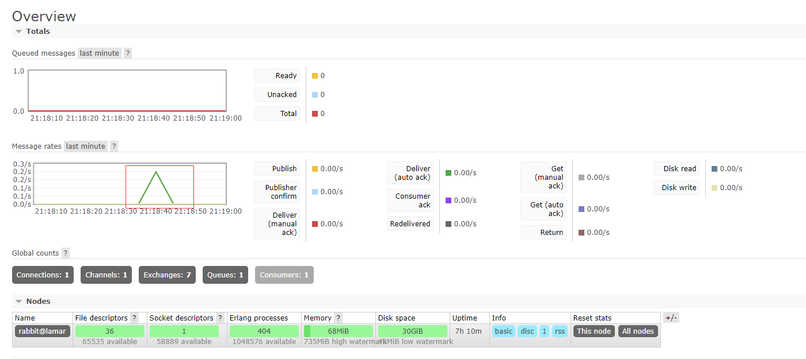

可以发现发生了一次波动。

# 深入介绍

## 交换机介绍

### Direct Exchange

所有发送到Direct Exchange的消息被转发到RouteKey中指定的Queue。

消息传递时，RouteKey必须完全匹配才会被队列接收，否则该消息会被抛弃。

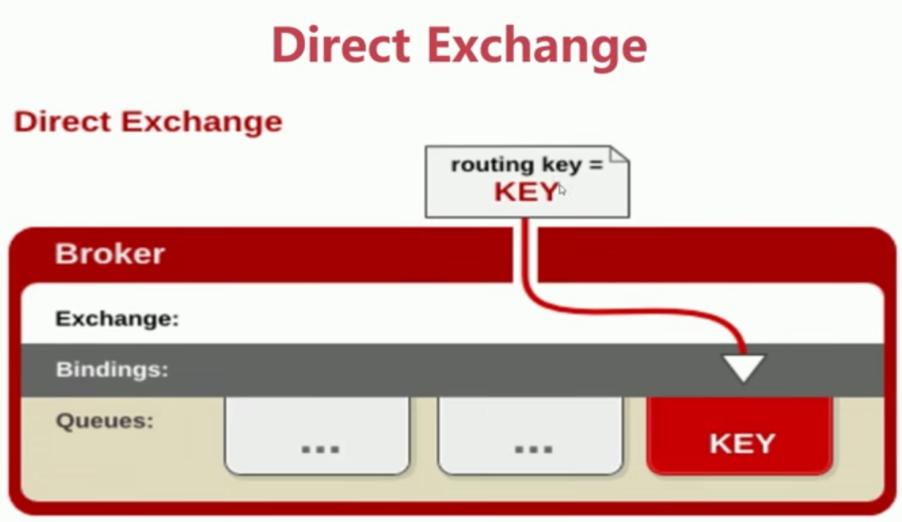

### Topic Exchange

1）所有发送到Topic Exchange的消息被转发到所有关心RouteKey中指定Topic的Queue上。

2）Exchange将RouteKey和某Topic进行**模糊匹配**，此时队列需要绑定一个Topic。

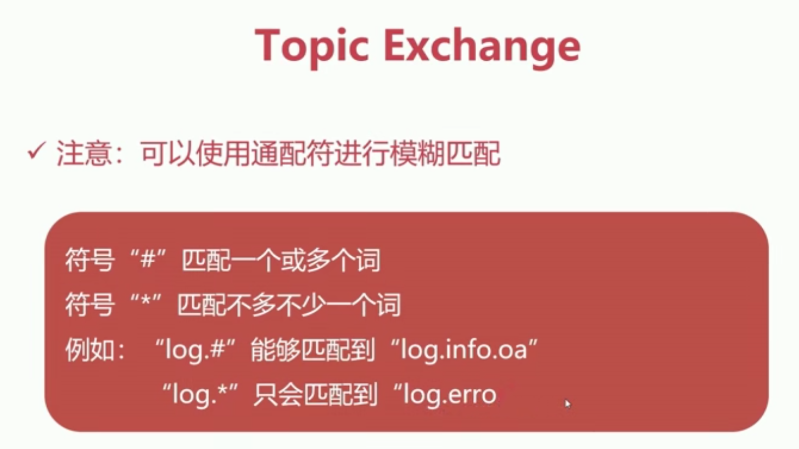

原理如下：

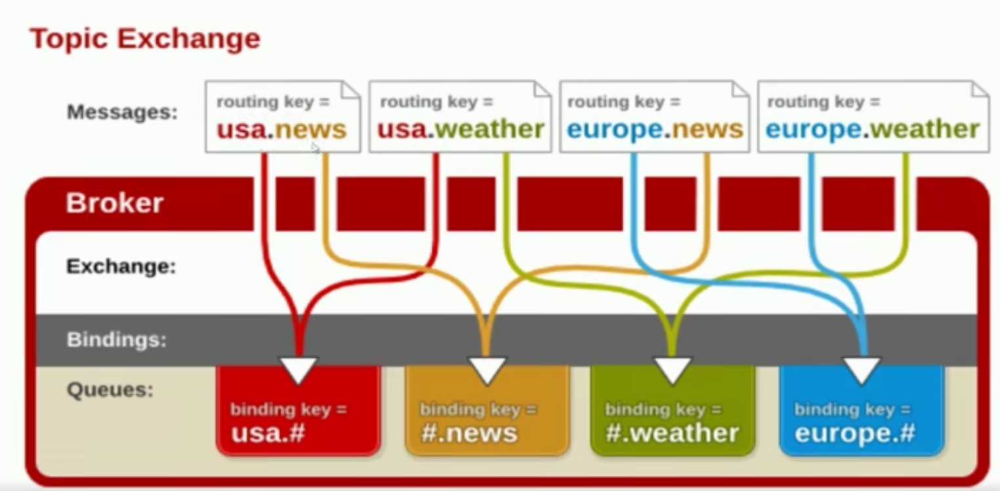

### Fanout Exchange

1）不处理路由键，只需要简单地将队列绑定到交换机上。

2）发送到交换机的消息都会被转发到与该交换机绑定的所有队列上。

3）Fanout交换机转发消息是最快的。


## 消息如何保障100%的投递成功？

**生产端的可靠性投递**

1）保障消息的成功发出。

2）保障MQ结点的成功接收。

3）发送端收到MQ结点（Broker）确认应答。

4）完善的消息进行补偿机制。

### 生产端-可靠性投递

#### 消息落库，对消息状态进行打标

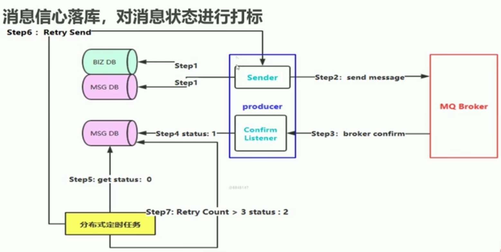

#### 消息的延迟投递，做二次确认，回调检查

目的：减少数据库操作。

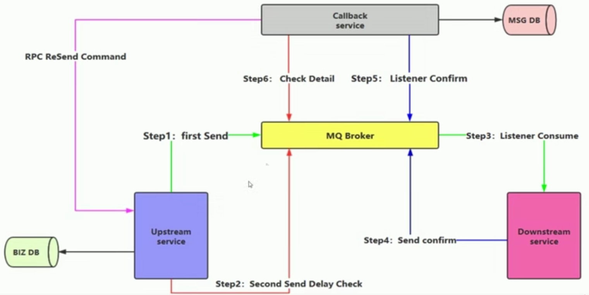

## 幂等性概念

消费端实现幂等性，就意味着，我们的消息永远不会消费多次，即使我们收到了多条一样的消息。

### 业界主流的幂等性操作

1）唯一ID+指纹码机制，利用数据库主键去重。

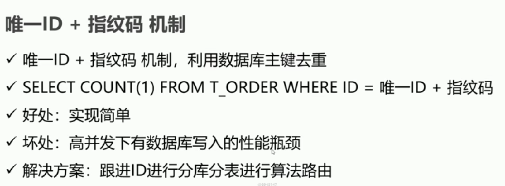

2）利用Redis的原子性去实现去重。


## 消费端限流

RabbitMQ提供了一种qos（服务质量保证）功能，即在非自动确认消息的前提下，如果一定数目的消息（通过基于consumer或者channel设置Qos的值）未被确认前，不进行消费新的消息。

**具体方法：**

`void BasicQos(uint prefetchSize, ushort prefetchCount, bool global);`

>prefetchSize: 0，不限制。
>
>prefetchCount: 会告诉RabbitMQ不要同时给一 一个消费者推送多于N个消息，即一-旦有N个消息还没有ack,则该consumer将block掉，直到有消息ack。
>
>global: true\false是否将上面设置应用于channel。
>简单点说，就是上面限制是channel级别的还是consumer级别。
>
>**注意：**prefetchSize和global这两项， rabbitmq没有实现，暂且不研究prefetch _count在no_ _ask= false的情况下生效，即在自动应答的情况下这两个值是不生效的。

## 消费端ACK与重回队列

ACK即确认消息已被消费。

### 消费端的手工ACK和NACK

1）消费端进行消费的时候，如果由于业务异常我们可以进行日志的记录，然后进行补偿。

2）如果由于服务器宕机等严重问题，那我们就需要手工进行ACK保障消费端消费成功。

### 消费端的重回队列

1）消费端重回队列是为了对没有处理成功的消息，把消息重新递给Broker。

2）一般在实际应用中，都会关闭重回队列，也就是设置为False。

## TTL队列/消息

1）TTL是Time To Live的缩写，也就是生存时间。

2）RabbitMQ支持消息的过期时间，在消息发送时可以进行指定。

3）RabbitMQ支持队列的过期时间，从消息入队列开始计算，只要超过了队列的超时时间配置，那么消息会自动的清除。

## 死信队列

### 死信队列：DLX,Dead-Letter-Exchange

利用DLX，当消息在一个队列中变成死信（dead message）之后，它能被重新publish到另一个Exchange，这个Exchange就是DLX。

### 消息变成死信的几种情况

1）消息被拒绝（basic.reject/basic.nack）并且requeue=false。

2）消息TTL过期。

3）队列达到最大长度。

### 特点

1）DLX也是一个正常的Exchange,和一般的Exchange没有区别，它能在任何的队列上被指定，实际上就是设置某个队列的属性。

2）当这个队列中有死信时，RabbitMQ就会自动的将这个消息重新发布到设置的Exchange上去，进而被路由到另一个队列。

3）可以监听这个队列中消息做相应的处理，这个特性可以弥补RabbitMQ3.0以前支持的immediate参数的功能。