# 前要说明

目前简单的开发了秒杀系统（只完成了业务逻辑），已部署至虚拟机上。数据库与redis均部署在了虚拟机上，避免大部分时间耗费在数据的网络传输上。

> 虚拟机的配置

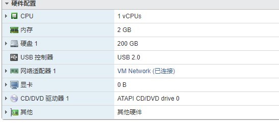

> jvm参数

-Xms400m -Xmx400m -XX:MaxNewSize=200m

# 初次压测

1）在压测前，我们使用pstree命令查看服务器上对应端口上运行的线程数：


说明此时，线程数为28个。

2）使用jmeter，线程组配置如下：


http配置为长连接，使用java客户端（高级配置），压测中途数据如下：

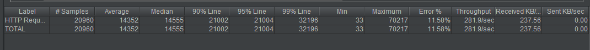

可以发现，已经出现错误了，Error的比例为11.58%。

3）使用`pstree -p jar端口号 | wc -l`命令，结果如下：

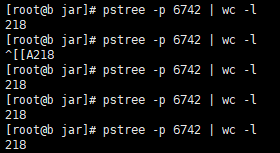

可以发现，线程数最多只有218，这导致并发数量无法提升。

# 单体部署

## Spring配置探究

由于SpringBoot内置了tomcat，故我们需要查看其相应的配置文件：spring-configuration-metadata.json，具体参数如下：


修改application.properties如下：

```
server.port=80
server.tomcat.accept-count=1000
server.tomcat.max-threads=800
server.tomcat.min-spare-threads=100
```

使用命令：

`nohup java -Xms400m -Xmx400m -XX:MaxNewSize=200m -jar seckill-0.0.1-SNAPSHOT.jar --spring.config.addition-location=/home/jar/application.properties >seckill.log &`

> 压测结果

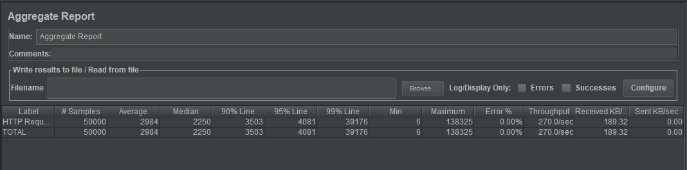

> 压测前后对比

| 状态   | 并发数 | 样本数 | 平均响应时间 | 吞吐量  | 错误率 | 接受Kb/s |
| ------ | ------ | ------ | ------------ | ------- | ------ | -------- |
| 修改前 | 200    | 10000  | 1189         | 143.3/s | 0.00%  | 100.45/s |
| 修改前 | 500    | 25000  | 1819         | 213.7/s | 0.00%  | 149.81/s |
| 修改前 | 1000   | 50000  | 3586         | 246.9/s | 0.00%  | 173.09/s |
| 修改后 | 200    | 10000  | 467          | 292.0/s | 0.00%  | 204.77/s |
| 修改后 | 500    | 25000  | 1865         | 235.2/s | 0.00%  | 164.93/s |
| 修改后 | 1000   | 50000  | 2984         | 270.0/s | 0.00%  | 189.32/s |

可以发现，提高了tomcat最大线程数确实可以在一定程度上提高吞吐量。

## 长连接优化

HTTP1.1支持长连接，但仍有优化的余地，关注如下两个参数：

1、keepAliveTimeOut：多少毫秒后不响应就断开keepalive

2、maxKeepAliveRequests：多少次请求后keepalive断开失效

### 定制化内嵌tomcat配置

使用WebServerFactoryCustomizer->ConfigurableServletWebServerFactory定制化内嵌tomcat配置，当服务器上的.properties配置文件加载完成后，可以继续加载customize中的配置，配置类如下：

```java
package com.lamarsan.seckill.common;

import org.apache.catalina.connector.Connector;
import org.apache.coyote.http11.Http11NioProtocol;
import org.springframework.boot.web.embedded.tomcat.TomcatConnectorCustomizer;
import org.springframework.boot.web.embedded.tomcat.TomcatServletWebServerFactory;
import org.springframework.boot.web.server.ConfigurableWebServerFactory;
import org.springframework.boot.web.server.WebServerFactoryCustomizer;
import org.springframework.stereotype.Component;

/**
 * className: WebServerConfig
 * description: 内嵌tomcat配置
 * 当Spring容器内没有TomcatEmbeddedServletContainerFactory这个bean时，会把此bean加载进spring容器中
 *
 * @author lamar
 * @version 1.0
 * @date 2020/1/11 21:22
 */
@Component
public class WebServerConfig implements WebServerFactoryCustomizer<ConfigurableWebServerFactory> {
    @Override
    public void customize(ConfigurableWebServerFactory factory) {
        // 使用对应工厂类提供给我们的接口定制化我们的tomcat connector
        ((TomcatServletWebServerFactory)factory).addConnectorCustomizers(new TomcatConnectorCustomizer() {
            @Override
            public void customize(Connector connector) {
                Http11NioProtocol protocol = (Http11NioProtocol) connector.getProtocolHandler();
                // 定制化keepalivetimeout 30秒内没有请求则服务端自动断开keepalive连接
                protocol.setKeepAliveTimeout(30000);
                // 当客户端发送超过10000个请求则自动断开keepalive连接
                protocol.setMaxKeepAliveRequests(10000);
            }
        });
    }
}
```

> 压测结果

| 状态   | 并发数 | 样本数 | 平均响应时间 | 吞吐量  | 错误率 | 接受Kb/s |
| ------ | ------ | ------ | ------------ | ------- | ------ | -------- |
| 修改前 | 200    | 10000  | 467          | 292.0/s | 0.00%  | 204.77/s |
| 修改前 | 500    | 25000  | 1865         | 235.2/s | 0.00%  | 164.93/s |
| 修改前 | 1000   | 50000  | 2984         | 270.0/s | 0.00%  | 189.32/s |
| 修改后 | 200    | 10000  | 1060         | 156.5/s | 0.00%  | 102.37/s |
| 修改后 | 500    | 25000  | 1965         | 221.8/s | 0.00%  | 145.13/s |
| 修改后 | 1000   | 50000  | 3109         | 237.7/s | 0.00%  | 155.52/s |

可以发现对keepalive做了相应的修改后，这台机器的吞吐量反而下降了。但优点是防止被连续攻击与用户无意间的闲置操作。

## 单Web容器上限

1、线程数量不可配置过大，否则将花费巨大时间在cpu调度上。

2、等待队列长度：队列做缓冲池用，但也不能无限长，消耗内存，出队入队也耗cpu。

3、MySQL数据库QPS容量问题：


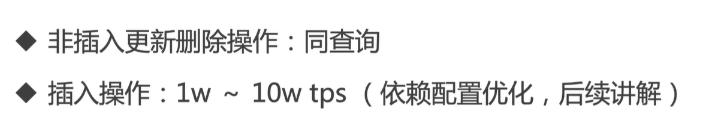

# nginx负载均衡

# 架构说明


c.com服务器开启nginx，静态资源请求则直接访问nginx的静态文件，ajax请求使用反向代理，代理到a.com与b.com两台机器上，同时mysql部署到533.com的机器上，以实现分布式水平扩展。

## nginx的安装

### 下载

下载地址：http://openresty.org/en/download.html

### 前置安装

`yum install pcre-devel openssl-devel gcc curl`

### 解压后配置

`./configure`

### 编译

`make`

`make install`

## 相关命令

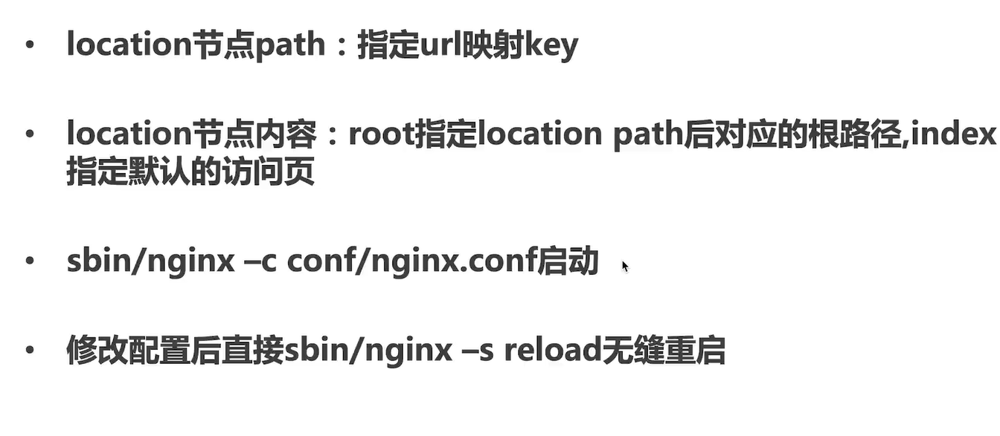

## 静态资源配置

配置策略是，当请求静态资源时，请求resources目录，如果是动态资源，再请求其他服务器。先进行静态资源路由配置。

进入/nginx/html目录，将静态资源全部放入其中，最后的文件目录：

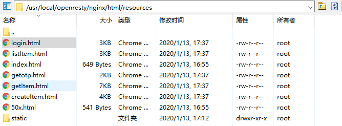

同时，修改nginx.conf，如图所示。

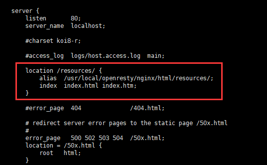

最后，使用浏览器访问，如图所示：


## 反向代理

修改nginx.conf文件，修改如下：


## 开启access.log

修改application.properties：

```
server.port=8090
server.tomcat.accept-count=1000
server.tomcat.max-threads=800
server.tomcat.min-spare-threads=100
server.tomcat.accesslog.enabled=true
server.tomcat.accesslog.directory=/home/jar/seckill/tomcat
server.tomcat.accesslog.pattern=%h %l %u %t "%r" %s %b %D
```

日志如下：

```
192.168.9.93 - - [13/Jan/2020:18:17:45 +0800] "GET /item/get?id=1 HTTP/1.0" 200 468 2821
192.168.9.93 - - [13/Jan/2020:18:17:49 +0800] "GET /item/get?id=1 HTTP/1.0" 200 468 25
192.168.9.93 - - [13/Jan/2020:18:17:50 +0800] "GET /item/get?id=1 HTTP/1.0" 200 468 25
```

同理，另一边的服务器也是同样的三条日志，可以发现确实有做到负载均衡。

## 压力测试

| 状态   | 并发数 | 样本数 | 平均响应时间 | 吞吐量  | 错误率 | 接受Kb/s |
| ------ | ------ | ------ | ------------ | ------- | ------ | -------- |
| 修改前 | 200    | 10000  | 1060         | 156.5/s | 0.00%  | 102.37/s |
| 修改前 | 500    | 25000  | 1965         | 221.8/s | 0.00%  | 145.13/s |
| 修改前 | 1000   | 50000  | 3109         | 237.7/s | 0.00%  | 155.52/s |
| 修改后 | 200    | 10000  | 625          | 237.2/s | 0.00%  | 167.24/s |
| 修改后 | 500    | 25000  | 1084         | 367.1/s | 0.00%  | 258.81/s |
| 修改后 | 1000   | 50000  | 1668         | 400.3/s | 5.51%  | 282.98/s |

可以发现，分布式扩展后，吞吐量有明显的提高，但是同样的，错误率也出现了上升。

## 优化短连接

nginx与jar包之间的连接其实是短连接，下图是压测过程中，c.com机器与a.com机器有关的连接数统计：


可以发现，在连续的上升。我们修改一下nginx.conf配置即可：


压力测试结果如下：

| 状态   | 并发数 | 样本数 | 平均响应时间 | 吞吐量  | 错误率 | 接受Kb/s |
| ------ | ------ | ------ | ------------ | ------- | ------ | -------- |
| 修改前 | 200    | 10000  | 625          | 237.2/s | 0.00%  | 167.24/s |
| 修改前 | 500    | 25000  | 1084         | 367.1/s | 0.00%  | 258.81/s |
| 修改前 | 1000   | 50000  | 1668         | 400.3/s | 5.51%  | 282.98/s |
| 修改后 | 200    | 10000  | 273          | 436.4/s | 0.00%  | 307.67/s |
| 修改后 | 500    | 25000  | 679          | 545.7/s | 0.18%  | 384.43/s |
| 修改后 | 1000   | 50000  | 1339         | 491.4/s | 1.85%  | 352.38/s |

我们可以很可观地感受到，使用长连接带来的好处，大幅度减少了平均响应时间，一定程度上提高了吞吐量。

## nginx高性能的原因

### epoll多路复用

详见：https://www.cnblogs.com/aspirant/p/9166944.html。

补充：jdk中只有select，但是实际上linux2.6内核版本之后，select会转成epoll。

### master worker进程模型


#### 父子进程

Master与Worker是父子进程之间的关系，中间使用epoll多路复用来确保非阻塞。

#### 客户端的连接

其中，Worker进程负责与Client进行三次握手协议，具体使用哪个Worker则由Worker去抢占Master的锁来决定。

#### Nginx的无缝重启

当执行`sbin/nginx -s reload`命令的时候，nginx能够无缝重启，事实上，master并不会重启，更换的是Worker进程，只需要更换的时候将上一个Worker进程的Socket连接迁移到下一个Worker即可。

#### 单线程

Worker为单线程，理由是通过epoll已经确保了非阻塞，使用单线程即可，并且速度比多线程更快。

### 协程机制

由于使用单线程，如果一个Worker进程中Connector过多，就会变慢，而使用异步来处理，则难以保证顺序性，所以会有协程的概念。

#### 协程特点

1）依附于线程的内存模型，切换开销小。

2）遇阻塞即归还执行权，代码同步。

3）无需加锁。

# 查询性能优化技术之多级缓存

## 多级缓存

1）redis缓存

2）热点内存本地缓存

3）nginx proxy cache缓存

4）nginx lua缓存

## 一级缓存

由于放假了，用不了机房的服务器集群，故在阿里云上面使用单机模仿负载均衡，机器性能与上图相同，带宽只有1Mbps，鉴于此，之前tomcat的最高800并发线程数我们需要将其降为200。

加入redis缓存前后压测结果如下：

| 状态   | 并发数 | 样本数 | 平均响应时间 | 吞吐量 | 错误率 | 接受Kb/s |
| ------ | ------ | ------ | ------------ | ------ | ------ | -------- |
| 修改前 | 100    | 500    | 30           | 50.1/s | 0.00%  | 32.32/s  |
| 修改前 | 200    | 1000   | 1665         | 46.1/s | 0.00%  | 32.52/s  |
| 修改前 | 500    | 2500   | 4289         | 39.2/s | 0.00%  | 27.59/s  |
| 修改后 | 100    | 500    | 49           | 49.6/s | 0.00%  | 34.97/s  |
| 修改后 | 200    | 1000   | 493          | 65.0/s | 0.00%  | 45.81/s  |
| 修改后 | 500    | 2500   | 4157         | 40.3/s | 0.00%  | 28.39/s  |

虽然由于带宽的关系，吞吐量依旧很小，但是加入缓存后，在200并发线程下，吞吐量还是有一定的提升的。

## 二级缓存

我们主要使用Guava cache来实现二级缓存，Guava cache特点如下：

1）可控制的大小和超时时间

2）可配置的lru策略

3）线程安全

压测结果：

| 状态   | 并发数 | 样本数 | 平均响应时间 | 吞吐量 | 错误率 | 接受Kb/s |
| ------ | ------ | ------ | ------------ | ------ | ------ | -------- |
| 修改前 | 100    | 500    | 49           | 49.6/s | 0.00%  | 34.97/s  |
| 修改前 | 200    | 1000   | 493          | 65.0/s | 0.00%  | 45.81/s  |
| 修改前 | 500    | 2500   | 4157         | 40.3/s | 0.00%  | 28.39/s  |
| 修改后 | 100    | 500    | 65           | 49.4/s | 0.00%  | 34.81/s  |
| 修改后 | 200    | 1000   | 491          | 54.1/s | 0.00%  | 38.12/s  |
| 修改后 | 500    | 2500   | 4150         | 38.8/s | 0.00%  | 27.34/s  |

可见，加入二级缓存，吞吐量反而下降了，这个也许挺好理解的，由于采用伪分布式，redis本就不走网络，所以加入本地缓存，其实没有什么差别。

## 三级缓存

### nginx proxy cache

三级缓存采用nginx proxy cache缓存，其特点如下：

1）nginx反向代理前置

2）依靠文件系统存索引级的文件

3）依靠内存缓存文件地址

具体配置如下：

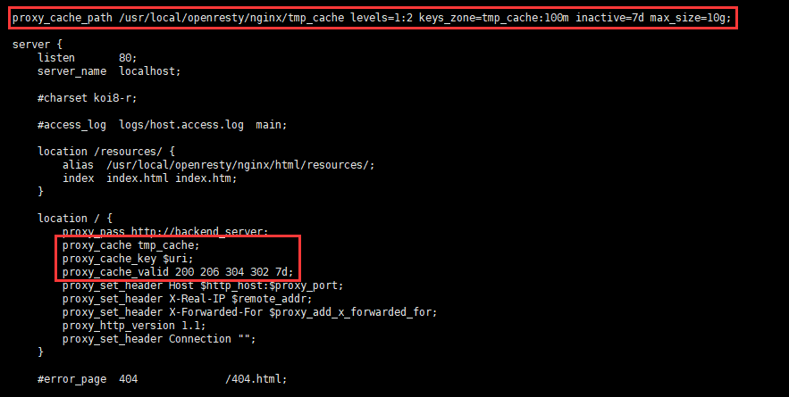

压测结果如下：

| 状态   | 并发数 | 样本数 | 平均响应时间 | 吞吐量  | 错误率 | 接受Kb/s |
| ------ | ------ | ------ | ------------ | ------- | ------ | -------- |
| 修改前 | 100    | 500    | 65           | 49.4/s  | 0.00%  | 34.81/s  |
| 修改前 | 200    | 1000   | 491          | 54.1/s  | 0.00%  | 38.12/s  |
| 修改前 | 500    | 2500   | 4150         | 38.8/s  | 0.00%  | 27.34/s  |
| 修改后 | 100    | 500    | 17           | 50.2/s  | 0.00%  | 35.37/s  |
| 修改后 | 200    | 1000   | 22           | 99.8/s  | 0.00%  | 70.35/s  |
| 修改后 | 500    | 2500   | 864          | 111.3/s | 0.00%  | 78.51/s  |

我们可以很明显地感受到，nginx缓存带来的提高，虽然读取的是文件索引，但相比redis与本地缓存来说在并发量不是特别大的情况下，还是有了很大程度的提升。

### nginx lua

 #### nginx处理阶段

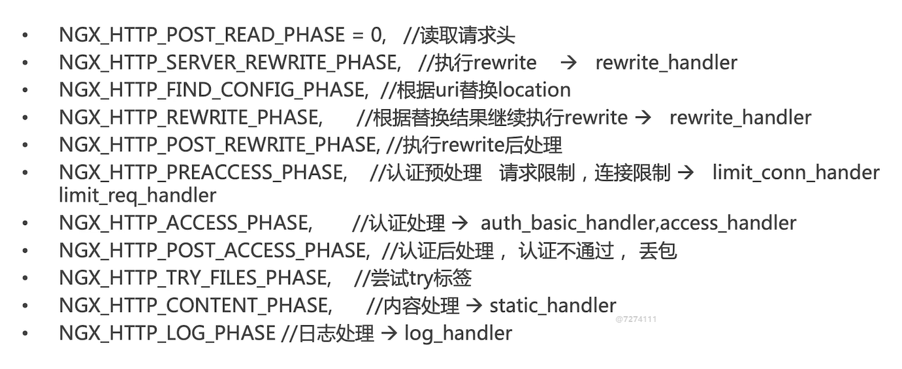

#### nginx lua插载点


编写lua代码如下：

```lua
function get_from_cache(key)
        local cache_ngx = ngx.shared.my_cache
        local value = cache_ngx:get(key)
        return value
end

function set_to_cache(key,value,exptime)
        if not exptime then
                exptime = 0
        end
        local cache_ngx = ngx.shared.my_cache
        local succ,err,forcible = cache_ngx:set(key,value,exptime)
        return succ
end

local args = ngx.req.get_uri_args()
local id = args["id"]
local item_dto = get_from_cache("item_"..id)
if item_dto == nil then
        local resp = ngx.location.capture("/item/get?id="..id)
        item_dto = resp.body
        set_to_cache("item_"..id,item_dto,1*60)
end
ngx.say(item_dto)
```

其中，nginx.conf也要做相应的配置：


| 状态   | 并发数 | 样本数 | 平均响应时间 | 吞吐量  | 错误率 | 接受Kb/s |
| ------ | ------ | ------ | ------------ | ------- | ------ | -------- |
| 修改前 | 100    | 500    | 17           | 50.2/s  | 0.00%  | 35.37/s  |
| 修改前 | 200    | 1000   | 22           | 99.8/s  | 0.00%  | 70.35/s  |
| 修改前 | 500    | 2500   | 864          | 111.3/s | 0.00%  | 78.51/s  |
| 修改后 | 100    | 500    | 16           | 50.2/s  | 0.00%  | 31.21/s  |
| 修改后 | 200    | 1000   | 17           | 98.2/s  | 0.00%  | 61.07/s  |
| 修改后 | 500    | 2500   | 214          | 179.2/s | 0.00%  | 111.49/s |

相较于nginx_proxy_cache，使用nginx+lua在并发数很高的时候，吞吐量有着明显的提升。

### OpenResty+Redis

由于单单使用nginx+lua可能会造成脏数据，故我们可以使用如下架构进行优化：


其中，redis可以扩展为主从，使nginx每次都从slave节点读取，这样基本上不会有读到脏数据的情况。同时，由于OpenResty已经为我们封装好了redis的lua代码，所以我们只需要编写业务lua代码即可，代码如下：

```lua
local args = ngx.req.get_uri_args()
local id = args["id"]
local redis = require "resty.redis"
local cache = redis:new()
local ok,err = cache:connect("127.0.0.1",46379)
ok,err = cache:auth("123456")
local item_dto = cache:get("item_"..id)
if item_dto == ngx.null or item_dto == nil then
	local resp = ngx.location.capture("/item/get?id="..id)
	item_dto = resp.body
end

ngx.say(item_dto)
```

同时修改nginx.conf，将上文的itemsharedic.lua修改成此lua，即itemredis.lua。

压力测试结果如下：

| 状态   | 并发数 | 样本数 | 平均响应时间 | 吞吐量  | 错误率 | 接受Kb/s |
| ------ | ------ | ------ | ------------ | ------- | ------ | -------- |
| 修改前 | 100    | 500    | 16           | 50.2/s  | 0.00%  | 31.21/s  |
| 修改前 | 200    | 1000   | 17           | 98.2/s  | 0.00%  | 61.07/s  |
| 修改前 | 500    | 2500   | 214          | 179.2/s | 0.00%  | 111.49/s |
| 修改后 | 100    | 500    | 18           | 50.2/s  | 0.00%  | 40.01/s  |
| 修改后 | 200    | 1000   | 20           | 99.8/s  | 0.00%  | 79.59/s  |
| 修改后 | 500    | 2500   | 703          | 130.6/s | 0.00%  | 104.21/s |

可见，将其改为nginx+redis架构后，多多少少会对吞吐量造成一定影响，但是我们避免了脏数据，也是值得的。

# 交易性能瓶颈

对下单行为进行压测，结果如下：


吞吐量只有10.0/sec，十分的低，接下来我们对其进行优化。

### 存在的问题

1）交易验证完全依赖数据库

2）库存行锁

3）后置处理逻辑

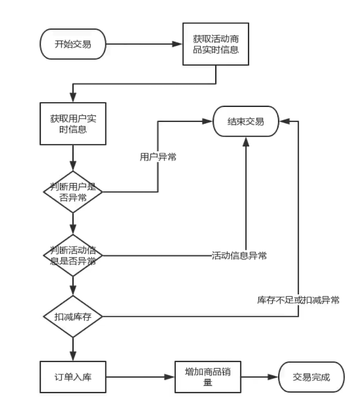

## 交易验证优化

修改了代码逻辑，将商品信息和用户信息的验证都从数据库转移到了redis上面，优化后的压测结果如下：

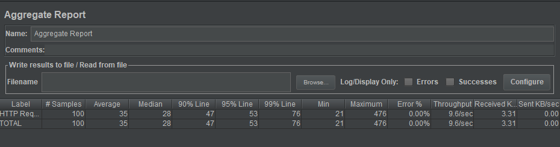

可以发现，平均时间有很大幅度的下降，吞吐量却没有提高。

## 活动缓存库存

### 索引优化

首先由于扣减库存会查询数据库，让我们来explain一下对应的语句：

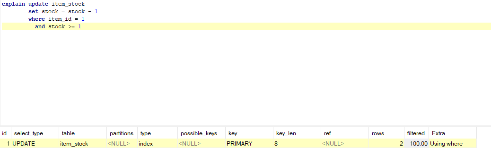

可以发现，是使用了主键索引，接着我们使用show profiles看看语句的执行时间：

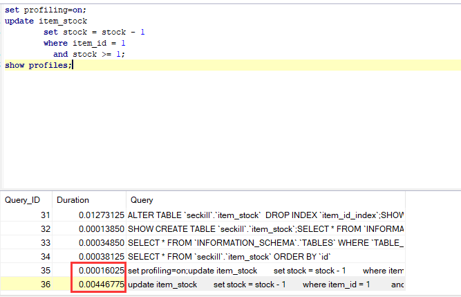

大概是在0.0046s左右，我们在item_id上面加上一个唯一索引，explain如下：

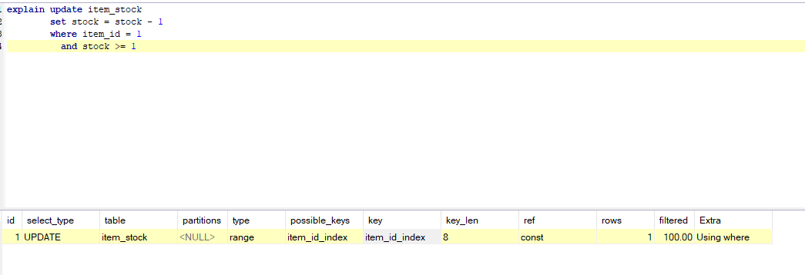

可以发现，ref变成了最快的const。show profiles：

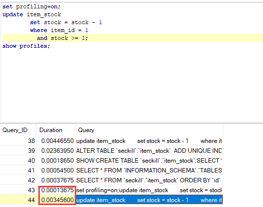

总耗时大概在0.0035s左右，快了0.0001s。

压测结果如下：

| 状态   | 并发数 | 样本数 | 平均响应时间 | 吞吐量  | 错误率 | 接受Kb/s |
| ------ | ------ | ------ | ------------ | ------- | ------ | -------- |
| 修改前 | 100    | 500    | 83           | 49.9/s  | 0.00%  | 17.15/s  |
| 修改前 | 200    | 1000   | 93           | 98.8/s  | 0.00%  | 33.97/s  |
| 修改前 | 500    | 2500   | 1017         | 156.4/s | 0.00%  | 53.76/s  |
| 修改后 | 100    | 500    | 71           | 49.6/s  | 0.00%  | 17.05/s  |
| 修改后 | 200    | 1000   | 75           | 95.2/s  | 0.00%  | 32.72/s  |
| 修改后 | 500    | 2500   | 237          | 237.2/s | 0.00%  | 81.53/s  |

加了唯一索引后，吞吐量和平均响应时间有大幅度的改善。

### 库存缓存

1）扣减库存缓存化

2）异步同步数据库

3）库存数据库最终一致性保证

当下订单后需要减库存的操作时，我们修改redis后，使用rocketmq异步同步数据库，最后保证数据一致性，压测结果如下：

| 状态   | 并发数 | 样本数 | 平均响应时间 | 吞吐量  | 错误率 | 接受Kb/s |
| ------ | ------ | ------ | ------------ | ------- | ------ | -------- |
| 修改前 | 100    | 500    | 71           | 49.6/s  | 0.00%  | 17.05/s  |
| 修改前 | 200    | 1000   | 75           | 95.2/s  | 0.00%  | 32.72/s  |
| 修改前 | 500    | 2500   | 237          | 237.2/s | 0.00%  | 81.53/s  |
| 修改后 | 100    | 500    | 452          | 36.2/s  | 0.00%  | 12.43/s  |
| 修改后 | 200    | 1000   | 538          | 70.8/s  | 0.00%  | 24.32/s  |
| 修改后 | 500    | 2500   | 2804         | 101.3/s | 0.00%  | 34.82/s  |

各个性能反倒是下降了，由于rocketmq部署在另一台机器上，不可避免会造成io传输过高，反而造成性能下降的情况。