API的使用

## 通用命令

**1）keys ***

遍历所有key。

可以使用`keys he*`遍历所有以he开头的键。

**使用方式：**热备从节点，scan。

**2）dbsize**

计算key的总数。

**3）exists**

检查key是否存在。

**4）del key**

删除指定的key-value。

**5）expire key seconds**

设置key的过期时间。

**6）ttl key**

查看key剩余的过期时间。

**7）persist key**

去掉key的过期时间。

**8）type key**

查看key的类型。

## 速度快的原因

1）纯内存。

2）非阻塞IO。

3）避免线程切换和静态消耗。

## 数据结构和内部编码


### String

Redis String类型是可以与Redis键关联的最简单的值类型。它是Memcached中唯一的数据类型，因此新手在Redis中使用它也很自然。

由于Redis键是字符串，当我们使用字符串类型作为值时，我们将字符串映射到另一个字符串。字符串数据类型对于许多用例很有用，例如缓存HTML片段或页面。

#### set命令

`set`：不管key是否存在，都设置。

`setnx`：key不存在，才设置。

`set key value xx`：key存在，才设置。

#### mget、mset命令

`mget key1 key2 key3,....`：批量获取key，原子操作。

`mset key1 value1 key2 value2 key3 value3`：批量设置key-value。

### HASH


实际上是一个map->map的结构，可以很方便的存储Java类。Redis哈希看起来正是人们可能期望看到一个“哈希”，使用字段值对：

```
> hmset user:1000 username antirez birthyear 1977 verified 1
OK
> hget user:1000 username
"antirez"
> hget user:1000 birthyear
"1977"
> hgetall user:1000
1) "username"
2) "antirez"
3) "birthyear"
4) "1977"
5) "verified"
6) "1"
```

#### 相关命令：

hget、hset、hdel、hesists、hlen、hmget、hmset。

### List


所述LPUSH命令将一个新元素到一个列表，在左侧（在头部），而RPUSH命令将一个新元素到一个列表，在右侧（在尾部）。最后， LRANGE命令从列表中提取元素范围：

```
> rpush mylist A
(integer) 1
> rpush mylist B
(integer) 2
> lpush mylist first
(integer) 3
> lrange mylist 0 -1
1) "first"
2) "A"
3) "B"
```

请注意，LRANGE需要两个索引，即要返回的范围的第一个和最后一个元素。两个索引都可以是负数，告诉Redis从结尾开始计数：所以-1是最后一个元素，-2是列表的倒数第二个元素，依此类推。

正如您所见，RPUSH附加了列表右侧的元素，而最后的LPUSH附加了左侧的元素。

Redis列表中定义的一个重要操作是*弹出元素*的能力。弹出元素是从列表中检索元素并同时从列表中删除元素的操作。您可以从左侧和右侧弹出元素，类似于如何在列表的两侧推送元素：

```
> rpush mylist a b c
(integer) 3
> rpop mylist
"c"
> rpop mylist
"b"
> rpop mylist
"a"
```

#### Capped lists(上限列表)

在许多用例中，我们只想使用列表来存储*最新的项目*，无论它们是什么：社交网络更新，日志或其他任何内容。

Redis允许我们使用列表作为上限集合，只记住最新的N项并使用[LTRIM](https://redis.io/commands/ltrim)命令丢弃所有最旧的项。

的[LTRIM](https://redis.io/commands/ltrim)命令类似于[LRANGE](https://redis.io/commands/lrange)，但是**，而不是显示元件的指定范围**它设置在该范围作为新的列表值。超出给定范围之外的所有元素。

一个例子将使它更清楚：

```
> rpush mylist 1 2 3 4 5
(integer) 5
> ltrim mylist 0 2
OK
> lrange mylist 0 -1
1) "1"
2) "2"
3) "3"
```

上面的LTRIM命令告诉Redis只从索引0到2中获取列表元素，其他所有内容都将被丢弃。这允许一个非常简单但有用的模式：一起执行List推操作+ List修剪操作以添加新元素并丢弃超出限制的元素：

```
LPUSH mylist <some element>
LTRIM mylist 0 999
```

上面的组合添加了一个新元素，并且只将1000个最新元素放入列表中。使用LRANGE，您可以访问顶级项目，而无需记住非常旧的数据。

注意：虽然LRANGE在技术上是一个O（N）命令，但是访问列表的头部或尾部的小范围是一个恒定时间操作。

### Set

Redis集是字符串的无序集合。该 SADD命令添加新的元素到set。对于集合执行许多其他操作也是可能的，例如测试给定元素是否已存在，执行多个集合之间的交集，并集或差异等等。

```
> sadd myset 1 2 3
(integer) 3
> smembers myset
1. 3
2. 1
3. 2
```

在这里，我已经为我的集合添加了三个元素，并告诉Redis返回所有元素。正如您所看到的那样，它们没有排序 - Redis可以在每次调用时以任意顺序返回元素，因为与用户没有关于元素排序的合同。

Redis有命令来测试会员资格。例如，检查元素是否存在：

```
> sismember myset 3
(integer) 1
> sismember myset 30
(integer) 0
```

### Sorted sets

排序集是一种数据类型，类似于Set和Hash之间的混合。与集合一样，有序集合由唯一的，非重复的字符串元素组成，因此在某种意义上，有序集合也是一个集合。

但是，虽然内部集合中的元素没有排序，但是有序集合中的每个元素都与浮点值相关联，称为*分数* （这就是为什么类型也类似于散列，因为每个元素都映射到一个值）。

此外，排序集合中的元素按*顺序排列*（因此它们不是根据请求排序的，顺序是用于表示排序集合的数据结构的特性）。它们按照以下规则订购：

- 如果A和B是两个具有不同分数的元素，如果A.score> B.score，那么A> B。
- 如果A和B具有完全相同的分数，如果A字符串按字典顺序大于B字符串，则A> B。A和B字符串不能相等，因为有序集只有唯一元素。

让我们从一个简单的例子开始，添加一些选定的黑客名称作为有序集合元素，其出生年份为“得分”。

```
> zadd hackers 1940 "Alan Kay"
(integer) 1
> zadd hackers 1957 "Sophie Wilson"
(integer) 1
> zadd hackers 1953 "Richard Stallman"
(integer) 1
> zadd hackers 1949 "Anita Borg"
(integer) 1
> zadd hackers 1965 "Yukihiro Matsumoto"
(integer) 1
> zadd hackers 1914 "Hedy Lamarr"
(integer) 1
> zadd hackers 1916 "Claude Shannon"
(integer) 1
> zadd hackers 1969 "Linus Torvalds"
(integer) 1
> zadd hackers 1912 "Alan Turing"
(integer) 1
```

正如您所看到的，ZADD与SADD类似，但是需要一个额外的参数（放在要添加的元素之前），即分数。 ZADD也是可变参数，因此您可以自由指定多个得分 - 值对，即使在上面的示例中未使用它。

对于排序集，返回按出生年份排序的黑客列表是微不足道的，因为实际上它们已经排序了。

实现说明：排序集是通过包含跳过列表和散列表的双端口数据结构实现的，因此每次添加元素时，Redis都会执行O（log（N））操作。这很好，但是当我们要求排序的元素时，Redis根本不需要做任何工作，它已经全部排序了：

```
> zrange hackers 0 -1
1) "Alan Turing"
2) "Hedy Lamarr"
3) "Claude Shannon"
4) "Alan Kay"
5) "Anita Borg"
6) "Richard Stallman"
7) "Sophie Wilson"
8) "Yukihiro Matsumoto"
9) "Linus Torvalds"
```

如果我想以相反的方式订购它们，最小到最老的怎么办？使用ZREVRANGE而不是ZRANGE：

```
> zrevrange hackers 0 -1
1) "Linus Torvalds"
2) "Yukihiro Matsumoto"
3) "Sophie Wilson"
4) "Richard Stallman"
5) "Anita Borg"
6) "Alan Kay"
7) "Claude Shannon"
8) "Hedy Lamarr"
9) "Alan Turing"
```

使用`WITHSCORES`参数也可以返回分数：

```
> zrange hackers 0 -1 withscores
1) "Alan Turing"
2) "1912"
3) "Hedy Lamarr"
4) "1914"
5) "Claude Shannon"
6) "1916"
7) "Alan Kay"
8) "1940"
9) "Anita Borg"
10) "1949"
11) "Richard Stallman"
12) "1953"
13) "Sophie Wilson"
14) "1957"
15) "Yukihiro Matsumoto"
16) "1965"
17) "Linus Torvalds"
18) "1969"
```

在切换到下一个主题之前，只需要关于排序集的最后一点。排序集的分数可以随时更新。仅针对已经包含在已排序集合中的元素调用ZADD将使用O（log（N））时间复杂度更新其得分（和位置）。因此，当有大量更新时，排序集合是合适的。

由于这个特性，常见的用例是排行榜。典型的应用程序是一个Facebook游戏，在这个游戏中，您可以结合使用高分进行排序的用户以及获取排名操作，以显示前N个用户以及排行榜中的用户排名（例如，“你是这里＃4932的最佳成绩“）。

## 配置建议

### maxTotal

理论值=命令平均执行时间*业务总QPS数。

### maxIdle&&minIdle（最大空闲数与最少空闲数）

1）maxIdle=maxTotal，减少创建新连接的开销。

2）预热minIdle，减少第一次启动后的新连接的开销。

# redis常用功能

## 慢查询

生命周期

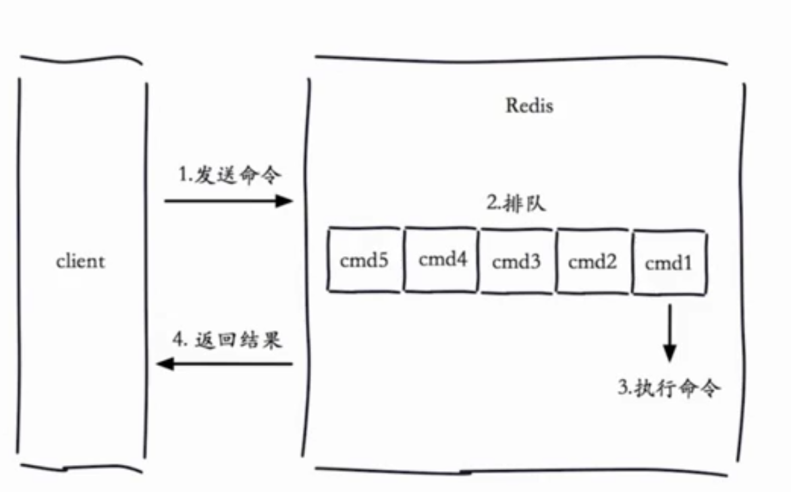

1）慢查询发生在第三阶段。

2）客户端超时不一定慢查询，但慢查询是客户端超时的一个可能因素。

### 两个配置

1）slowlog-max-len

>1：先进先出队列
>
>2：固定长度
>
>3：保存在内存内


2）slowlog-log-slower-than

> 慢查询阈值（单位：微秒）

### 命令

1）slowlog get [n]：获取慢查询队列。

2）slowlog len：获取慢查询队列长度。

3）slowlog reset：清空慢查询队列。

### 运维经验

1）slowlog-max-len不要设置过小，通常设置1000左右。

2）slowlog-log-slower-than不要设置过大，默认10ms，通常设置1ms。

3）理解生命周期。

4）定期持久化慢查询。

## Pipeline

Redis是使用客户端 - 服务器模型和所谓的*请求/响应*协议的TCP服务器。

这意味着通常通过以下步骤完成请求：

- 客户端向服务器发送查询，并通常以阻塞方式从套接字读取服务器响应。
- 服务器处理该命令并将响应发送回客户端。

例如，四个命令序列是这样的：

- *客户：* INCR X.
- *服务器：* 1
- *客户：* INCR X.
- *服务器：* 2
- *客户：* INCR X.
- *服务器：* 3
- *客户：* INCR X.
- *服务器：* 4

客户端和服务器通过网络链接连接。这样的链接可以非常快（环回接口）或非常慢（在因特网上建立的连接，在两个主机之间有许多跳）。无论网络延迟是什么，数据包都有时间从客户端传输到服务器，然后从服务器返回到客户端以进行回复。

此时间称为RTT（Round Trip Time）。当客户端需要连续执行许多请求时（例如，将多个元素添加到同一列表或使用多个键填充数据库），很容易看出这会如何影响性能。例如，如果RTT时间是250毫秒（在因特网上的链路非常慢的情况下），即使服务器能够每秒处理100k个请求，我们也能够以每秒最多四个请求进行处理。

如果使用的接口是环回接口，则RTT要短得多（例如我的主机报告0,044毫秒，ping 127.0.0.1），但如果你需要连续执行多次写入，它仍然很多。

幸运的是，有一种方法可以改进这个用例。

### Redis Pipelining

可以实现请求/响应服务器，以便即使客户端尚未读取旧响应，它也能够处理新请求。这样就可以将*多个命令*发送到服务器而无需等待回复，最后只需一步即可读取回复。

这被称为流水线技术，并且是几十年来广泛使用的技术。例如，许多POP3协议实现已经支持此功能，大大加快了从服务器下载新电子邮件的过程。

Redis从很早就开始支持流水线操作，因此无论您运行什么版本，都可以使用Redis进行流水线操作。这是使用原始netcat实用程序的示例：

```
$ (printf "PING\r\nPING\r\nPING\r\n"; sleep 1) | nc localhost 6379
+PONG
+PONG
+PONG
```

**重要说明**：当客户端使用流水线发送命令时，服务器将被强制使用内存对回复进行排队。因此，如果您需要使用流水线发送大量命令，最好将它们作为具有合理数量的批次发送，例如10k命令，读取回复，然后再次发送另外10k命令，依此类推。速度将几乎相同，但使用的额外内存将最大为此10k命令的回复排队所需的数量。

### mset与pipeline对比

mset：原子操作。

pipeline：非原子操作。

### 使用建议

1）注意每次pipeline携带数据量。

2）pipeline每次只能作用在一个Redis节点上。

## 发布订阅

SUBSCRIBE，UNSUBSCRIBE和PUBLISH 实现了发布/订阅消息传递范例，其中（引用维基百科）发件人（发布者）没有被编程为将其消息发送给特定接收者（订阅者）。相反，发布的消息被表征为信道，而不知道可能存在什么（如果有的话）订户。订阅者表达对一个或多个频道的兴趣，并且仅接收感兴趣的消息，而不知道有哪些（如果有的话）发布者。发布者和订阅者的这种分离可以允许更大的可扩展性和更动态的网络拓扑。

例如，为了订阅频道foo，bar客户端发出提供频道名称的SUBSCRIBE：

```
SUBSCRIBE foo bar
```

其他客户端发送到这些频道的消息将由Redis推送到所有订阅的客户端。

订阅一个或多个频道的客户端不应发出命令，尽管它可以订阅和取消订阅其他频道。对订阅和取消订阅操作的回复以消息的形式发送，以便客户端可以只读取连贯的消息流，其中第一个元素指示消息的类型。订阅客户端上下文中允许的命令是SUBSCRIBE，PSUBSCRIBE，UNSUBSCRIBE，PUNSUBSCRIBE， PING和QUIT。

请注意，redis-cli在订阅模式下不会接受任何命令，并且只能退出模式Ctrl-C。

消息是具有三个元素的[Array回复](https://redis.io/topics/protocol#array-reply)。

第一个元素是消息的类型：

- `subscribe`：表示我们成功订阅了作为回复中第二个元素的通道。第三个参数表示我们当前订阅的频道数。
- `unsubscribe`：表示我们成功取消订阅作为回复中第二个元素的频道。第三个参数表示我们当前订阅的频道数。当最后一个参数为零时，我们不再订阅任何通道，并且客户端可以发出任何类型的Redis命令，因为我们在Pub / Sub状态之外。
- `message`：它是由另一个客户端发出的[PUBLISH](https://redis.io/commands/publish)命令收到的消息。第二个元素是原始通道的名称，第三个参数是实际的消息有效负载。

# Redis的持久化

Redis提供了不同的持久性选项：

- RDB持久性以指定的时间间隔执行数据集的时间点快照。
- AOF持久性记录服务器接收的每个写入操作，将在服务器启动时再次播放，重建原始数据集。使用与Redis协议本身相同的格式以仅追加方式记录命令。当Redis太大时，Redis能够重写日志。
- 如果您愿意，只要服务器正在运行，您就可以根据需要禁用持久性。
- 可以在同一实例中组合AOF和RDB。请注意，在这种情况下，当Redis重新启动时，AOF文件将用于重建原始数据集，因为它保证是最完整的。

最重要的是要理解RDB和AOF持久性之间的不同权衡。让我们从RDB开始：

## RDB的优势

- RDB是Redis数据的一个非常紧凑的单文件时间点表示。RDB文件非常适合备份。例如，您可能希望在最近24小时内每小时归档您的RDB文件，并且每天保存RDB快照30天。这使您可以在发生灾难时轻松恢复数据集的不同版本。
- RDB非常适合灾难恢复，可以将单个压缩文件传输到远端数据中心，也可以传输到Amazon S3（可能是加密的）。
- RDB最大限度地提高了Redis的性能，因为Redis父进程为了坚持不懈而需要做的唯一工作就是分配一个将完成所有其余工作的孩子。父实例永远不会执行磁盘I / O或类似操作。
- 与AOF相比，RDB允许使用大数据集更快地重启。

## RDB的缺点

- 如果您需要在Redis停止工作时（例如断电后）将数据丢失的可能性降至最低，则RDB并不好。您可以配置生成RDB的不同*保存点*（例如，在对数据集进行至少五分钟和100次写入之后，但您可以有多个保存点）。但是，您通常每五分钟或更长时间创建一个RDB快照，因此如果Redis因任何原因停止工作而没有正确关闭，您应该准备丢失最新的数据分钟。
- RDB经常需要fork（）才能使用子进程持久存储在磁盘上。如果数据集很大，Fork（）可能会非常耗时，并且如果数据集非常大且CPU性能不佳，可能会导致Redis停止服务客户端几毫秒甚至一秒钟。AOF也需要fork（），但你可以调整你想要重写日志的频率而不需要对耐久性进行任何权衡。

## AOF优势

- 使用AOF Redis更持久：您可以使用不同的fsync策略：no fsync at all, fsync every second, fsync at every query。使用fsync的默认策略，每秒写入性能仍然很好（使用后台线程执行fsync，并且当没有fsync正在进行时，主线程将努力执行写入。）但是您只能丢失一秒的写入。
- AOF日志是仅附加日志，因此如果停电，则没有搜索，也没有损坏问题。即使由于某种原因（磁盘已满或其他原因）日志以半写命令结束，redis-check-aof工具也能够轻松修复它。
- 当Redis太大时，Redis能够在后台自动重写AOF。重写是完全安全的，因为当Redis继续附加到旧文件时，使用创建当前数据集所需的最小操作集生成一个全新的文件，并且一旦第二个文件准备就绪，Redis会切换两个并开始附加到新的那一个。
- AOF以易于理解和解析的格式一个接一个地包含所有操作的日志。您甚至可以轻松导出AOF文件。例如，即使您使用FLUSHALL命令刷新了所有错误，如果在此期间未执行重写日志，您仍然可以保存数据集，只需停止服务器，删除最新命令，然后重新启动Redis。

## AOF的缺点

- AOF文件通常比同一数据集的等效RDB文件大。
- 根据确切的fsync策略，AOF可能比RDB慢。一般来说，fsync设置为**every second**性能仍然非常高，并且在fsync禁用的情况下，即使在高负载下也应该与RDB一样快。即使在写入负载很大的情况下，RDB仍能够提供有关最大延迟的更多保证。
- 在过去，我们遇到了特定命令中的罕见错误（例如，有一个涉及阻塞命令，如BRPOPLPUSH）导致生成的AOF在重新加载时不会重现完全相同的数据集。这个错误很少见，我们在测试套件中进行测试，自动创建随机复杂数据集并重新加载它们以检查一切正常，但RDB持久性几乎不可能出现这种错误。为了更清楚地说明这一点：Redis AOF逐步更新现有状态，如MySQL或MongoDB，而RDB快照一次又一次地创建所有内容，这在概念上更加健壮。但是 —— 1）应该注意的是，每次通过Redis重写AOF时，都会从数据集中包含的实际数据开始重新创建，与总是附加的AOF文件（或者重写旧的AOF而不是读取内存中的数据）相比，对bug的抵抗力更强。2）我们从未向用户提供过关于在现实世界中检测到的AOF损坏的单一报告。

## 好的，那我该怎么用？

一般的迹象是，如果您希望一定程度的数据安全性与PostgreSQL为您提供的数据安全性相当，则应使用两种持久性方法。

如果你非常关心你的数据，但是在发生灾难的情况下仍然会有几分钟的数据丢失，你可以单独使用RDB。

有许多用户单独使用AOF，但我们不鼓励它，因为不时有RDB快照是进行数据库备份，更快重启以及AOF引擎中出现错误的好主意。

注意：由于所有这些原因，我们可能最终将AOF和RDB统一为未来的单一持久性模型（长期计划）。

有关详细的服务器配置请查阅我之前的博客。

# 常见的持久化开发运维问题

## 改善fork

1）优先使用物理机或者高效支持fork操作的虚拟化技术。

2）控制Redis实例最大可用内存:maxmemory。

3）合理配置Linux内存分配策略：vm.overcommit_memory=1。

4）降低fork频率：例如放宽AOF重写自动触发时机，不必要的全量复制。

## 子进程开销和优化

### CPU

开销：RDB和AOF文件生成，属于CPU密集型。

优化：不做CPU绑定，不和CPU密集型部署。

### 内存

开销：fork内存开销，copy-on-write。

优化：echo never > /sys/kernel/mm/transparent_hugepage/enabled。

### 硬盘

开销：AOF和RDB文件写入，可以结合iostat,iotop分析。

优化：no-appendfsync-on-rewrite = yes

## AOF阻塞

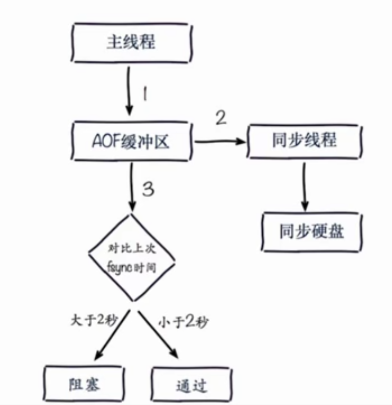

### 定位

1）Redis日志

2）info Persistence

3）硬盘使用情况

# 主从复制

在Redis复制的基础上（不包括由Redis Cluster或Redis Sentinel作为附加层提供的高可用性功能），有一个非常简单的使用和配置*leader follower*（主从）复制：它允许从属Redis实例准确主实例的副本。每次链接断开时，slave将自动重新连接到master，并且*无论*master发生什么情况，它都会尝试成为它的精确副本。

该系统使用三种主要机制：

1. 当主实例和从属实例连接良好时，主设备通过向从设备发送命令流来保持从设备更新，以便复制对主设备端发生的数据集的影响，原因是：客户端写入，key已过期或驱逐，更改主数据集的任何其他操作。
2. 当主设备和从设备之间的链路中断时，对于网络问题或者由于主设备或从设备中检测到超时，从设备重新连接并尝试继续部分重新同步：这意味着它将尝试仅获取部件它在断开连接时错过的命令流。
3. 当无法进行部分重新同步时，slave将要求完全重新同步。这将涉及一个更复杂的过程，其中主机需要创建其所有数据的快照，将其发送到从机，然后在数据集更改时继续发送命令流。

Redis默认使用异步复制，即低延迟和高性能，是绝大多数Redis用例的自然复制模式。但是，Redis slave异步确认它们与master定期收到的数据量。因此主设备不会每次等待从设备处理命令，但是如果需要，它知道哪个从设备已经处理了什么命令。这允许具有可选的同步复制。

客户端可以使用WAIT命令请求某些数据的同步复制。但是，WAIT只能确保在其他Redis实例中存在指定数量的已确认副本，但它不会将一组Redis实例转换为具有强一致性的CP系统：在故障转移期间，确认的写入仍然可能丢失，具体取决于关于Redis持久性的确切配置。然而，对于WAIT，在失败事件之后丢失写入的概率大大降低到某些难以触发的故障模式。

您可以查看Sentinel或Redis集群文档，以获取有关高可用性和故障转移的更多信息。本文档的其余部分主要描述了Redis基本复制的基本特征。

以下是有关Redis复制的一些非常重要的事实：

- Redis使用异步复制，异步slave到master确认处理的数据量。
- 主设备可以有多个从设备。
- Slaves能够接受来自其他Slaves的连接。除了将多个从设备连接到同一主设备之外，从设备还可以以类似级联的结构连接到其他从设备。从Redis 4.0开始，所有子slave将从master接收完全相同的复制流。
- Redis复制在主端是非阻塞的。这意味着当一个或多个从服务器执行初始同步或部分重新同步时，主服务器将继续处理查询。
- 复制在从属端也很大程度上是非阻塞的。当slave正在执行初始同步时，它可以使用旧版本的数据集处理查询，假设您在redis.conf中配置了Redis。否则，您可以将Redis从属配置为在复制流关闭时向客户端返回错误。但是，在初始同步之后，必须删除旧数据集并且必须加载新数据集。slave将在此简短窗口期间**阻止**传入连接（对于非常大的数据集，可能长达数秒）。从Redis 4.0开始，可以配置Redis，以便删除旧数据集在不同的线程中发生，但是加载新的初始数据集仍然会在主线程中发生并阻塞slave。
- 复制可以用于可伸缩性，以便为只读查询提供多个slave（例如，可以将慢速O（N）操作卸载到slave），或者仅用于提高数据安全性和高可用性。
- 可以使用复制来避免让主服务器花费巨大的开支将完整数据集写入磁盘：典型的技术是配置主服务器`redis.conf`以避免持久存储到磁盘，然后连接配置为save from time to time的从服务器，或者启用AOF。但是，必须小心处理此设置，因为重新启动的主服务器将以空数据集开始：如果从服务器尝试与其同步，则从服务器也将被清空。

## 工作原理

每个Redis主服务器都有一个replication ID：它是一个大的伪随机字符串，用于标记数据集的给定叙述。每个主服务器还会为生成的每个复制流字节递增一个偏移量，以便将其发送到从属服务器，方便使用修改数据集的新更改来更新从属服务器的状态。即使没有实际连接的slave，复制偏移也会增加，如下：

```
Replication ID, offset
```

用来标识主数据集的确切版本。

命令`./redis-cli -p 6379 -a 你的密码 info server | grep run`可以查看具体的id：

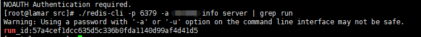

当slave连接到master时，它们使用`PSYNC`命令发送它们的旧主replication ID以及它们到目前为止处理的偏移量。这样master只用发送所需的增量部分。但是，如果主缓冲区中没有足够的*backlog*，或者从属设备指不知道历史记录（复制ID），则发生完全重新同步：在这种情况下，从属设备将获得数据集的完整副本， 从头开始。

这是完全同步在更多细节中的工作方式：

主服务器启动后台保存过程以生成RDB文件。同时它开始缓冲从客户端收到的所有新写命令。后台保存完成后，主服务器将数据库文件传输到从服务器，从服务器将其保存在磁盘上，然后将其加载到内存中。然后，主设备将所有缓冲的命令发送到从设备。这是作为**命令流**完成的，并且与Redis协议本身的格式相同。

您可以通过telnet自己尝试。在服务器执行某些工作时连接到Redis端口并发出[SYNC](https://redis.io/commands/sync)命令。您将看到批量传输，然后主服务器接收的每个命令都将在telnet会话中重新发出。实际上，较新的Redis实例不再使用[SYNC](https://redis.io/commands/sync)旧协议，但其仍然存在向后兼容性：它不允许部分重新同步，因此现在用`PSYNC`代替。

如前所述，当主 - 从链路由于某种原因而关闭时，从设备能够自动重新连接。如果主设备接收到多个并发从属同步请求，它将执行单个后台保存以便为所有这些请求提供服务。

### 全量复制

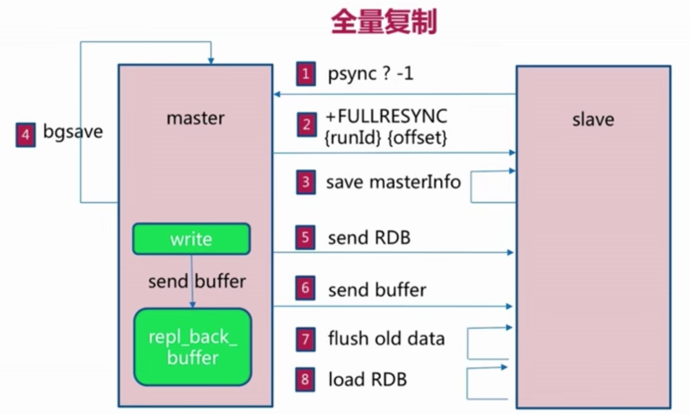

#### 开销

1）bgsave时间。

2）RDB文件网络传输时间。

3）从节点清空数据时间。

4）从节点加载RDB的时间。

5）可能的AOF重写时间。

### 部分复制

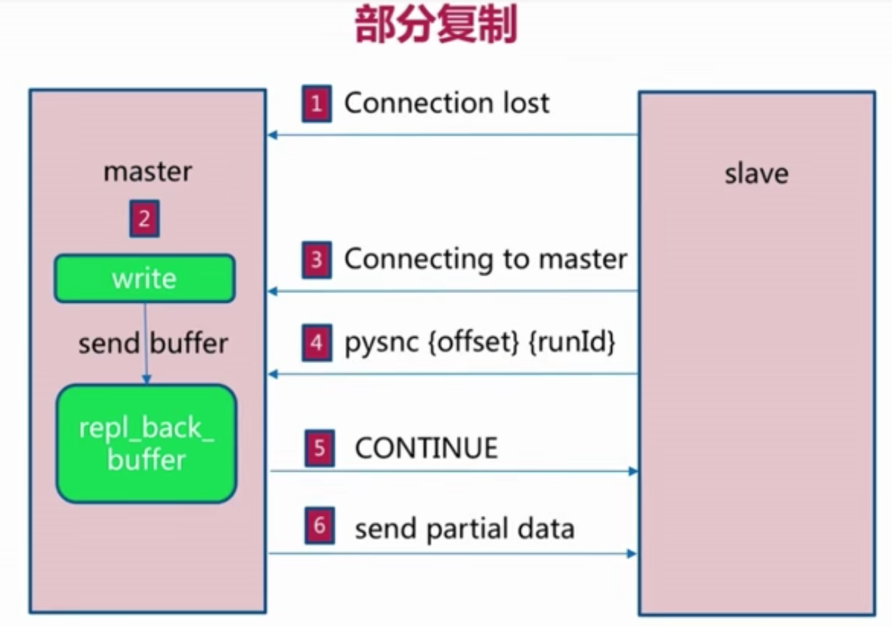

## 配置

配置基本Redis复制很简单：只需将以下行添加到从属配置文件：

```
slaveof 192.168.1.1 6379
```

当然，您需要将192.168.1.1 6379替换为您的主IP地址（或主机名）和端口。或者，您可以调用SLAVEOF命令，主控主机将启动与slave的同步。

还有一些参数用于调整主机在内存中采取的replication backlog以执行部分重新同步。

可以使用repl-diskless-sync配置参数启用无盘复制。传输开始后，等待在第一个slave之后到达的更多slaves的延迟由repl-diskless-sync-delay 参数控制。

### 具体步骤

1）进入redis目录，复制`redis.conf`文件为redis-6380.conf

```
cp redis.conf redis-6380.conf
```

2）修改redis-6380.conf的端口号，保存的rdb文件名，日志名等参数。

3）找到REPLICATION模块，修改如下：

`replicaof 127.0.0.1 6379`

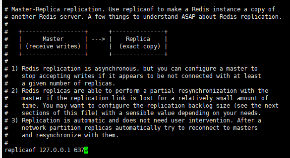

4）如果主节点redis设置了密码，修改masterauth属性：

在箭头处填上密码。

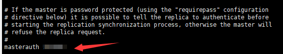

5）启动从结点：

```
./redis-server ../redis-6380.conf
```

6）使用命令`./redis-cli -p 6380 -a 你的密码 info replication`查看从节点状态：

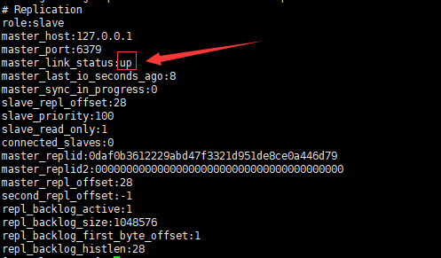

可以发现role为slave，并且master_link_status为up，说明启动成功。说明一下，上图的slave_repl_offset就是所谓的偏移量。

尝试使用redis-cli在主节点中写入一个值：

```
./redis-cli -p 6379 -a 你的密码
> set hello world
```

进入从节点，输入`get hello`，可以发现已经能够正确获取值。


7）可以使用命令`slaveof no one`取消从节点模式。

## 只读slave

从Redis 2.6开始，slave支持默认启用的只读模式。此行为由`slave-read-only`redis.conf文件中的选项控制，可以在运行时使用CONFIG SET启用和禁用。

只读slave将拒绝所有写入命令，因此由于错误而写入slave是不可能的。这并不意味着该功能旨在将从属实例暴露给互联网，或者更普遍地意味着将不受信任的客户端存在的网络，因为管理命令喜欢`DEBUG`或`CONFIG`仍然启用。但是，通过使用该`rename-command`指令禁用redis.conf中的命令，可以提高只读实例的安全性。

您可能想知道为什么可以恢复只读设置并具有可以通过写入操作作为目标的从属实例。如果slave和master重新同步或者slave重新启动，那么这些写操作将被丢弃，但有一些合法的用例可用于在可写slave中存储短暂数据。

例如，计算慢速设置或排序集合操作并将它们存储到本地key中是多次观察可写slave的用例。

但是请注意，**版本4.0之前的可写slave无法设置到期时间**。这意味着如果您使用EXPIRE或为key设置最大TTL的其他命令，key将泄漏，虽然您在使用读取命令访问key时可能再也看不到它，您将在key计数中看到它仍在使用内存。因此，通常混合可写slave（以前的版本4.0）和带有TTL的键会产生问题。

Redis 4.0 RC3及更高版本完全解决了这个问题，现在可写的从设备能够像主设备那样用TTL删除key，但用DB编号大于63的key除外（但默认情况下Redis实例只有16个数据库）。

另请注意，由于Redis 4.0从属写入仅是本地的，并且不会传播到附加到实例的子从属。相反，子slave将始终接收与顶层master向中间slave发送的复制流相同的复制流。例如，在以下设置中：

```
A ---> B ---> C
```

即使`B`是可写的，`C`也不会看到`B`写入，而是具有与主实例相同的数据集`A`。

## 开发中运维的常见问题

### 读写分离

1）读写分离：读流量分摊到从节点，写流量分摊到主节点。

2）可能遇到的问题

> 1、复制数据延迟。
>
> 2、读到过期数据（3.2已解决）。
>
> 3、从节点故障。

### 规避全量复制

1）第一次全量复制

> 1、第一次不可避免。
>
> 2、小主节点、低峰。

2）节点运行ID不匹配

> 1、主节点重启（运行ID变化）。
>
> 2、故障转移，例如哨兵或集群。

3）复制积压缓冲区不足

> 1、网络中断，部分复制无法满足。
>
> 2、增大复制缓冲区配置rel_backlog_size，网络“增强”。

### 规避复制风暴

1）单节点复制风暴

> 问题：主节点重启，多从节点复制。
>
> 解决：更换复制拓扑。

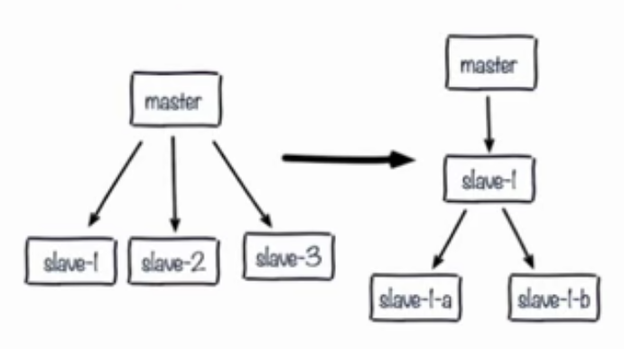

2）单机器复制风暴

> 问题：机器宕机后，大量全量复制。
>
> 解决：主节点分散多机器。


# Redis Sentinel

Redis Sentinel为Redis提供高可用性。实际上，这意味着使用Sentinel可以创建一个Redis部署，可以在没有人为干预的情况下抵御某些类型的故障。

Redis Sentinel还提供其他附属任务，如监控，通知，并充当客户端的配置提供程序。

这是宏观级别的Sentinel功能的完整列表（即*大图*）：

- **监控**。Sentinel会不断检查主实例和从属实例是否按预期工作。
- **通知**。Sentinel可以通过API通知系统管理员，另一台计算机程序，其中一个受监控的Redis实例出现问题。
- **自动故障转移**。如果主服务器未按预期工作，Sentinel可以启动故障转移过程，其中从服务器被提升为主服务器，其他服务器将重新配置为新主服务器，并且使用Redis服务器的应用程序会通知有关新服务器的地址。连接。
- **配置提供商**。Sentinel充当客户端服务发现的权限来源：客户端连接到Sentinels，以便询问负责给定服务的当前Redis主服务器的地址。如果发生故障转移，Sentinels将报告新地址。

## Sentinel的分布式特性

Redis Sentinel是一个分布式系统：

Sentinel本身设计为在多个Sentinel进程协同工作的配置中运行。让多个Sentinel进程协作的优势如下：

1. 当多个Sentinels认为给定主设备不再可用时，将执行故障检测。这降低了误报的可能性。
2. 即使并非所有Sentinel进程都正常工作，Sentinel也能正常工作，从而使系统能够抵御故障。毕竟，拥有故障转移系统本身就是一个单一的故障点并不是一件好事。

Sentinels，Redis实例（主服务器和从服务器）以及连接到Sentinel和Redis的客户端的总和也是具有特定属性的更大的分布式系统。在本文档中，将逐步介绍概念，从了解Sentinel的基本属性所需的基本信息，到更复杂的信息（可选），以了解Sentinel的工作原理。

## 获得哨兵

Sentinel的当前版本称为**Sentinel 2**。它是使用更强大和更简单的预测算法（本文档中解释）重写初始Sentinel实现。

自Redis 2.8发布Redis Sentinel的稳定版本。

在*不稳定的*分支中进行了新的开发，一旦它们被认为是稳定的，新的特征有时会被反导到最新的稳定分支中。

Redis 2.6附带的Redis Sentinel版本1已弃用，不应使用。

## 运行Sentinel

如果您正在使用`redis-sentinel`可执行文件（或者如果您的可执行文件具有该名称的符号链接`redis-server`），则可以使用以下命令行运行Sentinel：

```
redis-sentinel /path/to/sentinel.conf
```

或者，您可以直接使用`redis-server`在Sentinel模式下启动它的可执行文件：

```
redis-server /path/to/sentinel.conf --sentinel
```

两种方式都是一样的。

但是**，**在运行Sentinel时**必须**使用配置文件，因为系统将使用此文件以保存重新启动时将重新加载的当前状态。如果没有给出配置文件或配置文件路径不可写，Sentinel将拒绝启动。

默认情况下，Sentinels会**侦听与TCP端口26379的连接**，因此**要使** Sentinels正常工作，**必须打开**服务器的端口26379 以接收来自其他Sentinel实例的IP地址的连接。否则，Sentinels无法通话，也无法就该怎么做达成一致，因此永远不会执行故障转移。

## 在部署之前要了解Sentinel的基本知识

1. 您需要至少三个Sentinel实例才能实现强大的部署。
2. 应将三个Sentinel实例放入被认为不能以独立方式启动的计算机或虚拟机中。例如，在不同的可用区域上执行的不同物理服务器或虚拟机。
3. Sentinel + Redis分布式系统不保证在故障期间保留已确认的写入，因为Redis使用异步复制。但是，有一些方法可以部署Sentinel，使窗口丢失限制在某些时刻的写入，同时还有其他不太安全的方式来部署它。
4. 您需要在客户端获得Sentinel支持。流行的客户端库具有Sentinel支持，但不是全部。
5. 如果您不在开发环境中实时进行测试，则没有HA设置是安全的，在生产环境中，如果它们可以工作，则更好。您可能有一个错误的配置，只有在为时已晚（凌晨3点，当您的master节点停止工作）时才会变得明显。
6. **Sentinel，Docker或其他形式的网络地址转换或端口映射应谨慎使用**：Docker执行端口重新映射，中断其他Sentinel进程的Sentinel自动发现以及主服务器的从属列表。有关详细信息，请查看本文档后面有关Sentinel和Docker的部分。

## 配置Sentinel

Redis源代码分发包含一个名为`sentinel.conf`的文件 ，它是一个可以用来配置Sentinel的自我记录的示例配置文件，但是典型的最小配置文件如下所示：

```
sentinel monitor mymaster 127.0.0.1 6379 2
sentinel down-after-milliseconds mymaster 60000
sentinel failover-timeout mymaster 180000
sentinel parallel-syncs mymaster 1

sentinel monitor resque 192.168.1.3 6380 4
sentinel down-after-milliseconds resque 10000
sentinel failover-timeout resque 180000
sentinel parallel-syncs resque 5
```

您只需要指定要监视的主服务器，为每个单独的主服务器（可能有任意数量的从服务器）提供不同的名称。无需指定可被自动发现的slaves。Sentinel将自动更新配置有关slaves的其他信息（以便在重新启动时保留信息）。每次在故障转移期间将slave升级为master并且每次发现新的Sentinel时，也会重写该配置。

上面的示例配置基本上监视两组Redis实例，每组实例由主设备和未定义数量的从设备组成。一组实例被调用`mymaster`，另一组被调用`resque`。

`sentinel monitor`语句参数的含义如下：

```
sentinel monitor <master-group-name> <ip> <port> <quorum>
```

为清楚起见，让我们逐行检查配置选项的含义：

第一行用于告诉Redis监视一个名为*mymaster*的主*服务器*，它位于地址127.0.0.1和端口6379，连接数为2。一切都很明显，但是**quorum**参数：

- 该**quorum**是认为master不可达的哨兵的数量，为了真正把slave标志为失败，并最终启动关闭作业。
- 但是**，quorum仅用于检测故障**。为了实际执行故障转移，其中一个Sentinels需要被选为故障转移的领导者并被授权继续进行。其由**大多数Sentinel进程**的投票而来。

因此，例如，如果您有5个Sentinel进程，并且给定主服务器的quorum设置为值2，则会发生以下情况：

- 如果两个Sentinels同时认定主服务器无法访问，则其中一个将尝试启动故障转移。
- 如果至少总共有三个Sentinel可达，则故障转移将被授权并实际开始。

实际上，这意味着在故障期间，**如果大多数Sentinel进程无法通话**（在少数分区中也没有故障转移），**Sentinel永远不会启动故障转移**。

## 其他Sentinel选项

其他选项几乎总是以下列形式：

```
sentinel <option_name> <master_name> <option_value>
```

并用于以下目的：

- `down-after-milliseconds` 是对于Sentinel开始认为它已关闭并且实例不能到达的（无论是不回复我们的PING还是回复错误）以毫秒为单位的时间。
- `parallel-syncs`设置可在同一故障转移后重新配置以使用新主服务器的从服务器数。数字越小，故障转移过程完成所需的时间就越多，但是如果从属服务器配置为提供旧数据，则可能不希望所有从属服务器同时与主服务器重新同步。虽然复制过程对于从属设备大部分是非阻塞的，但是有一段时间它停止从主设备加载批量数据。您可能希望通过将此选项设置为值1来确保一次只能访问一个slave。

其他选项在本文档的其余部分中进行了描述，并记录在`sentinel.conf`Redis发行版附带的示例文件中。

可以使用该`SENTINEL SET`命令在运行时修改所有配置参数。有关详细信息，请参阅“ **在运行时重新配置Sentinel”**部分。

## 示例Sentinel部署

现在您已了解Sentinel的基本信息，您可能想知道应该在哪里放置Sentinel进程，需要多少Sentinel进程等等。本节介绍几个示例部署。

- Masters称为M1，M2，M3，...，Mn。
- Slaves称为R1，R2，R3，...，Rn（R代表*复制品*）。
- Sentinels称为S1，S2，S3，...，Sn。
- Clients称为C1，C2，C3，...，Cn。
- 当实例由于Sentinel操作而更改角色时，我们将其放在方括号内，因此[M1]表示由于Sentinel干预而现在成为主实例的实例。

请注意，我们永远不会显示**仅使用两个Sentinels的设置**，因为Sentinels总是需要**与大多数人交谈**才能启动故障转移。

## 例1：只有两个哨兵，不要这样做

```
+----+         +----+
| M1 |---------| R1 |
| S1 |         | S2 |
+----+         +----+

Configuration: quorum = 1
```

- 在此设置中，如果主M1发生故障，R1将被提升，因为两个Sentinels可以就故障达成协议（显然将quorum设置为1），并且还可以授权故障转移，因为大多数是两个。所以显然它可以表面上工作，但请检查下一点，看看为什么这个设置被打破。
- 如果M1运行的框停止工作，S1也停止工作。在另一个框S2中运行的Sentinel将无法授权故障转移，因此系统将无法使用。

请注意，为了执行不同的故障转移，需要多数，然后将最新配置传播到所有Sentinels。另请注意，在没有任何协议的情况下，在上述设置的单个方面进行故障转移的能力将非常危险：

```
+----+           +------+
| M1 |----//-----| [M1] |
| S1 |           | S2   |
+----+           +------+
```

在上面的配置中，我们以完全对称的方式创建了两个主服务器（假设S2可以在未经授权的情况下进行故障转移）。客户端可以无限期地向双方写入，并且无法理解分区何时恢复正确的配置，以防止*永久性的裂脑情况*。

所以请始终**在三个不同的盒子中至少部署三个Sentinels**。

## 示例2：具有三个框的基本设置

这是一个非常简单的设置，其优点是易于调整以获得额外的安全性。它基于三个框，每个框都运行Redis进程和Sentinel进程。

```
       +----+
       | M1 |
       | S1 |
       +----+
          |
+----+    |    +----+
| R2 |----+----| R3 |
| S2 |         | S3 |
+----+         +----+

Configuration: quorum = 2
```

如果主M1发生故障，S2和S3将同意故障，并且能够授权故障转移，使客户能够继续。

在每个Sentinel设置中，Redis被异步复制，总是存在丢失一些写入的风险，因为给定的已确认写入可能无法到达被提升为主设备的从设备。但是在上面的设置中，由于客户端使用旧主服务器进行分区，因此风险较高，如下图所示：

```
         +----+
         | M1 |
         | S1 | <- C1 (writes will be lost)
         +----+
            |
            /
            /
+------+    |    +----+
| [M2] |----+----| R3 |
| S2   |         | S3 |
+------+         +----+
```

在这种情况下，网络分区隔离了旧的主M1，因此从属R2被提升为主。但是，与旧主服务器位于同一分区的客户端（如C1）可能会继续将数据写入旧主服务器。这个数据将永远丢失，因为当分区将愈合时，主机将被重新配置为新主机的从机，丢弃其数据集。

使用以下Redis复制功能可以缓解此问题，如果主服务器检测到不再能够将其写入传输到指定数量的从服务器，则允许停止接受写入。

```
min-slaves-to-write 1
min-slaves-max-lag 10
```

使用上述配置（请参阅`redis.conf`Redis发行版中的自注释示例以获取更多信息）Redis实例作为主服务器时，如果无法写入至少1个从服务器，将停止接受写入。由于复制是异步的，*因此无法*实际*写入*意味着从属设备已断开连接，或者未向我们发送超过指定`max-lag`秒数的异步确认。

使用此配置，上例中的旧Redis主M1将在10秒后变为不可用。当分区恢复时，Sentinel配置将收敛到新的配置，客户端C1将能够获取有效配置并继续使用新主设备。

但是没有免费的午餐。通过这种改进，如果两个从属设备关闭，主设备将停止接受写入。这是一个折衷。

## 具体步骤

1）将三个redis（一主二从）启动。

2）配置`sentinel.conf`文件：

> 1、去掉protected-mode no的注释，即让它生效
>
> 2、将daemonize改成yes
>
> 3、修改logfile为26379.log
>
> 4、写入redis密码：sentinel auth-pass mymaster 你的密码（注意这里需要将其配置在sentinel monitor mymaster 你的服务器ip 6379 2语句之下，不然会报“No such master with specified name.”的错误。
>
> 5、修改dir

3）进入src目录，使用命令`./redis-sentinel ../sentinel.conf`进行启动。

4）使用命令：

```
./redis-cli -p 26379
>info
```

得到结果如下：


5）复制sentinel.conf为sentinel-26380.conf与sentinel-26381.conf，修改端口等信息，重复上述步骤。并且需要将myid注释，最终，sentinels的数目将等于3。

## Java客户端

1）Sentinel地址集合。

2）masterName。

3）不是代理模式。

### RedisUtils

```
package com.lamarsan.sentinel.util;

import redis.clients.jedis.*;
import redis.clients.jedis.exceptions.JedisConnectionException;

import java.util.HashSet;
import java.util.List;
import java.util.Map;
import java.util.Set;
import java.util.logging.Logger;

/**
 * className: RedisUtil
 * description: TODO
 *
 * @author hasee
 * @version 1.0
 * @date 2018/12/26 10:57
 */
public class RedisUtil {
    private static final Logger myLogger = Logger.getLogger("com.lamarsan.sentinel.util");

    private static JedisSentinelPool pool = null;

    static {
        try {
            Set<String> sentinels = new HashSet<String>();
            sentinels.add("你的ip:26380");
            sentinels.add("你的ip.140:26379");
            sentinels.add("你的ip:26381");
            String masterName = "mymaster";
            String password = "123456";
            JedisPoolConfig config = new JedisPoolConfig();
            config.setMinIdle(8);
            config.setMaxTotal(100);
            config.setMaxIdle(100);
            config.setMaxWaitMillis(10000);
            pool = new JedisSentinelPool(masterName, sentinels, config, password);
            try {
                pool.getResource();
            } catch (JedisConnectionException e) {
                myLogger.info(e.getMessage());
                e.printStackTrace();
            }
        } catch (Exception e) {
            myLogger.info(e.getMessage());
            e.printStackTrace();
        }
    }

    private static void returnResource(JedisSentinelPool pool, Jedis jedis) {
        if (jedis != null) {
            jedis.close();
        }
    }

    /**
     * <p>通过key获取储存在redis中的value</p>
     * <p>并释放连接</p>
     *
     * @param key
     * @return 成功返回value 失败返回null
     */
    public static String get(String key) {
        Jedis jedis = null;
        String value = null;
        try {
            jedis = pool.getResource();
            value = jedis.get(key);
        } catch (Exception e) {
            if (jedis != null) {
                jedis.close();
            }
            e.printStackTrace();
        } finally {
            returnResource(pool, jedis);
        }
        return value;
    }

    /**
     * <p>向redis存入key和value,并释放连接资源</p>
     * <p>如果key已经存在 则覆盖</p>
     *
     * @param key
     * @param value
     * @return 成功 返回OK 失败返回 0
     */
    public static String set(String key, String value) {
        Jedis jedis = null;
        try {
            jedis = pool.getResource();
            return jedis.set(key, value);
        } catch (Exception e) {
            if (jedis != null) {
                jedis.close();
            }
            e.printStackTrace();
            return "0";
        } finally {
            returnResource(pool, jedis);
        }
    }
    
    .....
}

```

### main

```
package com.lamarsan.sentinel;

import com.lamarsan.sentinel.util.RedisUtil;

/**
 * className: Test
 * description: TODO
 *
 * @author hasee
 * @version 1.0
 * @date 2019/9/13 15:54
 */
public class Test {
    public static void main(String[] args) throws InterruptedException {
        RedisUtil.setnx("hello", "world");
        while (true) {
            Thread.sleep(10000);
            String result = RedisUtil.get("hello");
            System.out.println(result);
        }
    }
}
```

### 结果

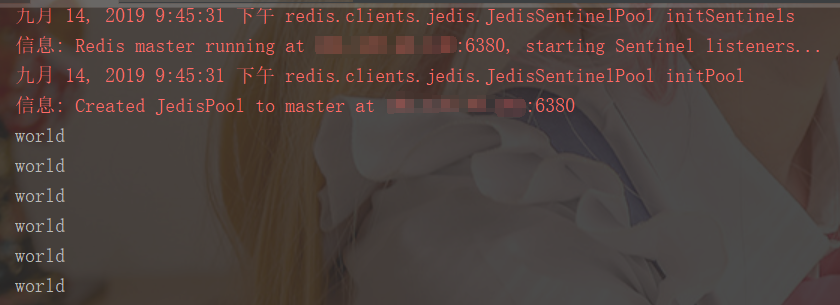

## 三个定时任务

 1）每10秒每个sentinel对master和slave执行info

> 1、发现slave结点。
>
> 2、确认主从关系。

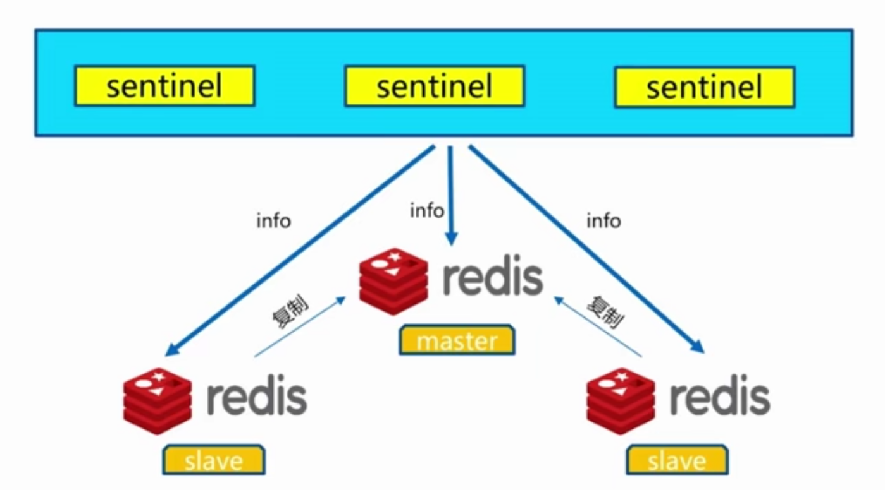

2）每2秒每个sentinel通过master结点的channel交换信息(pub/sub)

> 1、通过_sentinel_：hello频道交互。
>
> 2、交互对节点的”看法“和自身信息。


3）每1秒每个sentinel对其他sentinel和redis执行ping。

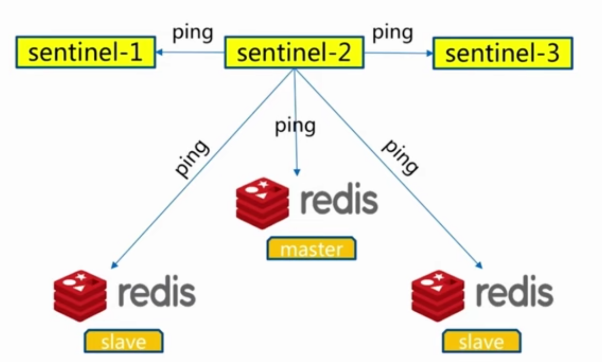

## 节点运维

1）机器下线：例如过保等情况。

2）机器性能不足：例如CPU、内存、硬盘、网络等。

3）节点自身故障：例如服务不稳定等。

### 主节点

`sentinel failover <masterName>`

### 从节点

临时下线还是永久下线，例如是否做一些清理工作，也要考虑读写分离的情况。

# Redis Cluster

## Redis Cluster

Redis Cluster提供了一种运行Redis安装的方法，其中数据 **在多个Redis节点之间自动分片**。

Redis Cluster还在**分区期间**提供**一定程度的可用性**，实际上是在某些节点发生故障或无法通信时继续运行的能力。但是，如果发生较大的故障（例如，当大多数主设备不可用时），集群将停止运行。

所以实际上，你对Redis Cluster有什么看法？

- 能够**在多个节点之间自动拆分数据集**。
- **当节点的子集遇到故障**或无法与集群的其余部分通信时，能够**继续操作**。

## Redis集群TCP端口

每个Redis集群节点都需要打开**两个**TCP连接。用于为客户端提供服务的普通Redis TCP端口，例如6379，加上通过向数据端口添加10000获得的端口，因此示例中为16379。

第二个端口用于集群总线，即使用二进制协议的节点到节点的通信通道。节点使用集群总线进行故障检测，配置更新，故障转移授权等。客户端永远不应尝试与集群总线端口通信，但始终使用正常的Redis命令端口，但请确保在防火墙中打开两个端口，否则Redis集群节点将无法通信。

命令端口和集群总线端口偏移是固定的，始终为10000。

请注意，对于每个节点，要使Redis集群正常工作，您需要：

1. 用于与客户端通信的普通客户端通信端口（通常为6379），对所有需要访问集群的客户端以及所有其他集群节点（使用客户端端口进行key迁移）开放。
2. 必须可以从所有其他集群节点访问集群总线端口（客户端端口+ 10000）。

如果不打开两个TCP端口，则集群将无法按预期工作。

集群总线使用不同的二进制协议进行节点到节点的数据交换，这更适合于使用很少的带宽和处理时间在节点之间交换信息。

## Redis集群和Docker

目前，Redis集群不支持NATted环境，也不支持重新映射IP地址或TCP端口的一般环境。

Docker使用一种称为*端口映射*的技术：与程序使用的端口相比，在Docker容器内运行的程序可能会使用不同的端口。这对于在同一服务器中同时使用相同端口运行多个容器非常有用。

为了使Docker与Redis Cluster兼容，您需要使用Docker 的**主机网络模式**。有关更多信息，请查看[Docker文档中](https://docs.docker.com/engine/userguide/networking/dockernetworks/)的`--net=host`选项。

## Redis集群数据分片

Redis Cluster不使用一致的散列，而是使用不同形式的分片，其中每个键在概念上都是我们称之为**散列槽的一部分**。

Redis集群中有16384个散列槽，为了计算给定key的散列槽，我们只需采用key模数为16384的CRC16。

Redis集群中的每个节点都负责哈希槽的子集，例如，您可能拥有一个包含3个节点的集群，其中：

- 节点A包含从0到5500的散列槽。
- 节点B包含从5501到11000的散列槽。
- 节点C包含从11001到16383的散列槽。

这允许轻松添加和删除集群中的节点。例如，如果我想添加一个新节点D，我需要将一些哈希槽从节点A，B，C移动到D。同样，如果我想从集群中删除节点A，我只需移动A服务的哈希槽到B和C。当节点A为空时，我可以完全从集群中删除它。

因为将哈希槽从一个节点移动到另一个节点不需要停止操作，添加和删除节点，或者更改节点所持有的哈希槽的百分比，所以不需要任何停机时间。

只要涉及单个命令执行（或整个事务或Lua脚本执行）的所有键都属于同一个哈希槽，Redis Cluster就支持多个键操作。用户可以通过使用称为*哈希标记*的概念强制多个key成为同一哈希槽的一部分。

Hash标签记录在Redis集群规范中，但要点是如果key中{}括号之间有子字符串，则只对字符串内部的内容进行哈希处理，例如，保证`this{foo}key`与`another{foo}key` 位于相同的哈希槽中，可以使多个键在一个参数的命令中一起使用。

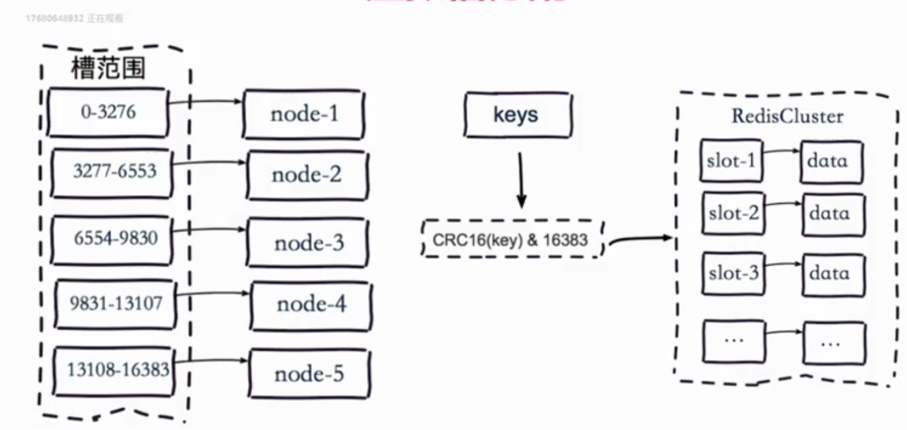

## Redis Cluster主从模型

为了在主节点子集发生故障或无法与大多数节点通信时保持可用，Redis Cluster使用主从模型，其中每个散列槽从1（主机本身）到N个副本（N-1个额外的从节点）。

在具有节点A，B，C的示例集群中，如果节点B发生故障，则集群无法继续，因为我们不再能够在5501-11000范围内提供服务哈希位置的方法。

然而，当创建集群时（或稍后），我们向每个主节点添加一个从节点，以便最终集群由作为主节点的A，B，C和作为从节点的A1，B1，C1组成。 ，如果节点B出现故障，系统就能继续运行。

节点B1复制B，B失败，集群将节点B1升级为新的主节点，并将继续正常运行。

但请注意，如果节点B和B1同时发生故障，Redis Cluster将无法继续运行。

## Redis集群一致性保证

Redis Cluster无法保证**强一致性**。实际上，这意味着在某些条件下，Redis Cluster可能会丢失系统向客户端确认的写入。

Redis Cluster可能丢失写入的第一个原因是它使用异步复制。这意味着在写入期间会发生以下情况：

- 您的客户端写入主B。
- masterB向您的客户回复确定。
- 主设备B将写入传播到其从设备B1，B2和B3。

正如你所看到的，B在回复客户端之前并没有等待来自B1，B2，B3的确认，因为这对Redis来说是一个过高的延迟惩罚，所以如果你的客户端写了一些内容，B会确认写入，但是崩溃在写入发送到其从属之前，其中一个从属（没有接收到写入）可以提升为master，将会永远丢失写入。

这与配置为每秒将数据刷新到磁盘的大多数数据库**所发生的情况非常相似**，因此，由于过去使用不涉及分布式系统的传统数据库系统的经验，因此您已经能够推断这种情况。同样，您可以通过在回复客户端之前强制数据库刷新磁盘上的数据来提高一致性，但这通常会导致性能过低。在Redis Cluster的情况下，这相当于同步复制。

基本上需要在性能和一致性之间进行权衡。

Redis Cluster在绝对需要时支持同步写入，通过[WAIT](https://redis.io/commands/wait)命令实现，这使得丢失写入的可能性大大降低，但请注意，即使使用同步复制，Redis Cluster也不会实现强一致性：在更复杂的情况下总是可以实现失败场景，无法接收写入的slave被选为master。

还有另一个值得注意的情况是，Redis集群将丢失写入，这种情况发生在网络分区中，其中客户端与少数实例（至少包括主服务器）隔离。

以6个节点簇为例，包括A，B，C，A1，B1，C1，3个master和3个slave。还有一个客户，我们称之为Z1。

在发生分区之后，可能在分区的一侧有A，C，A1，B1，C1，在另一侧有B和Z1。

Z1仍然可以写入B，它将接受其写入。如果分区在很短的时间内恢复，集群将继续正常运行。但是，如果分区持续足够的时间使B1在分区的多数侧被提升为主，则Z1发送给B的写入将丢失。

请注意，Z1将能够发送到B的写入量存在**最大窗口**：如果分区的多数方面已经有足够的时间将从属设备选为主设备，则少数端的每个主节点都会停止接受写入。

这段时间是Redis Cluster的一个非常重要的配置指令，称为**节点超时**。

节点超时过后，主节点被视为失败，可以由其中一个副本替换。类似地，在节点超时已经过去而主节点无法感知大多数其他主节点之后，它进入错误状态并停止接受写入。

## Redis集群配置参数

我们即将创建一个示例集群部署。在继续之前，让我们介绍Redis Cluster在`redis.conf`文件中引入的配置参数。有些会很明显，有些会在你继续阅读时更清楚。

- **cluster-enabled<yes/no>**：如果是，则在特定Redis实例中启用Redis集群支持。否则，实例像往常一样作为独立实例启动。
- **cluster-config-file<filename>**：请注意，尽管有此选项的名称，但这不是用户可编辑的配置文件，而是每次发生更改时Redis集群节点自动保持集群配置（基本上是状态）的文件，为了能够在启动时重新阅读它。该文件列出了集群中其他节点，状态，持久变量等内容。由于某些消息接收，通常会将此文件重写并刷新到磁盘上。
- **cluster-node-timeout<milliseconds>**：Redis集群节点不可用的最长时间，将会被视为失败。如果主节点的可访问时间超过指定的时间，则其从属节点将进行故障转移。此参数控制Redis集群中的其他重要事项。值得注意的是，在指定时间内无法访问大多数主节点的每个节点都将停止并接受查询。
- **cluster-slave-validity-factor<factor>**：如果设置为零，则不管master和slave之间链路保持断开连接的时间长短，slave将始终尝试对master进行故障切换。如果该值为正，则计算timeout值乘以此选项提供的因子作为最大断开时间，如果节点是从属节点，则如果主链接断开连接的时间超过指定的时间，则不会尝试启动故障转移。例如，如果节点超时设置为5秒，并且有效性因子设置为10，则从主设备断开超过50秒的从设备将不会尝试故障转移其主设备。请注意，如果没有slave能够对其进行故障转移，则任何不同于零的值都可能导致Redis集群在master发生故障后不可用。在这种情况下，只有当原始主服务器重新加入集群时，集群才会返回可用状态。
- **cluster-migration-barrier<count>**：主服务器将保持连接的最小从服务器数，以便另一个从服务器迁移到没有任何从服务器覆盖的主服务器。有关详细信息，请参阅本教程中有关副本迁移的相应部分。
- **cluster-require-full-coverage<yes/no>**：如果设置为yes，则默认情况下，如果任何节点未覆盖某个百分比的slots数量，则集群将停止接受写入。如果该选项设置为no，即使只能处理有关键子集的请求，集群仍将提供查询。

## 创建和使用Redis集群

注意：要手动部署Redis集群**，了解**它的某些操作方面**非常重要**。但是，如果要启动集群并尽快运行，请跳过本节和下一节，然后直接**使用create-cluster脚本创建Redis集群**。

要创建集群，我们首先要做的是在**集群模式**下运行一些空的Redis实例。这基本上意味着不使用普通Redis实例创建集群，因为需要配置特殊模式，以便Redis实例启用集群特定功能和命令。

以下是最小的Redis集群配置文件：

```
port 7000
cluster-enabled yes
cluster-config-file nodes.conf
cluster-node-timeout 5000
appendonly yes
```

正如您所看到的，启用集群模式的只是`cluster-enabled` 指令。每个实例还包含存储此节点配置的文件路径，默认情况下为`nodes.conf`。这个文件永远不会被人类接触；它只是在Redis Cluster实例启动时生成，并在每次需要时更新。copy的时候，记得修改`nodes.conf`的名字，如`nodes-7001.conf`。

请注意，按预期工作的**最小集群**需要包含至少三个主节点。对于您的第一次测试，强烈建议启动具有三个主设备和三个从设备的六节点集群。

为此，请输入一个新目录，并创建以我们将在任何给定目录中运行的实例的端口号命名的以下目录。

就像是：

```
mkdir cluster-test
cd cluster-test
mkdir 7000 7001 7002 7003 7004 7005
```

`redis.conf`在每个目录中创建一个文件，从7000到7005作为配置文件的模板，只需使用上面的小例子，但请确保根据目录名称用正确的端口号替换端口号`7000`。

现在**将从GitHub的unstable分支中的最新源编译的** redis-server可执行文件复制到`cluster-test`目录中，最后在您喜欢的终端应用程序中打开6个终端tabs。

像这样开始每个实例，每个tab一个：

```
cd 7000
../redis-server ./redis.conf
```

从每个实例的日志中可以看出，由于不存在任何`nodes.conf`文件，因此每个节点都会为自己分配一个新ID。

```
[82462] 26 Nov 11:56:55.329 * No cluster configuration found, I'm 97a3a64667477371c4479320d683e4c8db5858b1
```

此特定实例将永久使用此ID，以使实例在集群的上下文中具有唯一名称。每个节点都使用此ID记住每个其他节点，而不是通过IP或端口记住。IP地址和端口可能会发生变化，但唯一的节点标识符永远不会在节点的整个生命周期内发生变化。我们称这个标识符为**Node ID**。

## 创建集群

现在我们已经运行了许多实例，我们需要通过向节点编写一些有意义的配置来创建我们的集群。

如果您使用的是Redis 5，这很容易实现，因为我们在嵌入的Redis Cluster命令行实用程序`redis-cli`的帮助下，可用于创建新集群，检查或重新塑形现有集群等等。

对于Redis版本3或4，有一个名为`redis-trib.rb`非常相似的旧工具。您可以`src`在Redis源代码分发的目录中找到它。你需要安装`redis`gem才能运行`redis-trib`。

```
gem install redis
```

第一个例子，即集群创建，将在Redis 5的`redis-cli`和Redis 3和4中的`redis-trib`同时显示。但是所有下面的例子都只会使用`redis-cli`，因为你可以看到语法非常相似，你可以通过使用`redis-trib.rb help`获取有关旧语法的信息将一个命令行更改为另一个命令行。**重要提示：**请注意，如果您愿意，可以使用Redis 5 的`redis-cli`代替Redis 4集群。

要为Redis 5创建集群，`redis-cli`只需键入(如果redis有密码记得加入-a参数，要远程调用请配置公网ip）：

```
redis-cli -a 123456 --cluster create 127.0.0.1:7000 127.0.0.1:7001 \
127.0.0.1:7002 127.0.0.1:7003 127.0.0.1:7004 127.0.0.1:7005 \
--cluster-replicas 1
```

使用`redis-trib.rb`用于Redis的4或3：

```
./redis-trib.rb create --replicas 1 127.0.0.1:7000 127.0.0.1:7001 \
127.0.0.1:7002 127.0.0.1:7003 127.0.0.1:7004 127.0.0.1:7005
```

这里使用的命令是**create**，因为我们想要创建一个新的集群。该选项`--cluster-replicas 1`意味着我们希望每个创建的主服务器都有一个从服 其他参数是我要用于创建新集群的实例的地址列表。

显然，我们要求的唯一设置是创建一个包含3个主服务器和3个从服务器的集群。

Redis-cli将为您提供配置。键入**yes**接受建议的配置。将配置并*加入*集群，这意味着实例将被引导为彼此通信。最后，如果一切顺利，你会看到这样的消息：

`[OK] All 16384 slots covered`

这意味着至少有一个主实例为16384个可用插槽提供服务。

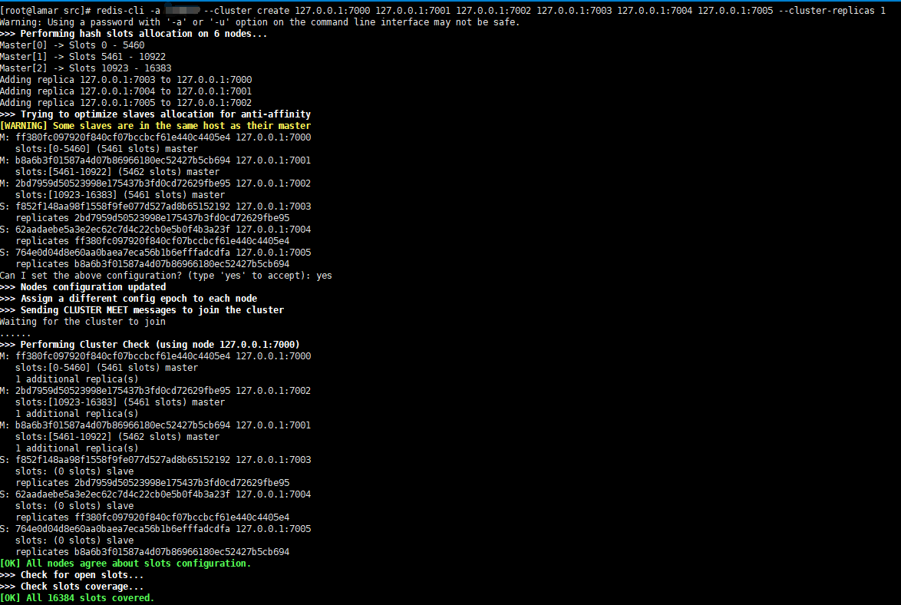

## 使用create-cluster脚本创建Redis集群

如果您不想通过如上所述手动配置和执行单个实例来创建Redis集群，则可以使用更简单的系统（但您不会学习相同数量的操作详细信息）。

只需检查Redis发行版中的`utils/create-cluster`目录即可。`create-cluster`内部有一个脚本（与其包含的目录同名），它是一个简单的bash脚本。要启动具有3个主服务器和3个从服务器的6节点集群，只需键入以下命令：

1、`create-cluster start`

2、`create-cluster create`

`yes`当`redis-cli`实用程序希望您接受集群布局时，在步骤2中回复。

您现在可以与集群交互，默认情况下，第一个节点将从端口30001开始。完成后，使用以下命令停止集群：

1、`create-cluster stop`。

`README`有关如何运行脚本的更多信息，请阅读此目录中的内容。

## 玩集群

在此阶段，Redis Cluster的一个问题是缺少客户端库实现。

我知道以下实现：

- [redis-rb-cluster](http://github.com/antirez/redis-rb-cluster)是由我（@antirez）编写的作为其他语言的参考的Ruby实现。它是原始redis-rb的简单包装器，实现了最小的语义，可以有效地与集群通信。
- [redis-py-cluster](https://github.com/Grokzen/redis-py-cluster) redis-rb-cluster到Python的一个端口。支持大多数*redis-py*功能。正在积极发展。
- 流行的[Predis](https://github.com/nrk/predis)支持Redis Cluster，最近更新了支持并且正在积极开发中。
- 最常用的Java客户端[Jedis](https://github.com/xetorthio/jedis)最近添加了对Redis Cluster的支持，请参阅项目README中的*Jedis Cluster*部分。
- [StackExchange.Redis](https://github.com/StackExchange/StackExchange.Redis)提供对C＃的支持（并且应该适用于大多数.NET语言; VB，F＃等）
- [thunk-redis](https://github.com/thunks/thunk-redis)支持Node.js和io.js，它是一个基于thunk / promise的redis客户端，具有流水线和集群。
- [redis-go-cluster](https://github.com/chasex/redis-go-cluster)是使用[Redigo库客户端](https://github.com/garyburd/redigo)作为基本客户端的Go语言的Redis集群的实现。通过结果聚合实现MGET / MSET。
- 在GitHub上的Redis的存储库中的不稳定分支中的`redis-cli`工具实现了一个非常基本的集群支持`-c`开关。

测试Redis Cluster的一种简单方法是尝试上述任何客户端或仅使用`redis-cli`命令行实用程序。以下是使用后者的交互示例：

```
$ redis-cli -c -p 7000
redis 127.0.0.1:7000> set foo bar
-> Redirected to slot [12182] located at 127.0.0.1:7002
OK
redis 127.0.0.1:7002> set hello world
-> Redirected to slot [866] located at 127.0.0.1:7000
OK
redis 127.0.0.1:7000> get foo
-> Redirected to slot [12182] located at 127.0.0.1:7002
"bar"
redis 127.0.0.1:7000> get hello
-> Redirected to slot [866] located at 127.0.0.1:7000
"world"
```

**注意：**如果使用脚本创建集群，则节点可以侦听不同的端口，默认情况下从30001开始。

redis-cli集群支持非常基础，因此它总是使用Redis集群节点能够将客户端重定向到右节点的事实。一个认真的客户端能够做得更好，并在哈希槽和节点地址之间缓存地图，以直接使用与正确节点的正确连接。仅当集群配置中的某些内容发生更改时（例如，在故障转移之后或系统管理员通过添加或删除节点更改集群布局后），才会刷新映射。

## 使用redis-rb-cluster编写示例应用程序

在继续展示如何操作Redis集群，执行故障转移或重新分片之前，我们需要创建一些示例应用程序，或者至少能够理解简单的Redis集群客户端交互的语义。

通过这种方式，我们可以运行一个示例，同时尝试使节点失败，或者开始重新分片，以了解Redis Cluster在真实条件下的行为方式。观察集群时没有数据写入并不是很有帮助。

本节介绍了[redis-rb-cluster的](https://github.com/antirez/redis-rb-cluster)一些基本用法， 展示了两个示例。第一个是以下内容，是redis-rb-cluster发行版中的文件 [`example.rb`](https://github.com/antirez/redis-rb-cluster/blob/master/example.rb) ：

```
1  require './cluster'
   2
   3  if ARGV.length != 2
   4      startup_nodes = [
   5          {:host => "127.0.0.1", :port => 7000},
   6          {:host => "127.0.0.1", :port => 7001}
   7      ]
   8  else
   9      startup_nodes = [
  10          {:host => ARGV[0], :port => ARGV[1].to_i}
  11      ]
  12  end
  13
  14  rc = RedisCluster.new(startup_nodes,32,:timeout => 0.1)
  15
  16  last = false
  17
  18  while not last
  19      begin
  20          last = rc.get("__last__")
  21          last = 0 if !last
  22      rescue => e
  23          puts "error #{e.to_s}"
  24          sleep 1
  25      end
  26  end
  27
  28  ((last.to_i+1)..1000000000).each{|x|
  29      begin
  30          rc.set("foo#{x}",x)
  31          puts rc.get("foo#{x}")
  32          rc.set("__last__",x)
  33      rescue => e
  34          puts "error #{e.to_s}"
  35      end
  36      sleep 0.1
  37  }
```

应用程序做了一件非常简单的事情，它将表单中的键`foo<number>`一个接一个设置为`number`。因此，如果您运行该程序，结果是以下命令流：

- SET foo0 0
- SET foo1 1
- SET foo2 2
- 等等...

该程序看起来比它应该更复杂，因为它被设计为在屏幕上显示错误而不是以异常退出，因此使用集群执行的每个操作都由`begin` `rescue`块包装。

第**14**行是该程序中第一个有趣的行。它创建Redis Cluster对象，使用**startup nodes** list作为参数，允许此对象对不同节点采用不同的最大连接数，最后在给定timeout，被认为给定的失败操作。

不需要集群的所有节点都启动。重要的是至少有一个节点是可达的。另请注意，只要redis-rb-cluster能够与第一个节点连接，它就会更新此启动节点列表。您应该期望与任何其他严肃的客户端都有这样的行为。

既然我们已将Redis Cluster对象实例存储在**rc**变量中，我们就可以使用该对象，就好像它是一个普通的Redis对象实例一样。

这正是**第18到26行**所发生的事情：当我们重新启动示例时，我们不想再次启动`foo0`，因此我们将计数器存储在Redis本身中。上面的代码用于读取此计数器，或者如果计数器不存在，则将其赋值为零。

但请注意它是如何循环，因为我们想要反复尝试，即使集群已关闭并返回错误。普通应用程序不需要那么小心。

**28到37之间的行**启动主循环，其中设置了键或显示错误。

注意`sleep`循环结束时的调用。在你的测试中，如果你想尽可能快地写入集群，你可以删除sleep（相对于这是一个繁忙的循环，当然没有真正的并行性，所以在最好的条件下，你通常会得到10k的操作/秒）。

通常，写入速度会降低，以便示例应用程序更容易被人类遵循。

启动应用程序会生成以下输出：

```
ruby ./example.rb
1
2
3
4
5
6
7
8
9
^C (I stopped the program here)
```

这不是一个非常有趣的程序，我们稍后会使用更好的程序，但我们已经可以看到程序运行时重新分片期间会发生什么。

## 重新整理集群

现在我们准备尝试集群重新分片了。为此，请保持example.rb程序运行，以便您可以查看是否对运行的程序有一些影响。此外，您可能想要继续执行该`sleep` 调用，以防止在重新分片期间有一些更严重的写入负载。

重新分片基本上意味着将散列槽从一组节点移动到另一组节点，并且像集群创建一样，它是使用redis-cli实用程序完成的。

要开始重新分片，只需输入：

`redis-cli --cluster reshard 127.0.0.1:7000`

您只需指定一个节点，redis-cli将自动找到其他节点。

目前redis-cli只能通过管理员支持重新加载，你不能只说将5％的插槽从这个节点移动到另一个节点（但这实现起来非常简单）。所以它从问题开始。首先是你要做多少大的重新分数：

`How many slots do you want to move (from 1 to 16384)?`

我们可以尝试重新设置1000个散列槽，如果示例在没有调用sleep的情况下运行，那么该散列槽应该包含非常少量的key。

然后redis-cli需要知道重新分片的目标是什么，即接收哈希槽的节点。我将使用第一个主节点，即127.0.0.1:7000，但我需要指定实例的节点ID。这已由redis-cli打印在列表中，但如果需要，我总能使用以下命令找到节点的ID：

```
$ redis-cli -p 7000 cluster nodes | grep myself
97a3a64667477371c4479320d683e4c8db5858b1 :0 myself,master - 0 0 0 connected 0-5460
```

好的，我的目标节点是97a3a64667477371c4479320d683e4c8db5858b1。

现在，您将被问到要从哪些节点获取这些key。我只是输入`all`以便从所有其他主节点获取一些哈希槽。

在最终确认之后，您将看到redis-cli将从一个节点移动到另一个节点的每个插槽的消息，并且将为从一侧移动到另一侧的每个实际键打印一个点。

重新分片正在进行中时，您应该能够看到您的示例程序不受影响地运行。如果需要，您可以在重新分片期间多次停止并重新启动它。

在重新分片结束时，您可以使用以下命令测试集群的运行状况：

`redis-cli --cluster check 127.0.0.1:7000`

所有的插槽都会像往常一样被覆盖，但这次127.0.0.1:7000的主机将有更多的散列槽，大约6461。

## 编写重新分析操作的脚本

可以自动执行重新分片，而无需以交互方式手动输入参数。这可以使用如下命令行：

```
redis-cli reshard <host>:<port> --cluster-from <node-id> --cluster-to <node-id> --cluster-slots <number of slots> --cluster-yes
```

如果您可能经常重新设置，则允许构建一些自动操作，但是目前无法`redis-cli`自动重新平衡集群，检查跨集群节点的key分发以及根据需要智能地移动插槽。此功能将在未来添加。

## 手动故障转移

有时强制进行故障转移而不会在主服务器上造成任何问题。例如，为了升级其中一个主节点的Redis进程，最好对其进行故障转移，以便将其转换为从属，对可用性的影响最小。

Redis Cluster使用[CLUSTER FAILOVER](https://redis.io/commands/cluster-failover) 命令支持手动故障转移，该命令必须在要故障转移的**master**的一个**slave**中执行。

手动故障转移是特殊的，与实际主故障导致的故障转移相比更安全，因为它们以避免数据丢失的方式发生，通过仅在系统确定新的主服务器时将客户端从原始主服务器切换到新主服务器master处理了旧的复制流。

这是您在执行手动故障转移时在从属日志中看到的内容：

```
# Manual failover user request accepted.
# Received replication offset for paused master manual failover: 347540
# All master replication stream processed, manual failover can start.
# Start of election delayed for 0 milliseconds (rank #0, offset 347540).
# Starting a failover election for epoch 7545.
# Failover election won: I'm the new master.
```

基本上连接到我们正在故障的主服务器的客户端被停止。同时主设备将其复制偏移量发送给从设备，该设备等待到达其侧面的偏移量。达到复制偏移量时，将启动故障转移，并通知旧主服务器有关配置开关的信息。在旧主服务器上取消阻止客户端时，会将它们重定向到新主服务器。

## 添加新节点

添加新节点基本上是添加空节点然后将一些数据移入其中（如果它是新主节点）或者告诉它设置为已知节点的副本（如果它是从属节点）的过程。

我们将展示两者，从添加新的主实例开始。

在这两种情况下，执行的第一步是**添加空节点**。

这很简单，只需要在端口7006中启动一个新节点（我们已经在7000到7005之间使用现有的6个节点），其他节点使用相同的配置，端口号除外，所以你应该按顺序做什么符合我们用于以前节点的设置：

- 在终端应用程序中创建一个新选项卡。
- 输入`cluster-test`目录。
- 创建一个名为的目录`7006`。
- 在里面创建一个redis.conf文件，类似于用于其他节点但使用7006作为端口号的文件。
- 最后启动服务器 `../redis-server ./redis.conf`

此时服务器应该正在运行。

现在我们可以像往常一样使用**redis-cli**，以便将节点添加到现有集群中。

```
redis-cli --cluster add-node 127.0.0.1:7006 127.0.0.1:7000
```

如您所见，我使用**add-node**命令将新节点的地址指定为第一个参数，并将集群中随机存在节点的地址指定为第二个参数。

实际上，redis-cli在这方面做的很少帮助我们，它只是向节点发送了一个[CLUSTER MEET](https://redis.io/commands/cluster-meet)消息，这也可以手动完成。但是redis-cli在运行之前也会检查集群的状态，所以即使你知道内部是如何工作的，通过redis-cli执行集群操作是个好主意。

现在我们可以连接到新节点以查看它是否真正加入了集群：

```
redis 127.0.0.1:7006> cluster nodes
3e3a6cb0d9a9a87168e266b0a0b24026c0aae3f0 127.0.0.1:7001 master - 0 1385543178575 0 connected 5960-10921
3fc783611028b1707fd65345e763befb36454d73 127.0.0.1:7004 slave 3e3a6cb0d9a9a87168e266b0a0b24026c0aae3f0 0 1385543179583 0 connected
f093c80dde814da99c5cf72a7dd01590792b783b :0 myself,master - 0 0 0 connected
2938205e12de373867bf38f1ca29d31d0ddb3e46 127.0.0.1:7002 slave 3c3a0c74aae0b56170ccb03a76b60cfe7dc1912e 0 1385543178072 3 connected
a211e242fc6b22a9427fed61285e85892fa04e08 127.0.0.1:7003 slave 97a3a64667477371c4479320d683e4c8db5858b1 0 1385543178575 0 connected
97a3a64667477371c4479320d683e4c8db5858b1 127.0.0.1:7000 master - 0 1385543179080 0 connected 0-5959 10922-11422
3c3a0c74aae0b56170ccb03a76b60cfe7dc1912e 127.0.0.1:7005 master - 0 1385543177568 3 connected 11423-16383
```

请注意，由于此节点已连接到集群，因此它已能够正确地重定向客户端查询，并且通常是集群的一部分。然而，与其他master相比，它有两个特点：

- 它没有数据，因为它没有分配的哈希槽。
- 因为它是没有分配插槽的主设备，所以当从设备想要成为主设备时，它不参与选举过程。

现在可以使用resharding功能为此节点分配哈希槽`redis-cli`。就像我们在上一节中所做的那样，它只是将一个空节点重新分区的过程。

## 将新节点添加为副本

添加新副本可以通过两种方式执行。显而易见的是再次使用redis-cli，使用--cluster-slave选项，如下所示：

```
redis-cli --cluster add-node 127.0.0.1:7006 127.0.0.1:7000 --cluster-slave
```

请注意，此处的命令行与我们用于添加新主服务器的命令行完全相同，因此我们不指定要添加副本的主服务器。在这种情况下，会发生的事情是redis-cli会将新节点作为随机主副本的副本添加到副本较少的主服务器中。

但是，您可以使用以下命令行准确指定要使用新副本定位的主控制器：

```
redis-cli --cluster add-node 127.0.0.1:7006 127.0.0.1:7000 --cluster-slave --cluster-master-id 3c3a0c74aae0b56170ccb03a76b60cfe7dc1912e
```

这样我们就可以将新副本分配给特定的主副本。

将副本添加到特定主节点的更手动方法是将新节点添加为空主节点，然后使用[CLUSTER REPLICATE](https://redis.io/commands/cluster-replicate)命令将其转换为副本 。如果将节点添加为从属节点但您想将其作为不同主节点的副本移动，则此方法也有效。

例如，为了添加当前服务于11423-16383范围内的哈希槽的节点127.0.0.1:7005的副本，其具有节点ID3c3a0c74aae0b56170ccb03a76b60cfe7dc1912e，我需要做的就是连接新节点（已经添加为空主）并发送命令：

```
redis 127.0.0.1:7006> cluster replicate 3c3a0c74aae0b56170ccb03a76b60cfe7dc1912e
```

而已。现在我们为这组哈希槽提供了一个新的副本，并且集群中的所有其他节点都已知道（需要几秒钟后才能更新它们的配置）。我们可以使用以下命令进行验证：

```
$ redis-cli -p 7000 cluster nodes | grep slave | grep 3c3a0c74aae0b56170ccb03a76b60cfe7dc1912e
f093c80dde814da99c5cf72a7dd01590792b783b 127.0.0.1:7006 slave 3c3a0c74aae0b56170ccb03a76b60cfe7dc1912e 0 1385543617702 3 connected
2938205e12de373867bf38f1ca29d31d0ddb3e46 127.0.0.1:7002 slave 3c3a0c74aae0b56170ccb03a76b60cfe7dc1912e 0 1385543617198 3 connected
```

节点3c3a0c ...现在具有两个从设备，在端口7002（现有的一个）和7006（新的一个）上运行。

## 删除节点

要删除从节点，只需使用redis-cli命令`del-node`：

```
redis-cli --cluster del-node 127.0.0.1:7000 `<node-id>`
```

第一个参数只是集群中的随机节点，第二个参数是要删除的节点的ID。

您也可以以相同的方式删除主节点，**但是为了删除主节点，它必须为空**。如果主服务器不为空，则需要将数据从其重新分配给所有其他主节点。

删除主节点的另一种方法是在其中一个从节点上执行手动故障转移，并在节点变为新主节点的从节点后将其删除。显然，当你想减少集群中实际的主数量时，这没有用，在这种情况下，需要重新分片。

## 副本迁移

在Redis集群中，只需使用以下命令，就可以随时使用不同的主服务器重新配置从属服务器进行复制：

```
CLUSTER REPLICATE <master-node-id>
```

但是，有一种特殊情况，您希望副本在没有系统管理员帮助的情况下自动从一个主服务器移动到另一个主服务器。副本的自动重新配置称为*副本迁移*，并且能够提高Redis集群的可靠性。

注意：您可以在[Redis集群规范中](https://redis.io/topics/cluster-spec)阅读副本迁移的详细信息，这里我们仅提供有关一般概念的一些信息以及您应该从中获益的信息。

您可能希望让集群副本在特定条件下从一个主服务器移动到另一个主服务器的原因是，通常Redis集群与附加到给定主服务器的副本数量一样可以抵御故障。

例如，如果主服务器及其副本同时发生故障，则每个主服务器具有单个副本的集群无法继续操作，原因很简单，因为没有其他实例可以拥有主服务器所服务的散列插槽的副本。然而，虽然netsplits可能同时隔离多个节点，但许多其他类型的故障（如单个节点本地的硬件或软件故障）是一类非常值得注意的故障，不太可能同时发生，所以有可能在你的集群中每个master都有一个slave，slave在凌晨4点被杀死，master在早上6点被杀死。这仍然会导致集群无法再运行。

为了提高系统的可靠性，我们可以选择为每个master添加额外的副本，但这很昂贵。副本迁移允许向少数主服务器添加更多从服务器。所以你有10个master，每个master有1个slave，总共20个实例。但是，例如，您添加了3个实例作为某些主服务器的从属服务器，因此某些主服务器将拥有多个服务器。

对于副本迁移，发生的情况是，如果master没有slave，则来自具有多个slave的master的副本将迁移到*孤立*master。所以在我们上面的例子中你的slave凌晨4点关闭之后，另一个slave将占据它的位置，当master在凌晨5点失败时，仍然有一个slave可以被选举，以便集群可以继续操作。

那么您应该简要了解副本迁移的内容？

- 集群将尝试从给定时刻具有最大副本数的主服务器迁移副本。
- 要从副本迁移中受益，您只需要向集群中的单个主服务器添加一些副本，这与主服务器无关。
- 有一个配置参数可以控制所调用的副本迁移功能`cluster-migration-barrier`：您可以在`redis.conf`Redis Cluster提供的示例文件中阅读有关它的更多信息。

## Java客户端

```
package com.lamarsan.cluster;

import redis.clients.jedis.HostAndPort;
import redis.clients.jedis.JedisCluster;
import redis.clients.jedis.JedisPoolConfig;

import java.io.IOException;
import java.util.LinkedHashSet;
import java.util.Set;

/**
 * className: Test
 * description: TODO
 *
 * @author hasee
 * @version 1.0
 * @date 2019/9/16 20:31
 */
public class Test {
    public static void main(String[] args) {
        JedisPoolConfig poolConfig = new JedisPoolConfig();
        // 最大连接数
        poolConfig.setMaxTotal(1);
        // 最大空闲数
        poolConfig.setMaxIdle(1);
        // 最大允许等待时间，如果超过这个时间还未获取到连接，则会报JedisException异常：
        // Could not get a resource from the pool
        poolConfig.setMaxWaitMillis(1000);
        Set<HostAndPort> nodes = new LinkedHashSet<HostAndPort>();
        nodes.add(new HostAndPort("******", 7000));
        nodes.add(new HostAndPort("******", 7001));
        nodes.add(new HostAndPort("******", 7002));
        nodes.add(new HostAndPort("******", 7003));
        nodes.add(new HostAndPort("******", 7004));
        nodes.add(new HostAndPort("******", 7005));
        String password = "******";
        JedisCluster cluster = new JedisCluster(nodes, 10000, 1000, 1000, password, poolConfig);
        cluster.setnx("foo","bar");
        System.out.println(cluster.get("foo"));
        try {
            cluster.close();
        } catch (IOException e) {
            e.printStackTrace();
        }
    }
}

```

# Redis集群规范

## Redis集群目标

Redis Cluster是Redis的分布式实现，具有以下目标，按设计重要性排序：

- 高性能和线性可扩展性，最多1000个节点。没有代理，使用异步复制，并且不对值执行合并操作。
- 写入安全的可接受程度：系统尝试（以best-effort的方式）保留源自与大多数主节点连接的客户端的所有写入。通常有小窗口可以丢失确认的写入。当客户端处于少数分区时，Windows丢失已确认的写入会更大。
- 可用性：Redis Cluster能够在大多数主节点可访问的分区中存活，并且每个主节点在不可访问时至少有一个可访问的从节点。此外，使用*副本迁移*，任何不可以复制的master中的slave将从多个slave覆盖的masters中接收一个master。

本文档中描述的内容在Redis 3.0或更高版本中实现。

## 实施子集

Redis Cluster实现Redis的非分布式版本中可用的所有单个键命令。执行复杂的多键操作（如Set类型联合或交叉）的命令也可以实现，只要这些键都散列到同一个槽。

Redis Cluster实现了一个称为**hash tags**的概念，可用于强制某些key存储在同一个哈希槽中。但是，在手动重新分片期间，多键操作可能会在一段时间内不可用，而单键操作始终可用。

Redis Cluster不支持多个数据库，例如Redis的独立版本。只有数据库0，不允许使用[SELECT](https://redis.io/commands/select)命令。

## Redis集群协议中的客户端和服务器角色

在Redis集群中，节点负责保存数据并获取集群的状态，包括将键映射到正确的节点。集群节点还能够自动发现其他节点，检测非工作节点，并在需要时促进从节点变成主节点，以便在发生故障时继续运行。

要执行任务，所有集群节点都使用TCP总线和二进制协议连接，称为**Redis集群总线**。每个节点都使用集群总线连接到集群中的每个其他节点。节点使用gossip protocol传播有关集群的信息，以便发现新节点，发送ping数据包以确保所有其他节点正常工作，以及发送发出特定条件信号所需的集群消息。集群总线还用于在集群中传播发布/订阅消息，并在用户请求时协调手动故障转移（手动故障转移是故障转移，不是由Redis集群故障检测程序启动，而是由系统管理员直接启动）。

由于集群节点不能代理请求，客户端可能会被重定向到其他节点，可以使用`-MOVED`和`-ASK`命令。理论上，客户端可以自由地向集群中的所有节点发送请求，并在需要时重定向，因此客户端不需要保持集群的状态。但是，能够在key和节点之间缓存映射的客户端可以以合理的方式提高性能。

## 写安全

Redis Cluster使用节点之间的异步复制，**上次故障转移获胜者**拥有隐式合并功能。这意味着最后选出的主数据集最终将替换所有其他副本。在分区期间总会有一个时间窗口，可能会丢失写入。然而，在连接到大多数主设备的客户端和连接到少数主设备的客户端的情况之间，这些窗口是非常不同的。

与少数端执行的写操作相比，Redis Cluster更加努力地保留由连接到大多数主服务器的客户端执行的写操作。以下是导致在故障期间在多数分区中收到的已确认写入丢失的情况示例：

1. 写入可以到达主设备，但是当主设备可能能够回复客户端时，写入可能不会通过主节点和从属节点之间使用的异步复制传播到从设备。如果主设备在没有写入到达从设备的情况下死亡，则如果主设备在其提升的一个从设备的足够长的时间段内无法访问，则写入将永久丢失。在主节点完全突然发生故障的情况下，这通常很难被观察到，因为主设备几乎同时尝试回复客户端（具有写入的确认）和从设备（传播写入）。然而，这是一个真实的失败模式。
2. 另一种理论上可能出现写入丢失的故障模式如下：

- 由于分区，主服务器无法访问。
- 它被其中一个slave击败了。
- 一段时间后，它可能再次可达。
- 具有过时路由表的客户端可以在集群将其转换为（新主服务器的）从属服务器之前写入旧主服务器。

第二种故障模式不太可能发生，因为主节点无法与大多数其他主设备通信足够的时间进行故障转移将不再接受写入，并且当分区被修复时，写入仍然会在少量时间内被拒绝允许其他节点通知配置更改。此故障模式还要求客户端的路由表尚未更新。

针对分区的少数端的写入有一个更大的窗口可以丢失。例如，Redis Cluster在有少数主设备和至少一个或多个客户端的分区上丢失了很多的写入次数，如果多数主设备在故障转移时发送到主设备的所有写入可能都会丢失。

具体来说，对于要进行故障转移的主服务器，至少`NODE_TIMEOUT`期间必须由大多数主服务器无法访问，因此如果在该时间之前修复了分区，则不会丢失任何写入。当分区持续时间超过`NODE_TIMEOUT`时，在少数端执行的所有写操作可能会丢失。然而，Redis集群的少数派一方将在没有与大多数人接触的情况下时间超过`NODE_TIMEOUT`时开始拒绝写入，因此有一个最大窗口，此后少数群体将不再可用。因此，在此之后不接受或丢失写入。

## 可用性

Redis Cluster在分区的少数端不可用。在分区的多数端，假设每个无法访问的主服务器至少有大多数主服务器和从服务器，则服务器会在`NODE_TIMEOUT`一段时间后再次可用，再次需要几秒钟以便从服务器获得选举并故障转移其主服务器，通常在1或2秒内执行）。

这意味着Redis Cluster旨在拯救集群中几个节点的故障，但对于需要在大型网络分裂时需要可用性的应用程序而言，它不是合适的解决方案。

在由N个主节点组成的集群的示例中，每个节点具有单个从节点，只要单个节点被分区，集群的大多数端将保持可用，并且在两个节点被分区时，将保持可用的概率为`1-(1/(N*2-1))`（在第一个节点失败后，我们总共留下了`N*2-1`节点，并且唯一没有副本的主机失败的概率是`1/(N*2-1))`。

例如，在每个节点具有5个节点和每个结点都有个slave的集群中，有`1/(5*2-1) = 11.11%`可能性，在两个节点与多数节点分开后，集群将不再可用。

由于Redis Cluster功能称为**replicas migration**，因此复制副本迁移到孤立主服务器（主服务器不再具有副本）这一事实可以改善许多真实场景中的集群可用性。因此，在每个成功的故障事件中，集群可以重新配置从设备布局，以便更好地抵抗下一个故障。

## 性能

在Redis集群中，节点不会将命令代理到负责给定key的正确节点，而是将客户端重定向到服务于key空间的给定部分的正确节点。

最终客户端获得集群的最新表示以及哪个节点服务于哪个key子集，因此在正常操作期间，客户端直接联系正确的节点以发送给定命令。

由于使用了异步复制，节点不会等待其他节点的写入确认（如果未使用[WAIT](https://redis.io/commands/wait)命令显式请求）。

此外，由于多键命令仅限于*近*键，因此除了重新分片之外，数据永远不会在节点之间移动。

正常操作的处理方式与单个Redis实例完全相同。这意味着在具有N个主节点的Redis集群中，您可以期望与单个Redis实例相同的性能乘以N，因为设计会线性扩展。同时，查询通常在单个往返中执行，因为客户端通常保留与节点的持久连接，因此延迟数字也与单个独立Redis节点情况相同。

Redis Cluster的主要目标是提供极高的性能和可扩展性，同时保留弱的但合理的数据安全性和可用性。

## 为什么避免合并操作

Redis集群设计避免了多个节点中相同键值对的冲突版本，就像Redis数据模型的情况一样，这并不总是令人满意的。Redis中的值通常非常大; 通常会看到包含数百万个元素的列表或排序集。数据类型在语义上也很复杂。转移和合并这些值可能是主要瓶颈，and/or可能需要应用程序端逻辑的non-trivial参与，存储元数据的附加存储器等等。

这里没有严格的技术限制。CRDT或同步复制的状态机可以模拟类似于Redis的复杂数据类型。但是，此类系统的实际运行时行为与Redis Cluster不同。Redis Cluster的设计旨在涵盖非集群Redis版本的确切用例。

## key分发模型

key空间分为16384个槽，有效地设置了16384个主节点的簇大小的上限（但建议的最大节点大小约为1000个节点）。

集群中的每个主节点处理16384个散列槽的子集。当没有正在进行的集群重新配置时（即散列插槽从一个节点移动到另一个节点），集群是**稳定的**。当集群稳定时，单个节点将提供单个散列槽（但是，在网络分裂或故障的情况下，服务节点可以有一个或多个将替换它的从属，并且可以用于扩展读取过时数据的读取操作）。

用于将键映射到散列槽的基本算法如下（读取此规则的散列标记异常的下一段）：

```
HASH_SLOT = CRC16(key) mod 16384
```

CRC16规定如下：

- Name：XMODEM（也称为ZMODEM或CRC-16 / ACORN）
- Width：16位
- Poly：1021（实际上是x^16 + x^12 + x^5 + 1）
- Initialization：0000
- Reflect Input byte：False
- Reflect Output CRC：错误
- Xor constant to output CRC：0000
- Output for "123456789"：31C3

使用16个CRC16输出位中的14个（这就是为什么在上面的公式中存在模16384运算的原因）。

在我们的测试中，CRC16在16384个插槽中均匀分配不同类型的key时表现非常出色。

**注**：所用CRC16算法的参考实现可在本文档的附录A中找到。

## 键哈希标签

计算用于实现**散列标记**的散列槽有一个例外。散列标记是一种确保在同一散列槽中分配多个key的方法。这用于在Redis集群中实现多键操作。

为了实现散列标签，在某些条件下以稍微不同的方式计算key的散列槽。如果key包含一个“{...}”模式仅是`{`and`}`之间的子串 ，以获得散列slot被散列。但是，由于可能存在多次出现`{`or`}`，以下规则很好地指定了算法：

- 如果key包含一个`{`字符。
- 如果`{`右边有一个字符`}`
- 如果第一次出现`{`和第一次出现`}`之间有一个或多个字符。

如果满足条件三，不是对key进行散列，而是仅对第一次出现`{`和第一次出现`}`之间的内容进行散列。

例子：

- 两个key`{user1000}.following`和`{user1000}.followers`将散列到相同的散列slot，因为只有在子串`user1000`会计算散列slot。
- 对于键`foo{}{bar}`，通常将整个键进行哈希处理，因为第一次出现`{`右侧是`}`，而中间没有字符。
- 对于键`foo{{bar}}zap`，子串`{bar`将被散列，因为它是第一次出现`{`和右边第一次出现`}`之间的子串。
- 对于key`foo{bar}{zap}`的子串`bar`将被散列，算法在第一个有效或无效（无内部字节）匹配`{`and`}`后停止匹配。
- 该算法的结果是，如果key开头`{}`，则保证整个散列。当使用二进制数据作为键名时，这很有用。

添加哈希标记异常，以下是Ruby和C语言中`HASH_SLOT`函数的实现。

Ruby示例代码：

```
def HASH_SLOT(key)
    s = key.index "{"
    if s
        e = key.index "}",s+1
        if e && e != s+1
            key = key[s+1..e-1]
        end
    end
    crc16(key) % 16384
end
```

C示例代码：

```
unsigned int HASH_SLOT(char *key, int keylen) {
    int s, e; /* start-end indexes of { and } */

    /* Search the first occurrence of '{'. */
    for (s = 0; s < keylen; s++)
        if (key[s] == '{') break;

    /* No '{' ? Hash the whole key. This is the base case. */
    if (s == keylen) return crc16(key,keylen) & 16383;

    /* '{' found? Check if we have the corresponding '}'. */
    for (e = s+1; e < keylen; e++)
        if (key[e] == '}') break;

    /* No '}' or nothing between {} ? Hash the whole key. */
    if (e == keylen || e == s+1) return crc16(key,keylen) & 16383;

    /* If we are here there is both a { and a } on its right. Hash
     * what is in the middle between { and }. */
    return crc16(key+s+1,e-s-1) & 16383;
}
```

## 集群节点属性

每个节点在集群中都有唯一的名称。节点名称是160位随机数的十六进制表示，在第一次启动节点时获得（通常使用/dev/urandom）。节点将其ID保存在节点配置文件中，并将永久使用相同的ID，或者至少只要系统管理员未删除节点配置文件，或通过[CLUSTER RESET](https://redis.io/commands/cluster-reset)命令请求*硬重置*。

节点ID用于标识整个集群中的每个节点。给定节点可以更改其IP地址，而无需也更改节点ID。集群还能够检测IP /端口的变化，并使用在集群总线上运行的gossip protocol进行重新配置。

节点ID不是与每个节点关联的唯一信息，而是唯一始终全局一致的信息。每个节点还具有以下相关信息集。某些信息是关于此特定节点的集群配置详细信息，并且最终在集群中保持一致。其他一些信息，例如上次节点被ping时，对每个节点来说都是本地的。

每个节点都维护有关集群中知道的其他节点的以下信息：节点ID，节点的IP和端口，一组标志，标记为节点的主节点`slave`，上次节点被ping后的时间戳，最近接收到pong的节点的时间戳， *configuration epoch*（在本说明书后面解释），链路状态以及最后服务的散列slots集合。

[CLUSTER NODES](https://redis.io/commands/cluster-nodes)文档中描述[了所有节点字段的](http://redis.io/commands/cluster-nodes)详细[说明](http://redis.io/commands/cluster-nodes)。

[集群节点](https://redis.io/commands/cluster-nodes)命令可在簇中被发送到任何节点，并提供该集群的状态，并根据本地视图所查询的节点具有集群的每个节点的信息。

以下是发送到三个节点的小型集群中的主节点的[CLUSTER NODES](https://redis.io/commands/cluster-nodes)命令的示例输出。

```
$ redis-cli cluster nodes
d1861060fe6a534d42d8a19aeb36600e18785e04 127.0.0.1:6379 myself - 0 1318428930 1 connected 0-1364
3886e65cc906bfd9b1f7e7bde468726a052d1dae 127.0.0.1:6380 master - 1318428930 1318428931 2 connected 1365-2729
d289c575dcbc4bdd2931585fd4339089e461a27d 127.0.0.1:6381 master - 1318428931 1318428931 3 connected 2730-4095
```

在上面的列表中，不同的字段按顺序排列：节点id，地址：端口，标志，最后ping发送，最后接收到的pong，configuration epoch，链路状态，slots。一旦我们谈到Redis Cluster的特定部分，我们将详细介绍上述领域的详细信息。

## 集群总线

每个Redis集群节点都有一个额外的TCP端口，用于接收来自其他Redis集群节点的传入连接。此端口与用于接收来自客户端的传入连接的普通TCP端口相距固定偏移量。要获取Redis集群端口，应将10000添加到普通命令端口。例如，如果Redis节点正在侦听端口6379上的客户端连接，则还将打开集群总线端口16379。

节点到节点的通信仅使用集群总线和集群总线协议进行：由不同类型和大小的帧组成的二进制协议。集群总线二进制协议未公开记录，因为它不是用于外部软件设备使用此协议与Redis集群节点通信。但是，您可以通过读取Redis集群源代码中的`cluster.h`和`cluster.c`文件来获取有关集群总线协议的更多详细信息 。

## 集群拓扑

Redis Cluster是一个完整的网格，其中每个节点使用TCP连接与每个其他节点连接。

在N个节点的集群中，每个节点具有N-1个传出TCP连接和N-1个传入连接。

这些TCP连接始终保持活动状态，不按需创建。当节点期望在响应集群总线中的ping时发出pong应答时，在等待足够长的时间以将节点标记为不可达之前，它将尝试通过从头开始重新连接来刷新与节点的连接。

当Redis Cluster节点形成一个完整的网格时，**节点使用gossip protocol和配置更新机制，以避免在正常情况下在节点之间交换太多消息**，因此交换的消息数量不是指数级的。

## 节点握手

节点始终接受集群总线端口上的连接，甚至在收到ping时也会回复ping，即使ping节点不受信任也是如此。但是，如果发送节点不被视为集群的一部分，则接收节点将丢弃所有其他分组。

节点将仅以两种方式接受另一个节点作为集群的一部分：

- 如果节点为自己显示`MEET`消息。`MEET`消息与[PING](https://redis.io/commands/ping)消息几乎完全相同，但强制接收者接受节点作为集群的一部分。**仅当**系统管理员通过以下命令请求时，节点才会将`MEET`消息发送到其他节点：

  `CLUSTER MEET ip port`

- 如果已经信任的节点谈及另一个节点，则节点还将另一个节点注册为集群的一部分。因此，如果A知道B，并且B知道C，则最终B将向A发送关于C的gossip消息。当发生这种情况时，A将注册C作为网络的一部分，并将尝试与C连接。

这意味着只要我们连接任何连接图中的节点，它们最终将自动形成完全连接的图。这意味着集群能够自动发现其他节点，但前提是系统管理员强制建立了信任关系。

此机制使集群更加健壮，但可防止不同的Redis集群在更改IP地址或其他网络相关事件后意外混合。

## MOVED重定向

Redis客户端可以自由地向集群中的每个节点发送查询，包括从节点。节点将分析查询，如果它是可接受的（即，查询中只提到一个key，或者提到的多个key都是相同的哈希槽），它将查找哪个节点负责哈希槽key或key所属的地方。

如果节点为哈希槽提供服务，则只处理查询，否则节点将检查其内部哈希槽到节点映射，并将回复具有MOVED错误的客户端，如下例所示：

```
GET x
-MOVED 3999 127.0.0.1:6381
```

该错误包括key的哈希槽（3999）和可以为查询提供服务的实例的ip：端口。客户端需要将查询重新发出到指定节点的IP地址和端口。请注意，即使客户端在重新发出查询之前等待很长时间，并且同时集群配置发生更改，如果散列槽3999现在由另一个节点提供服务，则目标节点将再次回复MOVED错误。如果联系的节点没有更新的信息，则会发生相同的情况

因此，从集群节点的角度来看，我们尝试通过ID来简化我们与客户端的接口，只是在哈希槽和由IP：端口对识别的Redis节点之间公开映射。

客户端不是必需的，但应该尝试记住127.0.0.1:6381提供的哈希槽3999。这样，一旦需要发出新命令，它就可以计算目标key的散列槽并且更有可能选择正确的节点。

另一种方法是在收到MOVED重定向时使用[CLUSTER NODES](https://redis.io/commands/cluster-nodes)或[CLUSTER SLOTS](https://redis.io/commands/cluster-slots)命令刷新整个客户端集群布局。遇到重定向时，可能会重新配置多个插槽而不是一个，因此尽快更新客户端配置通常是最佳策略。

请注意，当集群稳定（配置中没有持续更改）时，最终所有客户端都将获得散列插槽映射 - >节点，从而使集群高效，客户端直接寻址正确的节点而无需重定向，代理或其他单个节点失败点实体。

客户端**还必须能够处理**本文档后面描述的**-ASK重定向**，否则它不是完整的Redis集群客户端。

## 集群实时重配置

Redis Cluster支持在集群运行时添加和删除节点的功能。添加或删除节点被抽象为相同的操作：将哈希槽从一个节点移动到另一个节点。这意味着可以使用相同的基本机制来重新平衡集群，添加或删除节点等。

- 要向集群添加新节点，会向集群添加空节点，并将一些散列插槽集从现有节点移动到新节点。
- 要从集群中删除节点，分配给该节点的哈希槽将移动到其他现有节点。
- 为了重新平衡集群，在节点之间移动一组给定的散列槽。

实现的核心是移动哈希槽的能力。从实际的角度来看，哈希槽只是一组key，因此Redis Cluster在*重新分片*期间的确实做的是将key从一个实例移动到另一个实例。移动哈希槽意味着将哈希的合适的所有key移动到此哈希槽中。

要了解其工作原理，我们需要显示`CLUSTER`用于操作Redis集群节点中的插槽转换表的子命令。

可以使用以下子命令（在这种情况下，其他子命令无用）：

- [CLUSTER ADDSLOTS](https://redis.io/commands/cluster-addslots) slot1 [ [slot2](https://redis.io/commands/cluster-addslots) ] ... [slotN]
- [CLUSTER DELSLOTS](https://redis.io/commands/cluster-delslots) slot1 [ [slot2](https://redis.io/commands/cluster-delslots) ] ... [slotN]
- [CLUSTER SETSLOT](https://redis.io/commands/cluster-setslot)插槽NODE节点
- [CLUSTER SETSLOT](https://redis.io/commands/cluster-setslot)插槽MIGRATING节点
- [CLUSTER SETSLOT](https://redis.io/commands/cluster-setslot)插槽IMPORTING节点

前两个命令`ADDSLOTS`和`DELSLOTS`，仅用于将插槽分配（或删除）到Redis节点。分配时隙意味着告诉给定主节点它将负责存储和提供指定散列槽的内容。

在分配散列槽之后，它们将使用gossip协议在集群中传播，如稍后在*配置传播*部分中所指定的 。

`ADDSLOTS`当从头开始创建新集群时，通常会使用该命令，以便为每个主节点分配所有可用的16384个散列插槽的子集。

将`DELSLOTS`主要用于集群配置的人工修改或用于调试任务：在实践中很少使用。

`SETSLOT`如果使用`SETSLOT <slot> NODE`表单，子命令用于将槽分配给特定节点ID 。否则，插槽可以在两种特殊状态进行设置`MIGRATING`和`IMPORTING`。使用这两个特殊状态是为了将散列槽从一个节点迁移到另一个节点。

- 当插槽设置为MIGRATING时，节点将接受与此散列插槽有关的所有查询，但仅当存在有问题的key时，否则使用`-ASK`重定向将查询转发到作为迁移目标的节点。
- 当一个插槽设置为IMPORTING时，该节点将接受与该散列插槽有关的所有查询，但前提是该请求前面有一个`ASKING`命令。如果`ASKING`客户端未给出该命令，则查询将通过重定向错误`-MOVED`，重定向到真正的哈希槽所有者。

让我们通过哈希槽迁移的例子来说明这一点。假设我们有两个Redis主节点，称为A和B。我们想将散列槽8从A移动到B，所以我们发出如下命令：

- 我们发送B：`CLUSTER SETSLOT 8 IMPORTING A`。
- 我们发送A：`CLUSTER SETSLOT 8 MIGRATING B`。

每次使用属于散列槽8的key查询客户端时，所有其他节点将继续将客户端指向节点“A”，因此会发生以下情况：

- 有关现有key的所有查询都由“A”处理。
- 关于A中不存在的key的所有查询都由“B”处理，因为“A”将客户端重定向到“B”。

这样我们就不再在“A”中创建新key了。与此同时，`redis-trib`在重新分片和Redis集群配置期间使用的特殊程序将把散列槽8中的现有key从A迁移到B.这是使用以下命令执行的：

```
CLUSTER GETKEYSINSLOT slot count
```

上面的命令将返回`count`指定哈希槽中的键。对于返回的每个key，`redis-trib`向节点“A”发送一个[MIGRATE](https://redis.io/commands/migrate)命令，该命令将以原子方式将指定的key从A迁移到B（两个实例都被锁定了迁移key所需的时间（通常是非常小的时间），因此存在没有竞争条件）。这就是[MIGRATE的](https://redis.io/commands/migrate)工作原理：

```
MIGRATE target_host target_port key target_database id timeout
```

[MIGRATE](https://redis.io/commands/migrate)将连接到目标实例，发送key的序列化版本，一旦收到OK代码，将删除其自己的数据集中的旧key。从外部客户端的角度来看，key在任何给定时间存在于A或B中。

在Redis集群中，不需要指定0以外的数据库，但 [MIGRATE](https://redis.io/commands/migrate)是一个通用命令，可用于不涉及Redis集群的其他任务。 即使在移动复杂key（如长列表）时，[MIGRATE](https://redis.io/commands/migrate)也会尽可能快地进行优化，但在Redis集群中，如果使用数据库的应用程序存在延迟限制，则重新配置存在bigkey的集群不被视为明智的过程。

当迁移过程最终完成时，该`SETSLOT <slot> NODE <node-id>`命令被发送到迁移中涉及的两个节点，以便再次将槽设置为其正常状态。通常会将相同的命令发送到所有其他节点，以避免等待新配置在集群中的自然传播。

## ASK重定向

在上一节中，我们简要介绍了ASK重定向。为什么我们不能简单地使用MOVED重定向？因为虽然MOVED意味着我们认为哈希槽是由不同节点永久服务的，并且应该针对指定节点尝试下一个查询，但ASK意味着仅将下一个查询发送到指定节点。

这是必需的，因为关于散列槽8的下一个查询可以是关于仍在A中的key，因此我们总是希望客户端尝试A，然后在需要时尝试B。由于这仅发生在16384可用的一个散列槽中，因此集群上的性能可以接受。

我们需要强制该客户端行为，因此为了确保客户端在A尝试之后只尝试节点B，如果客户端在发送查询之前发送ASKING命令，则节点B将仅接受设置为IMPORTING的插槽的查询。

基本上，ASKING命令在客户端上设置一次性标志，强制节点提供有关IMPORTING槽的查询。

从客户端的角度来看，ASK重定向的完整语义如下：

- 如果收到ASK重定向，则仅发送重定向到指定节点的查询，但继续向旧节点发送后续查询。
- 使用ASKING命令启动重定向查询。
- 还没有更新本地客户端表以将哈希插槽8映射到B。

一旦散列槽8迁移完成，A将发送MOVED消息，并且客户端可以将散列槽8永久映射到新的IP和端口对。请注意，如果有错误的客户端先前执行了映射，这不是问题，因为它在发出查询之前不会发送ASKING命令，因此B将使用MOVED重定向错误将客户端重定向到A.

插槽迁移以类似的术语解释，但在[CLUSTER SETSLOT](https://redis.io/commands/cluster-setslot) 命令文档中使用不同的措辞（为了文档中的冗余）。

## 客户端首次连接和处理重定向

虽然有可能让Redis集群客户端实现不记得内存中的插槽配置（插槽号和节点的地址之间的映射），并且只能通过联系等待重定向的随机节点来工作，这样的客户端将是非常低效的。

Redis集群客户端应该尝试足够智能以记住插槽配置。但是，此配置*不需要*是最新的。由于联系错误的节点只会导致重定向，因此应该触发客户端视图的更新。

客户端通常需要在两种不同的情况下获取完整的插槽列表和映射的节点地址：

- 在启动时，为了填充初始插槽配置。
- 当`MOVED`接收到重定向。

请注意，客户端可以`MOVED`通过仅更新其表中移动的插槽来处理重定向，但这通常效率不高，因为通常会立即修改多个插槽的配置（例如，如果将从属设备提升为主服务器，则所有服务旧master的插槽将重新映射）。`MOVED`通过从头开始向节点提取完整的插槽映射来对重定向做出反应要简单得多。

为了检索插槽配置，Redis Cluster提供了不需要解析的[CLUSTER NODES](https://redis.io/commands/cluster-nodes)命令的替代方法，并且仅提供客户端严格需要的信息。

新命令称为[CLUSTER SLOTS](https://redis.io/commands/cluster-slots)，它提供一个插槽范围数组，以及服务于指定范围的关联主节点和从属节点。

以下是[CLUSTER SLOTS](https://redis.io/commands/cluster-slots)输出的示例：

```
127.0.0.1:7000> cluster slots
1) 1) (integer) 5461
   2) (integer) 10922
   3) 1) "127.0.0.1"
      2) (integer) 7001
   4) 1) "127.0.0.1"
      2) (integer) 7004
2) 1) (integer) 0
   2) (integer) 5460
   3) 1) "127.0.0.1"
      2) (integer) 7000
   4) 1) "127.0.0.1"
      2) (integer) 7003
3) 1) (integer) 10923
   2) (integer) 16383
   3) 1) "127.0.0.1"
      2) (integer) 7002
   4) 1) "127.0.0.1"
      2) (integer) 7005
```

返回数组的每个元素的前两个子元素是范围的起始端插槽。附加元素表示地址 - 端口对。第一个地址 - 端口对是服务于插槽的主设备，附加的地址端口对是服务于相同插槽的所有从设备，它们不处于错误状态（即未设置FAIL标志）。

例如，输出的第一个元素表示从5461到10922（包括起始和结束）的插槽由127.0.0.1:7001提供服务，并且可以看到只读slave的信息：127.0.0.1:7004。

如果集群配置错误，则无法保证[CLUSTER SLOTS](https://redis.io/commands/cluster-slots)返回覆盖完整16384个插槽的范围，因此客户端应使用NULL对象初始化填充目标节点的插槽配置映射，并在用户尝试执行有关key的命令时报告错误属于未分配的插槽。

在发现未分配插槽时将错误返回给调用方之前，客户端应尝试再次获取插槽配置以检查集群是否已正确配置。

## 多键操作

使用哈希标记，客户端可以自由使用多键操作。例如，以下操作有效：

```
MSET {user:1000}.name Angela {user:1000}.surname White
```

当key所属的散列槽的重新分片正在进行时，多键操作可能变得不可用。

更具体地说，即使在重新分片期间，仍然可以获得所有存在且仍然散列到相同slot（源节点或目的地节点）的多键操作。

对于不存在或在重新分片期间在源节点和目标节点之间拆分的键的操作将生成`-TRYAGAIN`错误。客户端可以在一段时间后尝试操作，或报告错误。

一旦指定的散列槽的迁移终止，所有多键操作再次可用于该散列槽。

## 使用从节点缩放读取

通常，从节点会将客户端重定向到给定命令中涉及的散列槽的权威主节点，但是客户端可以使用从属节点来使用[READONLY](https://redis.io/commands/readonly)命令扩展读取。

[READONLY](https://redis.io/commands/readonly)告诉Redis集群从属节点客户端可以读取可能过时的数据，并且对运行写入查询不感兴趣。

当连接处于只读模式时，仅当操作涉及未由从属主节点提供的key时，集群才会向客户端发送重定向。这可能是因为：

1. 客户端发送了一个关于从未由该从属服务器的主服务器提供服务的散列槽的命令。
2. 集群被重新配置（例如重新配置），并且从属设备不再能够为给定的哈希槽提供命令。

发生这种情况时，客户端应更新其散列图映射，如前面部分所述。

可以使用[READWRITE](https://redis.io/commands/readwrite)命令清除连接的只读状态。

## 心跳和gossip消息

Redis集群节点不断交换ping和pong数据包。这两种数据包具有相同的结构，并且都携带重要的配置信息。唯一的实际区别是消息类型字段。我们将ping和pong包的总和称为*心跳包*。

通常节点发送ping数据包，触发接收器回复pong数据包。然而，这不一定是真的。节点可以仅发送pong数据包以向其他节点发送有关其配置的信息，而不会触发回复。例如，这是有用的，以便尽快广播新配置。

通常，节点将每秒ping几个随机节点，以便每个节点发送的ping数据包总数（以及接收到的pong数据包）是一个恒定的数量，而不管集群中的节点数量。

但是，每个节点都会确保ping所有其他节点不会让发送ping或接收pong的节点的时间超过一半的`NODE_TIMEOUT`。在`NODE_TIMEOUT`经过之前，节点还尝试将TCP链路与另一个节点重新连接，以确保不会仅因为当前TCP连接存在问题而不相信节点不可达。

如果`NODE_TIMEOUT`设置为一个小数字并且节点数（N）非常大，则全局交换的消息数量可以是相当大的，因为每个节点将尝试每隔一半`NODE_TIMEOUT`时间ping它们没有获取到新信息的每个其他节点。

例如，在节点超时设置为60秒的100节点集群中，每个节点将尝试每30秒发送99个ping，总ping数为3.3 /秒。乘以100个节点，在整个集群中每秒330次ping。

有一些方法可以降低消息数量，但Redis Cluster故障检测当前使用的带宽没有报告问题，因此目前使用了明显且直接的设计。注意，即使在上面的例子中，每秒交换的330个数据包在100个不同的节点之间均匀分配，因此每个节点接收的流量是可接受的。

## 心跳包内容

Ping和pong数据包包含所有类型数据包通用的标头（例如，请求故障转移投票的数据包），以及特定于Ping和Pong数据包的特殊Gossip部分。

公共标头具有以下信息：

- 节点ID，一个160位伪随机字符串，在第一次创建节点时分配，并在Redis集群节点的所有生命周期内保持不变。
- 发送节点的`currentEpoch`和`configEpoch`字段，用于挂载Redis Cluster使用的分布式算法（这将在下一节中详细介绍）。如果节点是从属节点，则它`configEpoch`是`configEpoch`其主节点的最后一个节点。
- 节点标志，指示节点是否是从设备，主设备和其他单比特节点信息。
- 由发送节点服务的散列槽的位图，或者如果节点是从属节点，则是其主节点服务的槽的位图。
- 发送方TCP基本端口（即Redis用于接受客户端命令的端口;向此添加10000以获取集群总线端口）。
- 从发送方的角度来看集群的状态（down或ok）。
- 发送节点的主节点ID（如果它是从属节点）。

Ping和pong包也包含gossip部分。本节向接收方提供发送方节点对集群中其他节点的看法。gossip部分仅包含关于发送者已知的节点集中的几个随机节点的信息。gossip部分中提到的节点数量与集群大小成比例。

对于在gossip部分中添加的每个节点，将报告以下字段：

- 节点ID。
- 节点的IP和端口。
- 节点标志。

gossip部分允许接收节点从发送者的角度获得关于其他节点的状态的信息。这对于故障检测和发现集群中的其他节点都很有用。

## 故障检测

Redis集群故障检测用于识别大多数节点无法再访问主节点或从节点，然后通过将从属设备提升为主节点来进行响应。当无法进行从属提升时，集群将处于错误状态以停止接收来自客户端的查询。

如前所述，每个节点都采用与其他已知节点相关联的标志列表。有两个标志用于故障检测，被称为`PFAIL`和`FAIL`。`PFAIL`表示*可能的故障*，并且是未确认的故障类型。`FAIL`意味着节点出现故障，并且大多数master在固定的时间内确认了这一情况。

**PFAIL标志：**

`PFAIL`当节点不可访问超过`NODE_TIMEOUT`时间时，节点使用该标志标记另一个节点。主节点和从节点都可以标记另一个节点`PFAIL`，无论其类型如何。

Redis集群节点的不可达性概念是我们有一个**活动的ping**（我们发送的ping，我们还没有得到回复）等待的时间超过`NODE_TIMEOUT`。对于这种工作机制，`NODE_TIMEOUT`与网络往返时间相比必须很大。为了在正常操作期间增加可靠性，节点将尝试在`NODE_TIMEOUT`已经过去一半的情况下与集群中的其他节点重新连接，而不会回复ping。此机制可确保连接保持活动状态，因此断开的连接通常不会造成节点之间错误的故障报告。

**Fail标志：**

`PFAIL`标志就是本地信息对其他节点信息的看法，但它不足以触发一个slave节点称为主节点。对于要被视为关闭的节点，需要将`PFAIL`条件升级到`FAIL`条件。

如本文档的节点心跳部分所述，每个节点都向每个其他节点发送gossip消息，包括一些随机已知节点的状态。每个节点最终都会为每个其他节点接收一组节点标志。这样，每个节点都有一个机制来向其他节点发出有关它们检测到的故障情况的信号

假如`PFAIL`条件升级为`FAIL`条件时，下面的一组条件将满足：

- 我们称之为A的某个节点将另一个节点B标记为`PFAIL`。
- 节点A通过gossip部分从集群中的大多数master的角度收集关于B状态的信息。
- 大多数master在`NODE_TIMEOUT * FAIL_REPORT_VALIDITY_MULT`（在当前实现中，有效性因子设置为2，因此这只是时间`NODE_TIMEOUT`的两倍）时间内发出信号`PFAIL`或`FAIL`状态。

如果满足以上所有条件，则节点A将：

- 将节点标记为`FAIL`。
- `FAIL`向所有可访问节点发送消息。

该`FAIL`消息将强制每个接收节点将此节点状态标记为`Fail`，无论它是否已经标记了`PFAIL`状态中的节点。

请注意，*FAIL标志主要是单向的*。也就是说，一个节点可以去从`PFAIL`到`FAIL`，但`FAIL`标志只能在下列情况下被清除：

- 该节点已经可以访问并且是从属节点。在这种情况下，`FAIL`可以清除标志，因为slave未进行故障转移。
- 该节点已经可以访问，并且是不为任何插槽提供服务的主节点。在这种情况下，`FAIL`可以清除标志，因为没有插槽的主服务器不会真正参与集群，并且正在等待配置以加入集群。
- 该节点已经可以访问并且是主节点，但是很长时间（N次`NODE_TIMEOUT`）已经过去而没有任何可检测的从属促销。它最好重新加入集群并在这种情况下继续。

值得注意的是，虽然`PFAIL`- > `FAIL`过渡使用了一种协议形式，但使用的协议很弱：

1. 节点在一段时间内收集其他节点的视图，因此即使大多数master需要“同意”，实际上这只是我们在不同时间从不同节点收集的状态，我们不确定，也不需要，在一定时刻，大多数master都同意了。然而，我们丢弃旧的故障报告，因此大多数master在一个时间窗口内发出故障信号。
2. 虽然检测到该`FAIL`条件的每个节点都将使用该`FAIL`消息强制该集群中的其他节点上的该条件，但是无法确保该消息将到达所有节点。例如，节点可以检测到该`FAIL`条件，并且由于分区将无法到达任何其他节点。

但是，Redis集群故障检测具有活跃度要求：最终所有节点都应该就给定节点的状态达成一致。有两种情况可能源于裂脑情况。一些少数节点认为节点处于`FAIL`状态，或者少数节点认为节点不处于`FAIL`状态。在这两种情况下，最终集群将具有给定节点状态的单个视图：

**情况1**：如果大多数主机已将节点标记为`FAIL`由于故障检测及其产生的*链效应*，则每个其他节点最终将标记主机`FAIL`，因为在指定的时间窗口中将报告足够的故障。

**情况2**：当只有少数master标记了一个节点时`FAIL`，slave升级为master将不会发生（因为它使用更正式的算法，确保每个人最终都知道slave升级），并且每个节点将根据`FAIL`状态清除`FAIL`状态清除上述规则（即经过N次`NODE_TIMEOUT`后没有变化）。

**该FAIL标志仅用作触发器来运行**slave变成master**的算法的安全部分**。理论上，从属设备可以在其主设备无法访问时独立启动slave promotion，并等待主设备拒绝提供确认（如果主设备实际上可由多数人访问）。然而，由于`PFAIL -> FAIL`状态复杂性的增加，薄弱的协议，以及`FAIL`强制在集群的可到达部分中以最短的时间传播状态的消息具有实际优点。由于这些机制，如果集群处于错误状态，通常所有节点将几乎同时停止接受写入。从使用Redis Cluster的应用程序的角度来看，这是一个理想的功能。还避免了由于本地问题而无法到达其主设备的从设备发起的错误选举尝试（主设备可由大多数其他主节点到达）。

## 集群Current epoch

Redis Cluster使用类似于Raft算法“term”的概念。在Redis Cluster中，该术语称为epoch，它用于为事件提供增量版本控制。当多个节点提供冲突信息时，另一个节点可以了解哪个状态是最新的。

这`currentEpoch`是一个64位无符号数。

在创建节点时，每个Redis Cluster节点（从属节点和主节点）都将其`currentEpoch`设置为0。

每当从另一节点接收到分组时，如果发送方的epoch（集群总线消息报头的一部分）大于本地节点epoch，`currentEpoch`则更新为发送方时期。

由于这些语义，最终所有节点都将采用集群中的最好节点的`configEpoch`。

当集群的状态发生变化且节点寻求协议以执行某些操作时，将使用此信息。

目前，这只发生在slave promotion期间，如下一节所述。基本上，epoch是集群的逻辑时钟，并且要求给定的信息将具有较小epoch的集群统一。

## Configuration epoch

每个master总是在ping和pong数据包中公布`configEpoch`,以及一个位图公布其服务的插槽集。

创建新节点时，在master中将`configEpoch`设置为零。

在slave选举期间创建了一个新的`configEpoch`。slave试图增加了它们的epoch来取代失败的master，并试图获得大多数master的授权。当slave被授权时，将创建一个新的唯一的`configEpoch`，并且slave变成master后将使用新的`configEpoch`。

如下一节所述，当不同节点声明不同的配置（由于网络分区和节点故障而可能发生的情况）时，`configEpoch`有助于解决冲突。

从节点还在ping和pong数据包中通告该`configEpoch`字段，但是在slave的情况下，该`configEpoch`字段表示它们最后一次交换数据包时的主节点的配置。这允许其他实例检测从属设备何时具有需要更新的旧配置（主节点不会授予具有旧配置的slave的投票权限）。

每次更改某个已知节点的`configEpoch`时，它都会被接收到此信息的所有节点永久存储在nodes.conf文件中。`currentEpoch`值也会发生同样的情况。保证`fsync-ed`在节点继续运行之前更新这两个变量并保存到磁盘。

在故障转移期间使用简单算法生成的`configEpoch`值保证是新的，增量的和唯一的。

## slave选举和晋升

slave节点选举和晋升由slave节点处理，在主节点的投票支持下实现slave promotion。当主机`FAIL`处于从至少一个具有先决条件以成为主设备的从设备的角度处于状态时，发生从设备选举。

为了让slave能够自我提升，它需要开始选举并赢得选举。如果master处于`FAIL`状态，那么给定master的所有slave都可以开始选举，但是只有一个slave会赢得选举并促使自己掌握节点。

当满足以下条件时，slave开始选举：

- slave的master处于`FAIL`状态。
- 主机正在提供非零数量的插槽。
- 从复制链接与主服务器断开连接的时间不超过给定的时间，以确保提升的从属数据是最新的。此时间是用户可配置的。

为了被选举，slave的第一步是增加其`currentEpoch`计数器，并从主实例请求投票。

通过将`FAILOVER_AUTH_REQUEST`分组广播到集群的每个主节点，slave请求投票。然后它等待两倍的回复最大时间`NODE_TIMEOUT`到达（但总是至少2秒）。

一旦master投票给一个给定的slave，回答`FAILOVER_AUTH_ACK`，`NODE_TIMEOUT * 2`段时间内它就不能再投票给同一个master的另一个slave。在此期间，它将无法回复同一主机的其他授权请求。这不是保证安全所必需的，但对于防止多个slave`configEpoch`在大约同一时间（通常是不同的）被选中（通常不需要）是有用的。

从属服务器在收到epoch时间小于发送投票请求时的`currentEpoch`时丢弃任何`AUTH_ACK`回复。这确保它不计算用于先前选举的投票。

一旦slave接收到来自大多数master的ACK，它就赢得了选举。否则，如果在两倍`NODE_TIMEOUT`（但总是至少2秒）的时间内未获得多数投票，则选举中止，并且在`NODE_TIMEOUT * 4`（并且总是至少4秒）之后将再次尝试新的选举。

## slave等级

一旦master处于`FAIL`状态，slave会在尝试晋升之前等待一小段时间。该延迟计算如下：

```
DELAY = 500 milliseconds + random delay between 0 and 500 milliseconds +
        SLAVE_RANK * 1000 milliseconds.
```

固定延迟确保我们等待`FAIL`状态在集群中传播，否则slave可能会在其他masters仍然不知道此master`FAIL`状态时尝试当选，拒绝投票给它们

随机延迟用于使slaves去同步，因此它们不太可能同时开始选举。

这`SLAVE_RANK`是slave关于它从master处理的复制数据量的级别。当主设备发生故障时，从设备交换消息以建立（best effort）排名：具有最新复制偏移的从设备为等级0，第二高的等级为1，依此类推。通过这种方式，最新的slave试图在其他人之前当选。

排名顺序没有严格执行; 如果更高级别的slave未能当选，其他人将很快尝试。

一旦slave赢得选举，它将获得一个新的唯一和增量的`configEpoch`，高于任何其他现有master。它开始在ping和pong数据包中宣传自己作为master的角色，提供一组服务的插槽与`configEpoch`。

为了加速其他节点的重新配置，将pong分组广播到集群的所有节点。目前无法访问的节点在从另一个节点接收到ping或pong数据包时，最终将被重新配置，或者如果检测到它通过心跳包发布的信息已过期，则将从另一个节点接收`UPDATE`数据包。

其他节点将检测到有一个新主服务器为旧主服务器提供服务但具有更好的`configEpoch`以及具有相同插槽服务，并将升级其配置。旧主服务器的从服务器（如果它重新加入集群，则是故障转移主服务器）不仅会升级配置，还会重新配置以从新主服务器进行复制。如何配置重新加入集群的节点将在下一节中介绍。

## master回复slave投票请求

在上一节中，讨论了slave如何试图当选。本节解释了从请求为给定从属者投票的master的角度发生的事情。

master们以`FAILOVER_AUTH_REQUEST`要求形式收到slave的投票请求。

要获得投票，需要满足以下条件：

1. 主设备只对给定epoch投票一次，并拒绝给旧的epoch投票：每个主设备都有一个lastVoteEpoch字段，只要auth请求包中的`currentEpoch`值不大于lastVoteEpoch，它就会拒绝再次投票。当master对投票请求作出肯定回复时，lastVoteEpoch会相应更新，并安全地存储在磁盘上。
2. 只有当slave的master被标记为`FAIL`时，masters才会投票给slave。
3. auth请求的`currentEpoch`小于master的`currentEpoch`将被忽略。因此，master回复的`currentEpoch`将始终与auth请求相同。如果同一个slave再次要求投票，增加`currentEpoch`，可以保证不能接受来自master的旧延迟回复用于新投票。

不使用规则3导致的问题示例：

master`currentEpoch`是5，lastVoteEpoch是1（这可能发生在选举失败后）

- slave`currentEpoch`是3。
- slave试图用epoch 4（3 + 1）当选，master用`currentEpoch`5 回答确定，但回复延迟了。
- slave将尝试再次当选，在晚些时候，使用epoch 5（4 + 1），延迟回复到达slave`currentEpoch`5，并被接受为有效。

1. 如果该master的slave已经被投票，则master不会在`NODE_TIMEOUT * 2`过去之前投票给同一master的slave。这不是严格要求的，因为两个slave不可能在同一时期赢得选举。但是，实际上它确保当一个slave被选中时，它有足够的时间通知其他slave，并避免另一个slave赢得新选举的可能性，执行不必要的第二次故障转移。
2. master们不会以任何方式选择最好的slave。如果slave的master处于`FAIL`，并且master没有在当前任期内投票，则给予正面投票。最好的slave是最有可能开始选举并在其他slave选举之前赢得它，因为它通常能够提前开始投票过程，因为它的*排名更高，*如上一节所述。 
3. 当master拒绝为给定的slave投票时没有否定回应，该请求就会被忽略。
4. 对于slave声称的插槽，master不投票给slave发送的`configEpoch`数量小于master表中的任何一个`configEpoch`。请记住，从属设备发送其主设备`configEpoch`，以及主设备提供的插槽位图。这意味着请求投票的slave必须具有其想要故障转移的插槽的配置，该配置新于或等于授予投票的主设备。

## 分区期间配置epoch有用性的实际示例

本节说明了如何使用epoch概念使slave promotion过程对分区更具抵抗力。

- master不再无限期到达。master有三个slaveA，B，C。
- slaveA赢得选举并晋升为master。
- 网络分区使A在大多数集群中不可用。
- slaveB赢得选举并被提升为master。
- 分区使B在大多数集群中不可用。
- 先前的分区是固定的，A再次可用。

此时B已关闭且A再次具有master的角色（实际上`UPDATE`消息会立即重新配置它，但在这里我们假设所有`UPDATE`消息都丢失了）。与此同时，slaveC将尝试当选，以便将B故障转移。这就是：

1. C将尝试当选并将成功，因为对于大多数master来说，它的master实际上已经失败了。它将获得一个新的增量`configEpoch`。
2. A将因为其散列槽失去master身份，因为与A发布的节点相比，其他节点已经具有与更高配置epoch（B是其中的一个）相关联的相同散列槽。
3. 因此，所有节点都将升级其表以将散列槽分配给C，并且集群将继续其操作。

正如您将在下一节中看到的，重新加入集群的陈旧节点通常会尽快收到有关配置更改的通知，因为只要它ping任何其他节点，接收方就会检测到它有陈旧信息并将发送一个`UPDATE`信息。

## 散列槽配置传播

Redis Cluster的一个重要部分是用于传播有关哪个集群节点为一组给定哈希槽服务的信息的机制。这对于新集群的启动和在从属服务器提升为其故障主服务器的插槽提供服务后升级配置的能力至关重要。

相同的机制允许以无限长的时间划分的节点以合理的方式重新加入集群。

哈希槽配置有两种传播方式：

1. 心跳消息。ping或pong数据包的发送方总是添加有关它（或其主节点，如果它是从节点）服务的散列插槽集的信息。
2. `UPDATE`消息。由于在每个心跳包中都有关于所服务的发送方`configEpoch`和一组哈希slot的信息，如果心跳包的接收方发现发送方信息是陈旧的，它将发送包含新信息的包，迫使过时节点更新其信息。

心跳或`UPDATE`消息的接收器使用某些简单规则以便将其表映射散列槽更新到节点。创建新的Redis集群节点时，其本地哈希槽表将简单地初始化为`NULL`条目，以便每个哈希槽不绑定或链接到任何节点。这看起来类似于以下内容：

```
0 -> NULL
1 -> NULL
2 -> NULL
...
16383 -> NULL
```

为了更新其哈希槽表，第一个遵循节点的规则如下：

**规则1**：如果散列槽未分配（设置为`NULL`），并且已知节点声明它，我将修改我的散列槽表并将声明的散列槽与其关联。

因此，如果我们从节点A接收到声称为configEpoch值为3的散列插槽1和2提供服务的心跳，则该表将被修改为：

```
0 -> NULL
1 -> A [3]
2 -> A [3]
...
16383 -> NULL
```

创建新集群时，系统管理员需要手动分配（使用[CLUSTER ADDSLOTS](https://redis.io/commands/cluster-addslots)命令，通过redis-trib命令行工具或通过任何其他方式）每个主节点服务的插槽仅用于节点本身，以及信息将快速传播到集群中。

但是这条规则还不够。我们知道散列槽映射可以在两个事件期间发生变化：

1. 在故障转移期间，slave会替换其master。
2. 插槽从节点重新分段到另一个节点。

现在让我们关注故障转移。当从设备故障转移其主设备时，它获得configEpoch，该configEpoch保证大于其主设备之一（并且通常大于先前生成的任何其他配置时期）。例如，作为A的从属节点B，可以使用configEpoch 4来故障转移B。它将开始发送心跳包（第一次在集群范围内进行大规模广播），并且由于以下第二规则，接收器将更新他们的哈希槽表：

**规则2**：如果已经分配了一个散列槽，并且一个已知节点正在使用`configEpoch`大于当前与该槽相关联的主节点的`configEpoch`通告它，我将把散列槽重新绑定到新节点。

因此，在接收到来自B的消息声称服务于配置时期为4的散列插槽1和2之后，接收器将按以下方式更新其表：

```
0 -> NULL
1 -> B [4]
2 -> B [4]
...
16383 -> NULL
```

活动属性：由于第二个规则，最终集群中的所有节点都会同意插槽的所有者是公布它的节点中具有最大`configEpoch`的插槽的所有者。

Redis集群中的此机制称为**last failover wins**。

在重新分析期间也会发生同样的情况。当导入散列槽的节点完成导入操作时，其`configEpoch`会增加，以确保更改将在整个集群中传播。

## 更新消息，仔细看看

考虑到上一节，更容易了解更新消息的工作原理。节点A可能在一段时间后重新加入集群。它将发送心跳包，声称它服务于散列槽1和2，配置时期为3.所有具有更新信息的接收器将看到相同的散列槽与具有更高配置时期的节点B相关联。因此，他们将使用插槽的新配置向A 发送`UPDATE`消息。由于上面的**规则2**，A将更新其配置 。

## 节点如何重新加入集群

当节点重新加入集群时，将使用相同的基本机制。继续上面的例子，节点A将被通知哈希槽1和2现在由B服务。假设这两个是A服务的唯一哈希槽，A服务的哈希槽的数量将下降到0！所以A将**重新配置成新master的slave**。

遵循的实际规则比这复杂一点。通常，可能会发生A在很多时间之后重新加入，同时可能发生最初由A服务的哈希时隙由多个节点服务，例如，哈希slot 1可以由B服务，而哈希时隙2由C提供。 

因此，实际的*Redis集群节点角色切换规则*是：**主节点将更改其配置以复制（作为其从属）其最后一个散列槽的节点**。

在重新配置期间，最终服务的散列槽的数量将下降到零，并且节点将相应地重新配置。请注意，在基本情况下，这只意味着旧主服务器将成为在故障转移后替换它的从服务器的从服务器。但是，在一般形式中，规则涵盖所有可能的情况。

从属设备完全相同：它们重新配置以复制其前主设备的最后一个哈希槽的节点。

## 副本迁移

Redis Cluster实现了一个名为*副本迁移*的概念，以提高系统的可用性。我们的想法是，在具有主从设置的集群中，如果从设备和主设备之间的映射是固定的，则如果发生单个节点的多个独立故障，则可用性随时间受到限制。

例如，在每个主服务器都有一个从服务器的集群中，只要主服务器或从服务器发生故障，集群就可以继续运行，但如果两者都失败，则集群可以继续运行。然而，存在一类故障，这些故障是由于可能随时间累积的硬件或软件问题引起的单个节点的独立故障。例如：

- Master A有一个slaveA 1。
- A master失败了。A1被提升为新的master。
- 三小时后，A1以独立的方式失败（与A的失败无关）。由于节点A仍处于关闭状态，因此没有其他从站可用于升级。集群无法继续正常运行。

如果主服务器和从服务器之间的映射是固定的，那么使集群更能抵抗上述情况的唯一方法是向每个主服务器添加从服务器，但这样做成本很高，因为它需要执行更多Redis实例，更多内存和等等。

另一种方法是在集群中创建不对称，让集群布局随着时间的推移自动更改。例如，集群可以具有三个主设备A，B，C。A和B各自具有单个从设备A1和B1。然而，主设备C是不同的并且具有两个从设备：C1和C2。

副本迁移是自动重新配置从站以便*迁移*到不再覆盖的主站（无工作从站）的过程。使用副本迁移，上面提到的场景变为：

- A master失败了。A1升级。
- C2作为A1的从属进行迁移，否则不会被任何从属服务器支持。
- 三小时后，A1也失败了。
- C2被提升为新的master以取代A1。
- 集群可以继续操作。

## 副本迁移算法

迁移算法不使用任何形式的协议，因为Redis集群中的从属布局不是需要与configEpoch一致和/或版本化的集群配置的一部分。相反，当没有支持主服务器时，它使用算法来避免从服务器的大规模迁移。该算法最终确保（一旦集群配置稳定），每个主设备将由至少一个从设备支持。

这就是算法的工作原理。首先，我们需要在此上下文中定义什么是 *好的从属*：从给定节点的角度来看，良好的从属是没有`FAIL`从属状态的从属。

在每个从设备中触发算法的执行，该从设备检测到至少有一个没有良好从设备的主设备。然而，在检测到这种情况的所有slave中，只有一个子集应该起作用。该子集实际上通常是单个从设备，除非不同的从设备在给定时刻具有其他节点的故障状态的略微不同的视图。

*活跃slave*是具有最大可达master连接的从站数，不是在FAIL状态，并具有最小的ID节点的slave。

因此，例如，如果有10个主服务器，每个服务器有1个从服务器，2个主服务器各有5个从服务器，那么将尝试迁移的从服务器是 - 在具有5个从服务器的2个主服务器中 - 具有最低节点ID的从服务器。鉴于没有使用协议，当集群配置不稳定时，可能会出现竞争条件，其中多个从属设备认为自己是具有较低节点ID的非故障从设备（在实践中不太可能发生这种情况） ）。如果发生这种情况，结果是多个从属服务器迁移到同一个主服务器，这是无害的。如果比赛发生的方式会使分出的master没有slave，但在最终每个master都将得到至少一个slave的支持。但是，正常行为是单个从设备从具有多个从设备的主设备迁移到孤立主设备。

该算法由用户可配置的参数控制，该参数称为 `cluster-migration-barrier`：在从属设备迁移之前必须留下主设备的良好从设备的数量。例如，如果此参数设置为2，则只有在其主服务器保留两个工作从服务器时，服务器才能尝试迁移。

## configEpoch冲突解决算法

在故障转移期间通过slave promotion创建`configEpoch`新值时，它们将保证是唯一的。

但是，有两个不同的事件，其中新的configEpoch值以不安全的方式创建，只是递增本地节点的本地`currentEpoch`并希望同时没有冲突。这两个事件都是系统管理员触发的：

1. 具有`TAKEOVER`选项的[CLUSTER FAILOVER](https://redis.io/commands/cluster-failover)命令能够手动将从节点提升为主节点，*而无需大多数*主节点*可用*。例如，这在多数据中心设置中很有用。
2. 迁移用于集群重新平衡的插槽还会在本地节点内生成新的configEpoch，而不会出于性能原因而达成协议。

具体来说，在手动重新分片期间，当散列槽从节点A迁移到节点B时，重新分片程序将强制B将其配置升级到集群中发现的最大的时期加1（除非节点是已经是具有最大configEpoch的那个），而不需要来自其他节点的协议。通常，真实世界的重新分片涉及移动数百个散列槽（特别是在小簇中）。对于每个移动的散列槽，要求每次在重新分片期间生成新configEpoch的协议是低效的。此外，每次在resharding期间，都要让每个集群节点中用fsync来存储新配置。因为它的执行方式，我们可以用更好的方法代替，我们只需要在第一个hash slot被移动时，使用新的configEpoch ，这更有效。

然而，由于上述两种情况，有可能（尽管不太可能）以具有相同configEpoch的多个节点结束。系统管理员执行的重新分片操作以及同时发生的故障转移（加上很多坏运气）`currentEpoch`如果传播速度不够快，可能会导致冲突。

此外，软件错误和文件系统损坏也可能导致具有相同配置时期的多个节点。

当服务于不同散列槽的主服务器具有相同的`configEpoch`时，没有问题。更重要的是，slave failing over master具有唯一的configEpoch。

也就是说，手动干预或重新分配可能会以不同方式更改集群配置。Redis Cluster主要活动属性要求插槽配置始终收敛，因此在任何情况下我们都希望所有主节点都有不同的`configEpoch`。

为了强制执行此操作，在两个节点以相同的`configEpoch`方式结束时使用**冲突解决算法**。

- 如果主节点检测到另一个主节点正在使用相同的`configEpoch`。
- 如果与声称相同的`configEpoch`节点ID相比，节点具有按字典顺序更小的节点ID。
- 然后它将其增加`currentEpoch`1，并将其用作新的`configEpoch`。

如果有任何一组节点具有相同`configEpoch`的节点，那么除了具有最大节点ID的节点之外的所有节点都将向前移动，从而保证每个节点最终将选择唯一的configEpoch而不管发生了什么。

此机制还保证在创建新集群后，所有节点都以不同的方式启动`configEpoch`（即使实际上并未使用），因为`redis-trib`确保`CONFIG SET-CONFIG-EPOCH`在启动时使用。但是，如果由于某种原因导致节点配置错误，它将自动将其配置更新为不同的configEpoch。

## 节点重置

节点可以通过软件重置（无需重新启动），以便在不同的角色或不同的集群中重复使用。这在正常操作，测试和云环境中非常有用，在这些环境中，可以重新配置给定节点以加入不同的节点集以放大或创建新集群。

在Redis集群中，使用[CLUSTER RESET](https://redis.io/commands/cluster-reset)命令重置节点。该命令有两种变体：

- `CLUSTER RESET SOFT`
- `CLUSTER RESET HARD`

必须将命令直接发送到节点才能重置。如果未提供复位类型，则执行软复位。

以下是重置执行的操作列表：

1. 软复位和硬复位：如果节点是从属节点，则将其转换为主节点，并丢弃其数据集。如果节点是主节点并包含键，则重置操作将中止。
2. 软复位和硬复位：释放所有插槽，重置手动故障切换状态。
3. 软复位和硬复位：节点表中的所有其他节点都被删除，因此节点不再知道任何其他节点。
4. 仅硬重置：`currentEpoch`，`configEpoch`和`lastVoteEpoch`设置为0。
5. 仅硬重置：节点ID更改为新的随机ID。

无法重置具有非空数据集的主节点（因为通常您希望将数据重新硬化到其他节点）。但是，在适当的特殊条件下（例如，当为了创建新集群而完全销毁集群时），必须在继续复位之前执行[FLUSHALL](https://redis.io/commands/flushall)。

## 从集群中删除节点

通过将其所有数据重新分配给其他节点（如果它是主节点）并将其关闭，实际上可以从现有集群中删除节点。但是，其他节点仍将记住其节点ID和地址，并将尝试与其连接。

因此，当删除节点时，我们还希望从所有其他节点表中删除其条目。这是通过使用该`CLUSTER FORGET <node-id>`命令完成的 。

该命令有两个作用：

1. 它从节点表中删除具有指定节点ID的节点。
2. 它设置了60秒禁止，以防止重新添加具有相同节点ID的节点。

第二个操作是必需的，因为Redis Cluster使用gossip来自动发现节点，因此从节点A移除节点X可能导致节点B再次将节点X gossip 到A节点。由于禁止60秒，Redis集群管理工具有60秒，以便从所有节点中删除节点，从而防止由于自动发现而重新添加节点。

有关详细信息，请参阅[CLUSTER FORGET](https://redis.io/commands/cluster-forget)文档。

## Redis Cluster开发运维常见问题

### 1）Pub/Sub广播

> 问题：publish在集群每个节点广播：加重带宽。
>
> 解决：单独使用一套Redis Sentinel。

### 2）集群倾斜

##### 数据倾斜：内存不均。

1：节点和槽分配不均。

2：不同槽对应键值数量差异较大。

3：包含bigkey。

4：内存相关配置不一致。

##### 请求倾斜：热点。

热点key：重要的key或者bigkey。

优化：

> 1、避免bigkey
>
> 2、热键不要用hash_tag
>
> 3、当一致性不高时，可以用本地缓存+MQ

### 3）读写分离

**只读连接：集群模式的从节点不接受任何读写请求。**

1：重定向到负责槽的主节点。

2：readonly命令可以读：连接级别的命令。

**读写分离：更加复杂。**

1：同样的问题：复制延迟、读取过期数据、从节点故障。

2：修改客户端：cluster slaves {nodeId}

### 4）数据迁移

**在线迁移的一些工具：**

1：唯品会：redis-migrate-tool。

2：豌豆荚：redis-port。

### 5）集群限制

1：key批量操作支持有限：例如mget、mset必须在一个slot。

2：key事务和Lua支持有限：操作的key必须在一个节点。

3：key是数据分区的最小粒度：不支持bigkey分区。

4：不支持多个数据库：集群模式下只有一个db 0。

5：复制只支持一层：不支持树形复制结构。

#### 结论

1：Redis Cluster：满足容量和性能的扩展性，很多业务“不需要”。

2：很多场景Redis Sentinel已经足够好。

## 集群总结

1）Redis cluster数据分区规则采用虚拟槽方式(16384个槽)，每个结点负责一部分槽和相关数据，实现数据和请求的负载均衡。

2）搭建集群划分四个步骤：准备节点、节点握手、分配槽、复制。

3）集群伸缩通过在节点之间移动槽和相关数据实现。

4）使用smart客户端操作集群达到通信效率最大化，客户端内部负责计算维护键->槽->节点的映射，用于快速定位到目标节点。

5）集群自动故障转移过程分为故障发现和节点恢复。节点下线分为主观下线和客观下线，当超过半数主节点认为故障节点为主观下线时标记它为客观下线状态。从节点负责对客观下线的主节点触发故障恢复流程，保证集群的可用性。

# 缓存

## 缓存粒度控制

### 三个角度

1）通用性：全量属性更好。

2）占用空间：部分属性更好。

3）代码维护：表面上全量属性更好。

## 缓存穿透

定义：大量请求不命中。

### 原因

1）业务代码自身问题。

2）恶意攻击、爬虫等等。

### 如何发现

1）业务的相应时间。

2）业务本身问题。

3）相关指标：总调用数、缓存层命中数、存储层命中数。

### 解决问题

1）缓存空对象。

> 1、需要更多的键。
>
> 2、缓存层和存储层数据“短期”不一致。

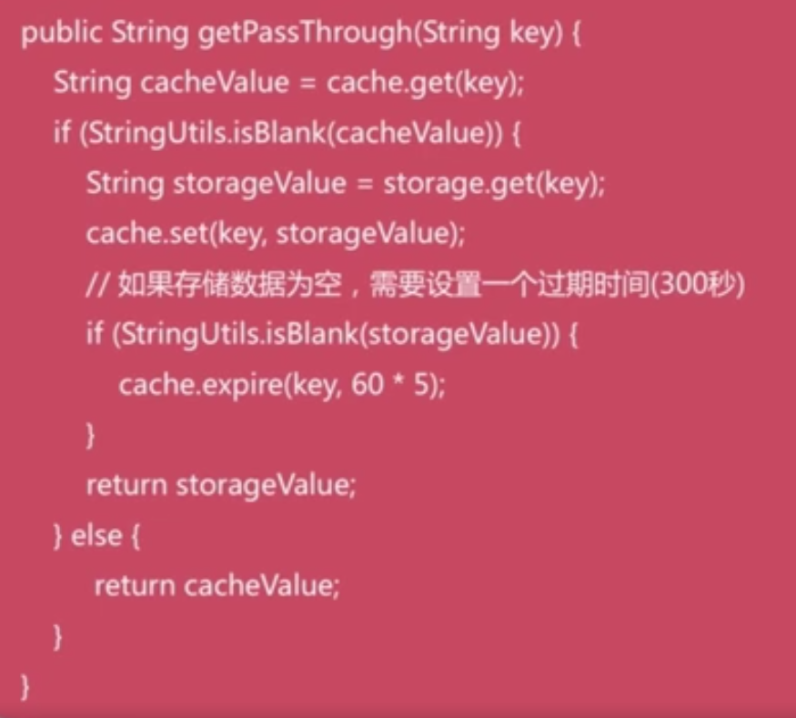

2）布隆过滤器拦截。

所谓的布隆过滤器是一个很长的二进制向量，存放0或者1。经过几次hash计算，得到5,9,2三个数字，那么存放结果如下图所示：


仅仅从布隆过滤器本身而言，根本没有存放完整的数据，只是运用一系列随机映射函数计算出位置，然后填充二进制向量。因此，可以使用固定的计算方式 ，来判断一个数据是否存在。但是由于类似哈希冲突的原因存在误判的可能性，也就是说，布隆过滤器只能判断数据不存在，而不能判断数据一定存在。

- 优点：由于存放的不是完整的数据，所以占用的内存很少，而且新增，查询速度够快；
- 缺点： 随着数据的增加，误判率随之增加；无法做到删除数据；只能判断数据不存在，而不能判断数据一定存在。

#### 代码

```
public class RedisTest {
    static final int expectedInsertions = 100;//要插入多少数据
    static final double fpp = 0.01;//期望的误判率

    //bit数组长度
    private static long numBits;

    //hash函数数量
    private static int numHashFunctions;

    static {
        numBits = optimalNumOfBits(expectedInsertions, fpp);
        numHashFunctions = optimalNumOfHashFunctions(expectedInsertions, numBits);
    }

    public static void main(String[] args) {
        Jedis jedis = new Jedis("你的ip", 6379);
        for (int i = 0; i < 100; i++) {
            long[] indexs = getIndexs(String.valueOf(i));
            for (long index : indexs) {
                jedis.setbit("codebear:bloom", index, true);
            }
        }
        for (int i = 0; i < 100; i++) {
            long[] indexs = getIndexs(String.valueOf(i));
            for (long index : indexs) {
                Boolean isContain = jedis.getbit("codebear:bloom", index);
                if (!isContain) {
                    System.out.println(i + "肯定没有重复");
                }
            }
            System.out.println(i + "可能重复");
        }
    }

    /**
     * 根据key获取bitmap下标
     */
    private static long[] getIndexs(String key) {
        long hash1 = hash(key);
        long hash2 = hash1 >>> 16;
        long[] result = new long[numHashFunctions];
        for (int i = 0; i < numHashFunctions; i++) {
            long combinedHash = hash1 + i * hash2;
            if (combinedHash < 0) {
                combinedHash = -combinedHash;
            }
            result[i] = combinedHash % numBits;
        }
        return result;
    }

    private static long hash(String key) {
        Charset charset = Charset.forName("UTF-8");
        return Hashing.murmur3_128().hashObject(key, Funnels.stringFunnel(charset)).asLong();
    }

    //计算hash函数个数
    private static int optimalNumOfHashFunctions(long n, long m) {
        return Math.max(1, (int) Math.round((double) m / n * Math.log(2)));
    }

    //计算bit数组长度
    private static long optimalNumOfBits(long n, double p) {
        if (p == 0) {
            p = Double.MIN_VALUE;
        }
        return (long) (-n * Math.log(p) / (Math.log(2) * Math.log(2)));
    }
}
```

## 缓存雪崩

定义：某一个时间段，缓存集中过期失效。

### 原因

1）集中设置统一的过期时间，到了一定时间时，便全部怼到数据库上了。

2）服务器某个结点宕机或断网。

### 解决

1）使用随机因子尽可能分散过期时间。

2）使用集群高可用化。

## 无底洞问题优化

问题描述：2010年，Facebook有了3000个Memcache节点，发现增加机器性能没能提升，反而下降。

### 问题关键点

1）更多的机器！=更高的性能。

2）批量接口需求（mget, mset等）。

3）数据增长与水平扩展等。

### 优化IO的几种方法

1）命令本身优化：例如慢查询keys、hgetall bigkey。

2）减少网络通信次数。

3）降低接入成本：例如客户端长连接/连接池、NIO等。

## 热点key**重建**

问题描述：热点key+较长的重建时间

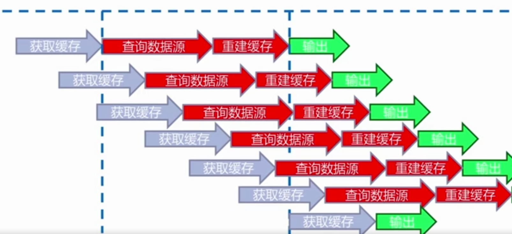

可能会存在多个线程共同执行查询数据源与重建缓存的操作。

### 目标

1）减少重建缓存的次数。

2）数据尽可能一致。

3）减少潜在风险。

### 解决

#### 互斥锁（mutex key)

在重建时开始加锁，完成重建后进行解锁。

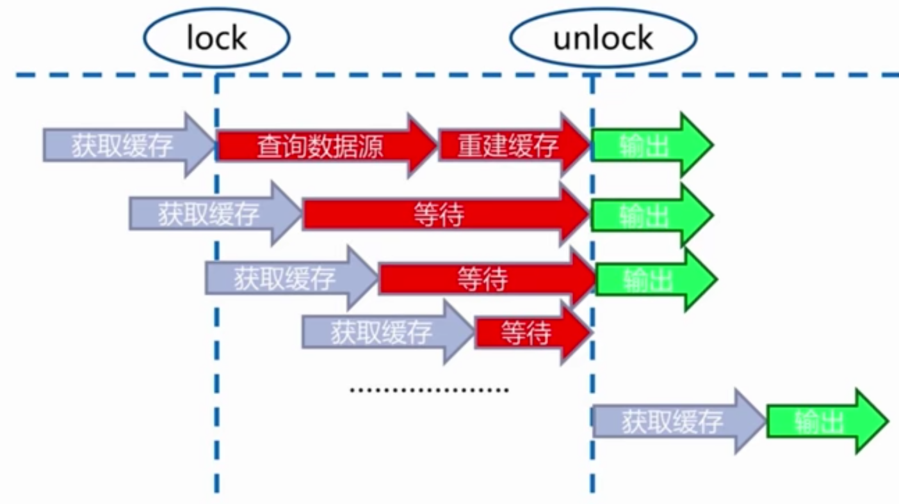

**代码：**

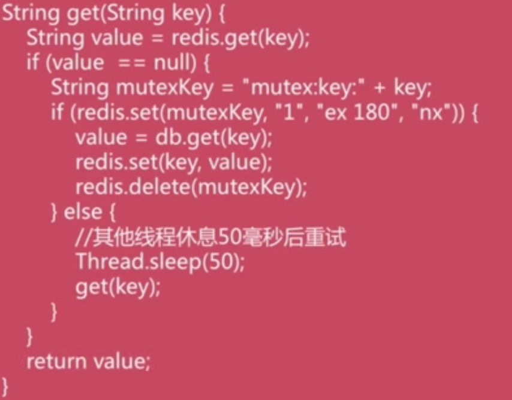

**优点：**

1）思路简单。

2）保证一致性。

**缺点：**

1）代码复杂度增加。

2）存在死锁的风险。

#### 永远不过期

1）缓存层面：没有设置过期时间。

2）功能层面：为每个value添加逻辑过期时间，但发现超过逻辑过期后，会使用单独的线程去构建缓存。

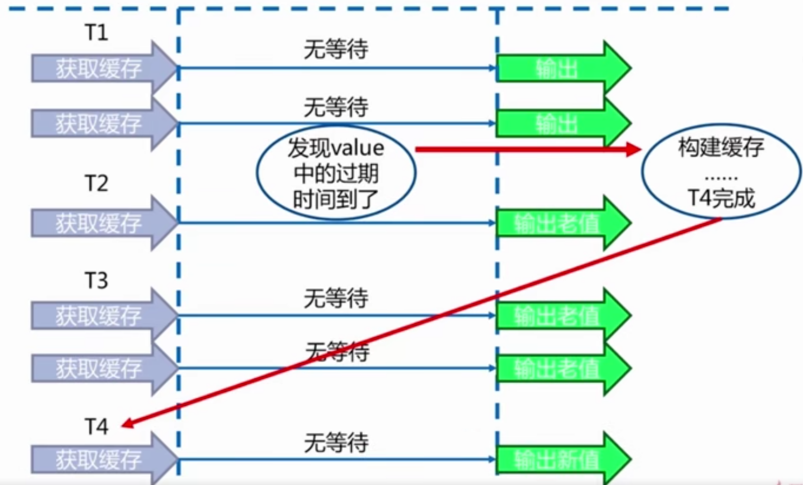

**代码：**

**优点：**

基本杜绝热点key重建问题。

**缺点：**

1）不保证一致性。

2）逻辑过期时间增加维护成本和内存成本。

# 机器部署

可以使用cacheCloud进行集群管理，项目地址：https://github.com/sohutv/cachecloud

## 作用

CacheCloud提供一个Redis云管理平台：实现多种类型(**Redis Standalone**、**Redis Sentinel**、**Redis Cluster**)自动部署、解决Redis实例碎片化现象、提供完善统计、监控、运维功能、减少运维成本和误操作，提高机器的利用率，提供灵活的伸缩性，提供方便的接入客户端。

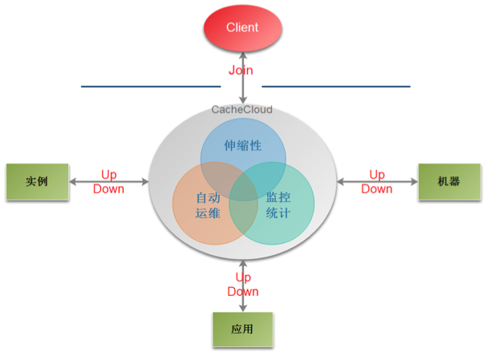

## 下载

### 1）下载项目

进入创建cachecloud目录，执行命令：

`git clone https://github.com/sohutv/cachecloud.git`

### 2）导入表结构

1：在mysql创建一个数据库cache-cloud（UTF-8）

2：导入cachecloud.sql

```
use cache-cloud;
source /usr/local/redis/cachecloud/cachecloud/script/cachecloud.sql;
```

## 启动

### 1）配置CacheCloud项目

修改配置文件online.properties：

`vi /usr/local/redis/cachecloud/cachecloud/cachecloud-open-web/src/main/swap/online.properties`


### 2）启动

#### 1：编译

在根目录下执行：

```
mvn clean compile install -Ponline
```

##### 2：拷贝war包(cachecloud-open-web/target/cachecloud-open-web-1.0-SNAPSHOT.war)到/opt/cachecloud-web下

```
mkdir /opt/cachecloud-web
cp cachecloud-open-web-1.0-SNAPSHOT.war /opt/cachecloud-web
```

#### 3：拷贝配置文件(cachecloud-open-web/src/main/resources/cachecloud-web.conf)到/opt/cachecloud-web下，并改名为cachecloud-open-web-1.0-SNAPSHOT.conf（spring-boot要求，否则配置不生效）

```
cp cachecloud-open-web/src/main/resources/cachecloud-web.conf /opt/cachecloud-web/
cd /opt/cachecloud-web/

mv cachecloud-web.conf cachecloud-open-web-1.0-SNAPSHOT.conf

sudo ln -s /opt/cachecloud-web/cachecloud-open-web-1.0-SNAPSHOT.war /etc/init.d/cachecloud-web

cp script/start.sh /opt/cachecloud-web/

cp script/stop.sh /opt/cachecloud-web/
```

#### 4：启动服务

先赋予start.sh与stop.sh可执行权限。赋予完毕后进行启动。

```
./start.sh
```

#### 5：登录页面

访问ip:8585，使用账号admin，密码admin进行登录即可。


### 3）添加机器

cachecloud项目中的cachecloud-init.sh(目录：cachecloud/script/cachecloud-init.sh)脚本是用来初始化服务器的cachecloud环境。

修改`cachecloud-init.sh`中的redis版本为5.0.0。

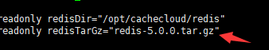

执行：

`sh cachecloud-init.sh cachecloud`

密码填写cachecloud，一路安装成功。

用户名和密码要跟配置修改中的保持一样：


进入后台管理，点击机器管理，添加新机器。

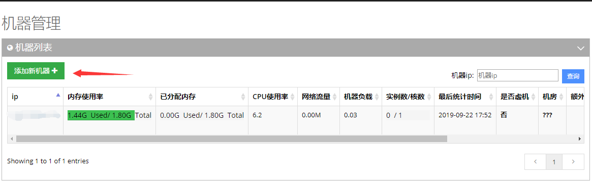

### 4）添加应用

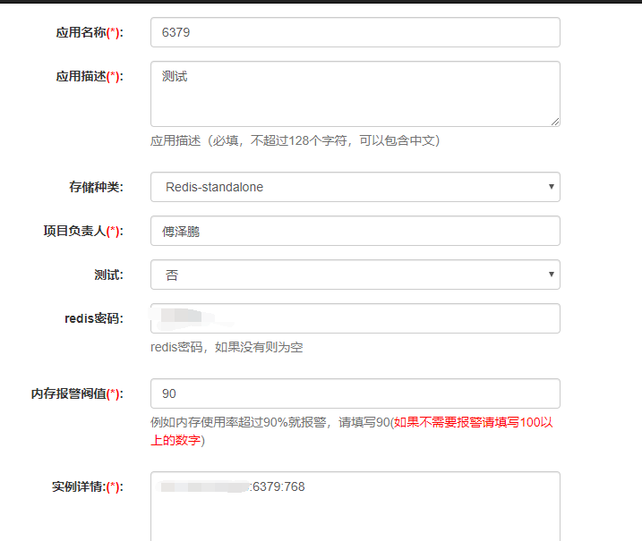

已成功导入：

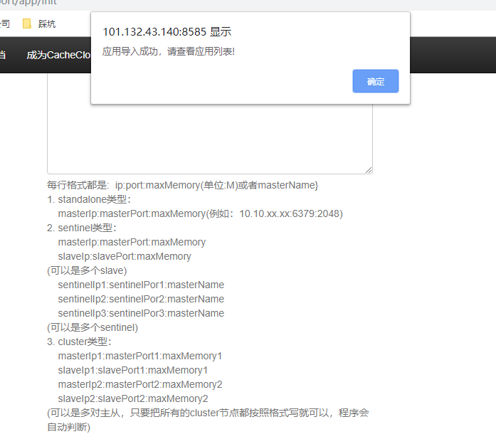

### 5）最终效果

由于只添加了单个节点，所以最终效果如下所示：

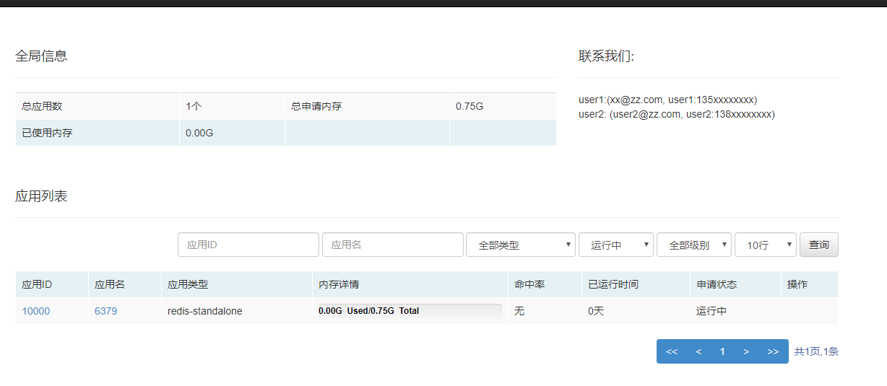

# 踩坑


## 踩坑

### 问题1 内存问题

#### 问题描述

出现了启动不了的问题，如下图所示：


#### 问题查找

首先，我在目录下发现了hs_err_pid16687.log文件，说明启动发生了点问题，浏览它。


大致就是内存溢出了。

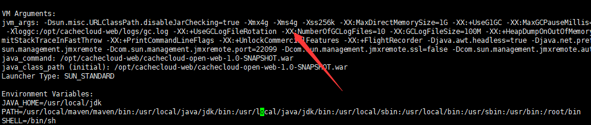

可以发现，cachecloud配置为4G，但是服务器的内存并没有那么大，所以启动失败。

#### 问题解决

将start.sh文件中的内存设置成1G：


### 问题2 日志问题

完成了问题1的设置之后，仍然启动不了，但很明显，它提示找不到日志文件。

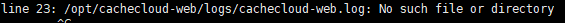

在相应的目录创建cachecloudp-web.log即可，再次启动：

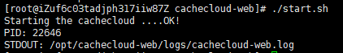

# Redis设计与实现知识点总结

## 简单动态字符串

Redis虽然使用C语言编写，但是Redis没有直接使用C语言的字符串，而是自己构建了一种名为简单动态字符串**(simple dynamic string,SDS)**的抽象类型，并将SDS作为Redis的默认字符串表示

举个例子：

```
redis>set msg "hello"
OK
```

那么，Redis将在数据库中创建一个新的键值对，其中：

> 1）键值对的键是一个字符串对象，对象的底层是一个保存着字符串“msg"的SDS。
>
> 2）键值对的值也是一个字符串对象，对象的底层实现是一个保存着字符串”hello“的SDS。

除了用来保存数据库中的字符串值之外，SDS还被用作**缓冲区**（buffer）：AOF模块中的AOF缓冲区，以及客户端状态中的输入缓冲区，都是由SDS实现的。

### SDS定义

每个sds.h/sdshdr结构表示一个SDS值：

```
struct sdshdr{
	//记录buf数组中已使用字节的数量
	//等于SDS所保存字符串的长度
	int len;
	
	//记录bug数组中未使用字节的数量
	int free;
	
	//字节数组，用于保存字符串
	char buf[];
}
```

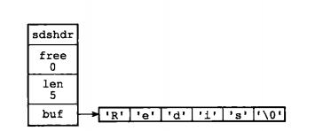

### SDS与C字符串的区别

#### 1）常数复杂度获取字符串长度

由于结构体存放了redis的长度，故不用像C语言一样使用循环遍历，故将时间复杂度从O(n)降低到了O(1)。

#### 2）杜绝缓冲区溢出

C语言对字符串操作时如果没有预先开辟好足够的空间则会造成缓冲区溢出的现象。

与C字符串不同，SDS的空间分配策略完全杜绝了发生缓冲区溢出的可能性：

当SDS API需要对SDS进行修改时，API会先检查SDS的空间是否满足修改所需的要求，如果不满足的话，将会**自动扩展**SDS的空间，才执行实际的修改。

#### 3）减少修改字符串时带来的内存重分配次数

C语言在添加值与截短值时，需要先扩充内存，再释放内存（不释放会内存泄漏），故对于Redis这种频繁操作的数据库而言，可能会造成性能上的影响。

SDS通过未使用空间解除了字符串长度和底层数组长度之间的关联：在SDS中，buf数组的长度不一定就是字符数量加一，数组里面可以包含未使用的字节，而这些字节的数量就由SDS的free属性记录。

通过未使用空间，SDS实现了**空间预分配**和**惰性空间释放**两种优化策略：


